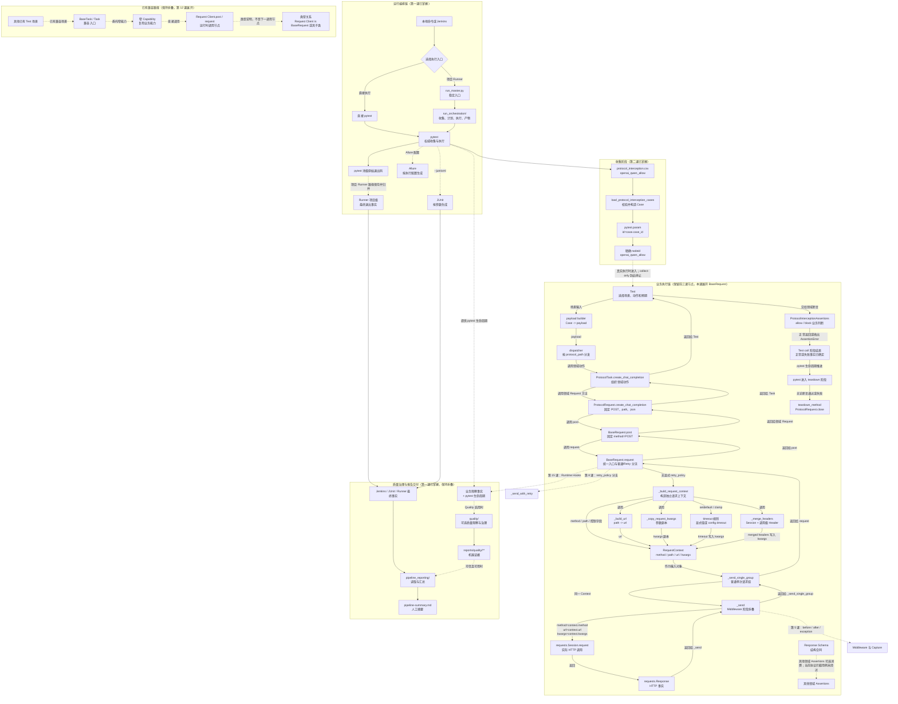

# 第 04 课：BaseRequest 是统一请求入口

> 本课只追踪一次普通、非流式、未显式启用 Retry 的 HTTP 请求：`SmokeRequest.create_chat_completion()` 进入 `BaseRequest.post()`、`BaseRequest.request()`、`_build_request_context()`，最终到达 `requests.Session.request()`。Middleware、Capture、Retry、Polling 和 Runtime Hooks 只保留折叠接口。

## 1. 课程信息

| 项目 | 内容 |
| --- | --- |
| 建议时长 | 60～90 分钟 |
| 核心问题 | 领域 Request 最终怎样发送 HTTP 请求？ |
| 讲解重点 | 统一 request 入口、URL、Header、RequestContext、Session |
| 代码入口 | `common/base_request.py`、`common/request_context.py` |
| 课堂切片 | `SmokeRequest.create_chat_completion()` 的普通 POST 路径 |
| 轻量验证 | 3 个现有离线测试，只观察 URL、Header、Context 隔离和参数复制 |
| 安全边界 | 不访问真实 API，不展开 Middleware 顺序，不启用 Retry 或 Polling |
| 课后产出 | 第四版累积总图、1 张 RequestContext 数据卡和口头三分钟复述 |

### 1.1 学完本课，你应该能够

1. 从一个领域 Request 方法追踪到 `BaseRequest.request()` 和 `requests.Session.request()`。
2. 解释 `get()`、`post()`、`put()`、`patch()`、`delete()` 为什么是统一入口的薄门面。
3. 区分框架默认模板、Session 当前状态和单次调用 Header 三种来源，并说明每次合并只读取后两项。
4. 说明 `_build_request_context()` 如何生成每次请求独立、但允许后续机制更新的请求上下文。
5. 区分函数调用链、RequestContext 对象流和 Response 返回链。

### 1.2 本课刻意不展开

- 不解释 Middleware 的 before、after、exception 顺序；第 5 课展开。
- 不解释 Capture、下载和 Allure 附件；第 5 课展开。
- 不解释 RetryPolicy、RetryExecutor 或多次 attempt；第 8 课展开。
- 不解释 Polling；第 9 课展开。
- 不解释 SSE；第 10 课展开。
- 不解释 Runtime Hooks 和 Quality 观察；第 15 课以后展开。
- 不执行真实 Smoke 用例，不验证线上模型响应。

看到这些机制时，只确认它们在统一入口周围存在，不进入内部状态与异常分支。

### 1.3 课堂必讲路径

| 环节 | 对应章节 | 建议时间 |
| --- | --- | ---: |
| 问题、约束与普通路径 | 第 2～6 节 | 8～10 分钟 |
| 构造、门面与统一入口 | 第 7～10 节 | 20～25 分钟 |
| URL、Header 与 Context | 第 11～14 节 | 20～25 分钟 |
| 二选一课堂活动 | 第 18 或第 19 节 | 8～10 分钟，计入被替代章节 |
| 总图、小测与复述 | 第 20、22、23 节 | 12～15 分钟 |
| 过渡、提问与讨论缓冲 | 全课 | 5 分钟 |

总计按不重复计时约 65～80 分钟。第 18、19 节只能二选一：活动 A 替代第 9、10、15.2 节的部分教师讲解，活动 B 替代第 12～14 节的部分教师讲解；活动时间已经计入对应章节，不再追加。第 17 节为可选教师演示，不计入必讲时间。

---

## 2. 承接第三课：领域 Request 已经知道端点，然后呢

第 3 课已经确认：

```text
Test
-> Task
-> ProtocolRequest.create_chat_completion()
-> BaseRequest.post()
```

其中领域 Request 已经固定：

- HTTP 方法是 POST；
- 相对路径是 `/v1/chat/completions`；
- payload 使用 `json=payload` 传递。

但调用 `self.post()` 后仍有一组尚未回答的问题：

1. 相对路径怎样变成完整 URL？
2. API Key 和默认 Header 从哪里来？
3. 单次请求 Header 怎样覆盖默认值，又不污染下一次请求？
4. timeout 在哪里补齐？
5. method、path、url、kwargs 怎样变成同一个请求对象？
6. 最终是谁调用 `requests.Session.request()`？

本课沿第 3 课留下的接口继续下钻：

```text
领域 Request 方法
--调用--> BaseRequest.post()
--调用--> BaseRequest.request()
--调用--> BaseRequest._build_request_context()
--构造并返回给 request()--> RequestContext
--由 request() 作为输入传给--> BaseRequest._send_single_group()
--调用--> BaseRequest._send()
--使用 method、url、kwargs 调用--> requests.Session.request()
```

---

## 3. 当前认知障碍与因果链

### 3.1 为什么直接打开 `base_request.py` 容易失去主线

`common/base_request.py` 当前同时出现：

- 普通 GET、POST、PUT、PATCH、DELETE；
- Header 管理；
- RequestContext；
- Middleware；
- Retry；
- Polling；
- SSE 与运行时观察；
- 日志和附件接口。

如果按文件从上到下全部阅读，会形成：

```text
一次看见所有分支
-> 不知道当前 Smoke 请求实际经过哪些函数
-> 把可选 Retry、Polling 和观察机制当成每次请求的固定步骤
-> 无法说清 RequestContext 在哪一刻产生
-> 最终只记住 BaseRequest 很复杂
```

### 3.2 TOC：本课真正的约束

当前约束不是不会使用 `requests`，而是：

> **无法从统一入口中隔离出一条普通请求的最短真实路径。**

解除方法是固定四个条件：

```text
只看一个 SmokeRequest 方法
-> 只看 POST
-> 不传 retry_policy
-> 不展开 Middleware 内部
```

本课固定切片：

```text
SmokeRequest.create_chat_completion(payload)
POST /v1/chat/completions
普通 JSON 响应
无显式 RetryPolicy
```

---

## 4. 第一性原理：统一入口必须完成什么

不考虑具体项目代码，一个可复用 HTTP 请求入口至少要完成五件事：

```text
接收请求意图
-> 生成完整地址
-> 形成发送前请求参数
-> 建立本次请求的独立上下文
-> 交给传输客户端发送
```

映射到当前项目：

| 必要问题 | 当前代码对象 |
| --- | --- |
| 请求方法是什么 | `method`、`get()`、`post()` 等门面 |
| 请求目标在哪里 | `_build_url()` |
| Header、timeout、body 是什么 | `_merge_headers()`、`kwargs` |
| 一次请求怎样被整体传递 | `RequestContext` |
| 最终谁发出 HTTP | `requests.Session.request()` |

如果每个领域 Request 都自己实现这些能力：

```text
每个模块自己拼 URL
+ 自己维护 API Key
+ 自己合并 Header
+ 自己补 timeout
+ 自己调用 requests
-> 同一公共规则产生多个版本
-> 修改必须穿透所有业务模块
```

因此 BaseRequest 的本质不是“再包一层 requests”，而是：

> **把所有领域都必须遵守的请求准备规则收敛成一个公共入口。**

---

## 5. 生活类比：服务员把订单交给统一出餐系统

可以把领域 Request 看成服务员：

- 知道顾客点的是哪道菜；
- 知道送到哪个业务窗口；
- 知道订单使用 JSON 还是文件表单。

BaseRequest 像统一出餐系统：

1. 根据餐厅地址和窗口号生成完整配送地址；
2. 加上餐厅默认身份信息；
3. 合并本单临时备注；
4. 生成一张不会与其他订单串线的完整面单；
5. 把面单交给配送员执行。

对应关系：

| 类比 | 代码对象 |
| --- | --- |
| 业务窗口号 | `path` |
| 餐厅完整地址 | `url` |
| 餐厅默认身份信息 | Session Header |
| 本单临时备注 | 调用级 `headers` |
| 完整面单 | `RequestContext` |
| 配送员 | `requests.Session` |

### 5.1 类比的边界

- RequestContext 不是响应，也不是测试用例上下文。
- Session 可以跨多次请求复用，但 RequestContext 每次请求重新创建。
- 单次 Header 合并发生在请求参数副本中，不等于永久修改 Session。
- Middleware 像发出前后的检查环节，但本课不展开其顺序。

---

## 6. 课堂切片：为什么选择 `SmokeRequest.create_chat_completion()`

大纲要求从一个 `SmokeRequest` 方法追踪到统一入口。当前选择：

```python
class SmokeRequest(BaseRequest):
    chat_completions_path = "/v1/chat/completions"

    def create_chat_completion(self, payload: dict[str, Any]) -> requests.Response:
        return self.post(
            self.chat_completions_path,
            json=payload,
            _quality_operation_name="chat_completion",
            _quality_traffic_role="workload",
        )
```

选择它有四个原因：

1. 使用普通 POST，不包含 Polling。
2. 使用 JSON body，不包含 multipart 文件细节。
3. 没有显式传入 `retry_policy`，进入普通单次发送分支。
4. 相对路径、payload 和 Response 都容易观察。

`_quality_operation_name` 和 `_quality_traffic_role` 是兼容观察元数据，会在统一入口被消费，不发送给 HTTP 服务；本课只保留名称，第 15 课再解释。

本课关键调用和返回关系固定为：

```text
SmokeRequest.create_chat_completion()
--调用--> BaseRequest.post()
BaseRequest.post()
--调用--> BaseRequest.request()
BaseRequest.request()
--调用--> BaseRequest._build_request_context()
BaseRequest._build_request_context()
--返回 context--> BaseRequest.request()
BaseRequest.request()
--调用--> BaseRequest._send_single_group(context)
BaseRequest._send_single_group(context)
--调用--> BaseRequest._send(context)
BaseRequest._send(context)
--调用--> requests.Session.request()
```

---

## 7. BaseRequest 构造：先准备可复用 Session

`BaseRequest.__init__()` 的核心代码是：

```python
class BaseRequest:
    def __init__(self, config: Settings = settings, ...):
        self.config = config
        self.session = requests.Session()
        self.default_headers = self._build_default_headers()
        self.session.headers.update(self.default_headers)
        ...
```

本课只展开前三项：

| 对象 | 当前职责 |
| --- | --- |
| `config` | 提供 `base_url`、`api_key` 和默认 `timeout` |
| `session` | 复用连接，并保存 Session 级 Header |
| `default_headers` | 保存框架定义的默认 Header 映射 |

其余外部构造参数：

- `middlewares`；
- `retry_executor`；
- `capture_policy`；

都属于后续课程接口，本课不展开。

`_runtime_observer` 不是构造参数，而是 `__init__()` 内部创建的属性：

```python
self._runtime_observer = RuntimeObserver()
```

它同样只保留为第 15 课的接口，但必须与调用方能够传入的构造参数区分。

### 7.1 框架默认 Header

`_build_default_headers()` 返回：

```python
{
    "Content-Type": "application/json",
    "Accept": "application/json",
    "User-Agent": "api-v1_chat_completions-framework",
    "Authorization": f"Bearer {self.config.api_key}",
}
```

然后这些值被更新到 `self.session.headers`。

需要准确区分：

```text
self.default_headers
= 框架自己定义的默认映射

self.session.headers
= requests.Session 当前持有的完整 Session Header 集合
```

两者不是同一个对象，也不能假设 `session.headers` 永远只包含上面四项。

### 7.2 Session 级 Header 管理

BaseRequest 提供四个持久化操作：

```python
set_header(name, value)
update_headers(headers)
remove_header(name)
reset_headers()
```

它们直接修改 `self.session.headers`，影响后续请求。

`reset_headers()` 的行为是：

```text
清空当前 Session Header
-> 重新写入 self.default_headers
```

因此 Session 级修改适合“后续多次请求都需要”的状态，不适合只服务于一次调用的临时 Header。

---

## 8. GET、POST 等方法只是统一入口的薄门面

普通 HTTP 方法实现非常薄：

```python
def get(self, path: str, **kwargs: Any) -> requests.Response:
    return self.request("GET", path, **kwargs)

def post(self, path: str, **kwargs: Any) -> requests.Response:
    return self.request("POST", path, **kwargs)

def put(self, path: str, **kwargs: Any) -> requests.Response:
    return self.request("PUT", path, **kwargs)

def patch(self, path: str, **kwargs: Any) -> requests.Response:
    return self.request("PATCH", path, **kwargs)

def delete(self, path: str, **kwargs: Any) -> requests.Response:
    return self.request("DELETE", path, **kwargs)
```

这些方法只固定一个决定：

```text
HTTP method
```

其余规则全部交给 `request()`：

- URL；
- timeout；
- Header；
- RequestContext；
- 发送与返回。

### 8.1 为什么还要保留这些薄门面

领域 Request 调用：

```python
self.post(path, json=payload)
```

比调用：

```python
self.request("POST", path, json=payload)
```

更直接表达 HTTP 意图，也为装饰器或方法级扩展保留稳定入口。

但必须记住：

> `post()` 不是另一套发送机制，它只是 `request("POST", ...)` 的门面。

### 8.2 `poll_get()` 不是普通 GET 门面

`poll_get()` 包含终止条件、间隔和超时预算，不是简单调用一次 `request("GET")`。它属于第 9 课，本课不能把它和普通 `get()` 混为一谈。

---

## 9. `request()`：统一接收请求意图

`request()` 是普通 HTTP 方法共同进入的公共入口。

为了保持本课主线，可以把当前代码折叠成：

```python
def request(self, method: str, path: str, **kwargs: Any) -> requests.Response:
    attach_log = kwargs.pop("_attach_log", True)
    retry_policy = kwargs.pop("retry_policy", None)
    inherit_session_headers = bool(
        kwargs.pop("_inherit_session_headers", True)
    )

    # Runtime observation metadata is consumed here.
    ...

    if retry_policy is not None:
        response = self._send_with_retry(...)
    else:
        context = self._build_request_context(
            method,
            path,
            attach_log=attach_log,
            inherit_session_headers=inherit_session_headers,
            **kwargs,
        )
        response = self._send_single_group(context)

    return response
```

### 9.1 三类入口控制参数

`request()` 会先消费三个框架控制参数：

| 参数 | 当前含义 | 后续课程 |
| --- | --- | --- |
| `_attach_log` | 是否启用请求响应附件 | 第 5 课 |
| `retry_policy` | 是否进入 Retry 分支 | 第 8 课 |
| `_inherit_session_headers` | 是否继承 Session Header | 本课 Header 边界 |

这些参数在进入 `requests.Session.request()` 前已经被消费，不应作为未知关键字发送给 HTTP 传输层。

### 9.2 当前切片进入哪个分支

`SmokeRequest.create_chat_completion()` 没有传入 `retry_policy`：

```text
retry_policy is None
-> request() 调用 _build_request_context()
-> _build_request_context() 返回 context 给 request()
-> request() 调用 _send_single_group(context)
```

本课只讲这条实线。

Retry 分支只保留：

```text
request()
-. retry_policy 不为 None .-> _send_with_retry()
```

具体 attempt、等待和终止条件留到第 8 课。

### 9.3 Runtime 观察不是业务发送的下一层

`request()` 当前还会启动和结束中性运行观察。它用于旁路记录，不改变 Response 的业务返回语义。第 15 课才学习其对象和生命周期，本课不把它画成 `RequestContext -> Runtime -> HTTP` 的固定线性管线。

---

## 10. 普通发送路径最终到达 `Session.request()`

没有 Retry 时，Context 被交给 `_send_single_group()`：

```python
def _send_single_group(self, context: RequestContext) -> requests.Response:
    group = self._runtime_observer.start_request_group(...)
    group.bind(context)
    try:
        return self._send(context)
    finally:
        group.finish()
```

本课只需要知道：

```text
_send_single_group()
-> 把同一个 RequestContext 交给 _send()
```

`_send()` 的核心传输代码是：

```python
response = self.session.request(
    method=context.method,
    url=context.url,
    **context.kwargs,
)
```

完整 `_send()` 在调用 Session 前后还会执行 Middleware：

```text
before Middlewares
--正常完成后--> Session.request
--正常返回后--> after Middlewares

仅当 Session.request() 抛出请求或传输异常时
--进入--> exception Middlewares
--随后--> 重新抛出原请求异常
```

before 或 after Middleware 自身抛错时，异常会在各自的执行器中包装为 `RuntimeError`。由于它们位于 `Session.request()` 的 `try` 范围之外，不会再次进入 exception Middleware。

这部分只折叠为一个节点，第 5 课再展开。

### 10.1 Response 怎样返回

正常路径的返回顺序是：

```text
requests.Session.request()
-> BaseRequest._send()
-> BaseRequest._send_single_group()
-> BaseRequest.request()
-> BaseRequest.post()
-> SmokeRequest.create_chat_completion()
-> 上层 Task / Test
```

Session 不会直接调用 Assertions。Response 必须先沿原函数调用方向逐层返回到 Test，再由 Test 进入业务验收。

---

## 11. `_build_url()`：相对路径和绝对 URL 使用不同规则

当前实现：

```python
def _build_url(self, path: str) -> str:
    if path.startswith(("http://", "https://")):
        return path
    return urljoin(f"{self.config.base_url}/", path.lstrip("/"))
```

### 11.1 相对路径

假设：

```text
base_url = https://example.com
path = /v1/chat/completions
```

处理过程：

```text
base_url 补 /
-> path 去掉开头 /
-> urljoin(...)
-> https://example.com/v1/chat/completions
```

### 11.2 绝对 URL

如果 `path` 已经以 `http://` 或 `https://` 开头：

```text
直接返回原值
```

这允许调用方在确有需要时绕过 `base_url` 拼接，但领域 Request 默认仍应优先使用相对路径集中表达端点。

### 11.3 `_build_url()` 不负责什么

- 不选择业务端点；领域 Request 已经决定 path。
- 不发送请求。
- 不读取 Response。
- 不决定 GET 或 POST。

它只把“基础地址 + 相对路径”转换为最终 URL。

---

## 12. Header 有三种来源，但每次只合并两项输入

本课需要区分三种来源：框架默认模板、Session 当前状态和单次调用值。但“三种来源”不表示 `_merge_headers()` 每次接收三个独立输入。

### 12.1 第一种来源：框架默认 Header 模板

来自：

```text
_build_default_headers()
```

主要包括 JSON、Accept、User-Agent 和 Authorization 默认值。

它在 BaseRequest 初始化和 `reset_headers()` 时写入 Session，不会在每次请求合并时再次作为独立兜底参数传入。

### 12.2 第二种来源：Session 级 Header

来自：

```text
self.session.headers
```

可通过 `set_header()`、`update_headers()`、`remove_header()` 和 `reset_headers()` 持久修改。

### 12.3 第三种来源：单次调用 Header

领域 Request 可以在某次调用中传入：

```python
self.post(
    path,
    json=payload,
    headers={"X-Case-Id": "case-001"},
)
```

这些 Header 只进入本次 RequestContext，不应永久写回 Session。

### 12.4 实际合并只有两项输入

`_merge_headers()` 当前真正合并的是：

1. `self.session.headers` 的当前状态；
2. 本次调用显式传入的 `headers`。

`self.default_headers` 不是这一步的第三个直接输入。它只是 Session 初始化和 `reset_headers()` 使用的模板。

`_merge_headers()` 的普通继承分支是：

```python
merged = dict(self.session.headers)
merged.update(headers)
```

因此优先级是：

```text
单次调用 Header
> 当前 Session Header
```

如果 Session 中某些值仍来自初始化默认模板，它们已经包含在“当前 Session Header”中，而不是在合并时再次参与一次兜底。

如果同名：

```text
单次调用值覆盖 Session 当前值
```

但覆盖只发生在新建的 `merged` 字典中，不会修改 `self.session.headers`。

### 12.5 纸面示例

请求前 Session：

```text
Authorization: Bearer account-a
Accept: application/json
```

本次调用：

```text
Authorization: Bearer account-b
X-Case-Id: case-001
```

RequestContext 中的最终 Header：

```text
Authorization: Bearer account-b
Accept: application/json
X-Case-Id: case-001
```

请求结束后的 Session 仍然是：

```text
Authorization: Bearer account-a
Accept: application/json
```

### 12.6 选读：不继承 Session Header

当 `_inherit_session_headers=False` 时，当前实现先为已有 Session Header 名称写入 `None`，再叠加显式 Header：

```python
merged = {str(name): None for name in self.session.headers}
merged.update(headers)
```

这用于 Anthropic 专用认证或 multipart 等需要屏蔽当前 Session Header 的场景。这里只确认边界，不展开具体协议规则。

---

## 13. `_build_request_context()`：把分散参数收拢成独立请求上下文

当前普通路径调用：

```python
context = self._build_request_context(
    method,
    path,
    attach_log=attach_log,
    inherit_session_headers=inherit_session_headers,
    **kwargs,
)
```

`_build_request_context()` 主要完成四步。

### 13.1 第一步：生成最终 URL

```python
url = self._build_url(path)
```

输入是领域 Request 提供的 path，输出是最终传输地址。

### 13.2 第二步：复制请求参数

```python
request_kwargs = self._copy_request_kwargs(kwargs)
```

`_copy_request_kwargs()` 会逐项尝试 `deepcopy()`：

```python
for name, value in kwargs.items():
    try:
        copied_kwargs[name] = deepcopy(value)
    except Exception:
        copied_kwargs[name] = value
```

准确边界是：

- 对 JSON、Header 等常见可复制对象，会生成独立副本；
- 如果某个对象无法深复制，则回退为原对象；
- 不能笼统说所有 kwargs 都一定深复制成功。

当前 JSON payload 可以被深复制，因此后续对 Context 内嵌套数据的处理不会修改测试传入的原 payload。

### 13.3 第三步：补齐 timeout

```python
request_kwargs.setdefault("timeout", self.config.timeout)
```

规则是：

```text
调用方显式传 timeout
-> 保留显式值

调用方未传 timeout
-> 使用 config.timeout
```

后续代码还会根据内部 deadline 限制 timeout。该边界主要服务 Retry 和 Polling，本课只确认默认 timeout 会进入 RequestContext。

### 13.4 第四步：生成本次最终 Header

```python
headers = dict(request_kwargs.pop("headers", None) or {})
request_kwargs["headers"] = self._merge_headers(
    headers,
    inherit_session_headers=inherit_session_headers,
)
```

这一步完成：

1. 从 kwargs 中取出调用级 Header；
2. 与当前 Session Header 合并；
3. 把合并结果重新写回 Context 的 kwargs。

Session 本身没有在这一步被修改。

---

## 14. RequestContext 保存哪些信息

`common/request_context.py` 当前定义：

```python
@dataclass
class RequestContext:
    method: str
    path: str
    url: str
    kwargs: dict[str, Any]
    attach_log: bool = True
    request_step_name: str = API_REQUEST_STEP_NAME
    response_step_name: str = API_RESPONSE_STEP_NAME
    protocol: str = "http"
    retry_policy: RetryPolicy | None = None
    polling_policy: PollingPolicy | None = None
    attributes: dict[str, Any] = field(default_factory=dict)
```

### 14.1 本课必须掌握的核心字段

| 字段 | 来源 | 作用 |
| --- | --- | --- |
| `method` | GET/POST 门面或直接 request | 保存大写 HTTP 方法 |
| `path` | 领域 Request | 保存原始相对路径或绝对 URL 输入 |
| `url` | `_build_url()` | 保存最终请求地址 |
| `kwargs` | 参数副本 + timeout + merged headers | 发送前已准备的请求参数；发送时由 `_send()` 读取，before Middleware 仍可更新 |

### 14.2 本课只认识名称的扩展字段

| 字段 | 后续用途 | 课次 |
| --- | --- | --- |
| `attach_log` | 是否附加请求响应日志 | 第 5 课 |
| `request_step_name` / `response_step_name` | 报告步骤名称 | 第 5 课 |
| `protocol` | 区分普通 HTTP 与 SSE | 第 10 课 |
| `retry_policy` | Retry 规则 | 第 8 课 |
| `polling_policy` | Polling 状态合同 | 第 9 课 |
| `attributes` | 横向机制附加本次请求状态 | 第 5 课以后 |

本课不展开这些字段的内部变化，只确认它们与 method、url、kwargs 一起属于同一个请求实例。

### 14.3 `_build_request_context()` 怎样构造对象

```python
return RequestContext(
    method=method.upper(),
    path=path,
    url=url,
    kwargs=request_kwargs,
    attach_log=attach_log,
    request_step_name=request_step_name,
    response_step_name=response_step_name,
    protocol=protocol or (
        "sse" if request_kwargs.get("stream") else "http"
    ),
    retry_policy=retry_policy,
    polling_policy=polling_policy,
)
```

三个容易忽略的事实：

1. `method` 会转成大写。
2. `path` 和最终 `url` 会同时保留。
3. 每次构造都会得到新的 `attributes` 字典。

### 14.4 RequestContext 的输入输出边界

RequestContext 是：

```text
_build_request_context() 的正常输出对象
+ _send_single_group() / _send() 的输入对象
```

它不是：

- `requests.Response`；
- pytest 测试结果；
- 跨整条测试用例共享的 TestContext；
- 全局单例。

### 14.5 独立不等于不可变

`RequestContext` 是每次请求独立创建的可变状态载体，而不是冻结对象：

- Middleware 可以向 `context.attributes` 写入本次请求的横向状态；
- Middleware 也可以在自己的职责边界内处理或修改 `context.kwargs`；
- 新建 Context 和参数副本的作用，是隔离不同请求及调用方原始数据，不是禁止本次请求内部发生状态变化。

因此，“独立”描述生命周期和隔离边界，“可变”描述同一次请求在发送过程中的协作方式，两者并不矛盾。

### 14.6 为什么需要 Context，而不是继续传散装参数

没有 Context：

```text
method、path、url、headers、timeout、payload 分散传递
-> 每个横向能力需要不同参数列表
-> 容易漏传或修改原始对象
-> 并发时难以判断数据属于哪次请求
```

有 RequestContext：

```text
一次请求的事实集中在一个对象
-> 发送层读取同一份请求状态
-> 后续 Middleware、Retry 和观察能力共享稳定接口
-> 每次请求可以独立演进
```

---

## 15. 一次普通 POST 中对象怎样变化

以一个示例 payload 为起点：

```python
payload = {
    "model": "DeepSeek-V4-Flash",
    "messages": [{"role": "user", "content": "hello"}],
}
```

按时间顺序观察，对象状态变化可以写成下面的过程。这里的 `->` 只表示“随后发生”，不表示相邻节点之间都是函数调用；第 15.2 节会把三类关系拆开。

```text
payload
-> SmokeRequest.create_chat_completion(payload)
-> kwargs = {json: payload, 观察元数据...}
-> BaseRequest.request("POST", path, **kwargs)
-> 清除框架控制参数和观察元数据
-> 复制 kwargs
-> 补 timeout
-> 合并 headers
-> RequestContext(method, path, url, kwargs, ...)
-> Session.request(method, url, **kwargs)
-> Response
```

### 15.1 哪些对象被复用，哪些对象每次新建

| 对象 | 生命周期 |
| --- | --- |
| `SmokeRequest` / `BaseRequest` 实例 | 通常在一次测试 setup 到 teardown 期间复用 |
| `requests.Session` | 随 Request 实例复用，teardown 时关闭 |
| 原始 payload | 由调用方持有 |
| Context 内 kwargs | 每次请求创建参数副本 |
| `RequestContext` | 每次请求新建 |
| `Response` | 每次实际 HTTP 调用产生 |

### 15.2 不要把对象流画成调用链

函数调用链：

```text
post() --调用--> request()
request() --调用--> _build_request_context()
_build_request_context() --返回 context--> request()
request() --调用--> _send_single_group(context)
```

对象流：

```text
path + kwargs
--被加工并构造成--> RequestContext
--由 _send() 读取为--> Session.request 参数
```

返回链：

```text
Session.request()
--返回--> Response
--返回给--> _send()
--逐层返回给--> _send_single_group() -> request() -> post() -> 领域 Request
```

三类箭头回答不同问题，累积总图必须通过边标签区分。

---

## 16. 推荐的源码阅读顺序

本课使用“调用方先行”，不要从 `_send_with_retry()` 或 `poll_get()` 开始。

### 16.1 必讲顺序

1. `module/smoke/request.py::SmokeRequest.create_chat_completion`
2. `common/base_request.py::BaseRequest.post`
3. `common/base_request.py::BaseRequest.request`
4. `common/base_request.py::BaseRequest._build_url`
5. `common/base_request.py::BaseRequest._merge_headers`
6. `common/base_request.py::BaseRequest._build_request_context`
7. `common/request_context.py::RequestContext`
8. `common/base_request.py::BaseRequest._send`

### 16.2 每个入口只回答一个问题

| 入口 | 本课只回答 |
| --- | --- |
| `SmokeRequest.create_chat_completion` | 领域方法传入了什么？ |
| `post` | 怎样固定 POST？ |
| `request` | 普通请求从哪里统一分流？ |
| `_build_url` | 最终 URL 怎样产生？ |
| `_merge_headers` | Session 与调用级 Header 怎样合并？ |
| `_build_request_context` | 独立请求上下文怎样形成？ |
| `RequestContext` | 请求状态载体保存哪些字段？ |
| `_send` | 最终 Session 调用使用哪些值？ |

### 16.3 阅读停止点

看到以下节点立即停止展开：

```text
default_request_middlewares
_run_before_middlewares
_run_after_middlewares
_run_exception_middlewares
_send_with_retry
_poll_get_with_policy
RuntimeObserver
```

停止不是遗漏，而是为了让本课只解除“普通请求入口”这一约束。

---

## 17. 可选教师演示：使用现有离线测试观察请求上下文

本课可以运行三个已有测试：

```powershell
.\.venv\Scripts\python.exe -m pytest `
  "tests/test_base_request_middleware.py::TestBaseRequestMiddlewarePipeline::test_runs_middlewares_in_registration_order" `
  "tests/test_base_request_middleware.py::TestBaseRequestMiddlewarePipeline::test_creates_independent_context_for_each_request" `
  "tests/test_base_request_middleware.py::TestBaseRequestMiddlewarePipeline::test_request_context_deep_copies_nested_kwargs" `
  -q
```

虽然测试文件名包含 Middleware，本课只观察以下证据：

| 测试 | 本课观察点 |
| --- | --- |
| `test_runs_middlewares_in_registration_order` | fake Session 收到 GET、大写 method、完整 URL、默认 timeout 和合并 Header |
| `test_creates_independent_context_for_each_request` | 连续两次请求得到不同 Context 和不同 attributes 字典 |
| `test_request_context_deep_copies_nested_kwargs` | Context 内嵌套 JSON 的修改不污染原 payload |

Middleware 的执行顺序虽然也被该测试覆盖，但留到第 5 课解释。

### 17.1 这些测试不能证明什么

- 不能证明真实 LLM API 可用。
- 不能证明线上 Header 一定被服务端接受。
- 不能证明 Retry 或 Polling 行为。
- 不能证明所有 kwargs 都一定可以深复制。
- 不能证明 Middleware 的全部异常边界。

---

## 18. 二选一课堂活动 A：区分普通 POST 的三类链路

本活动替代第 9、10、15.2 节的部分教师讲解。选择活动 A 后，学习者分别补全调用链、对象流和返回链，不能用同一种无标签箭头把函数与对象串成一条线。

### 18.1 待补全：函数调用链

```text
SmokeRequest.create_chat_completion(payload)
--调用--> [A] ______________________________
[A] --调用--> BaseRequest.request("POST", path, **kwargs)
BaseRequest.request(...) --调用--> [B] ______________________________
[B] --返回 context--> BaseRequest.request(...)
BaseRequest.request(...) --调用--> [C] ______________________________
[C] --调用--> BaseRequest._send(context)
BaseRequest._send(context) --调用--> [D] ______________________________
```

### 18.2 待补全：RequestContext 对象流

```text
path + kwargs
--由 _build_request_context() 加工并构造--> ______________________________
--由 _send() 读取--> method + url + kwargs
--作为实参交给--> ______________________________
```

### 18.3 待补全：Response 返回链

```text
requests.Session.request(...)
--返回--> ______________________________
--返回给--> BaseRequest._send()
--返回给--> ______________________________
--返回给--> BaseRequest.request()
--返回给--> BaseRequest.post()
--返回给--> ______________________________
```

### 18.4 作答要求

1. 调用链只回答“哪个函数调用哪个函数”。
2. 对象流只回答“哪些输入形成 RequestContext，发送层从中读取什么”。
3. 返回链只回答“Response 沿哪些函数逐层返回”。
4. 每条边必须标明“调用、构造、作为输入或返回”等关系。
5. `_build_request_context()` 返回 Context 给 `request()`，并不直接调用 `_send_single_group()`。

### 18.5 参考答案

调用链：

```text
SmokeRequest.create_chat_completion(payload)
--调用--> BaseRequest.post(path, json=payload, ...)
BaseRequest.post(...) --调用--> BaseRequest.request("POST", path, **kwargs)
BaseRequest.request(...) --调用--> BaseRequest._build_request_context(...)
BaseRequest._build_request_context(...) --返回 context--> BaseRequest.request(...)
BaseRequest.request(...) --调用--> BaseRequest._send_single_group(context)
BaseRequest._send_single_group(context) --调用--> BaseRequest._send(context)
BaseRequest._send(context) --调用--> requests.Session.request(method, url, **kwargs)
```

对象流：

```text
path + kwargs
--由 _build_request_context() 加工并构造--> RequestContext
--由 _send() 读取--> method + url + kwargs
--作为实参交给--> requests.Session.request(...)
```

返回链：

```text
requests.Session.request(...)
--返回--> Response
--返回给--> BaseRequest._send()
--返回给--> BaseRequest._send_single_group()
--返回给--> BaseRequest.request()
--返回给--> BaseRequest.post()
--返回给--> SmokeRequest.create_chat_completion()
```

### 18.6 验收问题

1. 哪个函数把 method 固定为 POST？
2. 哪个函数生成 RequestContext？
3. `_build_request_context()` 是否直接调用 `_send_single_group()`？
4. `_send()` 从 RequestContext 读取哪些字段交给 Session？
5. Response 怎样逐层返回领域 Request？
6. Response 是否由 Session 直接交给 Assertions？

课堂选择其中 4 个问题回答，其余用于课后自检。

---

## 19. 二选一课堂活动 B：制作 RequestContext 数据卡

本活动替代第 12～14 节的部分逐项讲解。选择活动 B 后，教师只解释字段来源，学习者完成一张数据卡。

假设：

```text
base_url = https://example.com
api_key = sk-config
config.timeout = 30
path = /v1/chat/completions
method = POST
payload = {model: demo-model}
调用 Header = {X-Case-Id: case-001}
```

### 19.1 待填写数据卡

| 字段 | 预测值 | 产生者 |
| --- | --- | --- |
| `method` |  |  |
| `path` |  |  |
| `url` |  |  |
| `kwargs.json` |  |  |
| `kwargs.timeout` |  |  |
| `kwargs.headers.Authorization` |  |  |
| `kwargs.headers.X-Case-Id` |  |  |
| `protocol` |  |  |

### 19.2 参考答案

| 字段 | 预测值 | 产生者 |
| --- | --- | --- |
| `method` | `POST` | `post()` + `method.upper()` |
| `path` | `/v1/chat/completions` | 领域 Request |
| `url` | `https://example.com/v1/chat/completions` | `_build_url()` |
| `kwargs.json` | `{model: demo-model}` 的副本 | `_copy_request_kwargs()` |
| `kwargs.timeout` | `30` | `config.timeout` 默认值 |
| `kwargs.headers.Authorization` | `Bearer sk-config` | 当前 Session Header；该值初始化时来自默认模板 |
| `kwargs.headers.X-Case-Id` | `case-001` | 单次调用 Header |
| `protocol` | `http` | `_build_request_context()` |

### 19.3 变化判断

再回答四个问题：

1. 如果调用显式传 `timeout=5`，最终值是什么？
2. 如果调用 Header 也包含 Authorization，谁覆盖谁？
3. 请求结束后 Session 的 Authorization 是否变化？
4. 第二次请求是否复用第一次的 RequestContext？

参考结论：

```text
显式 timeout 优先；调用级 Header 覆盖 Context 中的同名 Session Header；
Session 本身不被调用级合并修改；每次请求创建新的 RequestContext。
```

---

## 20. 第四版课后链路总图

课堂代码阅读使用 `SmokeRequest`，但累积总图继续保留第 2 课选定的 `openai_qwen_allow` 主链，因为 `ProtocolRequest` 和 `SmokeRequest` 最终共享同一个 BaseRequest 公共入口。本课只展开 BaseRequest 内部的普通无重试路径。



### 20.1 本课新增了什么

相较第 3 课，本课只展开 BaseRequest 公共段：

1. `post()` 如何固定 POST 并进入 `request()`；
2. `request()` 如何选择普通无 Retry 分支；
3. `_build_url()`、参数复制、timeout 和 Header 合并；
4. `RequestContext` 作为 `_send_single_group()` 的输入对象；
5. `_send()` 怎样把 Context 字段交给 `Session.request()`；
6. Response 怎样沿 BaseRequest、领域 Request、Task 返回 Test。

### 20.2 本课没有改变什么

- 第一课的直接 pytest、Runner、质量和报告边界保持不变；
- 第二课的 Case、nodeid、payload builder、dispatcher 和 Assertions 保持不变；
- 第三课的职责边界、兼容 Capability 分支、Schema 可选性和 pytest teardown 生命周期保持不变；
- Middleware、Retry 和 Runtime Hooks 仍然是后续课程接口；
- 当前协议拦截用例仍未经过独立 Response Schema。

### 20.3 怎样阅读 BaseRequest 展开段

```text
实线调用边：谁调用谁
实线产物边：helper 产生什么字段
实线返回边：Response 返回给谁
虚线：可选分支、类型关系或后续课次
```

不要把 `_build_url()`、`_merge_headers()` 画成彼此调用；它们都由 `_build_request_context()` 调用，并共同为 RequestContext 提供字段。

---

## 21. 常见误区

### 误区一：`post()` 自己完成 HTTP 发送

`post()` 只固定 method 为 POST，实际发送最终发生在 `requests.Session.request()`。

### 误区二：每个领域 Request 都应该自己拼完整 URL

领域 Request 负责相对 path，BaseRequest 统一使用 `base_url` 构造最终 URL。

### 误区三：单次调用 Header 会永久写入 Session

调用级 Header 在新的合并字典中覆盖 Session 值，不会自动写回 `self.session.headers`。

### 误区四：`default_headers` 等于 Session 当前所有 Header

`default_headers` 是框架定义的默认映射；Session 还可能包含 requests 默认值或后续持久修改。

### 误区五：RequestContext 是 Response 的另一种名称

RequestContext 是发送前的可变状态载体，Response 是实际 HTTP 调用后的事实对象。前者每次请求独立创建，但 Middleware 可以在本次请求内更新其 `attributes` 或 `kwargs`。

### 误区六：一个 BaseRequest 实例只创建一个 RequestContext

Session 可以复用，但每次请求都会构造新的 RequestContext。

### 误区七：所有 kwargs 都一定能深复制

当前实现会尝试 `deepcopy()`；失败时回退原对象。只能对已验证的常见 JSON 数据说明其副本隔离行为。

### 误区八：普通 `get()` 和 `poll_get()` 是同一种门面

`get()` 是一次普通请求，`poll_get()` 包含状态判断、等待与终止条件，属于第 9 课。

### 误区九：RequestContext 之后必须先经过 Retry

当前切片没有传 `retry_policy`，直接进入普通 `_send_single_group()`；Retry 是条件分支。

### 误区十：Session 直接把 Response 交给 Assertions

Response 先依次返回给 `_send()`、`_send_single_group()`、`request()`、`post()`、领域 Request、Task 和 Test，再由 Test 调用 Assertions。

---

## 22. 三分钟复述

请合上源码，按照“领域输入—统一入口—Context 构造—Session 发送—Response 返回”的顺序复述。

### 22.1 复述模板

```text
第 3 课已经确认领域 Request 负责端点和 HTTP 语义，第 4 课继续追踪 self.post() 后怎样形成真实 HTTP 请求。本课选择 SmokeRequest.create_chat_completion，只看普通 POST、无显式 Retry 的路径。

BaseRequest 构造时保存 config，创建 requests.Session，并把框架默认 Header 更新到 Session。get、post、put、patch、delete 都是薄门面，它们只固定 method，然后统一调用 request()。

request() 先消费框架控制参数和观察元数据。当前没有 retry_policy，因此调用 _build_request_context()。这个函数使用 _build_url() 生成完整 URL，复制 kwargs，在未显式提供时补 config.timeout，并把 Session Header 与单次调用 Header 合并。调用级同名 Header 在本次 Context 中覆盖 Session 值，但不会修改 Session 本身。

随后 _build_request_context() 创建新的 RequestContext，保存大写 method、原始 path、最终 url、完整 kwargs 和后续机制需要的控制字段。RequestContext 是每次请求独立创建的可变状态载体，也是 _send_single_group() 和 _send() 的输入对象；独立不等于不可变。

_send() 最终调用 session.request(method=context.method, url=context.url, **context.kwargs)。Middleware 在这一调用前后运行，但第 5 课才展开。Response 沿 _send、request、post、领域 Request 和 Task 返回 Test，再由 Test 调用 Assertions。测试结束后 pytest 进入 teardown，关闭 Request 持有的 Session。
```

### 22.2 复述自检

- 为什么选择普通无 Retry 路径？
- `post()` 和 `request()` 各自负责什么？
- 相对 path 怎样变成完整 url？
- Header 的三种来源是什么？`_merge_headers()` 实际合并哪两项？
- 调用级 Header 会不会修改 Session？
- RequestContext 的四个核心字段是什么？
- timeout 在哪里补齐？
- 谁真正调用 `requests.Session.request()`？
- Response 怎样返回 Test？
- Middleware 为什么仍然是虚线接口？

---

## 23. 课堂小测

课堂任选 3 题快速回答，其余题目用于课后自测。

### 题目 1

`BaseRequest.post(path, **kwargs)` 的直接下一跳是什么？

A. `requests.post()`  
B. `BaseRequest.request("POST", path, **kwargs)`  
C. `_build_url()`  
D. Assertions

### 题目 2

调用方没有显式传入 timeout 时，普通 RequestContext 默认使用什么？

A. 永不超时  
B. 固定 1 秒  
C. `config.timeout`  
D. Session 的 timeout Header

### 题目 3

Session Header 中 `Authorization=Bearer A`，单次调用 Header 中是 `Authorization=Bearer B`。本次 Context 使用什么？

A. Bearer A  
B. Bearer B  
C. 两个值同时发送  
D. 删除 Authorization

### 题目 4

下面哪项是 RequestContext 的核心字段？

A. pytest exit code  
B. pipeline summary  
C. method、path、url、kwargs  
D. Allure history

### 题目 5

当前普通无 Retry 路径中，谁最终发出 HTTP？

A. `SmokeRequest.create_chat_completion()`  
B. `_build_request_context()`  
C. `requests.Session.request()`  
D. `ProtocolInterceptionAssertions`

### 题目 6

为什么连续两次请求不能复用同一个 RequestContext？

A. Context 保存一次请求的独立 URL、kwargs 和 attributes  
B. Python dataclass 只能使用一次  
C. Session 不允许重复请求  
D. pytest 每次都会重启进程

<details>
<summary>展开答案</summary>

1. B。
2. C。
3. B。
4. C。
5. C。
6. A。

</details>

---

## 24. 课后作业：制作一张请求数据卡，不写代码

### 24.1 必做内容

1. 更新第四版累积总图，只展开 BaseRequest 普通无 Retry 路径。
2. 为 `SmokeRequest.create_chat_completion()` 制作一张 RequestContext 数据卡，至少包含 method、path、url、timeout、headers 和 json。
3. 完成一次口头三分钟复述；文字稿为选做。

### 24.2 不要求完成

- 不修改 BaseRequest。
- 不新增 Middleware。
- 不编写 Retry 或 Polling 测试。
- 不执行真实 Smoke 用例。
- 不提交长篇源码分析。
- 不强制提交三分钟复述文字稿。

### 24.3 作业模板

```text
1. 第四版累积总图

2. RequestContext 数据卡
   - method
   - path
   - url
   - kwargs.timeout
   - kwargs.headers
   - kwargs.json

3. 口头三分钟复述提纲
   - 为什么需要统一入口
   - post 与 request 的关系
   - URL 和 Header 怎样形成
   - RequestContext 的输入输出边界
   - Session 怎样发送并返回 Response

选做：记录一个仍未解决的问题
```

---

## 25. 验收标准

完成本课后，你应该能在不打开源码的情况下回答：

1. `SmokeRequest.create_chat_completion()` 为什么适合作为本课切片？
2. BaseRequest 构造时创建了哪些本课相关对象？
3. `post()` 怎样进入 `request()`？
4. 为什么普通路径不会进入 `_send_with_retry()`？
5. `_build_url()` 怎样处理相对 path 和绝对 URL？
6. 框架默认模板、Session 当前状态和调用级 Header 三种来源是什么关系？
7. `_merge_headers()` 实际接收哪两项合并输入？同名 Header 的覆盖优先级是什么？
8. 调用级 Header 为什么不会污染下一次请求？
9. `_copy_request_kwargs()` 的准确复制边界是什么？
10. timeout 在哪里获得默认值？
11. RequestContext 的四个核心字段是什么？
12. RequestContext 是谁的输出，又是谁的输入？
13. 谁最终调用 `requests.Session.request()`？
14. Response 怎样返回到 Test？
15. 为什么 Middleware、Retry 和 Runtime Hooks 仍保持折叠？

### 25.1 合格判断

合格答案必须同时包含：

- 普通无 Retry 的真实函数调用链；
- URL 和 Header 的产生规则；
- RequestContext 的对象边界；
- Session 与 Context 的不同生命周期；
- Response 的逐层返回关系；
- 至少三个明确未展开的后续机制。

如果只能背出：

```text
BaseRequest 负责发请求
```

但不能说明它怎样把 path、Header、timeout 和 payload 变成 RequestContext，再交给 Session，说明还没有真正掌握本课。

---

## 26. 下一课接口

本课已经回答：

```text
领域 Request 的 method、path 和 kwargs
--作为输入交给--> BaseRequest
--由 _build_request_context() 构造成--> RequestContext
--作为输入交给--> _send()
--由 _send() 调用--> requests.Session.request
```

但 `_send()` 中仍有三个尚未展开的真实阶段：

```text
_run_before_middlewares(context)
--正常完成后--> Session.request(...)
--正常返回后--> _run_after_middlewares(context, response)

当 Session.request() 抛出请求或传输异常时
--进入--> _run_exception_middlewares(context, error)
```

第 5 课将回答：

> 日志、脱敏、输入资源 Capture、输出下载和附件为什么不直接写在领域 Request 或 BaseRequest.request() 中？

下一课会展开：

- Middleware 的 before、after、exception 三个阶段；
- `LoggingMiddleware`；
- 输入 Capture 和输出 Capture 两条并列分支；
- 附件或 Capture 失败为什么不能改变业务 Response；
- 资源类型、文件名和脱敏边界。

到这里，第 4 课完成。你已经从“知道领域 Request 为什么存在”，走到了“能把一组请求意图还原成完整 RequestContext，并追踪到 Session 实际发送”。
