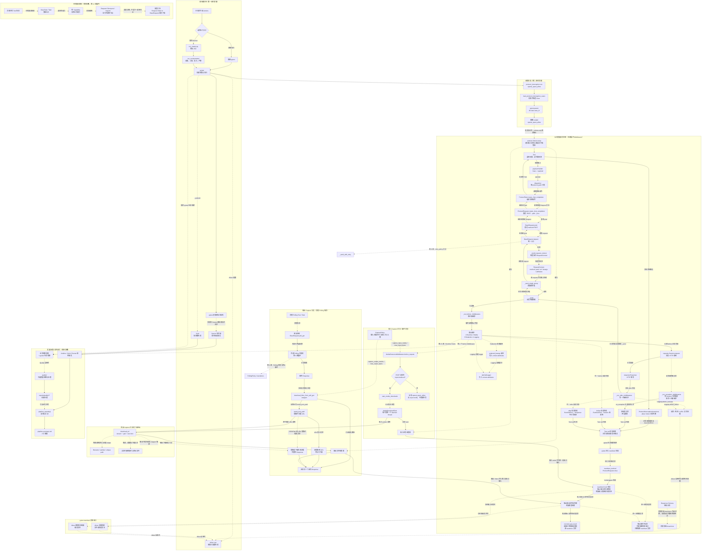

# 第 05 课：Middleware、Capture 与资源附件

> 本课从第 4 课的 `BaseRequest._send()` 继续下钻，只展开请求发送前后的横向能力：Middleware 三阶段、脱敏日志、输入媒体 Capture、输出结果 Capture，以及 pytest teardown 中的资源附件收口。Retry、Polling 状态机、SSE、Runtime Hooks 内部实现和业务断言继续保持折叠。

## 1. 课程信息

| 项目 | 内容 |
| --- | --- |
| 建议时长 | 60～90 分钟 |
| 核心问题 | 日志、脱敏、输入媒体和输出结果为什么不直接写在领域 Request 中？ |
| 讲解重点 | Middleware 三阶段、脱敏副本、Capture 双分支、下载与附件收口 |
| 代码入口 | `common/request_middleware.py`、`common/capture.py`、`common/base_decorators.py`、`util/`、`module/conftest.py` |
| 课堂切片 | 普通请求 Middleware、POST 输入媒体 Capture、最终 Polling Response 输出 Capture |
| 轻量验证 | 现有离线测试，只使用 fake Session、monkeypatch 和内存 Response |
| 安全边界 | 不访问真实 LLM API，不真实下载外部媒体，不展开 Polling 循环 |
| 课后产出 | 第五版累积总图、1 张双分支对照表和口头三分钟复述 |

### 1.1 学完本课，你应该能够

1. 准确说明 `before_request`、`after_response` 和 `on_exception` 的触发条件。
2. 解释默认 Middleware 的注册顺序，以及 Redaction 为什么必须先于 Logging 提供脱敏副本。
3. 证明内置脱敏与日志机制不会为了记录而修改真实请求参数。
4. 区分输入媒体 Capture 与输出结果 Capture 的入口、数据来源、时机和返回语义。
5. 说明 `CapturePolicy` 如何分别控制两条分支和下载大小上限。
6. 追踪资源怎样在测试 setup 建立收集器，并在 pytest teardown 中挂入 Allure。
7. 根据失败位置判断：业务 Response 保留、原请求异常重抛，还是 Middleware 自身失败导致 `RuntimeError`。

### 1.2 本课刻意不展开

- 不展开 `RuntimeObservationMiddleware` 背后的 Runtime Hooks；第 15 课学习。
- 不展开 Retry attempt 和等待策略；第 8 课学习。
- 不展开 Polling 状态判断、间隔、deadline 和终止条件；第 9 课学习。
- 不展开 SSE 流式消费；第 10 课学习。
- 不把 Allure 生命周期、历史报告和最终报告生成作为本课主题；第 14 课学习。
- 不判断 Response 是否满足业务合同；第 6 课学习 Assertions 与 Schema。
- 不执行可能访问真实媒体 URL 或真实模型接口的命令。

本课看到上述机制时，只保留它们与 Middleware、Capture 的接口，不进入内部状态机。

### 1.3 课堂必讲路径

| 环节 | 对应章节 | 建议时间 |
| --- | --- | ---: |
| 问题、约束与教学切片 | 第 2～6 节 | 8～10 分钟 |
| Middleware 阶段、脱敏与日志 | 第 7～10 节 | 20～25 分钟 |
| Capture、下载与资源收口 | 第 11～18 节 | 25～30 分钟 |
| 二选一课堂活动 | 第 21 或第 22 节 | 8～10 分钟，计入被替代章节 |
| 总图、小测与复述 | 第 23、25、26 节 | 12～15 分钟 |
| 过渡、提问与讨论缓冲 | 全课 | 5 分钟 |

总计按不重复计时约 70～85 分钟。活动 A 替代第 11～18 节中的部分 Capture 讲解；活动 B 替代第 7～10、18 节中的部分阶段与失败边界讲解。两项活动只能选择一项，第 20 节教师演示为可选内容，不计入必讲时间。

### 1.4 必讲与选读边界

必讲内容：

- 第 7～9 节的 Middleware 合同、阶段和脱敏副本；
- 第 10 节的 Logging 输入输出与失败边界；
- 第 11～15 节的 CapturePolicy 和双分支关系；
- 第 16 节的临时文件、大小限制与异常清理；
- 第 17、18 节的 pytest 收口和失败判断。

选读或教师参考：

- 第 10.3、10.4 节的附件与 cURL 细节；
- 第 12.2 节的完整 payload 形状；
- 第 13.2、13.3 节的任务字段和 ContextVar 细节；
- 第 16.3、16.4 节的完整命名与 MIME 映射；
- 第 19 节的完整源码阅读清单；
- 第 20.4 节的六文件完整回归。

选读内容不应追加到必讲时间中。

---

## 2. 承接第四课：`_send()` 不只有 Session 调用

第 4 课已经确认普通无 Retry 路径：

```text
request()
--调用--> _build_request_context()
_build_request_context()
--返回 context--> request()
request()
--调用--> _send_single_group(context)
_send_single_group(context)
--调用--> _send(context)
```

`_send()` 的当前实现是：

```python
def _send(self, context: RequestContext) -> requests.Response:
    self._run_before_middlewares(context)

    try:
        response = self.session.request(
            method=context.method,
            url=context.url,
            **context.kwargs,
        )
    except Exception as error:
        self._run_exception_middlewares(context, error)
        raise

    self._run_after_middlewares(context, response)
    return response
```

这段代码留下五个问题：

1. before、after、exception 分别在什么条件下运行？
2. 多个 Middleware 按什么顺序执行？
3. 日志怎样看到请求数据，又不把脱敏值发送给服务端？
4. 输入媒体和输出结果为什么不在同一个 Middleware 中顺序完成？
5. 下载文件为什么不直接在业务函数里立刻挂 Allure？

本课只回答这五个问题。

---

## 3. 当前认知障碍与因果链

### 3.1 第一个障碍：把 Middleware 当成领域业务层

如果把日志、脱敏和资源下载写进每个领域 Request：

```text
每个 Request 方法重复记录日志
+ 每个 Request 方法重复隐藏密钥
+ 每个媒体接口重复下载输入文件
+ 每个异步接口重复下载结果
-> 横向规则散落到所有领域模块
-> 任一安全规则变化都需要批量修改
-> 不同接口产生不同证据和泄密风险
```

真正要解决的不是“少写几行代码”，而是：

> 让横向能力复用同一个请求上下文，同时不取得领域动作和业务结果的所有权。

### 3.2 第二个障碍：把 Capture 画成一条线

错误图常写成：

```text
Middleware
-> 输入媒体下载
-> HTTP 请求
-> Polling
-> 输出结果下载
```

这会产生三层误解：

```text
误以为每个请求都包含输入媒体
-> 误以为普通 POST 必然进入 Polling
-> 误以为输出下载是输入下载的下一调用节点
```

真实关系是：

```text
CapturePolicy
├─ 输入分支：POST before Middleware 读取 payload 中的 input.media
└─ 输出分支：poll_get 装饰器读取最终 Response 中的结果链接
```

两条分支共享策略和下载原语，但入口、数据源和生命周期不同。

### 3.3 第三个障碍：把所有失败都称为“旁路失败”

当前代码没有提供一个无限宽的“所有记录失败都不影响业务”保证。

必须按失败位置分类：

```text
输入后台下载失败
-> 记录到 MediaDownloadTask
-> 主 HTTP 请求继续

输出结果提取或下载失败
-> 记录下载失败证据
-> 返回原最终 Response

Session.request 抛异常
-> 执行 on_exception
-> 重抛原请求异常

before / after Middleware 自身抛错
-> 包装为 RuntimeError
-> 当前调用失败
```

因此本课的 TOC 约束是：

> 先区分业务主链、观察阶段、输入 Capture、输出 Capture 和 pytest 资源收口，再讨论各自的失败隔离。

---

## 4. 第一性原理：横向能力至少要满足什么

不考虑当前项目，一个安全的请求横向机制至少要满足六项约束。

| 约束 | 为什么需要 |
| --- | --- |
| 统一输入对象 | 多个横向能力读取同一个请求上下文 |
| 明确阶段 | 发送前、成功后和传输异常时不能混为一谈 |
| 不取得业务所有权 | Middleware 不选择业务端点，不决定 allow/block |
| 证据与真实数据分离 | 脱敏副本用于记录，真实参数用于发送 |
| Capture 可关闭、可限额 | 避免不必要的外部下载和无限文件增长 |
| 异步或延迟资源在生命周期末端收口 | 产生异步任务或延迟附件的横向机制需要统一收口边界 |

映射到当前项目：

| 必要问题 | 当前对象 |
| --- | --- |
| 一次请求的共享输入是什么 | `RequestContext` |
| 三个阶段在哪里执行 | `_run_before_middlewares()`、`_run_after_middlewares()`、`_run_exception_middlewares()` |
| 谁建立脱敏证据 | `RedactionMiddleware` |
| 谁建立请求响应日志 | `LoggingMiddleware`、`ApiCallLogger` |
| 谁控制输入和输出 Capture | `CapturePolicy` |
| 输入媒体从哪里进入 | `MediaResourceMiddleware.before_request()` |
| 输出结果从哪里进入 | `download_links_from_poll_get` |
| 下载规则在哪里统一 | `util/downloads.py` |
| 谁在用例结束时挂附件 | `module/conftest.py` |

最重要的边界是：

```text
业务请求拥有 Response 或原请求异常
横向能力拥有观察证据和资源记录
pytest 生命周期拥有最终资源收口时机
```

---

## 5. 生活类比：流水线旁边有三类岗位

把一次请求想成一个包裹通过流水线。

| 项目对象 | 类比 |
| --- | --- |
| `RequestContext` | 包裹和面单的当前状态 |
| before Middleware | 发货前的安检、登记和样品留存 |
| `Session.request()` | 真正把包裹交给运输系统 |
| after Middleware | 收到回执后归档请求和响应证据 |
| exception Middleware | 运输系统没有返回时记录事故证据 |
| 输入 Capture | 发货前保存客户提供的原料照片 |
| 输出 Capture | 异步生产完成后保存成品文件 |
| pytest teardown | 本单结束后统一整理附件袋 |

类比只能用于区分职责，不能推出错误调用关系：

- 输入 Capture 不会调用输出 Capture。
- exception Middleware 不是所有 Python 异常的统一处理器。
- 日志中的脱敏面单不是实际发送的面单。
- 附件是证据，不是业务 Response 的替代品。

---

## 6. 本课使用三个离线切片，不伪造单一主链

本课不会声称某一个真实用例同时经过所有节点，而是使用三个独立切片回答三个问题。

### 6.1 切片 A：普通请求 Middleware

使用 fake Session 观察：

```text
RequestContext
-> before 阶段
-> fake Session.request
-> after 阶段
-> 原 Response 返回
```

传输异常切片单独观察：

```text
fake Session.request 抛 requests.Timeout
-> exception 阶段
-> 原 Timeout 重抛
```

### 6.2 切片 B：POST 输入媒体 Capture

使用纸面 payload 或 monkeypatch：

```python
{
    "input": {
        "media": {
            "type": "image",
            "url": "https://example.com/input.png",
        }
    }
}
```

只观察 `MediaResourceMiddleware.before_request()` 是否把该 payload 交给 `start_media_downloads()`，不真实访问 URL。

### 6.3 切片 C：最终 Response 输出 Capture

使用内存 Response 和 monkeypatch 观察：

```text
被装饰的 poll_get 返回最终 Response
-> 根据 result_json_path 提取链接
-> 下载函数被模拟为成功或失败
-> 无论下载失败与否，成功返回路径仍得到同一个 Response
```

### 6.4 三个切片不能混成一条调用链

第 2～4 课累计主链使用的 `openai_qwen_allow`：

- 是普通 POST；
- payload 没有 `input.media`，因此不会启动输入下载任务；
- 不调用 `poll_get()`，因此不会经过输出 Capture 装饰器。

它会经过默认 Middleware 阶段，但不会因为本课讲了 Capture，就自动经过两条下载分支。

---

## 7. RequestMiddleware 合同与默认注册顺序

`common/request_middleware.py` 定义的协议只有三个方法：

```python
class RequestMiddleware(Protocol):
    def before_request(self, context: RequestContext) -> None:
        ...

    def after_response(
        self,
        context: RequestContext,
        response: requests.Response,
    ) -> None:
        ...

    def on_exception(
        self,
        context: RequestContext,
        error: BaseException,
    ) -> None:
        ...
```

### 7.1 三个方法分别拥有什么输入

| 阶段 | 输入 | 当前能够知道什么 | 当前还不知道什么 |
| --- | --- | --- | --- |
| `before_request` | `RequestContext` | method、url、kwargs、控制字段 | 尚无 Response |
| `after_response` | Context + Response | 请求上下文和成功返回的 HTTP 事实 | 不负责业务断言结论 |
| `on_exception` | Context + 原请求异常 | 请求上下文和传输失败事实 | 没有成功 Response |

Middleware 方法的返回值都是 `None`。业务 Response 仍由 `_send()` 返回，原请求异常仍由 `_send()` 重抛。

### 7.2 默认 Middleware 列表

`BaseRequest` 在没有显式传入 `middlewares` 时调用：

```python
default_request_middlewares(self.capture_policy)
```

当前默认注册顺序固定为：

```text
1. RuntimeObservationMiddleware
2. MediaResourceMiddleware
3. RedactionMiddleware
4. LoggingMiddleware
```

本课只展开后面三项：

| Middleware | 本课职责 |
| --- | --- |
| `RuntimeObservationMiddleware` | 只保留为第 15 课接口 |
| `MediaResourceMiddleware` | 在符合条件的 POST 前启动输入媒体任务 |
| `RedactionMiddleware` | 建立脱敏副本 |
| `LoggingMiddleware` | 使用上下文中的证据生成请求、响应或异常附件 |

### 7.3 显式列表是替换，不是追加

构造代码是：

```python
self.middlewares = list(
    self._default_middlewares()
    if middlewares is None
    else middlewares
)
```

因此：

```text
middlewares=None
-> 使用完整默认列表

middlewares=[custom_a, custom_b]
-> 只使用传入列表，并按传入顺序执行

middlewares=[]
-> 禁用全部默认 Middleware
```

不能把“传入一个自定义 Middleware”理解成“自动追加到默认列表末尾”。

---

## 8. 三个阶段的准确触发边界

### 8.1 before 阶段

当前执行器：

```python
def _run_before_middlewares(self, context: RequestContext) -> None:
    for middleware in self.middlewares:
        try:
            middleware.before_request(context)
        except Exception as error:
            raise RuntimeError(
                f"Request middleware {type(middleware).__name__} "
                "failed in before_request"
            ) from error
```

准确关系是：

```text
_run_before_middlewares
--按注册顺序调用--> 每个 before_request
--全部正常完成后--> Session.request
```

如果某个 before Middleware 失败：

```text
当前异常被包装为 RuntimeError
-> 后续 before Middleware 不再执行
-> Session.request 尚未调用
-> 不进入 on_exception 阶段
```

最后一条来自第 4 课已经核对的 `try` 范围：只有 `Session.request()` 位于 try 中。

### 8.2 after 阶段

只有 `Session.request()` 正常返回 Response 后，才会调用：

```python
self._run_after_middlewares(context, response)
```

当前 after 仍按注册顺序执行，不是倒序退栈：

```text
RuntimeObservation.after_response
-> MediaResource.after_response
-> Redaction.after_response
-> Logging.after_response
```

如果某个 after Middleware 失败：

```text
HTTP Response 已经存在
-> Middleware 异常包装为 RuntimeError
-> 后续 after Middleware 不再执行
-> _send() 不会正常返回该 Response
-> 不进入 on_exception 阶段
```

### 8.3 exception 阶段

exception 阶段只由下面的范围触发：

```python
try:
    response = self.session.request(...)
except Exception as error:
    self._run_exception_middlewares(context, error)
    raise
```

因此准确表述是：

> 当 `Session.request()` 抛出请求或传输异常时，框架按注册顺序调用全部 `on_exception()`，随后重抛原请求异常。

`on_exception()` 自身失败时，执行器不会让它替换原请求异常：

```text
收集 Middleware 异常
-> 包装为 RuntimeError 记录到 context.attributes
-> 作为 note 添加到原请求异常
-> 继续调用后续 on_exception
-> 最终重抛原请求异常
```

### 8.4 三阶段判断表

| 事件 | before | Session | after | on_exception | 调用方最终看到 |
| --- | --- | --- | --- | --- | --- |
| 全部正常 | 执行 | 返回 Response | 执行 | 不执行 | 原 Response |
| before 自身失败 | 执行到失败项 | 不调用 | 不执行 | 不执行 | 包装后的 `RuntimeError` |
| Session 抛异常 | 已完成 | 抛原异常 | 不执行 | 全部执行 | 原请求异常 |
| after 自身失败 | 已完成 | 已返回 Response | 执行到失败项 | 不执行 | 包装后的 `RuntimeError` |
| on_exception 自身失败 | 已完成 | 抛原异常 | 不执行 | 继续其他项 | 带 note 的原请求异常 |

---

## 9. RedactionMiddleware：建立证据副本，不改真实请求

默认顺序中，Redaction 位于 Logging 之前：

```text
RedactionMiddleware.before_request
-> context.attributes["redacted_kwargs"]
-> LoggingMiddleware.before_request 读取
```

核心代码：

```python
class RedactionMiddleware:
    REDACTED_KWARGS_ATTR = "redacted_kwargs"

    def before_request(self, context: RequestContext) -> None:
        context.attributes[self.REDACTED_KWARGS_ATTR] = (
            redact_request_kwargs(context.kwargs)
        )
```

### 9.1 两份数据必须区分

```text
context.kwargs
= 真实发送参数，后续由 Session.request 使用

context.attributes["redacted_kwargs"]
= 日志证据副本，只用于记录
```

`redact_request_kwargs()` 会新建字典，并对常见字段执行：

| 字段 | 脱敏方式 |
| --- | --- |
| `headers` | Authorization、Cookie、X-API-Key 等敏感 Header 替换为 `<redacted>` |
| `params` | 对 api_key、token、password 等键递归脱敏 |
| `json` | 对嵌套敏感键递归脱敏 |
| `data` | 对结构化或文本敏感值脱敏 |
| 其他字段 | 尽量复制，复制失败时保留原值 |

### 9.2 为什么不能直接改 `context.kwargs`

错误做法：

```text
Authorization: Bearer real-token
-> Redaction 直接改成 <redacted>
-> Session 发送 <redacted>
-> 真实请求认证失败
```

正确做法：

```text
真实 kwargs 保持原值并发送
+ 脱敏 kwargs 副本用于日志
```

### 9.3 “不会修改”是内置实现合同，不是 dataclass 强制

`RequestContext` 本身是可变对象，自定义 Middleware 技术上可以修改 `context.kwargs`。本项目的规范要求观察和记录机制不要污染调用方数据；当前 RedactionMiddleware 通过建立副本遵守该边界。

---

## 10. LoggingMiddleware、ApiCallLogger 与 cURL 证据

### 10.1 before 阶段只建立 logger

```python
logger_kwargs = context.attributes.get(
    RedactionMiddleware.REDACTED_KWARGS_ATTR,
    context.kwargs,
)
context.attributes["api_call_logger"] = ApiCallLogger(
    context.method,
    context.url,
    logger_kwargs,
    step_name=context.request_step_name,
    response_step_name=context.response_step_name,
)
```

默认顺序下，`logger_kwargs` 是 Redaction 生成的副本。`ApiCallLogger` 构造时又会 `deepcopy()` 一次，使日志准备数据与后续 Context 变化进一步隔离。

### 10.2 成功与传输失败使用不同入口

```text
Session 正常返回
-> LoggingMiddleware.after_response
-> ApiCallLogger.attach_success(response)

Session 抛请求异常
-> LoggingMiddleware.on_exception
-> ApiCallLogger.attach_failure(error)
```

`attach_log=False` 时：

- before 阶段仍会创建 logger；
- after 和 on_exception 会跳过附件；
- 请求仍然照常发送。

### 10.3 成功证据包含什么

`attach_success()` 当前建立：

| Allure 步骤 | 附件 |
| --- | --- |
| 请求步骤 | 请求 cURL、请求行、请求头、请求体 |
| 响应步骤 | 响应行、响应头、响应体 |

成功路径优先读取 `response.request` 中的 `PreparedRequest`，因此日志可以反映 requests 最终准备出的 method、URL、Header 和 body。

### 10.4 cURL 为什么需要再次脱敏

`build_curl()` 接收 `requests.PreparedRequest`，会分别处理：

- URL 查询参数中的敏感键；
- Authorization、Cookie、X-API-Key 等 Header；
- JSON 或表单 body 中的 token、password、secret 等字段；
- shell 单引号转义；
- 多行或单行格式。

这意味着：

```text
RedactionMiddleware 的副本保护日志准备阶段
+ ApiCallLogger / build_curl 对 PreparedRequest 再次脱敏
```

不能因为已经有 RedactionMiddleware，就把 PreparedRequest 当成安全文本直接输出。

脱敏规则也不是万能秘密检测器：

- 只识别当前配置的敏感 Header 和敏感键名；
- JSON Response 会按敏感键递归脱敏；
- 非 JSON Response body 当前主要做格式化和长度截断，不保证识别任意业务秘密；
- 未被规则识别的自定义敏感字段仍可能进入证据。

因此测试数据、错误文本和响应内容本身仍应遵守最小敏感信息原则。

默认顺序也是安全依赖。若自定义列表把 Logging 放在 Redaction 前面，或完全省略 Redaction，logger 可能取得未脱敏的构造参数；不能在没有对应安全测试时随意调整顺序。

### 10.5 Logging 不拥有业务判断

Logging 只能记录：

- HTTP 请求事实；
- HTTP Response 事实；
- 请求异常事实。

它不能决定：

- 状态码 200 是否满足领域成功；
- JSON 字段是否符合合同；
- allow 或 block 是否符合 Case 预期。

这些判断仍属于第 6 课的 Assertions 与 Schema。

### 10.6 不要把所有日志失败都说成 fail-open

当前代码的准确边界是：

- `on_exception()` 中的日志附件失败，会被 exception 执行器记录为 note，原请求异常仍然保留；
- `after_response()` 中的日志附件失败，会被 after 执行器包装为 `RuntimeError`，当前调用不会正常返回已有 Response；
- 因此自定义或内置 Middleware 都必须控制自己的可靠性，不能依赖一个不存在的全局吞错器。

---

## 11. CapturePolicy：一份策略控制两条独立分支

`common/capture.py` 当前定义：

```python
@dataclass(frozen=True)
class CapturePolicy:
    capture_input_media: bool = True
    capture_output_results: bool = True
    max_input_bytes: int | None = None
    max_output_bytes: int | None = None
```

### 11.1 四个字段分别控制什么

| 字段 | 消费者 | 含义 |
| --- | --- | --- |
| `capture_input_media` | `start_media_downloads()` | 是否允许输入媒体分支启动下载 |
| `capture_output_results` | `download_links_from_poll_get` | 是否允许输出结果分支提取并下载链接 |
| `max_input_bytes` | 输入分支的 `download_url()` | 单个输入资源大小上限 |
| `max_output_bytes` | 输出分支的 `download_url()` | 单个输出结果大小上限 |

大小上限如果不为 `None`，必须大于 0，否则构造策略时立即抛出 `ValueError`。

### 11.2 便捷策略

```python
CapturePolicy.disabled()
CapturePolicy.input_only(max_bytes=...)
CapturePolicy.output_only(max_bytes=...)
```

| 策略 | 输入 Capture | 输出 Capture |
| --- | ---: | ---: |
| 默认 `CapturePolicy()` | 开 | 开 |
| `disabled()` | 关 | 关 |
| `input_only()` | 开 | 关 |
| `output_only()` | 关 | 开 |

默认策略的两个大小上限都是 `None`，表示框架本身不设置字节上限；真实项目应根据资源风险显式配置。

### 11.3 策略是许可条件，不是自动调用器

即使 `capture_input_media=True`，仍然需要：

```text
MediaResourceMiddleware 已注册
+ method == POST
+ json payload 中存在有效 input.media.url
```

即使 `capture_output_results=True`，仍然需要：

```text
调用被装饰的 poll_get
+ polling_policy.result_json_path 非空
+ 最终 Response 中能提取 URL
```

所以不能画成：

```text
CapturePolicy -> 自动下载所有输入和输出
```

它只向两条机制提供开关和限额。

还要区分 Middleware 列表与 CapturePolicy：

```text
middlewares=[]
-> MediaResourceMiddleware 不再运行
-> 输入 Capture 入口被移除
-> 但 poll_get 上的输出装饰器仍然存在

CapturePolicy.disabled()
-> 输入分支即使被调用也不启动线程
-> 输出装饰器即使执行也不下载结果
```

因此需要关闭两类外部资源访问时，应显式使用 `CapturePolicy.disabled()`，不能只依赖空 Middleware 列表。

---

## 12. 输入 Capture：POST before 阶段启动媒体任务

输入分支入口位于 `MediaResourceMiddleware.before_request()`：

```python
def before_request(self, context: RequestContext) -> None:
    if context.method == "POST":
        start_media_downloads(
            context.kwargs.get("json"),
            policy=self.capture_policy,
        )
```

### 12.1 准确触发条件

```text
context.method == POST
-> 读取 context.kwargs["json"]
-> start_media_downloads(payload, policy)
```

下面情况不会创建下载任务：

- method 不是 POST；
- 输入 Capture 被策略关闭；
- 没有 JSON payload；
- payload 不是字典；
- payload 中没有 `input.media`；
- media 项没有非空字符串 URL。

### 12.2 当前支持的 payload 形状

单个媒体：

```python
{
    "input": {
        "media": {
            "type": "image",
            "url": "https://example.com/a.png",
        }
    }
}
```

多个媒体：

```python
{
    "input": {
        "media": [
            {"type": "image", "url": "https://example.com/a.png"},
            {"type": "audio", "url": "https://example.com/a.wav"},
        ]
    }
}
```

如果 `type` 缺失或为空，附件名称使用 `media` 作为回退值。

### 12.3 输入 Capture 读取真实 payload，但不修改它

`MediaResourceMiddleware` 把 Context 中的 JSON 对象交给提取函数。当前提取逻辑只读取 `input.media.type` 和 `input.media.url`，不会替换 URL、删除字段或改变发送 body。

真实 HTTP 请求仍使用原 `context.kwargs`。

---

## 13. 输入下载为什么是异步任务

每个有效媒体条目会创建一个 `MediaDownloadTask`：

```python
from dataclasses import dataclass, field
from pathlib import Path
import threading


@dataclass
class MediaDownloadTask:
    media_type: str
    url: str
    cancel_event: threading.Event = field(default_factory=threading.Event)
    done_event: threading.Event = field(default_factory=threading.Event)
    file_path: Path | None = None
    error: str | None = None
    max_bytes: int | None = None
```

随后启动 daemon thread：

```python
thread = threading.Thread(
    target=_run_download,
    args=(task,),
    daemon=True,
)
thread.start()
```

### 13.1 主请求不等待下载完成

准确时序是：

```text
before Middleware 提取媒体链接
-> 启动后台下载线程
-> 记录 MediaDownloadTask
-> before Middleware 返回
-> _send() 继续调用 Session.request
```

因此输入媒体留存与业务 HTTP 请求可以并行发生。

### 13.2 下载线程怎样记录结果

后台函数 `_run_download()`：

```text
下载成功
-> task.file_path = 文件路径

下载取消
-> task.error = 资源下载未完成

下载失败
-> task.error = 异常类型和信息

无论成功失败
-> task.done_event.set()
```

网络下载异常在后台线程中转换为任务状态，不会从线程重新抛回主请求调用栈。

### 13.3 Task 怎样进入用例级收集器

`start_media_downloads()` 在启动任务后调用：

```python
_record_media_download_tasks(tasks)
```

只有当前测试已经建立 `ContextVar` 收集列表时，任务才会被加入用例资源集合。`module/conftest.py` 的 autouse fixture 会在 module 测试执行前建立该集合。

---

## 14. 输出 Capture：装饰器处理最终 Polling Response

输出分支不在 `MediaResourceMiddleware.after_response()` 中，而在 `BaseRequest.poll_get()` 的装饰器上：

```python
@download_links_from_poll_get
def poll_get(...):
    ...
```

本课不展开 `poll_get()` 内部怎样循环，只把它折叠成：

```text
poll_get 内部状态机
--正常结束并返回--> 最终 requests.Response
```

### 14.1 装饰器先取得业务 Response

核心顺序：

```python
response = func(instance, path, *args, **kwargs)
if result_json_path is None or not capture_policy.capture_output_results:
    return response
```

这说明：

- 内层 `poll_get` 先完整执行；
- 如果内层抛异常，装饰器不会得到 Response，也不会进入输出下载代码；
- 输出 Capture 关闭或没有结果 JSONPath 时，直接返回原 Response。

### 14.2 怎样提取并下载结果链接

```text
最终 Response
-> 按 result_json_path 读取值
-> 递归提取其中的 HTTP/HTTPS URL
-> 按首次出现顺序去重
-> 提取到 URL：对每个 URL 调用 download_url，并记录结果文件
-> 未提取到 URL：不下载，直接返回原 Response
```

提取值可以是：

- 单个字符串；
- 字典中的嵌套 URL；
- 列表或其他可迭代容器中的多个 URL。

### 14.3 输出下载失败为什么不替换 Response

链接提取和每次下载都有独立 `try/except`：

```text
JSONPath 解析或 Response JSON 失败
-> 尝试附加“模型结果下载失败”文本
-> 返回原 Response

单个 URL 下载失败
-> 尝试附加该 URL 的失败文本
-> 继续处理其他 URL
-> 返回原 Response
```

现有离线测试冻结的合同是对象身份不变：

```python
assert result is response
```

这只是输出 Capture 的失败隔离，不等于所有 Middleware 或 Allure 操作都自动 fail-open。

### 14.4 文件怎样进入收集器

成功下载后：

```text
存在模型结果收集器
-> 把 Path 加入当前用例列表

不存在收集器
-> 立即调用 allure.attach.file
```

在 `module/` 下由 pytest 正常执行时，autouse fixture 会先建立收集器，因此本课主路径是“先记录文件，teardown 再统一挂附件”。

---

## 15. 输入与输出 Capture 是并列分支

### 15.1 对照表

| 维度 | 输入 Capture | 输出 Capture |
| --- | --- | --- |
| 入口 | `MediaResourceMiddleware.before_request()` | `download_links_from_poll_get` wrapper |
| 触发动作 | 普通 POST 发送前 | `poll_get` 正常得到最终 Response 后 |
| 数据来源 | `context.kwargs["json"]["input"]["media"]` | `result_json_path` 对应的 Response JSON 值 |
| 策略开关 | `capture_input_media` | `capture_output_results` |
| 大小限制 | `max_input_bytes` | `max_output_bytes` |
| 并发方式 | 每个输入资源启动 daemon thread | 当前调用栈中逐个下载 |
| 成功记录 | `MediaDownloadTask.file_path` | 模型结果 `Path` 列表 |
| 下载失败 | 记录到 task，主请求继续 | 记录失败附件，原 Response 返回 |
| 最终附件 | teardown 的“前置资源”步骤 | teardown 的“模型响应结果”步骤 |

### 15.2 正确关系图

```text
CapturePolicy
├─ 输入 Capture
│  -> MediaResourceMiddleware.before_request
│  -> POST payload 的 input.media
│  -> 后台 MediaDownloadTask
│  -> 输入任务收集器
└─ 输出 Capture
   -> poll_get 装饰器
   -> 最终 Response 的 result_json_path
   -> 同步下载结果文件
   -> 输出文件收集器

pytest teardown
├─ 收口输入任务并附加前置资源或失败文本
└─ 收口输出文件并附加模型结果
```

### 15.3 三个禁止画出的错误箭头

```text
MediaResourceMiddleware -> download_links_from_poll_get
输入下载完成 -> 才允许 Session.request
输出下载失败 -> 替换业务 Response
```

这三条都不是当前实现。

---

## 16. `download_url()`：两条分支共享的下载原语

输入和输出分支最终都调用 `util/downloads.py::download_url()`。

### 16.1 下载步骤

```text
检查 cancel_event
-> 创建下载目录
-> 从 URL path 生成安全文件名
-> 分配不重名目标路径
-> 创建带 UUID 的 .part 临时文件
-> requests.get(stream=True)
-> 检查 Content-Length 上限
-> 分块读取并检查实际累计字节
-> 临时文件替换为目标文件
-> 返回 Path
```

### 16.2 为什么先写 `.part`

如果直接写最终文件名：

```text
下载到一半失败
-> 目录中留下看似完整的损坏文件
-> teardown 可能把坏文件当成证据
```

当前实现使用临时文件，并在任意异常时：

```python
temporary_path.unlink(missing_ok=True)
file_path.unlink(missing_ok=True)
raise
```

现有测试验证了超出字节上限后目录为空，没有残留部分文件。

### 16.3 文件名与重名规则

| 规则 | 当前行为 |
| --- | --- |
| URL path 有文件名 | URL decode 后取 basename |
| URL path 无文件名 | 使用 `fallback_name` |
| Windows 非法字符 | 替换为 `_` |
| 同名文件已存在 | 依次尝试 `_1`、`_2` 等后缀 |
| 无法分配路径 | 抛出 `RuntimeError` |

输入分支和输出分支的兼容 helper 都委托同一套函数，因此文件命名规则一致。

### 16.4 附件类型

`attachment_type_for_file()` 根据扩展名识别常见：

- JPG、PNG、GIF、SVG；
- TXT、JSON、CSV、XML、HTML；
- PDF；
- MP4、WebM、OGG、MOV、AVI、MKV 等视频格式。

未知扩展名使用 `application/octet-stream`。

### 16.5 课堂安全边界

`download_url()` 内部会真实调用 `requests.get()`。课堂只能运行已经 monkeypatch 该调用的离线测试，不能把示例 URL 直接交给真实函数。

---

## 17. pytest 怎样在 teardown 收口资源

输入任务和输出文件不会由 Assertions 收口，也不是 `teardown_method()` 直接发现的。

`module/conftest.py` 使用两个阶段。

### 17.1 setup：建立两个用例级收集器

autouse fixture：

```python
@pytest.fixture(scope="function", autouse=True)
def collect_test_resources(request):
    setattr(
        request.node,
        TEST_RESOURCE_STATE_ATTR,
        {
            "media_download_token": start_media_download_collection(),
            "model_result_token": start_model_result_collection(),
        },
    )
    yield
```

这里建立：

```text
输入 MediaDownloadTask 收集器
+ 输出模型结果 Path 收集器
```

两个收集器基于 `ContextVar`，用于隔离当前执行上下文中的用例资源。

### 17.2 call：两条分支只记录，不负责最终附件布局

```text
输入 Capture
-> 记录 MediaDownloadTask

输出 Capture
-> 记录下载成功的 Path
```

这样业务代码不需要知道 Allure 中最终使用哪个父步骤、何时取消未完成任务或怎样统一展示多个文件。

### 17.3 teardown：hook 恢复后统一附件

当前 hook 是：

```python
@pytest.hookimpl(hookwrapper=True)
def pytest_runtest_teardown(item):
    outcome = yield
    _attach_collected_test_resources(item)
    outcome.get_result()
```

准确生命周期：

```text
pytest 进入 teardown 阶段
-> hookwrapper yield，让 teardown_method 和 fixture finalizer 执行
-> hook 恢复
-> 停止输入任务收集器，并立即附加输入资源或失败文本
-> 前一步未抛异常时，停止输出文件收集器，并附加输出结果
-> 两段附件流程均未抛异常时，调用 outcome.get_result()
-> 返回 teardown 正常结果，或重新抛出 teardown 原异常
```

这里的结果保留是有条件的：当前实现不保证附件阶段 `fail-open`。如果 `_attach_collected_test_resources()` 抛异常，`outcome.get_result()` 不会执行，附件异常可能覆盖原 teardown 异常；输入资源停止或附件过程中若抛异常，还可能使后续输出收集器无法停止和附加。

对于前几课的协议测试，`ProtocolRequest.close()` 仍由 `teardown_method()` 执行；资源附件发生在 pytest teardown hook 的收口部分，不是 Assertions 的下一调用节点。

### 17.4 输入任务怎样附加

`attach_media_download_steps()`：

```text
任务已完成且文件存在
-> 在“前置资源”步骤附加文件

任务尚未完成
-> 设置 cancel_event
-> 附加“资源下载未完成”文本

任务已完成但失败
-> 附加“资源下载失败”文本
```

### 17.5 输出文件怎样附加

```text
停止模型结果收集器
-> 得到 Path 列表
-> 如果非空，创建“模型响应结果”步骤
-> 逐个 allure.attach.file
```

附件动作提供证据，不会把文件 Path 变成新的业务 Response。

---

## 18. 失败边界判断表

本课最容易被说成一句错误口号：

```text
Capture 和日志都是旁路，所以任何失败都不会影响测试。
```

当前实现必须逐项判断。

| 失败位置 | 当前处理 | 是否继续业务主链 |
| --- | --- | --- |
| 输入 Capture 被策略关闭 | 不启动线程 | 是 |
| 输入 URL 下载在线程中失败 | 写入 `task.error`，teardown 附加失败文本 | 是 |
| 输入下载尚未完成 | teardown 设置取消并附加未完成文本 | 业务 call 已结束 |
| 输入线程创建或 before Middleware 自身失败 | before 执行器包装 `RuntimeError` | 否，Session 尚未调用 |
| 输出 Capture 被策略关闭 | 直接返回原 Response | 是 |
| 输出 JSONPath 解析失败 | 尝试附加失败文本，返回原 Response | 是 |
| 输出某个 URL 下载失败 | 记录该 URL 失败，继续其他 URL，返回原 Response | 是 |
| `download_url` 超出大小上限 | 删除临时与目标文件，再抛给所在 Capture 分支处理 | 由分支决定 |
| `Session.request` 抛异常 | 执行全部 `on_exception`，重抛原异常 | 否 |
| `on_exception` 自身失败 | 添加 note，不覆盖原请求异常 | 原异常继续抛出 |
| after Middleware 自身失败 | 包装为 `RuntimeError` | 否，已有 Response 不会正常返回 |
| teardown 停止收集器或附件失败 | 当前没有统一捕获；可能阻断后续收口并覆盖原 teardown 异常 | 业务 call 已结束，但 teardown 结果可能被改变 |

### 18.1 本课能够证明的 fail-open 范围

可以证明：

- 输入后台下载异常不会回到主请求调用栈；
- 输出提取或下载失败不会替换已经得到的最终 Polling Response；
- `on_exception()` 自身失败不会覆盖原请求异常。

不能笼统证明：

- 所有 before/after Middleware 失败都不影响调用；
- 所有 Allure API 调用失败都一定被吞掉；
- teardown 附件失败不会改变原 teardown 结果；
- 所有自定义 Middleware 都不会修改请求数据。

### 18.2 设计要求与当前机械保证要分开

项目规范要求观察、附件和 Capture 尽量不覆盖业务事实；代码审阅时仍要逐个检查 try/except 的实际范围。设计目标不能代替当前实现证据。

### 18.3 Capture 失败附件的 URL 安全边界

当前输入失败文本会包含 `media.url`，输出失败文本也会包含原始下载 URL。这两处没有调用日志链中的 `redact_url()`。

因此必须遵守：

- 不把长期有效 API Key 或可复用令牌放进媒体 URL；
- 对带敏感签名的 URL，应在进入共享报告前增加专门脱敏规则；
- 不能因为请求日志已经脱敏，就推断 Capture 失败附件中的 URL 也必然脱敏。

---

## 19. 推荐的源码阅读顺序

本课使用“控制入口先行、分支分别下钻”的顺序。

### 19.1 Middleware 主段

1. `common/base_request.py::BaseRequest._send`
2. `common/base_request.py::BaseRequest._run_before_middlewares`
3. `common/base_request.py::BaseRequest._run_after_middlewares`
4. `common/base_request.py::BaseRequest._run_exception_middlewares`
5. `common/request_middleware.py::RequestMiddleware`
6. `common/request_middleware.py::default_request_middlewares`
7. `common/request_middleware.py::RedactionMiddleware`
8. `common/request_middleware.py::LoggingMiddleware`
9. `util/redaction.py::redact_request_kwargs`
10. `util/api_call_logger.py::ApiCallLogger`
11. `util/curl_builder.py::build_curl`

### 19.2 输入 Capture 分支

1. `common/request_middleware.py::MediaResourceMiddleware`
2. `common/capture.py::CapturePolicy`
3. `util/media_resources.py::start_media_downloads`
4. `util/media_resources.py::_extract_media_entries`
5. `util/media_resources.py::_run_download`
6. `util/media_resources.py::attach_media_download_steps`

### 19.3 输出 Capture 分支

1. `common/base_request.py::BaseRequest.poll_get` 上的装饰器
2. `common/base_decorators.py::BaseDecorators.download_links_from_poll_get`
3. `common/base_decorators.py::_extract_json_path_value`
4. `common/base_decorators.py::_extract_urls`
5. `common/base_decorators.py::_record_model_result_file`

### 19.4 两条分支的公共收口

1. `util/downloads.py::download_url`
2. `util/downloads.py::filename_from_url`
3. `util/downloads.py::sanitize_filename`
4. `util/downloads.py::unique_file_path`
5. `module/conftest.py::collect_test_resources`
6. `module/conftest.py::pytest_runtest_teardown`
7. `module/conftest.py::_attach_collected_test_resources`

### 19.5 阅读停止点

本课看到以下内容立即停止展开：

```text
RuntimeObserver / quality adapter
RetryExecutor
_poll_get_with_policy 的状态循环
PollingState / PollingTransition
SSE 迭代器
BaseAssertions / Response Schema
Allure 报告生成和历史目录
```

停止不是遗漏，而是为了让本课只解除“横向证据与业务主链如何分离”这一约束。

---

## 20. 可选教师演示：只运行离线合同测试

### 20.1 推荐最小命令

```powershell
.\.venv\Scripts\python.exe -m pytest `
  "tests/test_base_request_middleware.py::TestBaseRequestMiddlewarePipeline::test_runs_middlewares_in_registration_order" `
  "tests/test_base_request_middleware.py::TestBaseRequestMiddlewarePipeline::test_runs_exception_middlewares_then_reraises_original_error" `
  "tests/test_request_middleware.py::TestRedactionMiddleware::test_redacts_copy_without_mutating_original_kwargs" `
  "tests/test_request_middleware.py::TestMediaResourceMiddleware::test_post_triggers_media_download_and_get_does_not" `
  "tests/test_api_call_logger.py::TestApiCallLogger::test_attach_success_redacts_url_headers_body_and_response" `
  "tests/test_curl_builder.py::TestBuildCurl::test_redacts_sensitive_query_and_json_body_fields" `
  "tests/test_capture_downloads.py::test_output_download_failure_does_not_replace_polling_response" `
  "tests/test_capture_downloads.py::test_download_limit_removes_partial_file" `
  -q
```

### 20.2 八个测试分别证明什么

| 测试 | 本课证据 |
| --- | --- |
| Middleware registration order | before、Session、after 的真实顺序 |
| exception reraises original | Session 异常触发 on_exception，原异常身份不变 |
| redacted copy | 脱敏副本与真实 kwargs 分离 |
| POST media trigger | POST 触发输入分支，GET 不触发 |
| ApiCallLogger redaction | 该测试中的 URL、Header、JSON body 和 JSON Response 敏感值不会进入附件文本 |
| cURL redaction | 查询参数和嵌套 JSON 敏感字段被隐藏 |
| output failure isolation | 输出下载失败仍返回同一 Response |
| partial cleanup | 超限下载不残留部分文件 |

### 20.3 为什么这些测试安全

- Session 调用使用 fake 函数或内存 Response；
- 输入媒体函数通过 monkeypatch 记录参数；
- 输出下载函数通过 monkeypatch 模拟失败；
- `requests.get()` 在下载上限测试中被替换为内存响应；
- 不需要 API Key，不访问真实 LLM API，不产生模型费用。

### 20.4 完整回归命令只作为教师选做

```powershell
.\.venv\Scripts\python.exe -m pytest `
  tests/test_request_middleware.py `
  tests/test_base_request_middleware.py `
  tests/test_api_call_logger.py `
  tests/test_curl_builder.py `
  tests/test_capture_downloads.py `
  tests/test_base_decorators.py `
  -q
```

该命令不计入必讲时间。课堂学习者不需要逐个阅读所有测试实现。

---

## 21. 二选一课堂活动 A：画出两条 Capture 分支

本活动替代第 11～18 节的部分教师讲解。教师提供节点卡片，学习者必须画成两条分支，不能画成一条顺序管线。

### 21.1 节点卡片

```text
CapturePolicy
MediaResourceMiddleware.before_request
POST json payload
input.media
MediaDownloadTask
poll_get 装饰器
最终 Response
result_json_path
结果文件 Path
download_url
输入任务收集器
输出文件收集器
pytest teardown
Allure 前置资源
Allure 模型响应结果
```

### 21.2 作答要求

1. 从 `CapturePolicy` 分出输入和输出两条边。
2. 标明输入分支发生在 Session 发送前。
3. 标明输出分支发生在内层 `poll_get` 正常返回最终 Response 后。
4. 两条分支都要经过 `download_url`，但不能互相调用。
5. 两条分支都在 pytest teardown 收口，但附件名称不同。
6. 标出下载失败后的业务结果：输入主请求继续，输出返回原 Response。

### 21.3 参考答案

```text
CapturePolicy
├─ capture_input_media / max_input_bytes
│  -> MediaResourceMiddleware.before_request
│  -> POST json payload
│  -> input.media
│  -> MediaDownloadTask
│  -.后台线程.-> download_url
│  -> 输入任务收集器
│
└─ capture_output_results / max_output_bytes
   -> poll_get 装饰器
   -> 最终 Response
   -> result_json_path
   -> download_url
   -> 结果文件 Path
   -> 输出文件收集器

pytest teardown
├─ 输入任务收集器 -> Allure 前置资源或失败文本
└─ 输出文件收集器 -> Allure 模型响应结果
```

### 21.4 验收问题

1. 为什么输出 Capture 不能画在 `MediaResourceMiddleware.after_response()` 后面？
2. 当前普通 POST 是否一定会启动输入下载？
3. `CapturePolicy.disabled()` 会关闭哪两条外部下载路径？
4. 两条分支为什么仍然共享 `download_url()`？
5. 谁决定最终附件发生在 teardown？

课堂选择其中 4 题回答，其余用于课后自检。

---

## 22. 二选一课堂活动 B：判断失败属于哪条控制边界

本活动替代第 7～10、18 节的部分教师讲解。学习者不写代码，只判断失败位置、后续阶段和最终控制结果。

### 22.1 待填写判断表

| 场景 | Session 是否调用 | on_exception 是否执行 | 最终结果 |
| --- | --- | --- | --- |
| Redaction before 抛错 |  |  |  |
| Session 抛 `requests.Timeout` |  |  |  |
| Logging after 附件抛错 |  |  |  |
| 一个 on_exception 自身抛错 |  |  |  |
| 输入后台下载超时 |  |  |  |
| 输出结果下载超时 |  |  |  |
| CapturePolicy.disabled() |  |  |  |

### 22.2 参考答案

| 场景 | Session 是否调用 | on_exception 是否执行 | 最终结果 |
| --- | --- | --- | --- |
| Redaction before 抛错 | 否 | 否 | before 执行器抛 `RuntimeError` |
| Session 抛 `requests.Timeout` | 是 | 是 | 原 Timeout 重抛 |
| Logging after 附件抛错 | 已调用且已有 Response | 否 | after 执行器抛 `RuntimeError` |
| 一个 on_exception 自身抛错 | 是 | 其他项继续执行 | 原请求异常带 note 重抛 |
| 输入后台下载超时 | 是 | 否 | task 记录失败，主请求按自身结果继续 |
| 输出结果下载超时 | Polling 已完成 | 否 | 记录失败证据，返回原最终 Response |
| CapturePolicy.disabled() | 由业务请求决定 | 由业务请求决定 | 两条 Capture 不访问资源 URL |

### 22.3 验收重点

合格理由必须指出实际 try/except 或线程边界，例如：

```text
因为 before Middleware 位于 Session.request 的 try 外部，所以它失败时不进入 on_exception。
```

下面这种理由不合格：

```text
因为 Middleware 一般都不会影响请求。
因为 Capture 是旁路，所以所有错误都会被忽略。
```

---

## 23. 第五版课后链路总图

本图保留前四课的运行、收集、职责、BaseRequest、Response 返回、Schema 可选性和 pytest teardown 边界。本课只展开 `_send()` 周围的 Middleware，以及输入、输出两条独立 Capture 分支。



### 23.1 本课新增了什么

相较第 4 课，本课新增：

1. `_send()` 的 before、after、exception 三个阶段；
2. 默认 Middleware 注册顺序；
3. Redaction 副本到 Logging 的对象依赖；
4. POST 输入媒体 Capture 的条件分支；
5. 独立 Polling 场景中的输出 Capture；
6. 两条分支共享的下载原语；
7. pytest teardown 的资源收集与 Allure 附件边界；
8. before、after、Session 和 Capture 下载的不同失败结果。

### 23.2 本课没有改变什么

- 直接 pytest 只产生池级原始退出码，Runner 路径才形成项目级最终退出事实；
- 当前协议 Case、payload builder、dispatcher、Task 和领域 Request 主链不变；
- Response 仍逐层返回 Test，再由 Test 调用 Assertions；
- Schema 仍是其他领域 Assertions 的可选合同，当前协议拦截用例未经过；
- teardown 仍由 pytest 生命周期触发，不是 Assertions 的下一调用节点；
- 输出 Capture 是其他 Polling 场景，不是当前 `openai_qwen_allow` 的实线路径；
- Runtime Hooks、Retry、Polling 内部状态和报告生成仍是后续课程接口。

### 23.3 怎样阅读本课新增箭头

```text
实线调用边：当前函数确实调用下一函数
实线返回边：Response、Context 或文件记录返回给谁
虚线条件边：策略开关、特定 payload、异常或其他场景
附件边：证据写入 Allure，不代表业务成功
```

---

## 24. 常见误区

### 误区一：所有异常都会进入 on_exception

只有 `Session.request()` 抛出的请求或传输异常进入 on_exception。before、after 自身失败会包装为 `RuntimeError`。

### 误区二：after Middleware 按倒序执行

当前三个执行器都按注册顺序遍历列表，after 并不是栈式倒序。

### 误区三：Redaction 会把真实 Authorization 改成 `<redacted>`

Redaction 建立副本并写入 `context.attributes`，真实 `context.kwargs` 继续用于发送。

### 误区四：传入自定义 Middleware 会自动追加到默认列表

显式列表会替换默认列表；传入空列表会禁用全部默认 Middleware。

### 误区五：LoggingMiddleware 负责判断接口成功

Logging 记录 HTTP 和异常证据，Assertions 才判断业务合同。

### 误区六：每个 POST 都会下载输入媒体

还必须启用输入 Capture，并且 JSON payload 中存在有效 `input.media.url`。

### 误区七：输出 Capture 是 MediaResourceMiddleware.after_response

当前输出 Capture 位于 `poll_get` 装饰器，在内层 Polling 正常返回最终 Response 后执行。

### 误区八：输入下载完成后才发送 HTTP

输入下载在线程中运行，before 返回后主请求继续，不等待任务完成。

### 误区九：输入 Capture 和输出 Capture 是一条线

它们只共享 CapturePolicy、download_url 和 teardown 收口，入口和数据源彼此独立。

### 误区十：任何 Capture 或日志失败都不会影响调用

输出下载和输入后台下载具有明确隔离；before 或 after Middleware 自身失败仍会使调用失败。

### 误区十一：资源附件由 Assertions 触发

Assertions 结束 Test call 阶段；pytest teardown hook 才停止收集器并挂资源附件。

### 误区十二：Allure 附件就是业务结果

附件是可查看证据。业务 Response、AssertionError、pytest 结果和 Runner 退出事实仍有各自所有者。

---

## 25. 三分钟复述

请合上源码，按照“Middleware 阶段—脱敏日志—输入 Capture—输出 Capture—teardown 收口”的顺序复述。

### 25.1 复述模板

```text
第 4 课已经追踪到 BaseRequest._send。第 5 课展开 _send 周围的横向能力。BaseRequest 默认注册 RuntimeObservation、MediaResource、Redaction 和 Logging 四个 Middleware；显式传入列表会替换默认列表。

_send 先按注册顺序运行 before。全部正常完成后才调用 Session.request。Session 正常返回后，after 仍按注册顺序执行；只有 Session.request 抛请求或传输异常时才进入 on_exception，并在执行后重抛原请求异常。before 或 after 自身失败会包装为 RuntimeError，不进入 on_exception。

RedactionMiddleware 不修改真实 context.kwargs，而是建立 redacted_kwargs 副本写入 attributes。LoggingMiddleware 读取该副本建立 ApiCallLogger；成功时附加脱敏后的请求、cURL 和响应证据，传输失败时附加异常证据。日志不负责业务断言。

CapturePolicy 用不同开关和大小上限控制两条分支。输入 Capture 位于 MediaResourceMiddleware.before_request，只对 POST JSON 中的 input.media 启动后台下载任务，不等待任务完成。输出 Capture 位于 poll_get 装饰器，只在内层 Polling 返回最终 Response 后按 result_json_path 提取链接；提取或下载失败仍返回同一个 Response。

两条分支共享 download_url 的临时文件、大小限制、安全命名和清理规则。module/conftest 的 autouse fixture 在 setup 建立输入任务和输出文件收集器；pytest teardown hook 在测试清理后按输入、输出顺序停止收集器并挂入 Allure。只有附件流程未抛异常，outcome.get_result() 才会返回正常结果或重新抛出原 teardown 异常；当前附件阶段不保证 fail-open。附件是证据，不是业务 Response 或断言结论。
```

### 25.2 复述自检

- 默认 Middleware 的顺序是什么？
- before、after、on_exception 的准确触发条件是什么？
- 为什么 Redaction 必须建立副本？
- Logging 使用什么对象生成 cURL？
- 输入 Capture 的 payload 路径是什么？
- 输入任务为什么不会阻塞主请求？
- 输出 Capture 为什么必须放在最终 Polling Response 之后？
- `CapturePolicy.disabled()` 关闭什么？
- `download_url()` 怎样避免残留部分文件？
- 谁在 teardown 挂资源附件？
- 哪些失败能够保留 Response，哪些会产生 `RuntimeError`？

---

## 26. 课堂小测

课堂任选 4 题快速回答，其余用于课后自测。

### 题目 1

某个 before Middleware 抛出 `ValueError`，下面哪项正确？

A. Session 仍然发送请求  
B. 进入全部 on_exception 后返回 Response  
C. 包装为 `RuntimeError`，Session 尚未调用  
D. 自动忽略错误

### 题目 2

默认顺序中，谁为 Logging 提供脱敏参数？

A. MediaResourceMiddleware  
B. RedactionMiddleware  
C. Assertions  
D. pytest teardown

### 题目 3

下面哪个条件足以启动输入媒体下载任务？

A. 任意 GET 请求  
B. 任意 POST 请求  
C. 输入 Capture 开启，POST JSON 中存在有效 `input.media.url`  
D. Response 状态码为 200

### 题目 4

输出结果下载超时后，装饰器当前怎样处理？

A. 把 Response 替换成 Timeout  
B. 尝试记录失败证据并返回原最终 Response  
C. 重新执行领域 POST  
D. 进入 MediaResourceMiddleware

### 题目 5

`CapturePolicy.disabled()` 的直接效果是什么？

A. 禁用 Session  
B. 禁用 Assertions  
C. 关闭输入和输出两类 Capture 下载  
D. 删除所有已存在文件

### 题目 6

输入与输出 Capture 的共同点是什么？

A. 都由 MediaResourceMiddleware 调用  
B. 都必须经过 Polling  
C. 共享 CapturePolicy、download_url 和 teardown 收口  
D. 都在 after_response 中同步执行

### 题目 7

资源文件最终在什么阶段统一挂入 Allure？

A. pytest collection  
B. Test 调用 Assertions 时  
C. pytest teardown hook 收口时  
D. Runner 合并退出码时

### 题目 8

Logging after 附件代码自身抛错时，调用方当前看到什么？

A. 已有 Response 正常返回  
B. 包装后的 `RuntimeError`  
C. 原 Session 请求异常  
D. AssertionError

<details>
<summary>展开答案</summary>

1. C。
2. B。
3. C。
4. B。
5. C。
6. C。
7. C。
8. B。

</details>

---

## 27. 课后作业：更新双分支总图，不写代码

### 27.1 必做内容

1. 更新第五版累积总图，展开 before、after、exception 三阶段。
2. 制作一张输入 Capture 与输出 Capture 对照表，至少包含入口、数据源、策略字段、下载方式、失败结果和 teardown 附件。
3. 完成一次口头三分钟复述；文字稿选做。

### 27.2 不要求完成

- 不新增 Middleware。
- 不修改 CapturePolicy。
- 不编写下载器。
- 不执行真实媒体下载或真实模型用例。
- 不展开 Polling 状态机。
- 不提交长篇源码逐行翻译。
- 不强制提交复述文字稿。

### 27.3 作业模板

```text
1. 第五版累积总图
   - before / Session / after
   - Session 异常 -> on_exception -> 原异常重抛
   - 输入 Capture 条件分支
   - 输出 Capture 独立 Polling 分支
   - pytest teardown 资源收口

2. 双分支对照表
   - 入口
   - 数据来源
   - CapturePolicy 字段
   - 同步或异步
   - 失败结果
   - Allure 附件位置

3. 口头三分钟复述提纲
   - Middleware 为什么不进入领域 Request
   - 脱敏副本为什么不用于发送
   - 两条 Capture 为什么不能画成一条线
   - 下载和附件怎样收口
```

---

## 28. 验收标准

完成本课后，你应该能在不打开源码的情况下回答：

1. `RequestMiddleware` 的三个方法分别接收什么？
2. 默认 Middleware 的注册顺序是什么？
3. 自定义 Middleware 列表与默认列表是什么关系？
4. before 自身失败为什么不进入 on_exception？
5. after 自身失败时为什么已有 Response 仍不会正常返回？
6. on_exception 自身失败为什么不能覆盖原请求异常？
7. RedactionMiddleware 把结果存在哪里？
8. 为什么脱敏副本不能替代真实 kwargs？
9. LoggingMiddleware 在 before、after、exception 分别做什么？
10. cURL 需要脱敏哪些位置？
11. CapturePolicy 的四个字段分别被谁消费？
12. 输入 Capture 的准确触发条件是什么？
13. MediaDownloadTask 怎样记录成功、失败和未完成？
14. 输出 Capture 为什么只处理最终 Polling Response？
15. 输出下载失败后返回什么对象？
16. 两条 Capture 共享什么，又不共享什么？
17. `download_url()` 怎样限制大小并清理部分文件？
18. pytest setup 和 teardown 分别怎样管理资源收集器？
19. 为什么资源附件不是 Assertions 的下一调用节点？
20. 哪些失败是已验证的 fail-open，哪些会产生 `RuntimeError`？

### 28.1 合格判断

合格答案必须同时包含：

- Middleware 三阶段的真实触发条件；
- Redaction 副本与真实请求参数的对象边界；
- 输入和输出 Capture 的并列关系；
- CapturePolicy 与公共下载原语；
- pytest teardown 的资源收口；
- 至少两种“保留业务事实”和两种“使调用失败”的失败分类。

如果只能回答：

```text
Middleware 就是记录日志，Capture 就是下载文件。
```

说明还没有掌握本课，因为这句话无法判断阶段、数据来源、失败结果和资源生命周期。

---

## 29. 下一课接口

本课已经回答：

```text
RequestContext
-> Middleware 建立脱敏日志与请求证据
-> Session 产生 Response 或原请求异常
-> Capture 可选建立输入与输出资源证据
-> pytest teardown 收口附件
```

但到这里仍然只能得到“发生了什么”的事实和证据：

- HTTP 状态码是多少；
- Response body 是什么；
- 请求和响应日志是什么；
- 是否存在输入或输出文件；
- 请求是否抛出传输异常。

这些事实还不能自动回答：

```text
状态码 200 是否足够？
JSON 字段是否存在？
字段值是否符合业务预期？
复杂响应结构是否满足合同？
```

第 6 课将进入：

> Assertions 与 Response Schema 怎样把 HTTP 事实转换成可复用、可诊断的测试判断？

下一课会展开：

- 状态码断言；
- JSONPath 断言；
- JSON Schema 断言；
- 通用断言与领域断言的边界；
- 正常返回原 Response 与失败抛出 AssertionError 的控制语义。

到这里，第 5 课完成。你已经从“能追踪真实 HTTP 调用”，走到了“能区分业务传输、横向证据、双 Capture 分支和 pytest 资源收口”。
