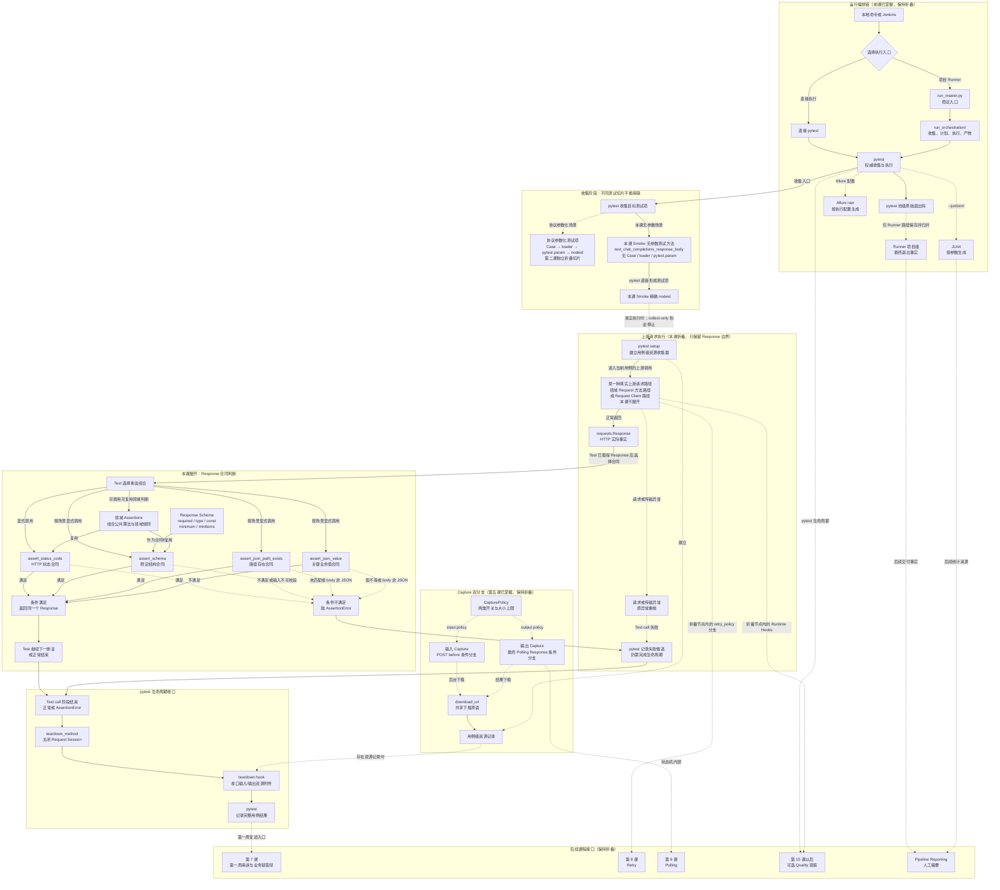

# 第 06 课：断言与响应合同

> 本课承接第 5 课已经取得的 `requests.Response`，只展开“怎样判断这个 Response 是否满足测试预期”：状态码断言、JSONPath 存在性与值断言、JSON Schema 结构合同，以及通用 Assertions 与领域 Assertions 的边界。Retry、Polling、SSE、Quality 和报告链继续保持折叠。

## 1. 课程信息

| 项目 | 内容 |
| --- | --- |
| 建议时长 | 60～90 分钟 |
| 核心问题 | 状态码已经是 200，为什么测试仍然可能失败？ |
| 讲解重点 | HTTP、结构和业务值三层合同；断言成功与失败的控制语义；可诊断失败信息 |
| 代码入口 | `common/base_assertions.py`、`module/smoke/assertions.py`、`module/smoke/response_schemas.py` |
| 课堂切片 | `TestResponseBodyValidation.test_chat_completions_response_body`，只读，不执行真实请求 |
| 轻量验证 | `tests/test_assertions_entrypoints.py`、`tests/test_base_assertions_schema.py` |
| 安全边界 | 只运行内存 Response 的离线测试；不执行 `module/smoke` 真实业务用例 |
| 课后产出 | 第六版累积总图、1 张响应合同判断表和口头三分钟复述 |

### 1.1 学完本课，你应该能够

1. 区分 HTTP 状态正确、JSON 结构正确和关键业务值正确。
2. 根据测试意图选择状态码、JSONPath 存在性、JSONPath 值或 JSON Schema 断言。
3. 解释四个公共同步断言的输入、成功返回和失败控制语义。
4. 读懂 Schema 失败信息中的实例路径、Schema 路径、验证器、期望和实际值。
5. 判断一条规则应放在 `BaseAssertions`、领域 Assertions、Response Schema 还是具体 Test 中。

### 1.2 本课刻意不展开

- 不展开 Retry 的资格、退避和 attempt；第 8 课学习。
- 不展开 Polling 状态机和总 deadline；第 9 课学习。
- 不展开 SSE chunk 的持续消费；第 10 课学习。
- 不展开 TestContext；第 11 课学习。
- 不展开 BaseTask 与 Capability；第 12 课学习。
- 不展开 Runner、JUnit 和 Allure 生命周期；第 13～14 课学习。
- 不展开 Runtime Hooks、Metrics 或 Flaky；第三周学习。
- 不要求新增或修改生产代码；课程唯一必做实现仍在第 25 课。

本课会看到 Allure 装饰器、异步断言入口和领域账单断言的名称，但只用它们说明边界，不进入内部流程。

### 1.3 课堂必讲路径

| 环节 | 对应章节 | 建议时间 |
| --- | --- | ---: |
| 问题、约束与三层合同 | 第 2～5 节 | 10～12 分钟 |
| 业务切片与四类公共断言 | 第 6～11 节 | 25～30 分钟 |
| Schema、领域边界与诊断 | 第 12～16 节 | 20～25 分钟 |
| 二选一课堂活动 | 第 19 或第 20 节 | 8～10 分钟，替代部分讲解 |
| 总图、复述与小测 | 第 21、23、24 节 | 12～15 分钟 |
| 过渡与讨论缓冲 | 全课 | 5 分钟 |

总计按不重复计时约 75～87 分钟。第 18 节教师演示为可选；如果课堂运行演示，应压缩第 16.3 节选读内容，而不是延长总时长。

### 1.4 必讲与选读边界

必讲内容：

- 第 4 节的三层响应合同；
- 第 7～11 节的公共断言输入、返回和失败语义；
- 第 12、13 节的成功与错误 Response Schema；
- 第 14 节的通用能力与领域规则边界；
- 第 15、16 节的控制结果和诊断安全边界。

选读或教师参考：

- 第 7.3 节的同步、异步和模块级入口委托；
- 第 10.3 节 JSONPath 多匹配行为；
- 第 11.4 节 Schema 校验器选择和错误排序；
- 第 16.3 节不同断言当前脱敏覆盖差异；
- 第 17 节完整源码阅读索引。

选读内容不追加到必讲时间中。

### 1.5 课堂最短路径

本文保留完整教师稿，但 60～90 分钟课堂不应从第 1 行顺序讲到最后。推荐最短路径：

```text
第 2～4 节：Response 为什么还不是结论
-> 第 6.1 节：只读三层断言组合
-> 第 8～11 节：状态、存在、值、Schema 四类合同
-> 第 12.2、13.1 节：成功与负向场景各看一个边界
-> 第 14.5 节：判断规则应该放哪一层
-> 第 15、16.1～16.2 节：成功、失败和诊断语义
-> 第 19 或 20 节：二选一活动
-> 第 21、23、24 节：更新总图、复述、任选 4 道小测
```

第 7.3、10.3、11.4、16.3、17、18 节均可作为教师备课或课后阅读，不得为了“讲完整文档”挤占核心路径。

---

## 2. 承接第五课：Response 是事实，不是结论

前五课已经确认：业务调用最终通过 `BaseRequest` 请求链取得 `requests.Response`，Middleware 可以留下请求、响应、cURL 和资源附件证据，但不拥有业务判断。

这里必须保留一个已经学过的重要边界：项目存在两种真实请求路径，不能把“领域 Request 方法”画成所有 Task 的必经节点。

```text
前课协议切片：
Test
-> ProtocolTask.create_chat_completion()
-> ProtocolRequest.create_chat_completion()
-> BaseRequest.post() / request()

本课 Smoke 断言切片：
Test
-> SmokeTask 继承的 BaseTask.create_chat_completion()
-> MediaGenerationCapability.create_chat_completion()
-> SmokeRequest 作为 Request Client
-> request_client.post()
-> BaseRequest.request()
```

第二条路径中的 `BaseTask` 与 `MediaGenerationCapability` 只用于校正当前调用事实；其设计原因和内部边界留到第 12 课。本课不沿任一路径继续下钻，而把上游统一折叠为：

```text
已执行的某一种上游请求路径
-> Test 已取得 requests.Response
```

因此，本课的实线起点是 `Response`，不是一个虚构的统一 `Task -> 领域 Request` 主链。

假设 Test 收到以下 Response：

```http
HTTP/1.1 200 OK
Content-Type: application/json

{
  "id": "chatcmpl-001",
  "object": "chat.chunk",
  "model": "unexpected-model",
  "choices": [],
  "usage": {}
}
```

从 HTTP 传输角度看：

```text
服务端正常返回了一个 200 Response。
```

从测试合同角度看，它可能同时存在多个问题：

- `object` 不是期望的 `chat.completion`；
- `model` 不是本场景要求的模型；
- `choices` 为空；
- `usage` 缺少稳定字段。

所以：

> Response 回答“服务端实际返回了什么”，Assertions 回答“实际返回是否满足本场景的明确合同”。

本课从 Response 继续向后追踪：

```text
Response
-> Test 选择断言组合
-> BaseAssertions 或领域 Assertions
-> 通过：返回原 Response
-> 失败：抛出 AssertionError
-> pytest 记录测试结果
```

最后一行只认识边界：pytest 怎样汇总结果、怎样生成 JUnit 和 Allure，将在第 13～14 课展开。

---

## 3. 当前认知障碍与因果链

### 3.1 第一个障碍：把 HTTP 200 当成业务成功

最常见的弱断言是：

```python
assert response.status_code == 200
```

这只能证明一个事实：

```text
实际状态码等于 200。
```

它不能证明：

- body 是合法 JSON；
- 必需字段存在；
- 字段类型正确；
- 数组至少有一个元素；
- 业务值属于预期模型或状态；
- 错误响应符合统一错误合同。

因果链是：

```text
只断言 200
-> 把传输层成功当成完整业务合同
-> 字段缺失、类型漂移和错误值无法被发现
-> 用例出现“绿色但无效”
-> 回归结果失去保护价值
```

### 3.2 第二个障碍：把“存在、类型和值”混成同一个问题

下面三句话并不等价：

```text
$.model 存在
$.model 是字符串
$.model 等于 DeepSeek-V4-Flash
```

对应的验证能力也不同：

| 问题 | 合适工具 |
| --- | --- |
| 路径是否至少匹配一次 | `assert_json_path_exists()` |
| 路径匹配值是否等于预期 | `assert_json_value()` |
| 整体结构、类型、必填项和集合约束 | `assert_schema()` |
| 某个场景的具体业务规则 | 领域 Assertions 或 Test 中的明确断言 |

如果不先拆开问题，很容易写出：

```python
assert response.json()
```

它只验证解析结果在 Python 中是否为真值，无法说明具体哪条合同被破坏。

### 3.3 第三个障碍：失败了，却不知道坏在哪里

考虑一个嵌套字段：

```text
$.usage.prompt_tokens
```

如果测试只输出：

```text
assert False
```

排查者还需要重新打开完整响应，人工寻找：

- 是字段缺失？
- 是类型错误？
- 是数值小于零？
- 是 Schema 本身非法？

因果链是：

```text
断言只给真假
-> 失败没有字段路径、期望和实际值
-> 排查者重新解析整个响应
-> 定位时间增加
-> 敏感响应还可能被不必要地完整复制
```

### 3.4 TOC：本课真正要解除的约束

本课的主要认知约束不是“不会写 `assert`”，而是：

> 不能把一个业务预期拆成层次明确、失败可定位、放置位置正确的响应合同。

解除约束所需的最小链路是：

```text
明确测试意图
-> 判断属于 HTTP、结构还是业务值
-> 选择最窄且足够的断言
-> 失败时读取路径、期望和实际
-> 把可复用规则放回正确层级
```

Retry、Polling 和 Quality 都不能替代这条链路，因此本课不提前展开它们。

---

## 4. 第一性原理：断言是在比较事实与合同

抛开当前代码，一个测试断言至少包含四个元素：

```text
实际事实 + 期望合同 + 比较规则 + 失败证据
```

映射到当前项目：

| 元素 | 当前对象或参数 |
| --- | --- |
| 实际事实 | `requests.Response` |
| 期望合同 | 状态码、JSONPath 目标值或 Schema |
| 比较规则 | `BaseAssertions` 同步方法或领域 Assertions |
| 失败证据 | `AssertionError` 消息 |

### 4.1 三层响应合同

本课把响应判断拆成三层：

```text
第一层：HTTP 状态合同
第二层：JSON 结构合同
第三层：关键业务值合同
```

| 层级 | 回答的问题 | 示例 |
| --- | --- | --- |
| HTTP 状态 | 服务端以哪类 HTTP 结果回应 | `status_code == 200` |
| JSON 结构 | 响应是否具备稳定形状、类型和必填项 | `choices` 是非空数组 |
| 关键业务值 | 本场景关心的明确值是否正确 | `$.model == "DeepSeek-V4-Flash"` |

这三层是推荐的判断顺序，不是 BaseAssertions 自动强制执行的管线。Test 必须显式选择需要调用的方法。

### 4.2 为什么顺序通常是状态、结构、业务值

推荐顺序：

```python
self.smoke_assertions.assert_status_code(response, 200)
self.smoke_assertions.assert_schema(response, CHAT_COMPLETION_SUCCESS_SCHEMA)
self.smoke_assertions.assert_json_value(
    response,
    "$.model",
    "DeepSeek-V4-Flash",
)
```

因果关系：

```text
先确认 HTTP 分支
-> 再确认响应具有可依赖的结构
-> 最后确认本场景的关键业务值
```

这样失败时更接近真实原因：

- 500 不会先表现为“缺少 `$.model`”；
- 非 JSON body 不会伪装成业务字段错误；
- 结构正确但模型值错误会精确落在业务值合同。

这仍不是绝对语法规则。例如负向用例可以先断言预期 4xx，再验证标准错误 Schema 和错误码。

### 4.3 Assertions 不创造新的业务事实

Assertions 消费 Response，但不会把 Response 改造成“成功响应对象”。

当前四个公共同步方法成功时都返回传入的同一个 Response：

```text
assertion(response, expected) is response
```

失败时抛出 `AssertionError`。

因此不要画出一个不存在的对象：

```text
Response -> AssertionResult -> pytest
```

正确表达是控制结果：

```text
Response -> Assertions
             ├─ 条件满足：返回原 Response
             └─ 条件不满足：抛 AssertionError
```

---

## 5. 生活类比：验收快递要分三道问题

把 Response 想成已经送到的快递。

### 5.1 第一问：快递状态是否符合预期

```text
已签收、拒收、退回，哪一种才是本场景预期？
```

对应状态码断言。

### 5.2 第二问：包装清单是否完整

```text
箱内必须有主机、说明书和配件；配件清单必须是数组；序列号必须是字符串。
```

对应 JSON Schema 结构合同。

### 5.3 第三问：关键商品是否就是所订型号

```text
有型号字段还不够，型号必须等于订单中的目标型号。
```

对应 JSONPath 值或领域业务断言。

### 5.4 类比的边界

这个类比只用于区分验证层次，不能替代代码事实：

- Schema 不会自动调用状态码断言；
- JSONPath 值断言不会自动先跑 Schema；
- Assertions 不负责请求发送和重试；
- Assertions 不负责修改 Response；
- pytest 才拥有用例是否失败的执行记录。

---

## 6. 本课使用两个切片，不执行真实业务用例

### 6.1 业务切片：只读 `test_chat_completions_response_body`

当前业务用例位于：

```text
module/smoke/test_response_body_validation.py
```

核心代码是：

```python
def test_chat_completions_response_body(self):
    response = self.smoke_task.create_chat_completion(
        self.smoke_request,
        self.smoke_task.build_chat_completions_payload(),
    )

    self.smoke_assertions.assert_status_code(response, 200)
    self.smoke_assertions.assert_schema(
        response,
        CHAT_COMPLETION_SUCCESS_SCHEMA,
    )
    self.smoke_assertions.assert_json_value(
        response,
        "$.model",
        "DeepSeek-V4-Flash",
    )
```

这段调用中的 `create_chat_completion()` 不是 `SmokeRequest.create_chat_completion()`。当前真实上游路径是：

```text
SmokeTask（继承 BaseTask）
-> BaseTask.create_chat_completion()
-> MediaGenerationCapability.create_chat_completion()
-> SmokeRequest 作为 Request Client 调用 post()
```

本课不展开这条兼容路径，只用返回后的三行断言解释“三层合同”。

还要明确一个当前遗留偏差：`build_chat_completions_payload()` 的默认模型来自 `module/smoke/task.py` 中的 `KEY_CHAT_COMPLETIONS_MODEL_ID`，当前 Test 没有显式传入模型 ID。这与最新用例规范“静态测试输入放在 `test_*.py` 并显式传给 Task”不一致。因此该切片只能作为“断言组合”的正面证据，不能作为“Test 已拥有静态输入”的正面模板。

此外，它会调用真实业务接口，所以本课只阅读，不执行。

### 6.2 离线切片：构造内存 Response

当前离线测试位于：

```text
tests/test_base_assertions_schema.py
tests/test_assertions_entrypoints.py
```

它们使用 `requests.Response()` 或 `tests.mock_helpers.make_response()` 构造内存对象，不调用 Session，也不访问网络。

离线测试能够证明：

- Schema 成功时返回原 Response；
- 顶层和嵌套必填字段能够定位精确路径；
- 类型、常量和数组元素错误能够输出诊断；
- 非法 JSON 与非法 Schema 会产生明确异常；
- Schema 失败中的敏感实际值会被脱敏；
- 同步、异步和模块级状态码入口委托同一同步实现；
- 薄领域 Assertions 仍保持真实类身份和 MRO。

它们不能证明：

- 真实模型当前一定可用；
- 外部服务一定返回目标 Schema；
- 所有业务字段都已经被 Schema 覆盖；
- Allure 或 JUnit 最终报告一定生成；
- Retry、Polling 或 SSE 行为正确。

### 6.3 两个切片的关系

```text
业务切片：说明断言怎样进入真实场景
离线切片：冻结公共断言的确定性行为
```

不要因为离线测试通过，就声称真实业务接口已经验证通过。

---

## 7. BaseAssertions：四个同步方法是公共判断入口

`common/base_assertions.py` 当前提供四个同步方法：

```python
assert_status_code(response, expected)
assert_json_value(response, json_path, expected)
assert_json_path_exists(response, json_path)
assert_schema(response, schema)
```

共同合同：

| 项目 | 当前行为 |
| --- | --- |
| 主要输入 | `requests.Response` |
| 期望输入 | 状态码、JSONPath 与值，或 JSON Schema |
| 成功返回 | 原 `requests.Response` |
| 失败控制 | 抛出 `AssertionError`，部分底层解析异常保留自己的异常类型 |
| 是否发送请求 | 否 |
| 是否修改 Response | 公共方法不以修改 Response 为职责 |

### 7.1 为什么返回原 Response

返回原对象允许领域断言继续组合：

```python
def assert_generation_succeeded(self, response):
    self.assert_status_code(response, 200)
    self.assert_schema(response, SUCCESS_SCHEMA)
    return response
```

这里的 `return response` 不是重新定义成功事实，而是保留调用兼容性和链式组合能力。

### 7.2 同步方法是唯一通用算法源

当前异步入口直接委托同步入口：

```python
async def async_assert_status_code(self, response, expected):
    return self.assert_status_code(response, expected)
```

模块级函数也委托默认 `BaseAssertions` 实例：

```text
common.assert_status_code
-> common.base_assertions.assert_status_code
-> _default_assertions.assert_status_code
-> BaseAssertions.assert_status_code
```

这避免同步、异步和模块级入口复制三套判断算法。

### 7.3 异步入口不等于异步 HTTP

本课只认识一个边界：

```text
async_assert_* 是异步可调用门面
```

它不会把同步 `requests.Response` 或同步 HTTP 发送自动变成异步网络 I/O。不要为了调用异步断言而把同步请求强行包装成 asyncio 流程。

### 7.4 领域 Assertions 必须保留真实类身份

例如：

```python
class SmokeAssertions(BaseAssertions):
    ...
```

即使某个领域类当前只是空继承，它仍然代表稳定的领域导入路径和未来扩展边界，不能简单写成：

```python
ImageAssertions = BaseAssertions
```

`tests/test_assertions_entrypoints.py` 已冻结 Image 和 Video Assertions 的真实类身份与 MRO。

---

## 8. 状态码断言：只回答 HTTP 结果是否符合预期

当前实现的核心逻辑：

```python
def assert_status_code(self, response, expected):
    actual = response.status_code
    assert actual == expected, ...
    return response
```

### 8.1 输入、比较和输出

```text
输入：Response + expected int
读取：response.status_code
比较：actual == expected
通过：返回原 Response
失败：AssertionError
```

### 8.2 状态码断言能证明什么

如果：

```python
self.assertions.assert_status_code(response, 200)
```

通过，只能证明：

```text
response.status_code == 200
```

不能继续推导：

```text
body 一定是 JSON
body 一定符合成功 Schema
choices 一定非空
model 一定是目标模型
业务一定成功
```

### 8.3 负向用例同样需要明确状态合同

对于标准错误场景，理想表达通常是：

```text
预期错误状态码
-> 标准错误 Schema
-> error.code / error.type 等关键值
```

当前 `test_wrong_text_model_response_body_contains_error_object()` 使用的是：

```python
assert response.status_code != 200
self.smoke_assertions.assert_schema(
    response,
    STANDARD_ERROR_RESPONSE_SCHEMA,
)
```

这段当前事实只要求“非 200 + 标准错误结构”，没有冻结某一个精确错误状态码。讲义不能擅自把它说成固定 404 合同。

### 8.4 状态码失败信息的当前边界

当前失败消息包含期望状态、实际状态和 `response.text`。这有诊断价值，但也意味着：

> 在没有额外脱敏保证时，不应把可能包含密钥、账号或敏感业务数据的 Response 原文带入课堂示例、作业或共享日志。

第 16 节会统一比较各类断言当前的诊断安全边界。

---

## 9. JSONPath 存在性断言：回答“路径是否匹配”

当前入口：

```python
assert_json_path_exists(response, json_path)
```

### 9.1 执行步骤

```text
检查表达式以 $ 开头
-> response.json()
-> parse(json_path).find(body)
-> 收集所有 match.value
-> 至少存在一个 match
-> 返回原 Response
```

### 9.2 “存在”不等于“值为真”

假设响应是：

```json
{
  "data": {
    "url": null
  }
}
```

对路径 `$.data.url`，JSONPath 仍然能够匹配一个值，只是该值为 `None`。

因此：

```text
路径存在
≠ 值非空
≠ 值类型正确
≠ 值符合业务预期
```

如果业务要求非空 URL，仅使用存在性断言不够，还需要 Schema 的 `type`、`minLength` 或领域规则。

### 9.3 适用场景

适合：

- 只关心可选响应中是否出现某个节点；
- 先做轻量关键路径存在检查；
- Schema 尚未稳定，但某个字段存在性已经是合同。

不适合：

- 验证整个响应结构；
- 验证字段类型；
- 验证数组非空；
- 验证具体业务值。

### 9.4 失败边界

- JSONPath 不以 `$` 开头时，当前方法抛 `AssertionError`；
- body 不是合法 JSON 时，当前方法把解析失败转换为 `AssertionError`；
- 路径没有匹配时，当前方法抛 `AssertionError`；
- 更深层的 JSONPath 语法解析错误不应笼统承诺一定被包装成同一种消息。

最后一点提醒我们：讲义描述公共合同必须以测试和代码已保证的范围为准。

---

## 10. JSONPath 值断言：回答“匹配结果是否等于预期”

当前入口：

```python
assert_json_value(response, json_path, expected)
```

### 10.1 单匹配行为

响应：

```json
{
  "model": "DeepSeek-V4-Flash"
}
```

调用：

```python
self.assertions.assert_json_value(
    response,
    "$.model",
    "DeepSeek-V4-Flash",
)
```

单个 match 时：

```text
actual = matches[0]
```

然后直接使用 Python 相等比较：

```text
actual == expected
```

### 10.2 它比存在性多证明了什么

存在性只证明路径有 match；值断言还证明匹配结果等于明确期望。

```text
$.model 存在
```

和：

```text
$.model == "DeepSeek-V4-Flash"
```

是两条强度不同的合同。

### 10.3 多匹配行为（选读）

当前实现是：

```python
actual = matches[0] if len(matches) == 1 else matches
```

所以路径匹配多个值时，`expected` 应与完整列表比较，而不是自动对每个元素执行同一个断言。

示意：

```json
{
  "items": [
    {"status": "ready"},
    {"status": "done"}
  ]
}
```

如果 JSONPath 得到两个 match，当前比较对象是：

```python
["ready", "done"]
```

不能把它误解成框架会自动执行：

```text
每个 status 都等于同一个 expected
```

### 10.4 什么时候不应使用值断言替代 Schema

如果要验证：

```text
usage.prompt_tokens 是非负整数
choices 是至少包含一个元素的数组
每个 choice.message 是对象
```

逐字段编写很多 `assert_json_value()` 既重复，又很难表达类型和集合约束。此时应该使用 JSON Schema。

---

## 11. JSON Schema：把稳定结构合同集中表达

当前入口：

```python
assert_schema(response, schema)
```

Schema 不是示例响应，也不是一份完整业务数据副本。它是对稳定结构规则的声明。

### 11.1 当前执行主线

```text
Response
-> response.json()
-> 选择 Schema validator
-> check_schema(schema)
-> validator.iter_errors(body)
-> 无错误：返回原 Response
-> 有错误：格式化第一个稳定排序错误并抛 AssertionError
```

### 11.2 Schema 能表达哪些结构合同

当前成功 Schema 使用的典型关键字：

| 关键字 | 当前用途 |
| --- | --- |
| `type` | 对象、数组、字符串、整数或联合类型 |
| `required` | 必需属性 |
| `properties` | 属性自己的子 Schema |
| `const` | 固定业务协议值 |
| `minLength` | 非空字符串 |
| `minimum` | 非负整数 |
| `minItems` | 非空数组 |
| `items` | 数组元素结构 |

### 11.3 为什么 Schema 只约束稳定合同

过度严格会造成另一种坏测试：

```text
把服务端允许扩展的字段全部禁止
-> 无害新增字段导致回归失败
-> 测试把兼容变化误报为破坏
```

当前 `CHAT_COMPLETION_SUCCESS_SCHEMA` 没有把 `additionalProperties` 设为 `False`，所以未声明的额外字段默认允许存在。

同时要注意：

- `created` 出现在 `properties` 中，但不在顶层 `required` 列表中；
- `message` 必须存在，但它内部的 `role`、`content` 当前没有列入 `required`；
- Schema 通过只证明当前声明的合同通过，不代表所有潜在业务要求都已验证。

这正是为什么 Test 还会追加关键业务值断言。

### 11.4 校验器选择与错误排序（选读）

当前行为：

```text
Schema 含 $schema
-> validator_for(schema)

Schema 不含 $schema
-> Draft202012Validator
```

随后先执行 `check_schema()`，避免用非法 Schema 去校验 Response。

所有校验错误按实例路径和 Schema 路径排序，当前只把排序后的第一个错误作为 `AssertionError` 输出。这让失败位置稳定且聚焦，但不能据此声称一次异常会列出全部问题。

### 11.5 非法 JSON 与非法 Schema 是两个不同错误

```text
Response 不是合法 JSON
-> AssertionError: Response body is not valid JSON

Schema 自身非法
-> AssertionError: Invalid JSON Schema
```

前者说明实际事实不能进入 JSON 结构判断；后者说明测试合同自身写错。两者的修复责任不同。

---

## 12. 成功响应 Schema：结构合同不等于业务值全集

`module/smoke/response_schemas.py` 定义：

```text
CHAT_COMPLETION_SUCCESS_SCHEMA
```

顶层稳定必填项：

```python
["id", "object", "model", "choices", "usage"]
```

### 12.1 结构树

```text
$
├─ id: non-empty string
├─ object: const "chat.completion"
├─ created: integer >= 0（当前非 required）
├─ model: non-empty string
├─ choices: array, minItems=1
│  └─ item: object
│     ├─ message: required object
│     │  ├─ role: string（当前非 required）
│     │  └─ content: string | array | null（当前非 required）
│     ├─ index: integer >= 0（当前非 required）
│     └─ finish_reason: string | null（当前非 required）
└─ usage: required object
   ├─ prompt_tokens: required integer >= 0
   ├─ completion_tokens: required integer >= 0
   └─ total_tokens: required integer >= 0
```

### 12.2 Schema 已经验证 model 是字符串，为什么还要值断言

Schema 当前只要求：

```text
model 是长度至少为 1 的字符串
```

业务场景还要求：

```text
model 必须等于 DeepSeek-V4-Flash
```

所以两者不是重复：

```text
Schema：结构与类型合同
JSONPath 值：当前场景的具体业务合同
```

### 12.3 Schema 失败路径怎样阅读

如果响应是：

```json
{
  "usage": {
    "total_tokens": 2
  }
}
```

缺少 `prompt_tokens` 时，离线测试冻结的失败信息包含：

```text
Path: $.usage.prompt_tokens
Validator: required
Expected: required property 'prompt_tokens'
Actual type: <missing>
Actual value: <missing>
```

这里：

- `Path` 指向实际响应中的失败位置；
- `Validator` 指出违反哪条 Schema 规则；
- `Expected` 解释期望合同；
- `Actual type/value` 解释实际事实。

---

## 13. 标准错误 Schema：负向用例也需要稳定合同

同一文件还定义：

```text
STANDARD_ERROR_RESPONSE_SCHEMA
```

结构是：

```text
$
└─ error: required object
   ├─ message: required non-empty string
   ├─ type: required non-empty string
   └─ code: required string | null
```

### 13.1 负向用例通过不等于请求成功

如果本场景故意提交未知模型：

```text
HTTP 返回非 200
+ body 满足标准错误 Schema
+ error.type / error.code 符合预期
-> 测试可以通过
```

这说明：

```text
请求结果与测试结果不是同一概念
```

本课只建立这个区分。第三周学习 Metrics 时，才会进一步解释为什么预期负向调用仍应保留真实失败语义。

### 13.2 错误响应同样不能只判断“有 error”

弱判断：

```python
assert "error" in response.json()
```

它不能保证：

- `error` 是对象；
- `message` 和 `type` 是非空字符串；
- `code` 字段存在；
- 错误结构与其他接口一致。

标准错误 Schema 把这些稳定结构集中到一个合同中。

### 13.3 Schema 与具体错误码的边界

当前 Schema 允许 `code` 是字符串或 `null`，没有固定某一个错误码。

如果某条用例必须验证：

```text
error.code == "model_not_found"
```

应额外使用值断言或领域断言，而不是把所有错误响应的 Schema 全局固定成同一个 `const`。

---

## 14. BaseAssertions、领域 Assertions、Schema 和 Test 各拥有哪种规则

### 14.1 BaseAssertions：跨模块通用算法

适合放入：

- 状态码相等；
- JSONPath 匹配；
- JSONPath 值比较；
- JSON Schema 校验；
- 通用的诊断格式和脱敏原语。

不适合放入：

- 某个模型的专属成功字段；
- 某个账号的余额规则；
- 某条用例的具体模型 ID；
- 发送请求或修改服务端状态。

### 14.2 Response Schema：稳定结构声明

适合放入：

- 必填字段；
- 稳定类型；
- 数组最小元素数；
- 协议固定常量；
- 嵌套对象结构。

不适合放入：

- 快速变化且尚未成为合同的字段；
- 只属于单个测试数据的值；
- 需要多 Response 比较的业务逻辑；
- 请求动作或资源清理。

### 14.3 领域 Assertions：可复用业务判断

`SmokeAssertions` 继承 `BaseAssertions`，增加了领域规则，例如：

```text
响应文本不得包含禁止值
余额必须非负
调用扣费与 usage 金额在容差内一致
失败调用前后余额不变
```

本课不展开账单流程，只观察边界：这些规则需要理解 Smoke 领域字段或比较多个 Response，不应下沉到所有模块共享的 `BaseAssertions`。

另一个清晰例子是 `VideoAssertions.assert_minimax_h3_generation_succeeded()`：

```python
def assert_minimax_h3_generation_succeeded(self, response):
    self.assert_status_code(response, 200)
    self.assert_schema(response, MINIMAX_H3_SUCCESS_RESPONSE_SCHEMA)
    return response
```

它用领域动作名组合公共算法和领域 Schema，但不复制状态码或 Schema 校验实现。

### 14.4 规范目标：Test 拥有静态输入和最终预期

按照当前 `FRAMEWORK_TEST_SPEC.md`，Test 应决定：

- 模型 ID、提示词等执行前已确定的静态测试输入，并显式传给 Task；
- 当前场景期望 200 还是错误状态；
- 使用成功 Schema 还是错误 Schema；
- 当前模型值、错误码或结果状态是什么；
- 哪些领域断言需要组合。

不要把某条用例专用模型 ID 写死进通用断言算法。

但是，本课选择的当前 Smoke 切片存在遗留偏差：

```text
KEY_CHAT_COMPLETIONS_MODEL_ID 定义在 module/smoke/task.py
-> build_chat_completions_payload() 把它作为默认参数
-> Test 调用 builder 时没有显式传入 model_id
```

所以当前 Test 只明确拥有断言侧的最终期望字符串，并没有按最新规范显式拥有请求侧模型输入。不能用这段遗留写法证明“当前实现已经符合静态输入规范”。

符合规范的新写法应表达为：

```python
CHAT_MODEL_ID = "example-model"  # 位于 test_*.py 的导入语句之后

payload = task.build_chat_completions_payload(model_id=CHAT_MODEL_ID)
response = task.create_chat_completion(request_client, payload)

assertions.assert_schema(response, CHAT_COMPLETION_SUCCESS_SCHEMA)
assertions.assert_json_value(response, "$.model", CHAT_MODEL_ID)
```

这段代码是推荐的规范示意，不是对当前 Smoke 文件的原样摘录。生产切片若要迁移，应单独修改业务代码并运行对应回归；本课只修正文档认知，不顺带改变真实用例。

### 14.5 放置位置判断表

| 需求 | 推荐位置 | 原因 |
| --- | --- | --- |
| 所有模块都要比较状态码 | `BaseAssertions` | 通用算法 |
| Chat 成功响应必须有 choices 和 usage | Chat/Smoke Response Schema | 稳定结构合同 |
| 当前用例必须返回指定 model | Test 调用值断言 | 场景专用期望 |
| Minimax H3 成功需组合 200 与专属 Schema | `VideoAssertions` | 可复用领域判断 |
| 两个余额 Response 的差额需与 usage 比较 | `SmokeAssertions` | 多 Response 的领域规则 |
| 请求一个接口获取 Response | Request/Task | Assertions 不发送请求 |

---

## 15. 断言成功、失败与 pytest 结果是三种不同关系

### 15.1 成功路径

```text
Test 调用 Assertions
-> 条件满足
-> Assertions 返回原 Response
-> Test 继续下一断言或结束
-> pytest 根据整个测试生命周期记录结果
```

“返回 Response”不是 pytest 已经记录通过。后续断言、测试代码或 teardown 仍可能失败。

### 15.2 失败路径

```text
Test 调用 Assertions
-> 条件不满足
-> 抛 AssertionError
-> 当前调用栈中断
-> pytest 捕获并记录测试失败
-> 仍进入适用的 teardown 清理
```

这里的 `AssertionError` 是控制结果，不是一个新的 Response。

### 15.3 多个断言默认不是“全部执行后汇总”

普通 Python 调用按顺序执行：

```python
assert_status_code(...)
assert_schema(...)
assert_json_value(...)
```

第一个失败后，后两个不会继续执行。当前 BaseAssertions 没有内置 soft assertion 汇总器。

这也是为什么断言顺序会影响最先暴露的失败原因。

### 15.4 Assertions 与 pytest 的所有权

| 对象 | 拥有什么 |
| --- | --- |
| Assertions | 比较规则和失败异常 |
| Test | 场景、断言组合和预期 |
| pytest | 用例执行结果与原始退出事实 |
| Allure | 步骤和附件明细，不能替代 pytest 结论 |
| Quality | 后续可选诊断，不能改写断言与 pytest 原始结果 |

本课只展开前两行，后三行保留为已知边界和后续接口。

---

## 16. 失败诊断：既要定位，也要守住敏感数据边界

### 16.1 Schema 失败信息包含什么

`assert_schema()` 当前格式化以下字段：

```text
JSON Schema assertion failed.
Path: ...
Schema path: ...
Validator: ...
Expected: ...
Actual type: ...
Actual value: ...
Message: ...
```

如果违反 `required`，还会附加经过处理的 Response body。

这组信息分别回答：

| 字段 | 回答的问题 |
| --- | --- |
| Path | 实际响应哪里失败 |
| Schema path | 合同的哪条规则被使用 |
| Validator | 违反 `required`、`type`、`const` 等哪类规则 |
| Expected | 期望是什么 |
| Actual type/value | 实际是什么 |
| Message | jsonschema 的原始语义经过安全处理后的说明 |

### 16.2 路径示例

嵌套字段：

```text
$.usage.prompt_tokens
```

数组元素：

```text
$.choices[0].message
```

Schema 自身路径示意：

```text
properties/choices/items/properties/message/type
```

实例路径和 Schema 路径不能混为一谈：前者指向 Response，后者指向合同定义。

### 16.3 当前脱敏覆盖必须准确表述（选读但建议教师掌握）

当前 `assert_schema()` 已集中处理：

- 非法 JSON body 的文本脱敏；
- 敏感字段实际值脱敏；
- jsonschema 错误消息中的敏感值替换；
- URL 编码文本脱敏；
- Response body 最多保留 2000 个字符，超出截断。

对应离线测试已验证 `api_key` 实际值不会出现在 Schema 失败消息中。

但是当前其他公共断言并不具有完全相同的覆盖：

- `assert_status_code()` 失败消息直接包含 `response.text`；
- `assert_json_value()` 在非法 JSON或未匹配路径时直接包含 `response.text`；
- `assert_json_path_exists()` 在非法 JSON或未匹配路径时直接包含 `response.text`；
- JSONPath 值不相等消息会输出 `expected` 和 `actual` 的 `repr`。

因此不能笼统宣称“所有 AssertionError 都已自动脱敏”。当前安全规则是：

```text
不要把密钥或敏感账号写入期望值
不要在共享材料中复制完整真实 Response
优先复用已有脱敏边界
发现安全合同缺口时，应先用离线测试冻结目标，再修改公共实现
```

最后一项是第 25 课“最小离线断言测试”可能选择的方向，但本课不要求实现。

### 16.4 诊断信息不能替代断言设计

再详细的失败消息，也不能弥补过于宽泛的判断：

```python
assert response.json()
```

高价值断言首先要选择正确合同，其次才是输出清晰诊断。

---

## 17. 推荐的源码阅读顺序

### 17.1 必讲顺序

```text
1. module/smoke/test_response_body_validation.py
   只读 test_chat_completions_response_body

2. common/base_assertions.py
   先读四个同步公共方法

3. module/smoke/response_schemas.py
   对照成功与错误 Schema

4. module/smoke/assertions.py
   观察领域规则为何不下沉到 BaseAssertions

5. tests/test_base_assertions_schema.py
   阅读成功、失败路径与脱敏证据

6. tests/test_assertions_entrypoints.py
   阅读委托和真实领域类身份合同
```

### 17.2 每个文件只回答一个问题

| 文件 | 本课问题 |
| --- | --- |
| `test_response_body_validation.py` | Test 怎样组合三层合同 |
| `base_assertions.py` | 公共比较算法怎样输入、返回和失败 |
| `response_schemas.py` | 稳定结构怎样声明 |
| `smoke/assertions.py` | 哪些规则属于领域复用 |
| `test_base_assertions_schema.py` | 哪些 Schema 行为已由离线测试冻结 |
| `test_assertions_entrypoints.py` | 多入口怎样复用同步实现，领域类怎样保持身份 |

### 17.3 阅读停止点

本课读到以下边界就停止：

- 看到 `allure_step`，只知道它提供步骤展示，不展开 Allure 生命周期；
- 看到异步入口，只知道它委托同步算法，不展开 asyncio 网络模型；
- 看到账单断言，只用于说明领域边界，不展开结算流程；
- 看到 pytest 捕获 AssertionError，只保留名称，不展开 Runner 和退出码；
- 看到真实 Smoke Test，只读代码，不执行。

---

## 18. 可选教师演示：运行两组纯离线合同测试

### 18.1 运行前先预测

先让学习者回答：

1. 测试是否会创建 `requests.Session` 并发送 HTTP？
2. Schema 缺少嵌套字段时，路径应指向父对象还是缺失字段？
3. Schema 成功后返回新对象还是原 Response？
4. 敏感 `api_key` 是否应出现在失败消息？
5. 同步与异步状态码入口是否有两套比较算法？

### 18.2 安全命令

这些测试虽然只构造内存 Response，但导入模块包时仍会加载 `config.py`。`config.py` 在导入阶段读取 dotenv 并校验环境，因此“离线”不等于“无需合法配置”。课堂命令显式使用语法合法的 `.env.example`，并把 pytest 临时文件和 Allure raw 写入本机可写临时目录：

```powershell
$hadDotenvPath = Test-Path Env:API_CASE_DOTENV_PATH
$previousDotenvPath = $env:API_CASE_DOTENV_PATH
$env:API_CASE_DOTENV_PATH = (Resolve-Path -LiteralPath '.env.example').Path
$evidenceRoot = Join-Path `
  ([System.IO.Path]::GetTempPath()) `
  ('api-case-lesson06-' + [guid]::NewGuid().ToString('N'))
New-Item -ItemType Directory -Path $evidenceRoot | Out-Null

$pytestExitCode = 1
try {
  & .\.venv\Scripts\python.exe -m pytest `
    tests/test_assertions_entrypoints.py `
    tests/test_base_assertions_schema.py `
    --basetemp "$evidenceRoot\pytest-temp" `
    --alluredir "$evidenceRoot\allure-results" `
    -q
  $pytestExitCode = $LASTEXITCODE
}
finally {
  if ($hadDotenvPath) {
    $env:API_CASE_DOTENV_PATH = $previousDotenvPath
  }
  else {
    Remove-Item Env:API_CASE_DOTENV_PATH -ErrorAction SilentlyContinue
  }
}

Write-Host "Lesson evidence: $evidenceRoot"
if ($pytestExitCode -ne 0) {
  throw "Lesson 06 offline tests failed with exit code $pytestExitCode"
}
```

这段命令不会调用真实 API，也不会把 `.env.example` 复制成真实 `.env`。临时证据目录只用于本轮课堂验证，路径会输出到控制台。

如果测试在 collection 阶段因 URL、Key、布尔值或 dotenv 路径校验失败，应先归类为“环境配置未满足导入前置条件”，不能写成“断言算法测试失败”。只有完成收集并执行到测试函数后，失败证据才用于判断断言合同是否回退。

当前核验结果：

```text
15 passed
```

具体耗时不作为课程合同；机器和依赖状态不同，耗时可以变化。

### 18.3 这条命令证明什么

- 公共入口委托关系符合测试合同；
- Image 和 Video Assertions 保持真实子类身份；
- Schema 成功返回原 Response；
- required、type、const 和数组路径诊断符合预期；
- 非法 JSON、非法 Schema 和敏感值路径有明确行为；
- 当前成功和标准错误 Schema 接受最小合法示例。

### 18.4 这条命令不能证明什么

- 不能证明 `module/smoke` 真实接口可用；
- 不能证明外部响应当前符合 Schema；
- 不能证明所有状态码和 JSONPath 失败消息都已脱敏；
- 不能证明 Allure HTML 最终报告、JUnit 或 Pipeline Summary 已生成；
- 不能证明 Retry、Polling 或 SSE 正确。

### 18.5 为什么不执行业务切片

`module/smoke/test_response_body_validation.py` 会调用真实模型或业务 API，可能依赖环境、凭据、账号状态并产生费用。它只作为代码阅读入口，不是默认课堂命令。

---

## 19. 二选一课堂活动 A：把需求放入正确合同层

教师给出以下需求卡片，学习者为每项选择最窄且足够的断言，并说明放置位置。

活动中的 Minimax 和账单卡片只用于判断“规则应落在哪一层”，不要求解释视频生成、余额查询、结算等待或 usage 对账流程；这些领域机制尚未进入本课前置知识。

### 19.1 需求卡片

1. 成功调用必须返回 HTTP 200。
2. body 必须包含 `data[0].url`，当前暂不约束 URL 格式。
3. Chat 成功响应的 `choices` 必须是至少一个元素的数组。
4. 当前用例返回的 `model` 必须是 `DeepSeek-V4-Flash`。
5. 标准错误 body 必须包含非空 `message`、非空 `type` 和 `code`。
6. 视频任务成功必须同时满足 200 与 Minimax H3 专属结构。
7. 调用前后余额差必须与 usage 金额在容差内一致。

### 19.2 待填写表

| 需求 | 工具 | 推荐位置 | 为什么 |
| --- | --- | --- | --- |
| 1 |  |  |  |
| 2 |  |  |  |
| 3 |  |  |  |
| 4 |  |  |  |
| 5 |  |  |  |
| 6 |  |  |  |
| 7 |  |  |  |

### 19.3 参考答案

| 需求 | 工具 | 推荐位置 | 为什么 |
| --- | --- | --- | --- |
| 1 | `assert_status_code` | Test 调用公共断言 | 单一 HTTP 合同 |
| 2 | `assert_json_path_exists` | Test 或可复用领域断言 | 只要求路径匹配 |
| 3 | `type=array` + `minItems=1` | 成功 Response Schema | 稳定结构与集合合同 |
| 4 | `assert_json_value` | 当前 Test | 场景专用具体值 |
| 5 | `STANDARD_ERROR_RESPONSE_SCHEMA` | Smoke Schema | 跨错误场景复用结构 |
| 6 | 组合状态码与领域 Schema | `VideoAssertions` | 可复用领域成功判断 |
| 7 | Decimal 领域比较 | `SmokeAssertions` | 多 Response 的账单业务规则 |

### 19.4 验收重点

不是背方法名，而是能说明：

```text
这条合同属于哪一层
-> 为什么这个工具已经足够
-> 为什么不应该放到更公共或更具体的层
```

---

## 20. 二选一课堂活动 B：阅读一条 Schema 失败证据

教师给出响应、Schema 和失败信息，学习者只做诊断，不修改代码。

### 20.1 实际响应

```json
{
  "usage": {
    "prompt_tokens": "12",
    "completion_tokens": 1,
    "total_tokens": 13
  }
}
```

### 20.2 合同片段

```json
{
  "type": "object",
  "properties": {
    "usage": {
      "type": "object",
      "properties": {
        "prompt_tokens": {"type": "integer"}
      }
    }
  }
}
```

### 20.3 失败信息

```text
JSON Schema assertion failed.
Path: $.usage.prompt_tokens
Schema path: properties/usage/properties/prompt_tokens/type
Validator: type
Expected: integer
Actual type: str
Actual value: '12'
```

### 20.4 课堂问题

1. 失败发生在 Response 的哪个位置？
2. 是字段缺失、类型错误还是值范围错误？
3. Schema 自身是否一定非法？
4. 把字符串转成整数后，这条 Schema 是否能证明 token 非负？
5. 如果该字段包含敏感值，哪一层应负责诊断脱敏？

### 20.5 参考结论

```text
实例路径指向 $.usage.prompt_tokens。
违反的是 type，期望 integer，实际是 str。
这不能说明 Schema 非法；Schema 已经正常执行并发现实例不满足合同。
仅修正类型仍不能证明非负，因为合同还需要 minimum: 0。
通用 Schema 诊断的敏感值处理应集中在公共断言层，业务用例不应复制脱敏算法。
```

---

## 21. 第六版课后链路总图

本图保留前五课的运行入口、收集阶段、两种请求路径、Middleware、Capture 双分支和 pytest teardown 边界。收集区把第二课的协议参数化 Case 链折叠为独立切片，并单独画出本课无参数 Smoke 测试项；只有 Smoke 分支连接本课 setup，二者不是一条连续执行链。由于本课 Smoke 切片走 Request Client 路径，图中把两种上游路径折叠为一个明确标注的节点，不再画统一的 `Task -> 领域 Request` 实线；本课只展开 Response 之后的 Assertions 与 Schema。



### 21.1 本课新增了什么

相较第 5 课，本课新增：

1. Response 之后由 Test 显式选择 Assertions 的调用节点；
2. HTTP 状态、JSONPath 存在、JSONPath 值和 Schema 四类合同；
3. Response Schema 作为 `assert_schema()` 参数，而不是下一个运行阶段；
4. 领域 Assertions 复用公共算法的依赖关系；
5. 成功返回原 Response、失败抛 AssertionError 的控制分支；
6. AssertionError 进入 pytest 生命周期，而不是形成新的结果对象。

### 21.2 本课没有改变什么

- 上游仍可能走领域 Request 方法路径或 Request Client 路径；本课只折叠显示，不把两者合并成同一条虚假实线；
- 第二课的协议 Case 参数化链仍是独立收集切片；本课 Smoke 方法由 pytest 直接收集，不经过 Case、loader 或 `pytest.param`；
- RequestContext、Middleware 和 Session 仍属于请求发送侧；
- Capture 仍是输入和输出两条条件分支，不是 Assertions 的前后步骤；
- teardown 仍由 pytest 生命周期触发；
- pytest 原始事实、Runner 最终事实、JUnit、Allure 和 Quality 的所有权不变；
- Retry、Polling、SSE、Runner 和 Quality 内部机制仍未展开。

### 21.3 怎样阅读断言区域的箭头

```text
Test -> Assertions：函数调用
Schema -> assert_schema：合同参数输入
Assertions -> 原 Response：成功返回同一对象
Assertions -.-> AssertionError：条件失败的控制结果
AssertionError -> pytest：pytest 捕获执行失败，不是对象转换
```

---

## 22. 常见误区

### 误区一：状态码 200 就表示业务成功

200 只满足 HTTP 状态合同，不能替代结构和业务值判断。

### 误区二：Schema 校验通过就表示所有业务字段都正确

Schema 只验证已声明规则。场景专用模型值等仍需要明确断言。

### 误区三：`assert_json_path_exists()` 会自动验证非空值

路径匹配到 `null` 仍然算存在。非空、类型和值需要其他合同。

### 误区四：`assert_json_value()` 匹配多个值时会逐个比较

当前实现会把多个 match 组成列表，再与完整 `expected` 比较。

### 误区五：Schema 应禁止所有未声明字段

稳定 API 常允许兼容扩展。是否设置 `additionalProperties: false` 必须基于真实合同，而不是追求“严格”。

### 误区六：Assertions 会生成 AssertionResult 对象

当前公共断言成功时返回原 Response，失败时抛异常，没有公共 AssertionResult。

### 误区七：一个断言失败后，后续断言仍会自动执行并汇总

普通调用按顺序执行，首个未捕获异常会中断后续代码。

### 误区八：领域 Assertions 应复制 BaseAssertions 算法

领域层应继承和组合公共算法，只增加领域规则。

### 误区九：异步断言入口会把 requests 变成异步 HTTP

当前异步断言只是委托同步比较算法，不改变网络模型。

### 误区十：所有断言失败消息都已经统一脱敏

当前 Schema 失败路径有集中脱敏测试；其他断言的部分失败路径仍直接包含 Response 或实际值。

### 误区十一：负向用例返回非 200，因此测试一定失败

如果非 200 和错误 body 正是预期合同，测试可以通过。

### 误区十二：Allure 附件能决定断言是否通过

Allure 是证据展示；Assertions 和 pytest 分别拥有比较规则与执行结果。

---

## 23. 三分钟复述

请合上源码，按照“Response 事实—三层合同—四个公共入口—成功/失败语义—领域边界”的顺序复述。

### 23.1 复述模板

```text
第 5 课已经追踪到 Session 返回 requests.Response，并由 Middleware 与 Capture 留下证据。Response 只表示服务端实际返回了什么，还不是测试结论。第 6 课把响应判断拆成 HTTP 状态、JSON 结构和关键业务值三层合同。

BaseAssertions 的四个同步公共入口分别是状态码、JSONPath 存在、JSONPath 值和 JSON Schema。状态码只比较 HTTP code；存在性只判断路径是否匹配；值断言比较单个值或多匹配列表；Schema 集中表达 required、type、const、minimum、minItems 和嵌套 items 等稳定结构规则。

Test 根据场景显式组合这些断言。成功 Chat 用例先验证 200，再验证成功 Schema，最后验证具体 model 值；负向用例可以验证错误状态、标准错误 Schema 和具体错误码。Schema 只验证已声明合同，不能代替场景业务值。

四个公共同步断言成功时返回传入的同一个 Response，失败时抛 AssertionError。它们不会生成 AssertionResult，也不会直接决定整个测试最终通过，因为后续代码和 teardown 仍可能失败；pytest 负责记录完整用例结果。

通用比较算法放在 BaseAssertions，稳定结构放在 Response Schema，可复用领域判断放在领域 Assertions，具体输入和最终预期由 Test 决定。Schema 失败诊断能够指出实例路径、Schema 路径、验证器、期望和实际值，并对敏感实际值做处理；不能笼统声称其他所有断言失败消息也有相同脱敏覆盖。
```

### 23.2 复述自检

- Response 为什么不是测试结论？
- HTTP、结构和业务值三层合同分别回答什么？
- 存在性断言与值断言有什么区别？
- Schema 通过后为什么还可能需要值断言？
- 四个公共同步方法成功时返回什么？
- 第一个断言失败后，后续断言是否继续？
- Schema 的实例路径和 Schema 路径有什么区别？
- BaseAssertions、领域 Assertions、Schema 和 Test 各拥有什么规则？
- 负向请求为什么可能对应通过的测试？
- 当前哪些失败诊断具有明确的敏感值脱敏测试？

---

## 24. 课堂小测

课堂任选 4 题快速回答，其余用于课后自测。

### 题目 1

`assert_status_code(response, 200)` 通过，可以直接推出什么？

A. body 一定是合法 JSON  
B. `choices` 一定非空  
C. `response.status_code == 200`  
D. 业务一定成功

### 题目 2

响应包含 `{"url": null}`，`assert_json_path_exists(response, "$.url")` 的合同是什么？

A. URL 一定非空  
B. URL 一定合法  
C. 路径至少匹配一次  
D. URL 一定是字符串

### 题目 3

要验证 `choices` 是至少一个元素的数组，最适合哪种表达？

A. 只断言状态码  
B. Schema 中使用 `type: array` 与 `minItems: 1`  
C. `assert response.json()`  
D. Middleware 日志

### 题目 4

Schema 已要求 `model` 是非空字符串，当前用例还要求它等于指定模型，应该怎样做？

A. 不需要再验证  
B. 使用 JSONPath 值断言  
C. 修改 Session Header  
D. 使用 CapturePolicy

### 题目 5

公共同步断言成功时当前返回什么？

A. 新的 AssertionResult  
B. `True`  
C. 原 `requests.Response`  
D. JUnit Case

### 题目 6

下面哪项最适合放入领域 Assertions？

A. 所有模块共享的状态码比较算法  
B. HTTP 请求发送  
C. 多个余额 Response 与 usage 的领域金额比较  
D. pytest 收集参数

### 题目 7

Schema 失败信息中的 `Path` 与 `Schema path` 分别指向什么？

A. 都指向 Response  
B. 都指向 Schema  
C. Response 实例位置与合同规则位置  
D. Request URL 与 Response Header

### 题目 8

关于当前脱敏合同，哪项准确？

A. 所有 AssertionError 都保证相同脱敏  
B. Schema 失败有集中脱敏处理和离线测试，其他入口不能笼统作同样承诺  
C. Assertions 从不输出实际值  
D. Test 应自行复制公共脱敏算法

<details>
<summary>展开答案</summary>

1. C。
2. C。
3. B。
4. B。
5. C。
6. C。
7. C。
8. B。

</details>

---

## 25. 课后作业：制作响应合同判断表，不写代码

### 25.1 必做内容

1. 更新第六版累积总图，只展开 Response、四类断言、Schema 参数和 AssertionError 分支。
2. 选择一个当前业务用例，为它制作“HTTP—结构—业务值”响应合同判断表。
3. 完成一次口头三分钟复述；文字稿选做。

### 25.2 不要求完成

- 不新增 Assertion 方法。
- 不修改 Response Schema。
- 不执行真实 `module/smoke` 用例。
- 不实现 soft assertion。
- 不展开 Retry、Polling、SSE、Runner 或 Quality。
- 不复制完整真实响应到作业。
- 不强制提交复述文字稿。

### 25.3 作业模板

```text
1. 第六版累积总图增量
   Response
   -> Test 选择断言组合
   -> status / exists / value / schema
   -> 通过返回原 Response
   -> 失败抛 AssertionError
   -> pytest 生命周期继续收口

2. 响应合同判断表
   - 用例 nodeid 或文件 + 方法名
   - HTTP 状态合同
   - 稳定结构合同
   - 关键业务值合同
   - 使用的公共或领域 Assertions
   - 当前未验证但可能被误以为已验证的内容

3. 口头复述提纲
   - 为什么 200 不够
   - 为什么存在、结构和值不能混为一谈
   - 为什么 Schema 通过仍不等于完整业务成功
   - 成功返回与失败控制语义
```

---

## 26. 验收标准

完成本课后，你应该能在不打开源码的情况下回答：

1. Response 与测试结论有什么区别？
2. HTTP 状态、JSON 结构和关键业务值分别验证什么？
3. `assert_json_path_exists()` 与 `assert_json_value()` 有什么不同？
4. 多个 JSONPath match 当前怎样比较？
5. Schema 的 `required`、`type`、`const`、`minimum` 和 `minItems` 分别解决什么问题？
6. 为什么 Schema 只约束稳定合同？
7. `CHAT_COMPLETION_SUCCESS_SCHEMA` 当前哪些顶层字段是 required？
8. `created` 出现在 properties 中是否意味着它当前必填？
9. 标准错误 Schema 与具体 `error.code` 值断言是什么关系？
10. 四个公共同步断言成功时返回什么？
11. 条件不满足时产生什么控制结果？
12. 为什么不能画出 AssertionResult 对象？
13. 第一个断言失败后，后续断言是否继续？
14. BaseAssertions、领域 Assertions、Schema 和 Test 各自拥有哪类规则？
15. 异步断言入口是否会改变 requests 的网络模型？
16. Schema 失败信息怎样定位实例路径和合同路径？
17. 非法 JSON 与非法 Schema 的责任有什么不同？
18. 为什么不能笼统宣称所有断言消息都已统一脱敏？
19. 为什么负向请求可以对应通过的测试？
20. 本课离线命令证明了什么，又不能证明什么？

### 26.1 合格判断

合格答案必须同时包含：

- 三层响应合同，而不是只背四个方法名；
- 存在、结构和值的强度差异；
- Schema 是稳定合同，不是完整示例 Response；
- 成功返回原 Response、失败抛 AssertionError；
- 通用、领域、Schema 和 Test 的规则边界；
- 至少一条准确的诊断路径解释；
- 离线测试与真实接口验证的证据边界。

如果只能回答：

```text
断言就是判断结果对不对，Schema 就是检查 JSON。
```

说明还没有掌握本课，因为这句话无法指导选择断言、定位失败、安放规则或判断证据强度。

---

## 27. 下一课接口

本课已经回答：

```text
Response 实际事实
-> Test 选择 HTTP、结构和业务值合同
-> BaseAssertions / 领域 Assertions
-> 成功返回原 Response 或失败抛 AssertionError
-> pytest 生命周期记录完整用例结果
```

至此，第一周已经分别建立：

- 项目地图；
- 单请求业务主链；
- Test、Task、Request、Assertions 与 Schema 的职责；
- BaseRequest 统一入口与 RequestContext；
- Middleware、Capture 和资源附件；
- Response 合同与断言控制语义。

但这些节点仍可能只是“分别听懂”。下一约束是：

```text
能否不看源码，把一次请求从输入到断言完整复述？
能否面对新接口，把变化放回正确层？
能否从失败现象判断应该检查请求、结构还是业务值？
```

第 7 课将进入：

> 第一周串讲与业务链答辩：把前六课节点合并成一条可解释、可定位、边界准确的业务链。

下一课不会增加新的复杂机制，而会验收：

- 五层职责边界；
- 成功路径和异常路径；
- 调用链、对象流和控制结果的区分；
- collect-only 能证明什么；
- 面对新需求时怎样判断代码落点。

到这里，第 6 课完成。你已经从“拿到 Response”，走到了“能把 Response 与明确合同比较，并用可定位证据解释为什么通过或失败”。
