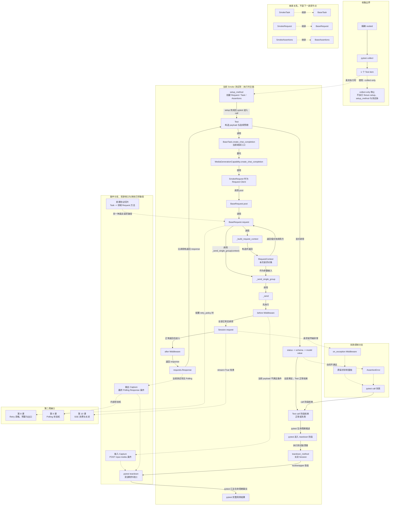

# 第 07 课：第一周串讲与业务链答辩

> 本课不增加新的框架机制，而是把前六课已经建立的项目地图、两种请求路径、BaseRequest、RequestContext、Middleware、Capture、Assertions 与 Schema 组织成一条可复述、可定位、可答辩的业务链。课堂以解释和判断为主，不执行真实接口，不编写新代码。

## 1. 课程信息

| 项目 | 内容 |
| --- | --- |
| 建议时长 | 60～90 分钟 |
| 核心问题 | 分别听懂前六课之后，能否不看源码准确讲清一次 API 用例？ |
| 讲解重点 | 真实调用链、对象流、控制结果、职责落点和失败分支 |
| 答辩切片 | `TestResponseBodyValidation.test_chat_completions_response_body` |
| 轻量验证 | 精确 nodeid 的 `--collect-only -q` |
| 安全边界 | 只收集，不执行测试体；不调用真实模型，不产生费用 |
| 课堂产出 | 一张第一周总图、三次口头答辩和一份故障判断表 |

### 1.1 学完本课，你应该能够

1. 在不打开源码时，用准确函数名复述当前 Smoke 切片从 Test 到 Assertions 的完整主链。
2. 区分函数调用链、继承或依赖关系、对象流和成功/失败控制结果。
3. 面对新接口需求，判断变化应进入 Test、Task/Capability、Request、公共请求层、Assertions 还是 Schema。
4. 面对请求、Middleware、Capture 或断言失败，说明异常和证据怎样流转。
5. 解释 collect-only 能证明什么，以及为什么它不能证明接口执行成功。

### 1.2 本课刻意不展开

- 不展开 Retry 资格、次数、退避或最终出口；第 8 课学习。
- 不展开 Polling 状态机；第 9 课学习。
- 不展开 SSE 消费与关闭；第 10 课学习。
- 不展开 TestContext；第 11 课学习。
- 不解释 BaseTask 兼容门面与 Capability 的设计原因；第 12 课学习。
- 不展开 Runner 分池、退出码、JUnit 和 Allure 生命周期；第 13～14 课学习。
- 不展开 Runtime Hooks、Quality、Metrics 或 Flaky；第三周学习。
- 不执行 `module/smoke` 真实用例，不要求新增测试或生产代码。

本课为了准确复述当前调用事实，会说出 `BaseTask` 和 `MediaGenerationCapability` 的名称，但只把它们当作当前链路节点，不讲内部设计。

### 1.3 课堂必讲路径

| 环节 | 对应章节 | 建议时间 |
| --- | --- | ---: |
| 本课约束、答辩规则与测试项数据卡 | 第 2～5 节 | 8～10 分钟 |
| 真实调用链、对象流和控制结果 | 第 6～10 节 | 18～20 分钟 |
| 职责落点与失败树 | 第 11～14 节 | 12～15 分钟 |
| 三项课堂答辩 | 第 17～19 节 | 18～20 分钟 |
| 总图、复述和周验收 | 第 20、22、25 节 | 8～10 分钟 |
| 缓冲与提问 | 全课 | 5 分钟 |

总计约 70～80 分钟，并保留约 10 分钟弹性。第 15 节 collect-only 由教师演示或学习者轻量验证，计入第 17 节答辩时间，不额外叠加。

### 1.4 课堂最短路径

完整教师稿不等于逐段朗读。推荐课堂路径：

```text
第 2～4 节：明确答辩目标和四类关系
-> 第 5 节：锁定唯一答辩测试项
-> 第 7 节：复述真实函数调用链
-> 第 8～10 节：分开对象流、控制结果和资源分支
-> 第 12、13 节：职责落点与失败树
-> 第 17～19 节：完成三次答辩
-> 第 20、22、25 节：总图、三分钟复述、周验收
```

第 6、11、14～16、21、23 节可以作为答辩提示、教师备课或课后自检。

---

## 2. 本课不是“第七批知识点”

前六课分别回答：

| 课次 | 已经回答的问题 |
| --- | --- |
| 第 1 课 | 项目有哪些变化方向和核心目录 |
| 第 2 课 | 怎样沿一个单请求协议 Case 追踪调用 |
| 第 3 课 | Test、Task、Request、Assertions、Schema 为什么分层 |
| 第 4 课 | BaseRequest 怎样统一构造并发送一次请求 |
| 第 5 课 | Middleware、Capture 和资源附件怎样形成横向证据 |
| 第 6 课 | Response 怎样通过状态、结构和业务值合同变成测试判断 |

如果第 7 课继续加入大量类名，会产生新的问题：

```text
知识点继续增加
-> 已学节点没有形成稳定关系
-> 学习者只能局部回答
-> 面对真实故障仍然从目录开始盲搜
```

因此本课只做三件事：

```text
把节点连成准确链路
把不同关系分开表达
用答辩暴露尚未稳定的认知边界
```

本课的成果不是“又读了哪些文件”，而是能够脱离文件列表讲清：

> 输入从哪里来，谁先处理，哪个对象发生变化，成功怎样返回，失败在哪里分叉，最后由谁判断。

---

## 3. 当前认知障碍与因果链

### 3.1 第一个障碍：会背角色，不会追踪当前实现

学习者可能背出：

```text
Test 负责场景
Task 负责业务动作
Request 负责请求
Assertions 负责断言
```

但面对：

```python
self.smoke_task.create_chat_completion(...)
```

却直接猜测下一步一定是：

```text
SmokeRequest.create_chat_completion()
```

当前答辩切片并不是这条路径。它调用继承自 `BaseTask` 的兼容入口，再委托 Capability，最后把 `SmokeRequest` 当作 Request Client 调用 `post()`。

因果链：

```text
用抽象模板代替源码追踪
-> 看到同名方法就猜调用关系
-> 把领域 Request 方法当作所有 Task 的必经节点
-> 真实调用链被讲错
```

### 3.2 第二个障碍：把四类关系画成一种箭头

下面四句话含义不同：

```text
SmokeTask 继承 BaseTask
BaseTask.create_chat_completion 调用 MediaGenerationCapability
payload 作为参数向下传递
AssertionError 使测试 call 阶段失败
```

它们分别是：

- 继承关系；
- 函数调用；
- 对象流；
- 控制结果。

如果全部画成 `A -> B`，图虽然连起来了，心智模型却不可信。

### 3.3 第三个障碍：把收集成功当作执行成功

精确 nodeid 被 pytest 收集，只能证明：

- 路径和命名符合发现规则；
- 模块能导入；
- 收集钩子已推进到足以形成目标测试项；如目标测试使用参数化，则参数展开也已完成；
- pytest 找到了目标测试项。

它不能证明：

- fixture setup、fixture 依赖或运行期资源可用；
- 测试体执行；
- HTTP 请求发送；
- Response 返回；
- Assertions 通过；
- 外部服务可用。

### 3.4 TOC：本课真正要解除的约束

本课的主要约束是：

> 学习者已经拥有局部节点，却不能稳定地从一个真实测试项还原调用、对象和失败关系。

解除路径：

```text
锁定一个精确测试项
-> 只沿当前分支追踪
-> 分开四类关系
-> 对成功与失败分别复述
-> 用 collect-only 校验收集边界
-> 用新需求和故障场景检验迁移能力
```

---

## 4. 第一性原理：完整解释必须回答七个问题

一条可信的技术复述至少回答：

1. 输入从哪里来？
2. 第一个业务调用是谁？
3. 当前代码走哪一条真实请求路径？
4. 哪些对象被创建、传递或返回？
5. 正常路径怎样结束？
6. 失败路径在哪里分叉？
7. 什么证据能够证明哪一级事实？

### 4.1 答辩不能只背文件顺序

错误答案：

```text
test 文件之后是 task.py，然后 request.py，然后 common。
```

目录不是运行顺序。同一项目中：

- 有的 Task 调用领域 Request 方法；
- 有的兼容入口委托 Capability，再直接使用 Request Client；
- Capture 是条件分支；
- TestContext 不是每个请求的必经节点；
- Quality 是可选观察链，不在 HTTP 与 Assertions 之间。

### 4.2 答辩必须说明停止点

好的复述不仅说明“经过什么”，也说明“没有经过什么”。

当前切片：

- 没有调用 `SmokeRequest.create_chat_completion()`；
- 没有显式传入 `RetryPolicy`；
- 没有 Polling；
- 没有 SSE；
- payload 不含 `input.media`，不会启动输入媒体下载；
- 没有输出 Capture 装饰器；
- collect-only 时不会进入测试体。

---

## 5. 唯一答辩测试项数据卡

### 5.1 稳定身份

```text
文件：module/smoke/test_response_body_validation.py
类：TestResponseBodyValidation
方法：test_chat_completions_response_body
精确 nodeid：
module/smoke/test_response_body_validation.py::TestResponseBodyValidation::test_chat_completions_response_body
```

### 5.2 setup 协作者

```python
self.smoke_request = SmokeRequest()
self.smoke_assertions = SmokeAssertions()
self.smoke_task = SmokeTask()
```

| 对象 | 本课角色 |
| --- | --- |
| `SmokeRequest` | 当前 Request Client，是 `BaseRequest` 子类 |
| `SmokeTask` | 当前 Test 调用的业务入口对象 |
| `SmokeAssertions` | 组合公共断言的领域断言对象 |

### 5.3 当前输入

Test 调用：

```python
self.smoke_task.build_chat_completions_payload()
```

当前 builder 使用 `module/smoke/task.py` 中的默认模型：

```text
KEY_CHAT_COMPLETIONS_MODEL_ID = "DeepSeek-V4-Flash"
```

这是一项当前事实，同时也是最新用例规范下的遗留偏差：静态模型 ID 应位于 `test_*.py` 并显式传给 Task。答辩必须能同时说出：

```text
当前代码实际怎样做
≠ 新用例应该继续怎样写
```

### 5.4 当前动作与预期

动作：

```python
response = self.smoke_task.create_chat_completion(
    self.smoke_request,
    payload,
)
```

预期：

```text
HTTP status == 200
Response 满足 CHAT_COMPLETION_SUCCESS_SCHEMA
$.model == "DeepSeek-V4-Flash"
```

### 5.5 teardown

```python
self.smoke_request.close()
```

它关闭该 Test 在 setup 创建的 Request Session。Assertions 不拥有 Session 清理。

---

## 6. 收集阶段与执行阶段先分开

### 6.1 collect-only 路径

收集钩子会推进到足以形成目标测试项；如目标测试使用参数化，则参数展开也会完成。但 fixture setup 尚未执行，其依赖与运行结果没有被验证。

```text
精确 nodeid
-> pytest 读取配置和插件
-> 导入测试模块
-> 识别类与测试方法
-> 形成 1 个测试项
-> 停止，不进入 setup_method 和测试体
```

因此 collect-only 不会：

- 执行 fixture setup 或验证 fixture 运行期依赖；
- 创建 `SmokeRequest`；
- 创建 `requests.Session`；
- 构造 payload；
- 调用 `create_chat_completion()`；
- 发送 HTTP；
- 执行 Assertions；
- 调用 `teardown_method`。

### 6.2 真实执行路径

只有不带 `--collect-only` 的执行才可能进入：

```text
setup
-> test call
-> teardown
```

当前 Smoke 用例依赖真实环境和 Key，可能产生调用费用，所以本课不执行。

### 6.3 为什么离线收集仍需要配置

测试模块导入框架时会加载 `config.py`。因此 collect-only 虽不发送请求，仍要求 dotenv 路径和配置值语法合法。

配置失败属于：

```text
收集前置环境失败
```

不是：

```text
接口失败或断言失败
```

---

## 7. 真实函数调用链：逐步追踪当前分支

### 7.1 Test 构造 payload

```python
payload = self.smoke_task.build_chat_completions_payload()
```

对象流：

```text
builder 默认静态值
-> 新 dict payload
-> Test 局部变量
```

这里是对象产生，不是 HTTP 调用。

### 7.2 Test 调用 `SmokeTask.create_chat_completion`

代码表面上是：

```python
self.smoke_task.create_chat_completion(...)
```

但 `SmokeTask` 自己没有重新定义这个方法，它从 `BaseTask` 继承。

关系必须分开：

```text
SmokeTask --继承--> BaseTask
Test --调用--> self.smoke_task.create_chat_completion(...)
运行时解析到 BaseTask.create_chat_completion(...)
```

### 7.3 BaseTask 委托 Capability

当前实现：

```python
return self._media_capability().create_chat_completion(
    request_client,
    payload,
)
```

调用链：

```text
BaseTask.create_chat_completion
-> BaseTask._media_capability
-> MediaGenerationCapability.create_chat_completion
```

本课只确认委托事实。为什么 BaseTask 是兼容门面、何时建立窄 Capability，第 12 课再解释。

### 7.4 Capability 使用 Request Client

当前 Capability 最终调用：

```python
request_client.post(
    self.chat_completions_path,
    json=payload,
)
```

此时：

```text
request_client 实际对象 == self.smoke_request
类型 == SmokeRequest
SmokeRequest 是 BaseRequest 子类
```

重要反例：

```text
当前切片没有调用 SmokeRequest.create_chat_completion()
```

不能因为该同名方法存在，就把它插入调用链。

### 7.5 `post()` 进入统一 `request()`

```text
BaseRequest.post(path, json=payload)
-> BaseRequest.request("POST", path, json=payload)
```

当前 Test 没有传 `retry_policy`，所以进入普通单请求分支：

```text
request()
├─ 调用 _build_request_context()
│  └─ 返回 context 给 request()
└─ 调用 _send_single_group(context)
   └─ 调用 _send(context)
```

第 8 课才展开 retry 分支。

### 7.6 RequestContext 收拢本次请求

`_build_request_context()` 负责形成：

```text
method = POST
path = /v1/chat/completions
url = base_url + relative path
kwargs.json = payload 副本
kwargs.headers = Session Header 与单次 Header 合并结果
kwargs.timeout = 当前配置或剩余预算约束后的值
```

RequestContext 是每次请求的新对象，不是 TestContext，也不是 Response。

### 7.7 `_send()` 运行 Middleware 和 Session

```text
_run_before_middlewares(context)
-> requests.Session.request(...)
-> _run_after_middlewares(context, response)
-> return response
```

默认 Middleware 顺序：

```text
RuntimeObservation
-> MediaResource
-> Redaction
-> Logging
```

当前 payload 没有 `input.media.url`，所以 MediaResourceMiddleware 不会创建输入下载任务。

### 7.8 Response 逐层返回 Test

成功返回方向：

```text
Session.request
-> _send
-> _send_single_group
-> BaseRequest.request
-> BaseRequest.post
-> MediaGenerationCapability.create_chat_completion
-> BaseTask.create_chat_completion
-> Test 的 response 变量
```

返回方向不能画成一个新的正向调用链；它是同一调用栈的返回值传播。

### 7.9 Test 执行三层响应合同

```text
Response
-> assert_status_code(response, 200)
-> assert_schema(response, CHAT_COMPLETION_SUCCESS_SCHEMA)
-> assert_json_value(response, "$.model", "DeepSeek-V4-Flash")
```

三层分别回答：

- HTTP 分支是否正确；
- 稳定结构是否正确；
- 当前关键业务值是否正确。

断言成功返回原 Response；任一断言失败会抛 `AssertionError`，后续普通代码不再继续。

### 7.10 pytest 进入 teardown

无论 call 阶段正常结束还是出现适用失败，pytest 都会推进到相应清理阶段：

```text
Assertions 全部满足或抛出 AssertionError
-> Test call 阶段正常结束或失败
-> pytest 进入 teardown 阶段
-> teardown_method
-> SmokeRequest.close()
-> module/conftest teardown hook 收口适用资源附件
-> pytest 记录完整生命周期结果
```

本课不展开 JUnit、Allure 生命周期或 Runner 退出码。

---

## 8. 同一用例必须画成四种关系

### 8.1 函数调用链

回答“谁调用谁”：

```text
Test method
-> BaseTask.create_chat_completion
-> MediaGenerationCapability.create_chat_completion
-> BaseRequest.post
-> BaseRequest.request
   ├─ 调用 _build_request_context
   │  └─ 返回 context 给 BaseRequest.request
   └─ 调用 _send_single_group(context)
      -> _send(context)
      -> Session.request
```

### 8.2 继承与依赖关系

回答“能力从哪里获得”：

```text
SmokeTask --继承--> BaseTask
SmokeRequest --继承--> BaseRequest
SmokeAssertions --继承--> BaseAssertions
BaseTask --创建并委托--> MediaGenerationCapability
```

继承箭头不能当成运行时下一函数。

### 8.3 对象流

回答“数据怎样变化”：

```text
builder 输入
-> payload dict
-> RequestContext.kwargs 中的请求副本
-> HTTP 请求 body
-> requests.Response
-> Assertions 的实际输入
```

`AssertionError` 不是 Response 变换后的数据对象。

### 8.4 控制结果

回答“成功或失败怎样发生”：

```text
Session 正常返回
-> after Middleware
-> Response 返回 Test

Session 抛请求异常
-> on_exception
-> 原异常重抛

断言不满足
-> AssertionError
-> pytest call 阶段失败
```

### 8.5 四类关系判断表

| 句子 | 关系类型 |
| --- | --- |
| SmokeRequest 是 BaseRequest 子类 | 继承 |
| Capability 调用 request_client.post | 函数调用 |
| payload 进入 RequestContext.kwargs | 对象流 |
| Session 异常被重抛 | 控制结果 |
| Schema 作为参数传给 assert_schema | 对象输入 |
| AssertionError 导致 call 失败 | 控制结果 |

---

## 9. 成功主链：五分钟复述版本

### 9.1 第一段：准备与输入

```text
pytest 执行精确测试项
-> setup_method 创建 SmokeRequest、SmokeTask、SmokeAssertions
-> Test 调用 builder 得到 payload
```

当前 builder 默认模型位于 Task，是遗留偏差；新用例应把静态输入放在 Test。

### 9.2 第二段：业务调用

```text
Test 调用继承的 BaseTask.create_chat_completion
-> BaseTask 创建并委托 MediaGenerationCapability
-> Capability 把 SmokeRequest 当作 Request Client
-> request_client.post("/v1/chat/completions", json=payload)
```

### 9.3 第三段：公共请求链

```text
BaseRequest.post
-> BaseRequest.request

BaseRequest.request
├─ 调用 _build_request_context
│  └─ 返回 RequestContext 给 request
└─ 调用 _send_single_group(context)
   -> _send
   -> before Middleware
   -> Session.request
   -> after Middleware
   -> Response
```

### 9.4 第四段：合同判断

```text
Response 返回 Test
-> 状态码合同
-> Schema 结构合同
-> model 业务值合同
```

### 9.5 第五段：资源收口

```text
Assertions 全部满足或抛出 AssertionError
-> Test call 阶段正常结束或失败
-> pytest 进入 teardown 阶段
-> teardown_method 关闭 SmokeRequest Session
-> pytest teardown hook 收口适用附件
-> pytest 记录完整用例结果
```

---

## 10. 失败路径：先定位分叉点，再谈证据

### 10.1 配置或导入失败

```text
config.py 校验失败
-> pytest 无法完成模块收集
-> 没有 Test item 或执行阶段
```

它不是接口失败。

### 10.2 before Middleware 失败

```text
before Middleware 自身抛错
-> Session 尚未调用
-> 当前实现包装为 RuntimeError
-> Test call 失败
```

不能说“所有 Middleware 错误都会忽略”。

### 10.3 Session 请求或传输失败

```text
Session.request 抛异常
-> _run_exception_middlewares
-> 记录适用异常证据
-> 重抛原请求异常
```

当前 Test 未配置 Retry，不会自动再次发送。

### 10.4 after Middleware 失败

```text
Session 已得到 Response
-> after Middleware 自身失败
-> 当前实现包装为 RuntimeError
-> Response 不正常返回 Test
```

### 10.5 Assertion 失败

```text
Response 已返回 Test
-> 某个合同不满足
-> AssertionError
-> 后续断言不执行
-> pytest 记录 call 失败
```

AssertionError 不会进入 Request Middleware 的 `on_exception()`，因为传输调用已经结束。

### 10.6 teardown 失败

```text
call 阶段结束
-> Session close 或资源附件收口失败
-> pytest 记录 teardown 结果
```

不能仅凭“业务断言通过”就宣布整个用例生命周期通过。

---

## 11. Capture 在第一周总链中的准确位置

### 11.1 输入 Capture

条件：

```text
CapturePolicy 开启输入捕获
+ POST JSON 存在 input.media.url
```

位置：

```text
MediaResourceMiddleware.before_request
-> 启动异步下载任务
-> 主 HTTP 请求继续
-> teardown 收口输入资源或失败证据
```

当前 Chat payload 不满足媒体路径条件，所以该测试项不创建输入下载任务。

### 11.2 输出 Capture

条件：

```text
其他 Polling 场景
+ 输出 Capture 开启
+ 装饰器配置 result_json_path
+ 最终 Response 中提取到 URL
```

位置：

```text
最终 Polling Response
-> 输出 Capture 装饰器
-> 下载结果
-> teardown 收口输出文件
```

当前 Chat 测试项没有 Polling，也不进入输出 Capture。

### 11.3 为什么总图仍保留 Capture

第 7 课总图是第一周项目图，不是当前测试项的每条边都为实线。

- 当前测试项实际经过的路径使用实线；
- 输入、输出 Capture 使用带条件的虚线；
- 后续课程接口继续保持虚线。

---

## 12. 五类职责：面对变化应该先问什么

### 12.1 Test：场景与最终预期

先问：

```text
这是某条用例的输入、步骤组合或最终预期吗？
```

适合：

- 静态模型 ID、提示词和开关；
- 当前场景调用顺序；
- 期望状态、Schema 和具体业务值。

### 12.2 Task 或窄 Capability：业务动作组合

先问：

```text
这是一个参数化业务动作，还是确实需要跨模块复用的窄能力？
```

本课只做落点判断，不解释 BaseTask 与 Capability 的详细决策；第 12 课展开。

### 12.3 Request 或 Request Client：端点和 HTTP 语义

先问：

```text
这是领域端点、HTTP 方法、stream/header 或请求级 metadata 吗？
```

有的模块通过领域 Request 方法固定这些语义；兼容 Capability 也可能直接使用 Request Client。不能假设所有模块只有一种路径。

### 12.4 BaseRequest 与 Middleware：公共请求机制和横向能力

先问：

```text
所有模块是否都需要同一请求算法或横向规则？
```

适合：

- URL/Header/timeout 合并；
- RequestContext；
- 通用发送管线；
- 脱敏、日志和横向资源观察。

不适合放具体模型 ID、领域路径或某个测试预期。

### 12.5 Assertions 与 Schema：判断规则

先问：

```text
这是通用比较、稳定结构、可复用领域判断，还是单场景具体值？
```

| 规则 | 位置 |
| --- | --- |
| 状态码、JSONPath、Schema 通用算法 | `BaseAssertions` |
| 稳定响应结构 | `response_schemas.py` |
| 可复用领域判断 | 领域 `assertions.py` |
| 单场景具体预期 | Test |

---

## 13. 新接口需求的落点决策

### 13.1 决策顺序

```text
先写场景输入和验收条件
-> 确定端点与 HTTP 语义
-> 判断是否需要参数化业务动作
-> 复用公共请求能力
-> 声明稳定结构合同
-> 设计离线证据
```

### 13.2 示例需求

假设新增同步摘要接口：

```text
POST /v1/text/summaries
输入 model、text、max_length
成功响应包含 id、model、summary、usage
当前用例要求返回指定 model
```

落点：

| 变化 | 推荐位置 |
| --- | --- |
| 模型 ID、输入文本、max_length | `test_*.py` 静态输入 |
| 参数化 payload builder | 当前模块 Task 或按需 payloads |
| `/v1/text/summaries` 与 POST | 当前模块 Request |
| 请求发送、Header、timeout | 复用 BaseRequest |
| id/model/summary/usage 结构 | Response Schema |
| model 等于当前输入 | Test 的值断言 |
| 可复用摘要成功判断 | 当前模块 Assertions |

### 13.3 不应做什么

- 不把模型 ID 写入 BaseRequest；
- 不在 Test 中复制 `requests.post()`；
- 不把完整域名写进领域 Request；
- 不为一条场景扩张 BaseTask；
- 不把响应日志当成业务断言；
- 不因为“可能不稳定”就在本课默认增加 Retry。

最后一项是第 8 课的入口。

---

## 14. 证据等级：每种验证只能证明自己的范围

| 证据 | 能证明什么 | 不能证明什么 |
| --- | --- | --- |
| 文件树和源码 | 路径、函数和实际调用关系 | 运行一定成功 |
| collect-only | pytest 找到目标测试项 | fixture setup、测试体和接口已执行 |
| 离线单元测试 | 公共算法与失败合同 | 外部服务可用 |
| loopback 测试 | 本地真实 HTTP 生命周期 | 真实账号和生产服务状态 |
| 真实业务执行 | 当前环境下的业务交互 | 历史长期稳定性 |
| Allure 附件 | 具体步骤和请求响应证据 | 覆盖 pytest 原始结论 |

本课只使用前两级证据：源码追踪与 collect-only。

---

## 15. 轻量验证：只收集精确 nodeid

### 15.1 运行前预测

先回答：

- 应收集几个测试项？
- 是否调用 setup_method？
- 是否创建 Session？
- 是否发送 HTTP？
- 是否产生断言结果？

预期：

```text
1 个测试项；其余全部不会发生。
```

### 15.2 配置前置

collect-only 导入框架时仍会加载 `config.py`。下面的命令在同一 `try/finally` 中使用 `.env.example`、临时关闭 Quality、创建可写证据目录并执行收集；结束后逐值恢复调用者原有的 `API_CASE_DOTENV_PATH` 与 `QUALITY_ENABLE`：

```powershell
$hadDotenvPath = Test-Path Env:API_CASE_DOTENV_PATH
$previousDotenvPath = $env:API_CASE_DOTENV_PATH
$hadQualityEnable = Test-Path Env:QUALITY_ENABLE
$previousQualityEnable = $env:QUALITY_ENABLE

$pytestExitCode = 1
$evidenceRoot = $null
try {
  $env:API_CASE_DOTENV_PATH = (
    Resolve-Path -LiteralPath '.env.example' -ErrorAction Stop
  ).Path
  $env:QUALITY_ENABLE = '0'
  $evidenceRoot = Join-Path `
    ([System.IO.Path]::GetTempPath()) `
    ('api-case-lesson07-' + [guid]::NewGuid().ToString('N'))
  New-Item `
    -ItemType Directory `
    -Path $evidenceRoot `
    -ErrorAction Stop | Out-Null

  & .\.venv\Scripts\python.exe -m pytest `
    'module/smoke/test_response_body_validation.py::TestResponseBodyValidation::test_chat_completions_response_body' `
    --collect-only `
    --basetemp "$evidenceRoot\pytest-temp" `
    --alluredir "$evidenceRoot\allure-results" `
    -q
  $pytestExitCode = $LASTEXITCODE
}
finally {
  if ($hadDotenvPath) {
    $env:API_CASE_DOTENV_PATH = $previousDotenvPath
  }
  else {
    Remove-Item Env:API_CASE_DOTENV_PATH -ErrorAction SilentlyContinue
  }

  if ($hadQualityEnable) {
    $env:QUALITY_ENABLE = $previousQualityEnable
  }
  else {
    Remove-Item Env:QUALITY_ENABLE -ErrorAction SilentlyContinue
  }
}

if ($null -ne $evidenceRoot) {
  Write-Host "Lesson evidence: $evidenceRoot"
}
if ($pytestExitCode -ne 0) {
  throw "Lesson 07 collect-only failed with exit code $pytestExitCode"
}
```

### 15.3 当前核验结果

```text
module/smoke/test_response_body_validation.py::TestResponseBodyValidation::test_chat_completions_response_body

1 test collected
```

耗时不是课程合同。

### 15.4 结论边界

这条命令证明：

- 精确 nodeid 有效；
- 模块能完成导入；
- 收集钩子已完成到足以形成目标测试项；如目标测试使用参数化，则参数展开也已完成；
- pytest 找到 1 个测试项。

它不证明：

- fixture setup、fixture 依赖或运行期资源可用；
- setup、Test、Task、Request、Middleware 或 Assertions 已执行；
- 真实接口可用；
- 用例通过；
- 费用为零以外的任何真实执行事实。

---

## 16. 教师备课：五分钟追踪源码顺序

```text
1. module/smoke/test_response_body_validation.py
   setup_method / test_chat_completions_response_body / teardown_method

2. module/smoke/task.py
   确认 SmokeTask 没有重写 create_chat_completion
   确认 builder 当前默认输入

3. common/base_task.py
   create_chat_completion / _media_capability

4. common/task_capabilities/media_generation.py
   create_chat_completion -> request_client.post

5. common/base_request.py
   post -> request
   request 调用 _build_request_context 并接收返回的 context
   request 调用 _send_single_group(context) -> _send

6. common/request_middleware.py
   默认 Middleware 的三个阶段

7. common/base_assertions.py
   status / schema / json value

8. module/smoke/response_schemas.py
   CHAT_COMPLETION_SUCCESS_SCHEMA
```

停止点：

- 不展开 operation_scope 和 Runtime Hooks；
- 不进入 RetryExecutor；
- 不进入 Polling；
- 不进入 Allure HTML 生成；
- 不执行真实 Test。

---

## 17. 课堂答辩一：不看源码复述真实调用链

### 17.1 规则

- 准备 2 分钟；
- 复述不超过 5 分钟；
- 必须说出当前真实函数名；
- 必须指出一条没有经过的同名方法；
- 必须把返回方向与调用方向分开；
- 不允许只按目录名背诵。

### 17.2 必答节点

```text
setup_method
payload builder
BaseTask.create_chat_completion
MediaGenerationCapability.create_chat_completion
SmokeRequest 作为 Request Client
BaseRequest.post / request
RequestContext
Middleware
Session.request
Response
三层 Assertions
teardown_method
```

### 17.3 参考答案

```text
pytest 执行 TestResponseBodyValidation 的 chat completions 测试项。setup_method 创建 SmokeRequest、SmokeTask 和 SmokeAssertions。Test 调用 SmokeTask 的 payload builder 得到 dict；当前模型来自 Task 默认值，这是遗留偏差。

Test 调用 self.smoke_task.create_chat_completion。SmokeTask 没有重写该方法，所以运行时进入 BaseTask.create_chat_completion。BaseTask 创建 MediaGenerationCapability 并委托；Capability 把 SmokeRequest 当作 Request Client，直接调用 post。当前链没有调用虽然存在的 SmokeRequest.create_chat_completion。

BaseRequest.post 进入 request。因为没有 retry_policy，request 先调用 _build_request_context 并接收返回的 RequestContext，再把 context 作为参数调用 _send_single_group；_build_request_context 不调用 _send_single_group。随后 _send 先执行 before Middleware，再调用 Session.request；正常返回后执行 after Middleware，并把同一个 Response 沿调用栈返回 Test。

Test 依次验证 200、成功 Schema 和 model 具体值。全部满足后 call 正常结束；任何一项不满足都会抛 AssertionError。Test call 阶段结束后，pytest 进入 teardown 阶段并执行 teardown_method 关闭 SmokeRequest Session；随后 teardown hook 收口适用资源，pytest 再记录完整用例结果。
```

### 17.4 扣分点

- 把 `SmokeRequest.create_chat_completion()` 插入当前链；
- 说 collect-only 已执行上述链路；
- 把 Capture 画成当前 Chat 测试项的固定步骤；
- 把 Quality 放在 HTTP 与 Assertions 之间；
- 说 Response 返回就等于测试通过；
- 说断言失败会进入 Request Middleware 的 on_exception。

---

## 18. 课堂答辩二：新接口代码应该放哪里

### 18.1 题目

新增一个同步文本摘要接口，需求如下：

```text
POST /v1/text/summaries
测试输入包含 model、text、max_length
成功 body 包含 id、model、summary、usage
所有摘要用例共享 payload 字段映射
当前用例要求 model 与输入一致
```

### 18.2 学习者输出

用表格回答：

| 需求元素 | 放置位置 | 依据 |
| --- | --- | --- |
| model/text/max_length 的具体值 |  |  |
| payload 字段映射 |  |  |
| POST 与相对路径 |  |  |
| HTTP 发送和 Header |  |  |
| 成功结构 |  |  |
| model 与输入相等 |  |  |

### 18.3 参考答案

| 需求元素 | 放置位置 | 依据 |
| --- | --- | --- |
| model/text/max_length 的具体值 | `test_*.py` | 静态场景输入 |
| payload 字段映射 | 当前模块 Task/payloads | 参数化公共模板 |
| POST 与相对路径 | 当前模块 Request | 领域 HTTP 语义 |
| HTTP 发送和 Header | 复用 BaseRequest | 通用请求机制 |
| 成功结构 | Response Schema | 稳定结构合同 |
| model 与输入相等 | Test 或领域 Assertions | 当前场景业务值 |

### 18.4 追问

1. 为什么不把路径写进 Test？
2. 为什么不把 model ID 写进 BaseRequest？
3. 什么时候才考虑窄 Capability？
4. 如果接口偶尔 503，是否立刻默认重试？

第 4 题的合格答案是：

```text
不能仅凭“偶尔失败”决定；需要先判断方法幂等性、允许的错误、次数和预算，第 8 课再设计。
```

---

## 19. 课堂答辩三：沿故障树说明异常和证据

### 19.1 场景 A：服务端连接失败

问题：

```text
哪个函数首先得到异常？
哪些 Middleware 会收到通知？
Test 最终得到 Response 还是异常？
Assertions 是否执行？
```

参考：

```text
Session.request 抛请求异常
-> _send 调用 on_exception
-> 记录适用失败证据
-> 重抛原异常
-> Test 没有 Response
-> Assertions 不执行
```

### 19.2 场景 B：Response 为 200，但 `choices` 为空

参考：

```text
Session 和 after Middleware 已正常完成
-> Response 返回 Test
-> status 断言通过
-> Schema 的 minItems 失败
-> AssertionError
-> 业务值断言不再执行
-> 不进入 Request on_exception
```

### 19.3 场景 C：输入媒体后台下载失败

该场景不是当前 Chat 测试项，但用于复习第 5 课：

```text
MediaDownloadTask 记录失败
-> 主 HTTP 请求继续
-> teardown 尝试附加失败证据
```

不能把它说成 Session 请求异常。

### 19.4 场景 D：before Middleware 自身抛错

参考：

```text
before 尚未全部完成
-> Session 未调用
-> 当前实现产生包装后的 RuntimeError
-> 没有 Response
```

### 19.5 故障判断表

| 失败位置 | 是否已有 Response | 主要控制结果 | Assertions 是否执行 |
| --- | --- | --- | --- |
| 配置/导入 | 否 | 收集失败 | 否 |
| before Middleware | 否 | RuntimeError | 否 |
| Session.request | 否 | 原请求异常重抛 | 否 |
| after Middleware | 是，但不正常返回 | RuntimeError | 否 |
| Schema/业务断言 | 是 | AssertionError | 已执行到失败点 |
| teardown | 可能有 | teardown 失败 | call 可能已完成 |

---

## 20. 第一周最终链路总图

图中实线表示当前 Smoke 答辩测试项的已确认路径；协议切片、Capture 和后续课程接口使用虚线。每条边都标明函数调用、对象输入、返回值传播或生命周期推进；继承关系单独标注，不能当作函数调用。



### 20.1 图中没有哪些错误箭头

- 没有 `SmokeTask -> SmokeRequest.create_chat_completion`；
- 没有 `Response -> Capture -> Assertions` 的固定线性路径；
- 没有 `Assertions -> Quality`；
- 没有 `collect-only -> setup_method`；
- 没有把继承箭头画成函数调用；
- 没有把 Retry 画成当前测试项的实线路径。

### 20.2 本周总图完成标准

学习者自己的图不必复制所有节点，但必须保留：

- 一种当前真实请求路径；
- RequestContext 与 Middleware；
- Response 返回和 Assertions；
- 至少一个请求失败分支和一个断言失败分支；
- collect-only 停止点；
- Capture 的条件性；
- 下一周 Retry 的虚线接口。

---

## 21. 常见误区

### 误区一：每个 Task 都会调用领域 Request 方法

项目同时存在领域 Request 方法路径和 Request Client 路径。

### 误区二：同名方法存在，就一定在当前调用链

必须通过方法解析和源码调用确认，不能把 `SmokeRequest.create_chat_completion()` 凭空插入当前测试项。

### 误区三：collect-only 已经运行 setup

collect-only 形成测试项后停止，不执行 setup、call 或 teardown。
其中也包括 fixture setup：fixture 是否可创建、其依赖是否可用，必须到真实执行阶段才能验证。

### 误区四：Response 返回就等于测试通过

后续 Assertions、测试代码和 teardown 仍可能失败。

### 误区五：Middleware 负责业务成功判断

Middleware 拥有横向观察与证据，Assertions 拥有比较规则。

### 误区六：所有 Middleware 失败都 fail-open

before/after 自身失败当前会使调用失败；只有明确实现和测试覆盖的旁路才能声称 fail-open。

### 误区七：AssertionError 会进入 on_exception

Request Middleware 的 on_exception 处理 Session 请求或传输异常，不处理已经返回 Test 后的断言失败。

### 误区八：输入和输出 Capture 是一条顺序链

它们是共享策略与下载原语下的两个条件分支。

### 误区九：当前 Task 默认模型位置符合最新规范

它是遗留事实；新用例应把静态输入放在 Test 并显式传入。

### 误区十：发现偶发 503 就应该立即自动重试

重试需要资格、幂等性、次数、等待和预算判断，第 8 课学习。

---

## 22. 三分钟复述

### 22.1 复述模板

```text
第一周先建立项目地图，再沿真实测试项学习业务执行链。当前答辩测试项是 test_chat_completions_response_body。collect-only 只能证明精确 nodeid 被收集，不执行 fixture setup、setup_method、测试体或 HTTP。

真实执行时，setup 创建 SmokeRequest、SmokeTask 和 SmokeAssertions。Test 通过 builder 得到 payload；当前模型默认值仍位于 Task，是与最新规范不一致的遗留写法。Test 调用 SmokeTask 继承的 BaseTask.create_chat_completion，BaseTask 委托 MediaGenerationCapability。Capability 把 SmokeRequest 当作 Request Client 调用 post；当前链不调用 SmokeRequest 的同名领域方法。

BaseRequest.post 进入 request。当前没有 retry_policy，所以 request 先调用 _build_request_context 并接收返回的 RequestContext，再调用 _send_single_group(context)；二者是 request 的兄弟调用。_send 依次运行 before Middleware、Session.request 和 after Middleware。Session 成功后，Response 沿调用栈返回 Test；请求异常则进入 on_exception 并重抛原异常。

Test 对 Response 依次验证状态码、成功 Schema 和 model 业务值。断言成功返回原 Response，失败抛 AssertionError；断言失败不进入 Request on_exception。Test call 阶段结束后，pytest 进入 teardown 阶段，执行 teardown_method 关闭 Request Session，再由 teardown hook 收口适用资源并记录完整用例结果。

函数调用、继承关系、对象流和失败控制必须分开表达。输入与输出 Capture 是条件分支，当前 Chat 测试项都不触发。面对新需求，应把场景输入放 Test，把领域动作放 Task，把端点和 HTTP 语义放 Request，把公共发送能力留在 BaseRequest，把结构与业务判断放 Schema 和 Assertions。下一课才讨论 Retry。
```

### 22.2 复述自检

- 当前 Test 调用的 `create_chat_completion` 定义在哪里？
- 当前链是否调用 `SmokeRequest.create_chat_completion()`？
- Capability 怎样使用 SmokeRequest？
- 为什么当前进入普通单请求分支？
- RequestContext 保存什么？
- Session 异常和 AssertionError 的流向有什么不同？
- 当前测试项是否触发输入或输出 Capture？
- collect-only 能证明什么？
- 当前模型默认值为什么属于遗留偏差？
- 下一课将解除什么约束？

---

## 23. 课堂小测

课堂任选 5 题，其余用于课后自测。

### 题目 1

当前 Smoke 答辩测试项中，`self.smoke_task.create_chat_completion` 实际解析到哪里？

A. `SmokeRequest.create_chat_completion`  
B. `BaseTask.create_chat_completion`  
C. `BaseRequest.request`  
D. `SmokeAssertions`

### 题目 2

`MediaGenerationCapability` 怎样发送当前请求？

A. 创建新的全局 Session  
B. 调用 `request_client.post`  
C. 调用 Assertions  
D. 调用 Polling

### 题目 3

下面哪项是对象流？

A. SmokeTask 继承 BaseTask  
B. Capability 调用 post  
C. payload 进入 RequestContext.kwargs  
D. AssertionError 中断测试

### 题目 4

精确 nodeid collect-only 成功能够证明什么？

A. 接口返回 200  
B. Assertions 通过  
C. pytest 找到目标测试项  
D. Session 已关闭

### 题目 5

Session.request 抛连接异常后，当前无 Retry 路径怎样处理？

A. 自动重试三次  
B. 进入 on_exception 后重抛原异常  
C. 返回空 Response  
D. 进入 Schema 断言

### 题目 6

Response 已返回后 Schema 失败，会进入哪个分支？

A. Request Middleware.on_exception  
B. AssertionError  
C. RetryExecutor  
D. 输入 Capture

### 题目 7

当前 Chat 测试项为什么不启动输入媒体下载？

A. 因为状态码未知  
B. 因为 payload 没有 `input.media.url`  
C. 因为没有 Assertions  
D. 因为 Session 已关闭

### 题目 8

新接口的静态模型 ID 应优先放在哪里？

A. BaseRequest  
B. Middleware  
C. 使用它的 `test_*.py`  
D. Allure 标题

<details>
<summary>展开答案</summary>

1. B。
2. B。
3. C。
4. C。
5. B。
6. B。
7. B。
8. C。

</details>

---

## 24. 课后作业：完成第一周答辩档案，不写代码

### 24.1 必做内容

1. 更新第一周最终总图，至少区分调用、继承、对象流和失败控制。
2. 完成三次口头答辩：真实链路、新接口落点、一个故障场景；每次不超过 5 分钟。
3. 保存一份简短答辩卡，只记录易错节点和证据边界；不要求逐字稿。

### 24.2 不要求完成

- 不执行真实 Smoke。
- 不新增接口模块。
- 不修改 BaseTask 或 Capability。
- 不实现 Retry。
- 不提交长篇源码抄录。
- 不强制录制视频或提交完整文字稿。

### 24.3 答辩卡模板

```text
测试项：
精确 nodeid：

当前真实调用链：

一个容易误插入的节点：

payload -> RequestContext -> Response 的对象流：

Session 异常分支：

AssertionError 分支：

collect-only 能证明：

collect-only 不能证明：

新需求落点判断：

下一周接口：
```

---

## 25. 第一周验收标准

### 25.1 入门达标

- 能找到当前 Test 的 Task、Request Client 和 Assertions；
- 能运行精确 nodeid 的 collect-only；
- 能解释状态、结构和业务值三层合同；
- 能说明 Middleware 和 Capture 的基本边界。

### 25.2 第一周通过

学习者应能在不打开源码时回答：

1. 当前测试项的完整函数调用链是什么？
2. 为什么没有调用 `SmokeRequest.create_chat_completion()`？
3. SmokeTask、SmokeRequest、SmokeAssertions 分别继承谁？
4. payload 怎样进入 RequestContext？
5. Middleware 的 before、after、exception 分别何时发生？
6. Response 怎样返回 Test？
7. 三层响应合同分别验证什么？
8. Session 异常与 AssertionError 有什么不同？
9. 输入和输出 Capture 为什么不是一条线？
10. collect-only 为什么不能证明接口成功？
11. 新接口的路径、payload、Schema 和业务值分别放哪里？
12. 当前静态模型输入为什么不是新用例的推荐模板？

### 25.3 合格复述必须包含

- 精确测试项身份；
- 当前真实 Request Client 路径；
- BaseRequest 普通请求分支；
- RequestContext 和 Middleware；
- Response 返回与三层 Assertions；
- Session 异常与 AssertionError 两个不同出口；
- teardown 资源所有权；
- collect-only 的停止点；
- 至少一个当前未经过的条件分支。

如果只能回答：

```text
Test 调 Task，Task 调 Request，然后发请求并断言。
```

说明第一周尚未通过，因为这句话无法识别当前真实路径、对象变化、失败出口或证据强度。

---

## 26. 下一课接口

第一周已经能够解释：

```text
一次请求怎样形成
-> 怎样经过 Middleware 发送
-> 怎样返回 Response
-> 怎样通过合同判断
-> 失败和资源怎样收口
```

当前答辩测试项没有配置 Retry。遇到连接超时、429 或 503 时，它会保留真实失败，不自动再次发送。

下一约束是：

```text
哪些失败属于可恢复的瞬时故障？
哪些请求具备安全重试资格？
最多尝试多少次？
等待时间与总预算怎样限制？
最后一次响应或异常怎样返回？
```

第 8 课将进入：

> Retry 不是无脑重试：只有方法资格、错误类型、尝试次数和时间预算都满足时，才能再次发送。

到这里，第 7 课完成。第一周的衡量标准不是记住多少类名，而是能沿真实测试项找到约束，用源码关系和有限证据解释自己的判断。
