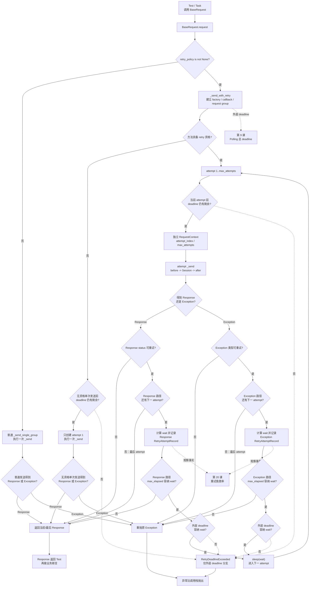

# 第 08 课：Retry 不是无脑重试

> 本课从第 7 课已经掌握的普通单请求分支出发，只展开显式传入 `RetryPolicy` 后的 Retry 分支：方法资格、响应与异常判定、attempt 次数、等待计算、时间预算、独立 RequestContext 和最终出口。Polling、SSE、Metrics 与 Flaky 继续保持折叠。

## 1. 课程信息

| 项目 | 内容 |
| --- | --- |
| 建议时长 | 60～90 分钟 |
| 核心问题 | 请求失败后，为什么不能简单再发一次？ |
| 讲解重点 | 重试资格、结果判定、等待与预算、响应/异常出口 |
| 代码入口 | `common/retry.py`、`common/retry_executor.py`、`common/base_request.py` |
| 轻量验证 | `tests/test_retry_policy.py`、`tests/test_retry_executor.py` |
| 安全边界 | 只使用内存 Response、FakeClock 和故障对象，不访问真实接口 |
| 课后产出 | Retry 决策图、场景预测表和三分钟复述 |

### 1.1 学完本课，你应该能够

1. 解释为什么“传入 RetryPolicy”不等于“必然多次发送”。
2. 根据 HTTP 方法、幂等依据、状态码或异常判断当前结果是否具备重试资格。
3. 计算固定/指数退避、`Retry-After`、jitter、`max_attempts` 和 `max_elapsed` 的基本结果。
4. 分别复述响应路径与异常路径在成功、不可重试、次数耗尽和预算不足时的真实出口。
5. 说明每次 attempt 为什么创建独立 RequestContext，并重新经过 Middleware。

### 1.2 本课刻意不展开

- 不展开 Polling 多次状态查询；第 9 课学习。
- 不展开 SSE 流式响应；第 10 课学习。
- 不展开 TestContext；第 11 课学习。
- 不展开 BaseTask/Capability 设计；第 12 课学习。
- 不展开 Runner 分池、退出码与 Allure 生命周期；第 13～14 课学习。
- 不展开 Runtime Hooks、Semantic、Metrics 或重试挽救率；第三周学习。
- 不为真实付费 POST 默认开启重试。
- 不新增生产代码或真实接口测试。

本课会看到 request group、Polling deadline 等名称，但只解释与 Retry 的接口，不展开后续机制。

### 1.3 课堂必讲路径

| 环节 | 对应章节 | 建议时间 |
| --- | --- | ---: |
| 问题、约束和 Retry 决策漏斗 | 第 2～5 节 | 10～12 分钟 |
| Policy、资格与结果判定 | 第 6～8 节 | 15～18 分钟 |
| 等待、Executor 和最终出口 | 第 9～13 节 | 22～25 分钟 |
| BaseRequest 接入与证据 | 第 14～16 节 | 10～12 分钟 |
| 二选一活动、总图与复述 | 第 17～20、22 节 | 15～18 分钟 |
| 缓冲与提问 | 全课 | 5 分钟 |

总计约 77～90 分钟。第 16 节命令由教师演示或学习者轻量验证，不追加到课堂时间中。

### 1.4 课堂最短路径

```text
第 2～5 节：先建立“重复发送有风险”的决策模型
-> 第 6.1、7、8 节：Policy、方法门禁和结果门禁
-> 第 9.1～9.4 节：等待怎样计算
-> 第 10～13 节：循环、预算和真实出口
-> 第 15 节：BaseRequest 怎样接入
-> 第 17 或 18 节：先预测再验证
-> 第 20、22 节：更新总图并完成复述
```

第 6.2、9.5、14.3、16、19、21、23 节可作为教师备课和课后自检。

---

## 2. 承接第七课：普通请求为什么保留真实失败

第 7 课答辩测试项没有传 `retry_policy`：

```text
BaseRequest.request
├─ 调用 _build_request_context 并接收 context
└─ 调用 _send_single_group(context)
   -> _send(context)
   -> Middleware
   -> Session.request
```

如果 Session 抛连接异常，当前普通路径会：

```text
on_exception
-> 重抛原请求异常
```

如果 Session 返回 503，普通路径会：

```text
返回 503 Response
-> Test 决定怎样断言
```

这是安全默认值：框架不会仅因失败就猜测“再发一次一定安全”。

只有调用方显式传入：

```python
RetryPolicy(...)
```

`BaseRequest.request()` 才进入 `_send_with_retry()`。

但进入 Retry 分支仍不等于多次发送。Executor 首先判断方法资格。

---

## 3. 当前认知障碍与因果链

### 3.1 第一个障碍：把 Retry 理解成 while 循环

错误模型：

```text
失败
-> sleep
-> 再请求
-> 一直成功为止
```

缺少：

- 方法是否允许重复发送；
- 失败是否属于瞬时故障；
- 最大 attempt 数；
- 等待与总预算；
- 最终 Response 或异常怎样返回。

### 3.2 第二个障碍：把 POST 和 GET 当成同一种风险

GET 通常用于读取；重复调用通常不改变服务端状态。

POST 可能：

- 重复创建任务；
- 重复扣费；
- 重复发送消息；
- 重复写入资源。

因果链：

```text
看到超时就重试 POST
-> 第一次请求可能已到达服务端，只是客户端没收到响应
-> 第二次请求重复执行业务动作
-> 产生重复资源或费用
```

### 3.3 第三个障碍：把所有失败都包装成 RetryExhausted

当前实现没有统一的 `RetryExhausted` 出口：

```text
最后一次得到 Response
-> 返回该 Response

最后一次抛异常
-> 重抛原异常
```

外层绝对 deadline 已耗尽，或无法容纳下一次等待时，才可能抛 `RetryDeadlineExceeded`。

### 3.4 TOC：本课真正要解除的约束

本课主要约束是：

> 学习者只看到“失败后再次发送”，没有形成重复发送前的安全决策链。

解除路径：

```text
显式策略
-> 方法资格
-> 结果资格
-> attempt 余额
-> 等待计算
-> 时间预算
-> 下一 attempt 或真实出口
```

---

## 4. 第一性原理：Retry 是受约束的重复发送

一次重试决策至少需要五类事实：

| 事实 | 当前来源 |
| --- | --- |
| 是否主动启用 | 调用方是否传入 `RetryPolicy` |
| 请求能否安全重复 | HTTP method、allowed methods、幂等 Header、`allow_post` |
| 当前失败是否可恢复 | status 或 exception 类型 |
| 还能否继续 | `max_attempts`、`max_elapsed`、外层 deadline |
| 等多久 | Retry-After、fixed/exponential、max_delay、jitter |

缺少任一项，都不能完整回答“是否再发一次”。

### 4.1 Retry 的最小决策漏斗

```text
是否传入 policy？
├─ 否 -> 普通单请求
└─ 是 -> 方法允许重复发送？
         ├─ 否 -> 只执行一次 _send
         └─ 是 -> 执行 attempt
                  -> 结果可重试？
                  -> 还有 attempt？
                  -> 等待能否进入预算？
                  -> 再次发送或结束
```

### 4.2 Retry 不拥有业务成功定义

Retry 只判断：

```text
是否值得再次尝试传输
```

它不判断：

- Response 是否满足业务 Schema；
- 模型输出是否正确；
- 负向用例是否符合预期；
- pytest 用例是否通过。

---

## 5. 三个容易混淆的计数

### 5.1 attempt

一次实际 `_send(context)` 调用。

```text
max_attempts = 3
-> 最多发送 3 次
```

第一发送已经是 attempt 1。

### 5.2 retry

前一个 attempt 得到可重试结果后，再次发送。

```text
max_attempts = 3
-> 最多发生 2 次 retry
```

### 5.3 wait

两个 attempt 之间的等待。

```text
3 attempts
-> 最多 2 次 wait
```

最后一个 attempt 之后没有下一次发送，因此不会为了“重试”再等待。

---

## 6. RetryPolicy：规则快照，不是循环本身

### 6.1 当前默认值

| 字段 | 默认值 | 含义 |
| --- | --- | --- |
| `max_attempts` | `3` | 包含第一次发送 |
| `retry_statuses` | 429、500、502、503、504 | 可重试 HTTP 状态 |
| `retry_exceptions` | ConnectionError、Timeout | 可重试异常基类 |
| `backoff` | `exponential` | 指数退避 |
| `base_delay` | `0.5` | 基础等待秒数 |
| `max_delay` | `10.0` | 单次等待上限 |
| `jitter` | `True` | 在 0 到 delay 之间随机化 |
| `respect_retry_after` | `True` | 优先读取 Retry-After |
| `max_elapsed` | `30.0` | 只判断是否还能承担下一次 wait；不会截断当前 attempt |
| `allowed_methods` | GET、HEAD | 默认方法白名单 |
| `allow_post` | `False` | 是否显式允许 POST |
| `idempotency_header` | `Idempotency-Key` | POST 幂等依据 Header 名 |

默认值只在调用方已经传入 Policy 时生效；默认请求仍然不重试。

### 6.2 模型边界（选读）

`RetryPolicy` 是 frozen Pydantic model：

- `max_attempts >= 1`；
- `base_delay >= 0`；
- `max_elapsed` 为 `None` 或大于 0；
- backoff 只能是 fixed/exponential；
- `max_delay >= base_delay`；
- 幂等 Header 名不能为空；
- 创建后不能随意修改。

非法公开构造参数仍以 `ValueError` 语义暴露。

---

## 7. 第一重门禁：方法是否允许重复发送

当前 `is_method_retry_allowed()` 顺序：

```text
method 在 allowed_methods？
├─ 是 -> 允许
└─ 否 -> method 是 POST？
         ├─ 否 -> 不允许
         └─ 是 -> allow_post=True？
                  ├─ 是 -> 允许
                  └─ 否 -> Header 中存在幂等键？
                           ├─ 是 -> 允许
                           └─ 否 -> 不允许
```

### 7.1 GET/HEAD

默认在白名单中，传入 Policy 后可以进入 attempt 循环。

### 7.2 POST 无幂等依据

```python
RetryPolicy(max_attempts=3)
```

即使策略写了 3，POST 无 Key 且未 `allow_post` 时：

```text
只创建 attempt 1
-> 只执行一次 _send
-> 直接返回 Response 或抛异常
```

### 7.3 POST 带幂等键

```python
headers={"Idempotency-Key": "request-001"}
```

Header 名比较不区分大小写。存在幂等 Header 后，POST 才进入多 attempt 资格。

这里的“存在”只是框架机械门禁：`is_method_retry_allowed()` 只检查 Header 名，不检查值是否非空、唯一或稳定。因此下面的请求也会通过方法门禁：

```python
headers={"Idempotency-Key": ""}
```

Header 名存在只代表通过框架机械门禁，不代表幂等键有效，更不证明服务端幂等。`RetryPolicy` 对 `idempotency_header` 的非空校验约束的是“要查找的 Header 名”，不是请求中实际 Header 值。

### 7.4 `allow_post=True`

这是调用方显式承担重复发送风险的开关，不是“POST 自动安全”的证明。

业务必须先回答：

- 服务端是否支持幂等；
- 重复创建是否会去重；
- 超时后第一次请求可能处于什么状态；
- 重复扣费或资源创建怎样防止。

---

## 8. 第二重门禁：本次结果是否可重试

### 8.1 Response 路径

默认可重试：

```text
429 / 500 / 502 / 503 / 504
```

默认不可重试示例：

```text
400 / 401 / 403 / 404
```

不可重试 Response 立即返回调用方，Retry 不把它改写成异常。

### 8.2 Exception 路径

默认可重试：

- `requests.ConnectionError`；
- `requests.Timeout`。

显式排除：

- `requests.exceptions.SSLError`；
- `requests.exceptions.TooManyRedirects`。

即使异常属于配置的基类，SSL 与重定向过多仍不会被 Retry 掩盖。

### 8.3 断言和业务错误不是传输重试条件

以下不进入 RetryExecutor 的结果判定：

- `AssertionError`；
- Schema 失败；
- 业务字段值错误；
- Test 代码异常。

它们发生在 Response 返回 Test 之后。

---

## 9. 等待时间怎样计算

### 9.1 Retry-After 优先

当：

```text
respect_retry_after=True
+ Response 存在可解析 Retry-After
```

使用服务端等待值，不叠加 jitter。

支持：

- 秒数，例如 `3`；
- HTTP 日期。

过去的 HTTP 日期得到 0；负数或非法值视为不可解析。

### 9.2 fixed

```text
每次 delay = base_delay
```

仍受 `max_delay` 限制。

### 9.3 exponential

在第 `attempt_index` 次失败后：

```text
delay = base_delay * 2 ** (attempt_index - 1)
```

例如 base=0.5：

| 失败 attempt | 未加 jitter 的 delay |
| ---: | ---: |
| 1 | 0.5 |
| 2 | 1.0 |
| 3 | 2.0 |

随后使用 `max_delay` 截断。

### 9.4 jitter

启用后，普通退避在：

```text
0 到截断后的 delay
```

之间随机取值，用于减少多个客户端同时重试形成的尖峰。

课堂计算时为了确定性，统一使用 `jitter=False`，或注入固定随机函数。

### 9.5 Retry-After 也受 max_delay 限制

当前实现对 Retry-After 计算后仍执行：

```text
min(max_delay, delay)
```

因此服务端给 30 秒、`max_delay=10` 时，当前等待为 10 秒。讲义不能声称 Retry-After 会无条件覆盖客户端上限。

---

## 10. RetryExecutor：先资格，再进入循环

### 10.1 不具备方法资格

```text
method 不允许 retry
-> 检查外层 deadline 尚有剩余
-> context_factory(1)
-> send_once(context)
-> 直接返回或抛异常
```

不会计算等待，不会消费第二个结果。

### 10.2 具备方法资格

```text
started_at = monotonic()
for attempt_index in 1..max_attempts:
    检查 deadline
    创建独立 context
    send_once(context)
    分别处理 exception 或 response
```

### 10.3 每次循环先创建新 Context

`context_factory(attempt_index)` 每次构造新的 RequestContext，并写入：

```text
attempt_index
max_attempts
retry_records
```

不同 attempt 不共享同一个 RequestContext 对象。

---

## 11. Response 路径的真实出口

本节与下一节先描述 Retry 结果路径；其中“返回 Response”或“重抛原异常”都以 `attach_records()` 回调未抛异常为前提。附件失败边界在第 14.3 节单独展开。

### 11.1 非重试状态

```text
attempt 得到 200/400/404 等非重试状态
-> attach_records
-> 返回当前 Response
```

### 11.2 可重试状态，后续成功

```text
attempt 1 -> 503
-> 记录 HTTP 503 与 wait
-> sleep
-> attempt 2 -> 200
-> 返回 200 Response
```

### 11.3 次数耗尽

```text
attempt 1 -> 503
attempt 2 -> 503
max_attempts = 2
-> 返回第二个 503 Response
```

不会抛统一 RetryExhausted。

### 11.4 max_elapsed 不容纳等待

```text
当前得到可重试 Response
-> 计算 wait
-> elapsed + wait > max_elapsed
-> 不 sleep
-> 返回当前 Response
```

响应事实仍交给 Test 判断。

---

## 12. Exception 路径的真实出口

### 12.1 不可重试异常

```text
attempt 抛 SSLError 等不可重试异常
-> attach_records
-> 原异常重抛
```

### 12.2 可重试异常，后续成功

```text
attempt 1 -> Timeout
-> 记录异常类型、消息与 wait
-> sleep
-> attempt 2 -> 200 Response
-> 返回 Response
```

### 12.3 次数耗尽

```text
最后 attempt -> Timeout
-> 重抛该原始 Timeout
```

测试可验证对象身份仍是原异常对象。

### 12.4 max_elapsed 不容纳等待

```text
当前抛可重试异常
-> elapsed + wait > max_elapsed
-> 不 sleep
-> 重抛当前原异常
```

Response 路径返回 Response，Exception 路径抛原异常；两条路径不能合并成同一个“重试失败”。

---

## 13. 两类时间约束不能混为一谈

### 13.1 `max_elapsed`

Policy 字段，按 RetryExecutor 当前本轮 `started_at` 计算：

```text
当前经过时间 + 下一次 wait <= max_elapsed？
```

不满足时：

- Response 路径返回当前 Response；
- Exception 路径重抛原异常。

`max_elapsed` 不是单次 transport 的硬超时：当前实现用它判断“是否还能承担下一次 wait”，不会像外层 deadline 那样截断每次 HTTP timeout。

### 13.2 外层 `deadline`

传给 Executor 的绝对 monotonic 截止时间，可能来自 Polling 等更大流程。

它用于：

- 每个 attempt 前要求仍有剩余；
- 把单次 transport timeout 截断到剩余预算；
- 判断下一次 wait 是否严格小于剩余时间。

### 13.3 `RetryDeadlineExceeded`

以下情况可能产生：

- attempt 开始前 deadline 已耗尽；
- 下一次等待无法容纳进外层 deadline。

它可以携带最后一个 Response，但它不是次数耗尽或 `max_elapsed` 的统一异常。

### 13.4 本课与下一课的接口

独立普通请求通常没有外层 deadline；Polling 会把 HTTP attempt、Retry wait 和 poll sleep 放进同一个总预算。第 9 课再展开。

---

## 14. RetryAttemptRecord 记录什么

字段包括：

```text
attempt_index
max_attempts
reason
wait_seconds
response_status_code
exception_type
exception_message
```

### 14.1 它不是“所有 attempt 列表”

当前 record 在“准备进行下一次重试”时追加：

- 可重试 Response 且还有 attempt；
- 可重试 Exception 且还有 attempt。

最终成功、最终 Response 或最终异常不会额外生成一条“下一次等待”记录。

例如 `max_attempts=1` 时第一次 Timeout 直接重抛，record 列表为空。

`wait_seconds` 是当时计算出的候选等待。record 在预算判断前追加，因此记录存在不等于随后一定执行了 `sleep`；实际是否等待还要看 `max_elapsed` 和外层 deadline。

### 14.2 记录怎样进入证据

BaseRequest 把 records 交给当前 attempt 的 logger 附件逻辑。日志可以观察：

- 为什么重试；
- 等待多久；
- 状态码或异常类型；
- 当前 attempt 与最大次数。

只有附件回调未抛异常时，日志证据才不会改变 Response 或原异常出口。

### 14.3 当前附件回调不是 fail-open 保证（选读）

进入具备方法资格的 attempt 循环后，`RetryExecutor.execute()` 会在多个控制点同步调用 `attach_records()`。但 BaseRequest 的 `_attach_retry_records()` 会先判断 records：

```text
records 为空
-> 直接返回
-> 不取得 logger，也不调用 logger.attach_retry_records

records 非空
-> 取得当前 attempt 的 logger
-> 调用 logger.attach_retry_records(records)
```

因此 `max_attempts=1`、第一次即得到不可重试结果等没有产生 RetryAttemptRecord 的场景，不会真正进入 logger 附件逻辑。只有 records 非空并调用 logger 时，才存在以下附件失败边界：

```text
最终或不可重试结果
-> attach_records(context, records)
-> 回调正常：返回 Response 或重抛原异常
-> 回调异常：附件异常向外传播，原出口不再成立

准备下一次 retry
-> 追加 RetryAttemptRecord
-> attach_records(context, records)
-> 回调正常：继续预算判断、sleep 和下一 attempt
-> 回调异常：中断 Executor，后续 retry 不再执行
```

BaseRequest 当前传入的 `_attach_retry_records()` 会直接调用 logger 的附件方法，没有统一 `try/except` 隔离。因此“观测不影响业务”是设计目标，不是当前机械保证；附件异常可能阻止 Response 返回、覆盖原请求异常，或阻断后续重试。

---

## 15. BaseRequest 怎样接入 RetryExecutor

### 15.1 `request()` 分支

```text
retry_policy is None
-> 普通 _send_single_group

retry_policy is not None
-> _send_with_retry
```

### 15.2 `_send_with_retry()` 的适配职责

它负责提供：

- 首个 RequestContext，用于方法与 Header 资格判断；
- `context_factory`，每次创建独立 RequestContext；
- `send_once=self._send`；
- retry records 附件回调；
- 当前请求组的等待记录；
- 可选外层 deadline。

### 15.3 每个 attempt 都重新经过 Middleware

因为：

```python
send_once=self._send
```

而 `_send()` 的结构是：

```text
before Middleware
-> Session.request
-> after Middleware
```

Session 异常时执行 on_exception。因此 Retry 不包在 Middleware 内部；每个 attempt 都是一次完整请求生命周期。

### 15.4 当前上下文记录指向最新 attempt

`context_recorder` 被更新为只包含最新 RequestContext。不同 attempt 的 Context 身份不同，避免前一次日志和当前发送状态串线。

---

## 16. 轻量验证：纯离线 Policy 与 Executor 测试

### 16.1 测试为什么安全

这两组测试只使用：

- 内存 `requests.Response`；
- 人工构造的 Timeout/SSL 异常；
- FakeClock；
- 注入的 `send_once`；
- 内存 RequestContext。

不创建真实 Session 请求，不访问外部网络。

### 16.2 安全命令

```powershell
$hadDotenvPath = Test-Path Env:API_CASE_DOTENV_PATH
$previousDotenvPath = $env:API_CASE_DOTENV_PATH
$hadQualityEnable = Test-Path Env:QUALITY_ENABLE
$previousQualityEnable = $env:QUALITY_ENABLE

$pytestExitCode = 1
$evidenceRoot = $null
try {
  $env:API_CASE_DOTENV_PATH = (
    Resolve-Path -LiteralPath '.env.example' -ErrorAction Stop
  ).Path
  $env:QUALITY_ENABLE = '0'
  $evidenceRoot = Join-Path `
    ([System.IO.Path]::GetTempPath()) `
    ('api-case-lesson08-' + [guid]::NewGuid().ToString('N'))
  New-Item `
    -ItemType Directory `
    -Path $evidenceRoot `
    -ErrorAction Stop | Out-Null

  & .\.venv\Scripts\python.exe -m pytest `
    tests/test_retry_policy.py `
    tests/test_retry_executor.py `
    --basetemp "$evidenceRoot\pytest-temp" `
    --alluredir "$evidenceRoot\allure-results" `
    -p no:cacheprovider `
    -q
  $pytestExitCode = $LASTEXITCODE
}
finally {
  if ($hadDotenvPath) {
    $env:API_CASE_DOTENV_PATH = $previousDotenvPath
  }
  else {
    Remove-Item Env:API_CASE_DOTENV_PATH -ErrorAction SilentlyContinue
  }

  if ($hadQualityEnable) {
    $env:QUALITY_ENABLE = $previousQualityEnable
  }
  else {
    Remove-Item Env:QUALITY_ENABLE -ErrorAction SilentlyContinue
  }
}

if ($null -ne $evidenceRoot) {
  Write-Host "Lesson evidence: $evidenceRoot"
}
if ($pytestExitCode -ne 0) {
  throw "Lesson 08 offline tests failed with exit code $pytestExitCode"
}
```

### 16.3 当前核验结果

```text
25 passed
```

### 16.4 能证明什么

- `max_attempts` 非法值校验与 Policy frozen 行为；
- Retry-After 解析/回退、exponential、max_delay 和 jitter；
- GET/POST 方法资格；
- status/exception 判定；
- Response 与 Exception 两类出口；
- max_attempts 与 max_elapsed；
- 每次 attempt 独立 Context。

### 16.5 不能证明什么

- 真实网络一定按时恢复；
- 这两组测试没有覆盖 fixed backoff 分支，也没有覆盖全部 Policy 字段校验；
- 服务端幂等实现正确；
- 真实 POST 重试不会重复扣费；
- Retry 附件回调失败不会影响控制流；当前实现没有这一 fail-open 保证；
- Polling 总 deadline 正确；
- Metrics 重试挽救率已生成。

---

## 17. 课堂活动 A：先预测次数、等待和出口

统一策略：

```python
RetryPolicy(
    max_attempts=3,
    base_delay=1,
    max_delay=10,
    jitter=False,
)
```

### 17.1 待预测场景

| 场景 | method / 条件 | 结果序列 | 预测 attempts | waits | 最终出口 |
| --- | --- | --- | ---: | --- | --- |
| A | GET | 503, 200 |  |  |  |
| B | GET | 400, 200 |  |  |  |
| C | POST，无幂等键 | 503, 200 |  |  |  |
| D | POST，有幂等键 | 503, 200 |  |  |  |
| E | GET | Timeout, 200 |  |  |  |
| F | GET，max_attempts=2 | 503, 503 |  |  |  |
| G | GET，max_elapsed=0.5 | 503 |  |  |  |

### 17.2 参考答案

| 场景 | attempts | waits | 最终出口 |
| --- | ---: | --- | --- |
| A | 2 | `[1]` | 返回 200 |
| B | 1 | `[]` | 返回 400 |
| C | 1 | `[]` | 返回 503 |
| D | 2 | `[1]` | 返回 200 |
| E | 2 | `[1]` | 返回 200 |
| F | 2 | `[1]` | 返回最后 503 |
| G | 1 | `[]` | max_elapsed 不容纳 wait，返回当前 503 |

### 17.3 验收重点

每个答案必须先说明：

```text
方法资格
-> 结果资格
-> attempt 余额
-> 预算
-> 出口
```

---

## 18. 课堂活动 B：POST 是否允许重试

### 18.1 题目

某媒体创建接口返回客户端 Timeout。业务提出“自动重试三次”。已知：

- 方法是 POST；
- 服务端可能已创建任务；
- 当前没有幂等键；
- 每次创建都可能计费。

### 18.2 判断

不能直接设置 `allow_post=True`。

应该先回答：

1. 服务端能否接受稳定幂等键？
2. 相同 Key 是否返回同一业务结果？
3. Key 的生命周期和冲突规则是什么？
4. 重复请求是否重复扣费？
5. 超时后是否有查询原任务的替代路径？

### 18.3 推荐决策

```text
没有幂等合同
-> 保留一次发送和真实 Timeout

服务端有明确幂等合同
-> 请求级 Header 传 Idempotency-Key
-> 再选择有限 RetryPolicy
-> 用离线与真实受控证据验证
```

`allow_post=True` 是显式绕过方法门禁，不是幂等性证明。

---

## 19. 教师演示：读取两条最小证据

### 19.1 POST 无 Key

`test_post_without_idempotency_key_runs_once` 冻结：

```text
结果序列准备了 503、200
-> 实际只消费第一个 503
-> Context 数量 1
-> sleeps 为空
```

### 19.2 最终 Timeout

`test_get_final_timeout_raises_original_exception` 冻结：

```text
max_attempts=1
-> 第一次 Timeout 即最后 attempt
-> 抛出的对象 is 原 error
-> 没有 retry record
```

两条证据共同否定：

```text
有 Policy 就一定多次发送
耗尽后一定抛 RetryExhausted
```

---

## 20. 第八版累积链路总图

本图保留第一周主链，只展开 `BaseRequest.request()` 的 Retry 核心分支。Retry 记录的附件观察与失败边界折叠到第 14.3 节，不进入本课主图；Polling、SSE 和 Quality 继续使用虚线接口。



### 20.1 图中三类“否”不能合并

- 方法不允许：执行一次，不进入循环；
- 结果不可重试：主图直接表达返回 Response 或抛原异常，附件观察边界已折叠；
- 预算不允许：根据 Response/Exception/max_elapsed/deadline 走不同出口。

### 20.2 当前图没有表达业务成功

`RRET` 可能是 200，也可能是 400 或最终 503。业务 Test 仍要断言。

---

## 21. 常见误区

### 误区一：max_attempts=3 表示失败后再重试 3 次

它包含第一次发送，最多只有 2 次 retry。

### 误区二：传了 Policy 就一定发送多次

POST 无资格、结果不可重试或第一次成功都只发送一次。

### 误区三：POST Timeout 一定可以重试

Timeout 不代表服务端没执行；必须先有幂等依据。

### 误区四：所有 5xx 都默认重试

默认集合是 500、502、503、504，不包含所有可能状态。

### 误区五：SSL 错误属于 ConnectionError，所以会重试

当前实现显式排除 SSLError。

### 误区六：Retry-After 不受客户端限制

当前仍受 max_delay 截断。

### 误区七：最终 503 会抛 RetryExhausted

当前返回最后 503 Response。

### 误区八：最终 Timeout 会包装成统一异常

当前重抛原 Timeout。

### 误区九：RetryDeadlineExceeded 是所有耗尽出口

它只属于外层 deadline 约束，不代表次数或 max_elapsed 的统一耗尽。

### 误区十：多个 attempt 共享同一个 RequestContext

每次 attempt 创建独立 Context，并重新经过 Middleware。

### 误区十一：RetryAttemptRecord 等于所有 attempt 清单

当前记录的是触发下一次重试的原因与等待，不为最终结果额外追加等待记录。

### 误区十二：Retry 成功就表示测试通过

Retry 只返回最终 Response；业务合同仍由 Assertions 判断。

### 误区十三：Retry 记录附件是纯旁路，失败也不会改变出口

当前附件回调在 Executor 中同步执行，且 BaseRequest 没有统一异常隔离。附件失败可能阻断下一次 retry、阻止 Response 返回或覆盖原请求异常。

---

## 22. 三分钟复述

### 22.1 复述模板

```text
框架默认请求不重试，只有显式传入 RetryPolicy 才进入 _send_with_retry。但 Executor 在循环前先判断方法资格：GET/HEAD 默认允许；POST 只有在 allowed methods、allow_post 或幂等 Header 提供依据时才允许多 attempt。无资格 POST 即使 max_attempts=3，也只执行一次 _send。

具备方法资格后，每个 attempt 创建独立 RequestContext，并通过 send_once=self._send 重新经过 before Middleware、Session 和 after/on_exception。Response 只有状态在 retry_statuses 中才可重试；异常默认只重试 ConnectionError 和 Timeout，并显式排除 SSL 与重定向过多。

max_attempts 包含第一次发送。可重试结果且还有 attempt 时，Executor 优先读取 Retry-After，否则按 fixed 或 exponential 计算退避，再受 max_delay 和 jitter 影响。等待还必须满足 max_elapsed 和可选外层 deadline。

响应路径耗尽次数或 max_elapsed 时返回当前/最后 Response；异常路径耗尽时重抛原异常。只有外层 deadline 已耗尽或无法容纳等待时才可能抛 RetryDeadlineExceeded，不存在统一 RetryExhausted。

RetryAttemptRecord 保存触发下一次重试的 attempt、原因、等待、状态或异常证据，但不替代业务结果。Test 收到最终 Response 后仍需执行状态、Schema 和业务值断言。
```

### 22.2 复述自检

- 默认请求为什么不重试？
- POST 有哪三种进入多 attempt 的方式？
- max_attempts=3 最多发送几次、等待几次？
- 400、503、Timeout、SSLError 分别怎样处理？
- Retry-After 与 jitter 的关系是什么？
- max_elapsed 与 deadline 有什么不同？
- 最后 503 和最后 Timeout 的出口分别是什么？
- 为什么每次 attempt 都重新经过 Middleware？
- RetryAttemptRecord 是否包含所有 attempt？
- Retry 成功为什么不等于测试通过？

---

## 23. 课堂小测

课堂任选 5 题。

### 题目 1

`max_attempts=3` 最多产生多少次实际发送？

A. 2  
B. 3  
C. 4  
D. 无限

### 题目 2

POST 无幂等键、`allow_post=False`，即使收到 503 会怎样？

A. 重试到 200  
B. 只发送一次并返回 503  
C. 抛 RetryExhausted  
D. 转成 GET

### 题目 3

默认哪项可重试？

A. 404  
B. SSLError  
C. Timeout  
D. AssertionError

### 题目 4

两次 attempt 都返回 503，`max_attempts=2`，最终怎样？

A. 返回第二个 503  
B. 抛统一异常  
C. 返回第一个 503  
D. 自动第三次发送

### 题目 5

第一次 Timeout 且 `max_attempts=1`，最终怎样？

A. 返回空 Response  
B. 抛原 Timeout  
C. 抛 RetryDeadlineExceeded  
D. sleep 后结束

### 题目 6

可解析 Retry-After 存在时，当前普通 jitter 怎样处理？

A. 继续随机化  
B. 不使用 jitter  
C. 固定乘 2  
D. 忽略 Retry-After

### 题目 7

为什么每次 attempt 都有独立 RequestContext？

A. 为了修改调用方 payload  
B. 为了隔离每次发送、日志和 attempt 属性  
C. 为了跳过 Middleware  
D. 为了替代 Response

### 题目 8

哪个条件可能抛 `RetryDeadlineExceeded`？

A. max_attempts 自然耗尽  
B. 最后得到 503  
C. 外层 deadline 无法容纳下一等待  
D. 收到 400

<details>
<summary>展开答案</summary>

1. B。
2. B。
3. C。
4. A。
5. B。
6. B。
7. B。
8. C。

</details>

---

## 24. 课后作业：完成 Retry 决策图，不写代码

### 24.1 必做内容

1. 更新第八版累积总图，展开方法门禁、结果门禁、次数、等待、预算和两类出口。
2. 完成 4 个自选场景预测，写出 attempts、waits 和最终出口。
3. 完成一次三分钟复述；文字稿选做。

### 24.2 不要求完成

- 不修改 RetryPolicy 默认值。
- 不为真实 POST 开启 `allow_post`。
- 不调用真实 429/503 接口。
- 不实现新的 backoff。
- 不展开 Polling 总 deadline。
- 不提交长篇源码抄录。

### 24.3 场景预测模板

```text
method：
幂等依据：
policy：
结果序列：

方法是否允许：
每次结果是否可重试：
attempts：
waits：
预算判断：
最终 Response 或异常：
```

---

## 25. 验收标准

完成本课后，应能回答：

1. 为什么默认请求不重试？
2. Policy 与 Executor 分别负责什么？
3. 方法资格为什么在循环前判断？
4. POST 无幂等键为什么只发送一次？
5. `allow_post=True` 为什么不是安全证明？
6. 默认可重试状态和异常有哪些？
7. 为什么 SSL 错误被显式排除？
8. `max_attempts` 是否包含第一次发送？
9. fixed 和 exponential 怎样计算？
10. Retry-After、max_delay 和 jitter 怎样组合？
11. Response 与 Exception 路径怎样分叉？
12. 最后 503 为什么返回 Response？
13. 最后 Timeout 为什么重抛原异常？
14. max_elapsed 不足时两条路径分别怎样结束？
15. 外层 deadline 什么时候产生 RetryDeadlineExceeded？
16. 每个 attempt 为什么创建独立 Context？
17. 每个 attempt 是否重新运行 Middleware？
18. RetryAttemptRecord 记录什么、不记录什么？
19. 离线测试能证明什么？
20. Retry 为什么不能替代业务断言？

### 25.1 合格判断

合格复述必须包含：

- 显式启用；
- 方法资格；
- Response/Exception 两类结果资格；
- attempt 包含第一次发送；
- 等待与双重预算；
- 返回最后 Response 与重抛原异常；
- 独立 RequestContext 和完整 Middleware 生命周期；
- 没有统一 RetryExhausted。

如果只能回答：

```text
失败后按策略等一下，再试几次。
```

说明尚未掌握本课，因为无法判断 POST 风险、次数、预算或最终出口。

---

## 26. 下一课接口

本课的 Retry 循环只回答：

```text
同一个 HTTP 请求在瞬时失败时，是否允许再次尝试？
```

但异步任务会出现另一种循环：

```text
创建任务成功
-> 查询状态仍是 pending
-> 等待
-> 再次查询
-> success / failure / unknown / timeout
```

这不是 Retry：

- Retry 重复同一请求以应对瞬时传输失败；
- Polling 发起多次状态查询以等待业务状态终结；
- 每次 Polling GET 内部还可以独立使用 Retry；
- 两个循环必须共享清晰的总 deadline。

第 9 课将进入：

> Polling 是有终点的查询循环：pending 可以等待，success 返回，failure 和 unknown 明确失败，deadline 耗尽必须停止。

到这里，第 8 课完成。你已经能在再次发送前先问“是否安全、是否值得、是否还有预算”，而不是把重试当作掩盖失败的默认动作。
