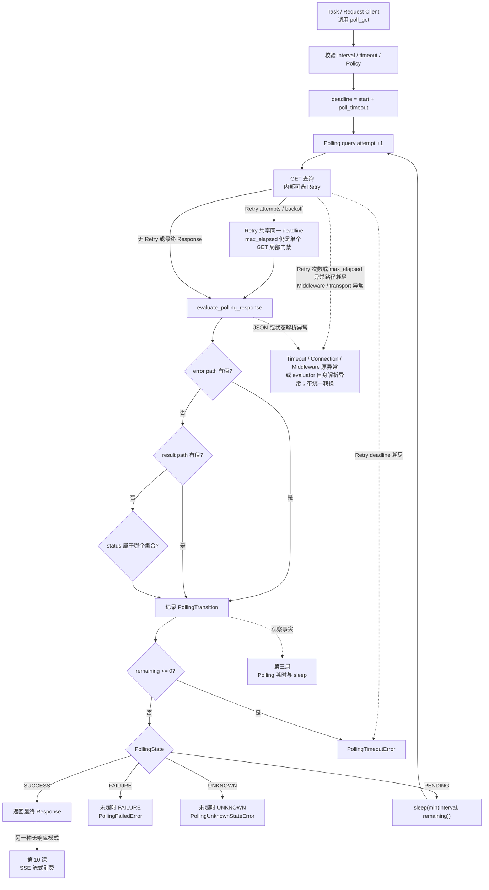

# 第 09 课：Polling 是有终点的查询循环

> 本课承接第 8 课的单请求 Retry，展开异步任务的业务状态查询循环：PollingPolicy、四类状态、状态优先级、迁移记录、总 deadline，以及每次 Polling GET 内部可选 Retry 的嵌套边界。SSE、TestContext、Runner 和 Quality 继续保持折叠。

## 1. 课程信息

| 项目 | 内容 |
| --- | --- |
| 建议时长 | 60～90 分钟 |
| 核心问题 | 异步任务还没完成时，怎样等待成功，又不会永远等待？ |
| 讲解重点 | pending/success/failure/unknown、状态优先级、总 deadline、Retry 嵌套 |
| 代码入口 | `common/polling.py`、`common/base_request.py` |
| 轻量验证 | `tests/test_polling_state_machine.py`、`tests/test_base_request_retry_polling.py` |
| 安全边界 | 只使用内存 Response、FakeClock 和 Fake Transport，不访问真实任务接口 |
| 课后产出 | Polling 状态机、迁移表和三分钟复述 |

### 1.1 学完本课，你应该能够

1. 区分 Polling 与 Retry 分别解决的业务状态等待和瞬时传输失败。
2. 根据 PollingPolicy 和 Response 判断 pending、success、failure 或 unknown。
3. 解释 error path、result path 和 status 集合的当前判定优先级。
4. 复述 poll_timeout 怎样形成覆盖 HTTP、Retry wait 和 poll sleep 的唯一 deadline。
5. 说明 success、failure、unknown、timeout 的真实返回或异常出口及迁移证据。

### 1.2 本课刻意不展开

- 不展开 SSE；第 10 课学习。
- 不展开 TestContext；第 11 课学习。
- 不展开 BaseTask/Capability 的媒体组合；第 12 课学习。
- 不展开 Runner、JUnit 与 Allure 生命周期；第 13～14 课学习。
- 不展开 Runtime Hooks、Semantic、Metrics 或 Polling 指标；第三周学习。
- 不执行真实异步媒体任务。

### 1.3 课堂必讲路径

| 环节 | 对应章节 | 建议时间 |
| --- | --- | ---: |
| 问题、约束与 Retry 对比 | 第 2～4 节 | 8～10 分钟 |
| Policy、评估优先级与四类状态 | 第 5～8 节 | 18～20 分钟 |
| 循环、总 deadline 与异常出口 | 第 9～13 节 | 20～22 分钟 |
| 离线证据与课堂预测 | 第 14～16 节 | 10～12 分钟 |
| 总图、复述和验收 | 第 17、19、22 节 | 8～10 分钟 |
| 缓冲与提问 | 全课 | 5 分钟 |

总计约 69～79 分钟，并保留提问与演示弹性。第 14 节命令不额外计时。

### 1.4 课堂最短路径

```text
第 2～4 节：先分清 Polling 与 Retry
-> 第 5～8 节：建立状态分类和优先级
-> 第 9～12 节：沿循环追踪 deadline 与四个出口
-> 第 15 或 16 节：预测状态和时间
-> 第 17、19、22 节：更新总图、复述、验收
```

---

## 2. 承接 Retry：两个循环解决不同问题

### 2.1 Retry

```text
同一个 HTTP 请求
-> 遭遇 503 / Timeout 等瞬时故障
-> 在资格和预算允许时再次尝试
```

### 2.2 Polling

```text
一次 GET 正常返回业务状态 running
-> 请求本身成功，但业务任务尚未终结
-> 等待 poll_interval
-> 发起下一次状态查询
```

### 2.3 嵌套关系

```text
Polling 循环
├─ GET 查询 1
│  └─ 内部可选 Retry attempts
├─ poll sleep
├─ GET 查询 2
│  └─ 内部可选 Retry attempts
└─ 终态或 timeout
```

Retry attempt 不是 Polling attempt；两种计数不能混用。

---

## 3. 当前认知障碍与因果链

### 3.1 把 pending 当失败

`running` 表示任务尚未完成，不等于 HTTP 失败或业务失败。

```text
pending 被当失败
-> 用例过早结束
-> 合法异步任务被误报
```

### 3.2 只写 while True

没有终态集合、未知状态策略和总 deadline：

```text
服务端一直 running 或返回新状态
-> 客户端无限查询
-> 占用线程、请求和费用
```

### 3.3 success 覆盖时间预算

如果 Response 在 deadline 之后才返回 success，不能宣称任务按时成功。

### 3.4 TOC：本课真正的约束

> 学习者会写循环，却没有“状态分类 + 唯一 deadline + 明确出口”的状态机。

解除路径：

```text
定义 Policy
-> 每次 GET
-> 评估状态
-> 记录 transition
-> 检查 deadline
-> terminal 出口或 pending sleep
```

---

## 4. 第一性原理：Polling 必须有状态、时钟和出口

| 必要元素 | 当前实现 |
| --- | --- |
| 状态来源 | `status_json_path` |
| 等待集合 | `pending` |
| 成功集合 | `success` |
| 失败集合 | `failure` |
| 陌生状态策略 | `unknown` |
| 查询间隔 | `poll_interval` |
| 总预算 | `poll_timeout -> deadline` |
| 证据 | `PollingTransition` |
| 出口 | Response 或明确异常 |

缺少任一项，都可能出现过早成功、无限等待或无法诊断。

---

## 5. PollingPolicy：声明业务状态合同

### 5.1 默认 Policy

```text
status_json_path = $.status
pending = queued, running
success = succeeded
failure = failed, cancelled
result_json_path = None
error_json_path = $.error
unknown = fail
```

Policy 是 frozen Pydantic model。

### 5.2 unknown 策略

允许：

- `fail`：评估为 UNKNOWN，随后抛 `PollingUnknownStateError`；
- `pending`：把陌生值视为 PENDING；
- `ignore`：当前同样评估为 PENDING。

`ignore` 不是立即返回，它仍继续 Polling。

### 5.3 媒体默认 Policy

`DEFAULT_MEDIA_POLLING_POLICY` 扩展了常见状态：

- pending：queued/running/pending/processing；
- success：succeeded/success/completed；
- failure：failed/cancelled/canceled；
- result：`$.result.urls`；
- error：`$.error`。

直接调用 `BaseRequest.poll_get()` 必须显式提供 Policy。

### 5.4 状态集合当前不校验互斥（选读）

`PollingPolicy` 当前不会检查 pending、success、failure 三个集合是否重叠。若同一个值被错误地放入多个集合，源码判断顺序是：

```text
pending -> success -> failure
```

因此重叠值会被最先命中的集合分类。规范用法应保持集合互斥，不依赖这一实现顺序表达业务语义。

---

## 6. evaluate_polling_response 的判定优先级

当前顺序不是简单先读 status：

```text
解析 JSON
-> 读取 raw status
-> error_json_path 存在非 None 值？
   -> FAILURE
-> result_json_path 存在非 None 值？
   -> SUCCESS
-> raw status 在 pending/success/failure 集合？
-> 应用 unknown 策略
```

### 6.1 error 优先于 result

同一 body 同时有 error 和 result 时，当前评估为 FAILURE。

### 6.2 result 优先于 status 集合

配置 result path 且提取到值时，即使 status 仍不是 success 集合，也评估为 SUCCESS。

### 6.3 路径存在与值非 None

当前 error/result 快捷判断要求提取值不是 `None`。路径值为 null 不会触发对应快捷终态。

### 6.4 非法 JSON

转换为 `AssertionError`，消息使用脱敏且最多 2000 字符的 Response 文本。

---

## 7. 四种 PollingState

### 7.1 PENDING

```text
记录 transition
-> 预算仍有剩余
-> sleep(min(poll_interval, remaining))
-> 下一次 GET
```

### 7.2 SUCCESS

```text
记录 transition
-> deadline 仍有效
-> 附加迁移证据
-> 返回最终 Response
```

### 7.3 FAILURE

```text
记录 transition
-> deadline 仍有效
-> 抛 PollingFailedError
```

异常携带 path、last_status、last_response、transitions 和 error_value。

### 7.4 UNKNOWN

默认：

```text
记录 transition
-> deadline 仍有效
-> 抛 PollingUnknownStateError
```

未知状态不能假装成功。

---

## 8. PollingEvaluation 与 Transition 不是同一对象

`PollingEvaluation` 表示当前 Response 的分类：

```text
state / raw_status / result_value / error_value
```

`PollingTransition` 表示本轮历史证据：

```text
attempt_index
elapsed_seconds
state
raw_status
response_status_code
```

典型序列：

```text
queued -> running -> succeeded
```

Polling attempt_index 是状态查询次数，不是内部 Retry attempt。

---

## 9. poll_get 入口先校验参数

公开入口：

```python
poll_get(
    path,
    poll_interval=2,
    poll_timeout=None,
    polling_policy=policy,
    retry_policy=None,
)
```

边界：

- `poll_interval > 0`；
- `poll_timeout > 0`；
- poll_timeout 为 None 时使用 `config.timeout`；
- polling_policy 是必填 keyword-only 参数；
- 旧的 success/failure JSONPath 参数不再接受。

---

## 10. 循环的真实执行顺序

```text
started_at = monotonic()
deadline = started_at + timeout
while True:
    attempt_index += 1
    GET（内部可选 Retry，共享 deadline）
    evaluate_polling_response
    observe state
    append transition
    remaining = deadline - observed_at
    remaining <= 0 ? timeout
    SUCCESS ? return Response
    FAILURE ? raise PollingFailedError
    UNKNOWN ? raise PollingUnknownStateError
    PENDING ? sleep(min(interval, remaining))
```

顺序决定了一个重要合同：deadline 检查早于终态出口。

---

## 11. 唯一总 deadline

### 11.1 谁消费预算

```text
Polling GET transport
Retry attempts
Retry backoff / Retry-After
状态解析和框架执行时间
poll sleep
```

它们共享：

```text
deadline = started_at + poll_timeout
```

### 11.2 单次 HTTP timeout

每次请求的 timeout 参数会被限制到剩余 deadline，但它不是墙钟硬中断器；底层调用仍可能迟到返回，因此取得 Response 后必须再次检查 deadline。

### 11.3 poll sleep

```text
sleep_seconds = min(poll_interval, remaining)
```

不会主动睡过剩余预算。

### 11.4 迟到的 success

Response 内容是 succeeded，但观察时间已经超过 deadline：

```text
仍记录 succeeded transition
-> 抛 PollingTimeoutError
```

这是“业务最终成功”与“在测试预算内成功”的区别。

---

## 12. Polling 内部 Retry 的边界

### 12.1 一个 Polling 查询可包含多个 Retry attempt

```text
Polling query 1
-> GET attempt 1: 503
-> retry wait
-> GET attempt 2: 200, status=succeeded
```

Polling transition 只记录评估后的业务 Response；中间 503 属于 Retry 证据。

### 12.2 Retry wait 不能超出 Polling deadline

若剩余 1 秒而 Retry backoff 需要 2 秒：

```text
RetryDeadlineExceeded
-> poll_get 转换为 PollingTimeoutError
-> 不 sleep，不发下一次请求
```

### 12.3 两个循环的计数

```text
Polling attempt_index：业务状态查询轮数
Retry attempt_index：单个 GET 的传输尝试次数
```

不能相加为一个模糊的“重试次数”。

### 12.4 Retry max_elapsed 仍是局部门禁

`RetryPolicy.max_elapsed` 只属于当前一次 Polling GET 内部的 RetryExecutor，用于判断是否还能承担下一次 retry wait。它不会建立第二个可突破 Polling deadline 的总预算，也不会把当前 transport 变成硬截止。

### 12.5 只有 RetryDeadlineExceeded 被转换

`poll_get` 当前只捕获 `RetryDeadlineExceeded` 并转换为 `PollingTimeoutError`。以下异常不会统一包装：

- Retry 次数或 `max_elapsed` 耗尽后重抛的原始 Timeout/ConnectionError；
- Middleware 异常；
- Response JSON 或状态解析异常；
- 其他请求执行异常。

Retry 耗尽后的 Timeout/ConnectionError 与 Middleware 等请求异常保持原异常继续抛出；解析路径遵循 `evaluate_polling_response()` 自己的 AssertionError/解析异常语义。它们都不会被统一转换为 PollingError。

---

## 13. 状态机出口与底层异常边界

| 出口 | 返回/异常 | 保留信息 |
| --- | --- | --- |
| SUCCESS 且未超时 | 最终 Response | transitions 进入日志 |
| FAILURE 且未超时 | `PollingFailedError` | last status/response/transitions/error |
| UNKNOWN 且未超时 | `PollingUnknownStateError` | last status/response/transitions |
| deadline 耗尽 | `PollingTimeoutError` | timeout/last status/response/transitions |
| Retry 耗尽后的原异常、Middleware 等请求异常 | 保持原异常继续抛出 | 不统一转换为 PollingError |
| JSON/状态解析异常 | evaluator 自身的 AssertionError/解析异常 | 不统一转换为 PollingError |

`PollingFailedError` 和 `PollingUnknownStateError` 属于 `AssertionError` 分支；`PollingTimeoutError` 属于 `TimeoutError`。

已取得 Response 的请求日志不代表 HTTP 2xx 或业务 Polling 成功；failure/unknown 是状态机结论。

---

## 14. 轻量验证：32 条离线测试

### 14.1 安全命令

```powershell
$hadDotenvPath = Test-Path Env:API_CASE_DOTENV_PATH
$previousDotenvPath = $env:API_CASE_DOTENV_PATH
$hadQualityEnable = Test-Path Env:QUALITY_ENABLE
$previousQualityEnable = $env:QUALITY_ENABLE
$pytestExitCode = 1
$evidenceRoot = $null
try {
  $env:API_CASE_DOTENV_PATH = (
    Resolve-Path -LiteralPath '.env.example' -ErrorAction Stop
  ).Path
  $env:QUALITY_ENABLE = '0'
  $evidenceRoot = Join-Path `
    ([System.IO.Path]::GetTempPath()) `
    ('api-case-lesson09-' + [guid]::NewGuid().ToString('N'))
  New-Item -ItemType Directory -Path $evidenceRoot -ErrorAction Stop | Out-Null

  & .\.venv\Scripts\python.exe -m pytest `
    tests/test_polling_state_machine.py `
    tests/test_base_request_retry_polling.py `
    --basetemp "$evidenceRoot\pytest-temp" `
    --alluredir "$evidenceRoot\allure-results" `
    -p no:cacheprovider `
    -q
  $pytestExitCode = $LASTEXITCODE
}
finally {
  if ($hadDotenvPath) {
    $env:API_CASE_DOTENV_PATH = $previousDotenvPath
  }
  else {
    Remove-Item Env:API_CASE_DOTENV_PATH -ErrorAction SilentlyContinue
  }
  if ($hadQualityEnable) {
    $env:QUALITY_ENABLE = $previousQualityEnable
  }
  else {
    Remove-Item Env:QUALITY_ENABLE -ErrorAction SilentlyContinue
  }
}
if ($null -ne $evidenceRoot) {
  Write-Host "Lesson evidence: $evidenceRoot"
}
if ($pytestExitCode -ne 0) {
  throw "Lesson 09 offline tests failed with exit code $pytestExitCode"
}
```

### 14.2 当前结果

```text
32 passed
```

### 14.3 证明范围

覆盖当前测试明确验证的：

- Policy 路径与 frozen；
- 四类状态和 unknown pending；
- error path 高于 status、result path 高于 status；
- 非法 JSON 脱敏；
- success/failure/unknown/timeout 上下文；
- transition 与 sleep；
- 迟到 success 被拒绝；
- Polling GET 内 Retry；
- Retry backoff 被总 deadline 阻止。

现有测试没有构造 error 与 result 同时存在的 Response，因此不直接证明二者之间的优先级；`error -> result -> status` 的完整顺序来自当前源码。测试也不证明真实异步服务、媒体结果或外部任务一定成功。

---

## 15. 课堂活动 A：预测状态与出口

使用默认 `PollingPolicy()`：

| body | Evaluation | poll_get 出口 |
| --- | --- | --- |
| `{"status":"queued"}` | PENDING | sleep 后继续 |
| `{"status":"succeeded"}` | SUCCESS | 返回 Response |
| `{"status":"failed"}` | FAILURE | PollingFailedError |
| `{"status":"paused"}` | UNKNOWN | PollingUnknownStateError |
| `{"status":"running","error":"x"}` | FAILURE | PollingFailedError |

如果设置 `unknown="pending"`，paused 改为 PENDING。

---

## 16. 课堂活动 B：计算时间与查询次数

场景：

```text
poll_timeout = 3
poll_interval = 1
状态序列 = queued, running, succeeded
每次 GET 和解析忽略耗时
```

预测：

```text
GET 1 queued -> sleep 1
GET 2 running -> sleep 1
GET 3 succeeded -> return
总 GET=3，poll sleeps=[1,1]
```

追问：若第三个 succeeded 在时钟 3.1 秒才观察到？

答案：记录 succeeded transition，但抛 PollingTimeoutError。

---

## 17. 第九版累积链路总图



### 17.1 图的关键顺序

```text
transition
-> deadline
-> terminal state
```

不能改成 success 先返回、最后才检查 deadline。

### 17.2 Retry 与 Polling 没有合并

Retry 是 GET 节点内部的条件分支；Polling loop 仍由业务状态控制。

---

## 18. 常见误区

### 误区一：pending 是失败

pending 是继续等待的合法状态。

### 误区二：HTTP 200 就是 Polling success

200 body 仍可能是 running、failed 或 unknown。

### 误区三：Polling 就是 Retry

Polling 等业务终态；Retry 修复单次查询的瞬时传输失败。

### 误区四：陌生状态可以继续等

默认 unknown=fail，会抛明确异常；只有 Policy 显式选择 pending/ignore 才继续。

### 误区五：看到 succeeded 就一定返回

先检查 deadline；迟到 success 仍 timeout。

### 误区六：poll_interval 可以睡过总预算

当前 sleep 取 interval 与 remaining 的较小值。

### 误区七：Retry 有自己的独立时间预算

Polling 内 Retry 接收同一外层 deadline。`RetryPolicy.max_elapsed` 只是单个 GET 内部能否承担下一次 retry wait 的局部门禁，不能延长或突破共享 deadline。

### 误区八：error 和 result 同时存在时成功优先

当前 error 优先，评估为 FAILURE。

### 误区九：PollingTransition 是 RetryAttemptRecord

前者记录业务状态查询，后者记录准备再次传输的原因与候选等待。

### 误区十：超时异常没有最后上下文

PollingTimeoutError 保留 last status、Response 和 transitions。

---

## 19. 三分钟复述

```text
Polling 与 Retry 是两个循环。Retry 重复同一 HTTP 请求以应对瞬时传输失败；Polling 在每次 GET 正常得到业务状态后，决定继续查询还是结束。每个 Polling GET 内部可以使用 Retry，但二者共享 poll_timeout 形成的唯一 deadline。

PollingPolicy 定义 status JSONPath、pending/success/failure 集合、可选 result/error path 和 unknown 策略。evaluate 先检查 error，再检查 result，再按 status 集合分类，最后处理 unknown。pending 继续，success 返回，failure 和 unknown 抛明确异常。

poll_get 每轮 GET 后解析状态、记录 transition，然后先检查 deadline，再处理终态。迟到的 succeeded 仍然 timeout。只有 pending 才 sleep，等待是 poll_interval 与 remaining 的较小值。

HTTP transport、Retry attempts、Retry backoff 和 poll sleep 都消费同一 deadline。HTTP timeout 参数会缩小到剩余预算，但不是硬中断器，所以 Response 返回后仍要复查 deadline。RetryPolicy.max_elapsed 只是单个 GET 内部的局部门禁。

poll_get 只把 RetryDeadlineExceeded 转换为 PollingTimeoutError。Retry 耗尽后的原始 Timeout/ConnectionError 与 Middleware 异常继续抛出；解析路径保留 evaluator 自身的异常语义，不会统一包装。业务状态失败与 HTTP 传输失败仍是不同出口。
```

---

## 20. 课堂小测

1. running 属于什么状态？A SUCCESS / B PENDING / C FAILURE（B）
2. error 与 result 同时存在谁优先？A error / B result（A）
3. 默认 paused 怎样？A 成功 / B 继续 / C UNKNOWN 异常（C）
4. success 在 deadline 后观察到怎样？A 返回 / B timeout（B）
5. Polling GET 内 503 Retry wait 消费哪个预算？A 独立预算 / B Polling deadline（B）
6. failure 状态抛什么？A PollingFailedError / B Timeout（A）
7. poll sleep 怎样计算？A interval / B min(interval, remaining)（B）
8. transition attempt 是什么？A 状态查询轮数 / B HTTP Retry 次数（A）

---

## 21. 课后作业：完成 Polling 状态机，不写代码

### 21.1 必做内容

1. 更新第九版图，包含优先级、四状态、deadline 和 Retry 嵌套。
2. 完成 4 组状态序列预测，写出 transitions、sleeps 和出口。
3. 完成一次三分钟复述。

### 21.2 不要求完成

- 不执行真实媒体任务。
- 不修改默认 Policy。
- 不实现新状态。
- 不展开 SSE。
- 不提交长篇源码抄录。

---

## 22. 验收标准

完成本课后，应能回答：

1. Polling 与 Retry 的问题边界是什么？
2. Policy 默认四类状态是什么？
3. error/result/status 的优先级是什么？
4. unknown 三种策略怎样表现？
5. PollingEvaluation 与 Transition 有何不同？
6. 为什么 deadline 检查早于所有终态出口？
7. poll sleep 为什么取 min？
8. 哪些活动消费同一 deadline？
9. RetryDeadlineExceeded 怎样变成 PollingTimeoutError？
10. success/failure/unknown/timeout 各是什么出口？
11. 迟到 success 为什么不能通过？
12. Polling 与 Retry attempt_index 为什么不能混用？

合格复述必须包含：

- 状态分类；
- 判定优先级；
- transition；
- deadline 先于终态；
- pending sleep；
- 四个明确出口；
- Retry 嵌套但不等同 Polling。

---

## 23. 下一课接口

Polling 适合“多次独立查询状态”。另一类接口只建立一次 HTTP 连接，服务端持续推送数据：

```text
普通 JSON：等待完整 body
Polling：多次 GET 等终态
SSE：一次连接，逐行持续消费
```

第 10 课将进入：

> SSE 是边接收边处理：怎样解析 data 行、区分正常结束与中断，并确保 Response 最终关闭。

到这里，第 9 课完成。你已经能让异步查询循环拥有明确状态、唯一预算和可诊断出口，而不是依赖无限 `while True`。
