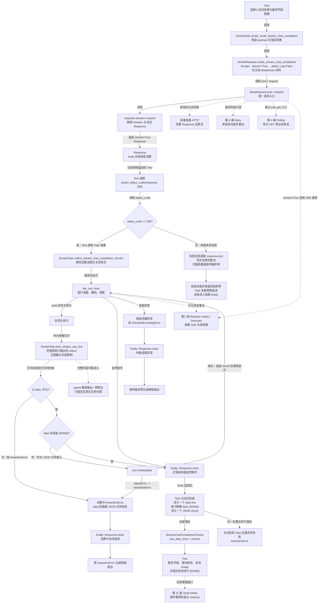

# 第 10 课：SSE 是边接收边处理

> 本课承接第 9 课的 Polling，展开另一种长响应模式：一次 HTTP 连接返回流式 Response，上层逐行消费 SSE 数据，区分正常结束、数据合同错误、传输中断和主动停止；同时分清消费函数 `try/finally` 内的关闭保证与当前仍存在的前置关闭缺口。TestContext、Runner 和 Quality 内部实现继续保持折叠。

## 1. 课程信息

| 项目 | 内容 |
| --- | --- |
| 建议时长 | 60～90 分钟 |
| 核心问题 | 为什么流式响应不能像普通 JSON 一样一次读取？ |
| 讲解重点 | `stream=True`、逐行消费、`data:`、`[DONE]`、异常出口、Response 关闭责任 |
| 真实业务切片 | `test_stream_chat_completions_chunk_fields` |
| 代码入口 | `common/streaming.py`、`module/smoke/request.py`、`module/smoke/task.py` |
| 轻量验证 | `tests/test_stream_fault_simulation.py` |
| 安全边界 | 只使用内存中的 `FakeStreamResponse`，不访问真实模型接口 |
| 课后产出 | 增加普通 HTTP 与 SSE 两条分支，并完成三分钟复述 |

### 1.1 学完本课，你应该能够

1. 区分普通 JSON、Polling 和 SSE 的连接与消费方式。
2. 沿真实调用链解释 `stream=True` 怎样让 Response 先返回、body 再被逐行消费。
3. 说明 `iter_sse_lines()`、SmokeTask 和 Test 各自拥有的职责。
4. 区分正常 `[DONE]`、数据合同错误、传输中断、主动停止和非 2xx Response。
5. 解释消费函数为什么使用 `finally` 关闭 Response，并指出当前两个尚未进入 `try/finally` 的关闭缺口。

### 1.2 本课刻意不展开

- 不展开完整 SSE 标准中的 `event`、`id`、`retry`、注释和多行事件拼接；当前框架只是逐行消费。
- 不设计通用 SSE 业务错误 Schema；当前 Smoke 切片没有自动识别任意 `{"error": ...}` 数据块。
- 不展开 Runtime Hooks、Semantic、首包时间和 Token 用量聚合；第三周学习。
- 不展开 TestContext；第 11 课学习。
- 不展开 BaseTask 与 Capability；第 12 课学习。
- 不展开 Runner、JUnit 与 Allure；第 13～14 课学习。
- 不执行真实流式模型请求，不消耗 API 配额。

### 1.3 课堂必讲路径

| 环节 | 对应章节 | 建议时间 |
| --- | --- | ---: |
| 三种响应模式与认知障碍 | 第 2～4 节 | 8～10 分钟 |
| 真实调用链与请求阶段 | 第 5～7 节 | 14～16 分钟 |
| 逐行消费、解析与关闭 | 第 8～12 节 | 22～25 分钟 |
| 五类出口与离线证据 | 第 13～15 节 | 12～15 分钟 |
| 活动 A/B 二选一、总图、复述和验收 | 第 16～20、23 节 | 9～12 分钟 |
| 缓冲与提问 | 全课 | 5 分钟 |

总计约 70～83 分钟。课堂活动 A/B 二选一，默认选择更贴近本课约束的活动 A；第 15 节命令不额外计时，第 14.3 节可选讲。

### 1.4 课堂最短路径

```text
第 2～4 节：分清普通 JSON、Polling 与 SSE
-> 第 5～7 节：沿真实链路观察 stream=True
-> 第 8～12 节：追踪 line、chunk、[DONE] 与 close
-> 第 13、16 节：判断五类出口和关闭责任
-> 第 18、20、23 节：更新总图、复述、验收
```

---

## 2. 承接第九课：Polling 与 SSE 都在“等”，但不是同一种等待

### 2.1 普通 JSON

```text
一次 HTTP 请求
-> 等待完整响应体
-> response.json()
-> 一次性得到完整对象
```

普通 JSON 像收一封完整邮件。信没有收完时，调用方还不能读取完整正文。

### 2.2 Polling

```text
GET 状态 1 -> pending
-> 等待
-> GET 状态 2 -> pending
-> 等待
-> GET 状态 3 -> success
```

Polling 是多次独立 HTTP 查询。每个 Response 都是一个相对完整的状态快照。

### 2.3 SSE

```text
一次 HTTP 连接
-> Response headers 已到达
-> data line 1
-> data line 2
-> ...
-> data: [DONE]
```

SSE 更像听直播。连接已经建立，不代表节目已经播完；调用方必须持续接收片段。

### 2.4 三者的最小区别

| 模式 | HTTP 请求次数 | body 消费方式 | 正常结束依据 |
| --- | ---: | --- | --- |
| 普通 JSON | 1 | 完整读取 | 完整 body 已取得 |
| Polling | 多次 | 每次读取完整状态 Response | 业务状态进入终态 |
| SSE | 1 | 在同一 Response 上逐行读取 | 当前业务协议的终止标记 |

本课使用的终止标记是：

```text
data: [DONE]
```

它属于当前 Chat Completions 流式合同，不能泛化成所有流式协议都必须使用的标准。

---

## 3. 当前认知障碍与因果链

### 3.1 把“拿到 Response”当成“拿到完整结果”

```text
看到 status_code = 200
-> 误以为响应体已经完整
-> 把流式 Response 当普通 JSON 使用
-> 提前消费整条流或得到不完整结果
```

对 SSE 而言，拿到 Response 只是进入消费阶段。

### 3.2 把 `iter_sse_lines()` 当成完整 SSE 解析器

```text
函数名包含 SSE
-> 误以为它会验证 data、解析 JSON、识别业务错误
-> 上层省略合同判断
-> 非法行或业务错误被当成普通数据
```

当前函数只做逐行读取、UTF-8 解码和流生命周期观察，不拥有领域数据合同。

### 3.3 只在成功路径关闭 Response

```text
close 写在循环之后
-> 中途 JSON 解析失败或网络断开
-> 控制流跳过 close
-> 连接资源不能及时归还
-> 后续用例出现难定位的资源问题
```

因此，进入消费流程后的 close 必须放进 `finally`；是否存在发生在 `try` 之前的前置出口，还要单独审计。

### 3.4 把“15 秒主动停止”理解成硬中断

```text
看到 max_duration_seconds
-> 误以为时钟一到就能打断阻塞读取
-> 忽略检查发生在下一行到达之后
-> 无数据时仍可能等待底层 read timeout
```

当前 `interrupt_stream_chat_completion()` 的时长判断不是后台定时器，也不是硬 deadline。

### 3.5 TOC：本课真正的约束

主要约束不是 JSON 语法，而是所有权不清：

```text
谁创建流？
谁消费行？
谁判断数据合同？
谁保证关闭？
```

解除约束的方法是拆成三个阶段：

```text
Request：取得可消费的 Response
-> helper / Task：逐行消费并解释合同
-> Task：在消费 try/finally 内关闭 Response
-> 单独审计进入 try 之前的前置出口
```

---

## 4. 第一性原理：流式响应是“控制信息先到，业务数据后到”

一个 HTTP 流式调用至少包含两个时间阶段。

### 4.1 阶段一：取得 Response

此时通常已经可以看到：

- HTTP 状态码；
- Response headers；
- 服务端是否接受请求；
- 一个尚待持续消费的 body。

### 4.2 阶段二：消费 Response body

此时才逐步出现：

- 第一条 SSE 数据行；
- 后续 JSON chunk；
- usage chunk；
- 终止标记；
- 或中途传输异常。

所以：

```text
HTTP 2xx
≠ 已经收到完整业务结果
≠ 已经看到 [DONE]
≠ 每个 chunk 都符合数据合同
```

### 4.3 两阶段带来的责任分离

| 阶段 | 核心责任 | 当前代码所有者 |
| --- | --- | --- |
| 发起请求 | 设置路径、headers、`stream=True` | `SmokeRequest` / `BaseRequest` |
| 逐行读取 | 从 Response 取得非空行并解码 | `iter_sse_lines()` |
| 领域解析 | 验证 `data:`、解析 JSON、收集 chunks | `SmokeTask` |
| 最终断言 | 检查 chunk 字段与 usage | Test |
| 资源释放 | 关闭已经进入消费 `try/finally` 的 Response | `SmokeTask` 的 `finally` |

---

## 5. 本课真实业务切片

本课选择：

```text
module/smoke/test_response_body_validation.py
::TestResponseBodyValidation
::test_stream_chat_completions_chunk_fields
```

真实调用链是：

```text
Test
-> SmokeTask.create_small_stream_chat_completion()
-> SmokeRequest.create_stream_chat_completion()
-> BaseRequest.post()
-> BaseRequest.request(stream=True)
-> requests.Session.request()
-> Response
-> Test 先断言 status_code
-> SmokeTask.collect_stream_chat_completion_chunks()
-> SmokeTask.iter_stream_lines()
-> iter_sse_lines()
-> Response.iter_lines()
-> SmokeTask 解析 data 与 JSON
-> finally: Response.close()
-> Test 断言 chunk 字段
```

这里确实经过领域 Request 方法；不能据此推导所有 Task 都必须经过领域 Request。第 6 课已经区分“领域 Request 方法路径”和“Request Client 路径”。

### 5.1 Test 拥有什么

- 发起“小流式响应”场景；
- 先断言 HTTP 200；
- 接收 Task 返回的 chunks；
- 断言每个 chunk 的字段；
- 断言首 chunk 的角色；
- 断言末 JSON chunk 的 usage；
- 断言原始数据行最后是 `data: [DONE]`。

### 5.2 Task 拥有什么

- 构造小流式 payload；
- 委托 SmokeRequest 发请求；
- 逐行消费；
- 把原始 `data:` 行翻译成 JSON chunks；
- 在进入收集函数 `try/finally` 后的所有消费出口关闭 Response。

### 5.3 Request 拥有什么

- 使用 `/v1/chat/completions`；
- 设置 `Accept: text/event-stream`；
- 传入 `stream=True`；
- 传入 `_attach_log=False`；
- 标记 operation name 为 `chat_completion_stream`。

---

## 6. `stream=True` 改变了什么

`SmokeRequest.create_stream_chat_completion()` 的关键调用：

```python
return self.post(
    self.chat_completions_path,
    json=payload,
    headers={"Accept": "text/event-stream"},
    stream=True,
    _attach_log=False,
    _quality_operation_name="chat_completion_stream",
    _quality_traffic_role="workload",
)
```

### 6.1 对 requests 的影响

`stream=True` 让 requests 不在返回 Response 前预先下载完整 body。调用方之后通过 `iter_lines()` 持续消费。

这不是异步 Python，也不会自动开启后台线程：

```text
当前线程调用 next()
-> 等待下一行
-> 得到一行
-> 当前线程继续处理
```

### 6.2 对 RequestContext 的影响

`BaseRequest._build_request_context()` 根据 `stream` 设置协议：

```python
protocol = "sse" if request_kwargs.get("stream") else "http"
```

这是请求事实分类，不是对服务端 Content-Type 的验证。

### 6.3 对运行时观察类型的影响

`BaseRequest.request()` 根据 `stream` 选择：

```text
stream=False -> RuntimeOperationKind.HTTP
stream=True  -> RuntimeOperationKind.SSE
```

当已启用的运行时观察获得 operation 所有权时，成功的 2xx SSE Response 不会在 headers 到达时立即被观察为完整成功，而会把后续流生命周期绑定到 Response。未启用观察时，这条旁路不改变业务控制流。内部机制第三周再展开。

### 6.4 `Accept` 与 `stream=True` 不是一回事

| 设置 | 告诉谁 | 含义 |
| --- | --- | --- |
| `Accept: text/event-stream` | 服务端 | 客户端希望收到 SSE |
| `stream=True` | requests | 不预先消费完整响应体 |

只设置其中一个，都不能完整表达当前调用意图。

---

## 7. 为什么必须使用 `_attach_log=False`

普通响应日志可能读取 Response body 形成附件。流式 body 若在 Request 返回阶段被日志提前读取，就会改变后续 Task 能看到的数据。

当前 LoggingMiddleware 在成功 Response 和请求异常两条路径都检查 `attach_log`：

```python
def after_response(self, context, response):
    if not context.attach_log:
        return
    self.get_logger(context).attach_success(response)

def on_exception(self, context, error):
    if not context.attach_log:
        return
    self.get_logger(context).attach_failure(error)
```

`_attach_log=False` 的准确含义：

```text
跳过 after_response 的成功响应附件
并跳过 on_exception 的请求异常附件
-> 成功路径避免日志阶段提前消费流
```

它只控制 Middleware 附件，不控制后续 Test 或 Task 怎样读取、打印流内容。真实 Test 随后仍会调用普通状态断言；真实 SmokeTask 也仍可能把原始行输出到 stdout。

它不表示：

- 不创建 RequestContext；
- 不执行所有 Middleware；
- 不记录任何请求事实；
- 不向 stdout 输出流内容；
- 不需要上层关闭 Response；
- 不需要 Test 检查状态码。

### 7.1 普通状态断言仍可能提前消费流

真实 Test 在 Task 接管流之前调用：

```python
self.smoke_assertions.assert_status_code(response, 200)
```

公共 `assert_status_code()` 在状态不符时，会把 `response.text` 写入失败消息。对于尚未消费的 `stream=True` Response，这不是只读 headers：

```text
stream=True Response
-> status_code != 200
-> 构造断言消息时读取 response.text
-> 同步消费完整流，可能阻塞或抛传输异常
-> Task 不再拥有原始未消费流
-> 同时尚未进入 Task 的关闭 finally
```

最小内存验证中，`Response._content_consumed` 会从 `False` 变为 `True`。因此流式状态检查不能机械复用会读取完整 `response.text` 的普通响应断言；错误预览应由拥有 Response 生命周期的边界限长、脱敏读取，并在同一个 `try/finally` 中保证关闭。

### 7.2 `_attach_log=False` 不会关闭 SmokeTask 的 stdout 输出

`collect_stream_chat_completion_chunks()` 对每个非空行无条件调用：

```python
self.print_stream_raw_line(line)
```

`print_stream_raw_line()` 直接打印完整原始行，只在控制台编码失败时转义字符，没有敏感信息脱敏或长度限制。主动停止方法虽然提供 `print_raw_lines` 开关，但默认值仍是 `True`。

准确边界是：

```text
_attach_log=False
-> 关闭 LoggingMiddleware 的成功/异常附件
-> SmokeTask 仍可能打印完整 SSE chunk
-> 内容可能进入 pytest 捕获输出或控制台
```

因此“状态码、headers、终态和必要的限长脱敏片段”是流式日志的目标设计，不是当前 SmokeTask 已完全满足的保证。当前实现仍存在原始业务内容进入 stdout 的缺口。

---

## 8. `iter_sse_lines()` 的真实算法

当前顺序：

```text
取得 Response 上的 stream lease
-> response.iter_lines(decode_unicode=False)
-> 跳过空行
-> bytes 使用 UTF-8 解码，非法字节替换
-> 观察这一行
-> 若 line.strip() 等于 data: [DONE]，记录 completed
-> yield 文本行给上层
-> 根据结束方式记录流生命周期
```

### 8.1 它会做什么

- 延迟迭代 Response；
- 跳过空行；
- 把 bytes 转成 str；
- 保留非空行文本；
- 去除行首尾空白后识别 `data: [DONE]`，但仍把未 strip 的文本行 yield 给上层；
- 原样传播读取阶段异常；
- 记录 complete、interrupted 或 error 生命周期。

### 8.2 它不会做什么

- 不验证每行必须以 `data:` 开头；
- 不执行 `json.loads()`；
- 不校验 chunk 字段；
- 不把 `{"error": ...}` 自动转成业务异常；
- 不在看到 `[DONE]` 后主动 break；
- 不关闭 Response；
- 不是完整的通用 SSE event parser。

`yield` 表示控制权在每一行处交回调用方。调用方可以继续、停止或抛异常。

### 8.3 为什么 helper 不关闭 Response

helper 不知道调用方是否：

- 消费到 `[DONE]`；
- 只读取前几行；
- 还需要读取 headers；
- 要在多个步骤间传递 Response。

所以它拥有“迭代生命周期”，但不拥有 Response 资源。谁组织完整消费流程，谁负责最终关闭。

---

## 9. SmokeTask 怎样把 line 翻译成 chunk

`collect_stream_chat_completion_chunks()`：

```text
初始化 raw_data_lines 与 chunks
-> for line in iter_stream_lines(response)
-> 断言 line 以 data: 开头
-> 保存原始 data line
-> 去掉 data: 并 strip
-> 是 [DONE]：break
-> 否则 json.loads(data)
-> 保存 JSON chunk
-> finally 关闭 Response
-> 断言至少有一条 data line
-> 断言最后一条精确为 data: [DONE]
-> 断言 [DONE] 前至少有一个 JSON chunk
```

### 9.1 原始行与 JSON chunk 是两个对象

```text
原始行：
data: {"id":"chatcmpl-001","choices":[]}

去掉前缀后的 data：
{"id":"chatcmpl-001","choices":[]}

解析后的 chunk：
{"id": "chatcmpl-001", "choices": []}
```

`raw_data_lines` 证明协议行与终止标记；`chunks` 用于 JSON 字段断言。

### 9.2 `[DONE]` 不是 JSON

Task 在 `json.loads()` 前判断：

```text
data == "[DONE]"
-> break
```

若顺序反过来，`json.loads("[DONE]")` 会失败。

### 9.3 当前 Smoke 合同比通用 helper 更窄

通用 helper 会产出所有非空行；SmokeTask 明确拒绝：

```text
event: message
```

因为当前业务切片只接受 `data:` 行。这是领域合同，不是对整个 SSE 标准的定义。

---

## 10. `[DONE]` 的三个边界

### 10.1 helper 观察完成与业务行合同通过不是一回事

helper 与 SmokeTask 使用两层不同规则：

```text
helper 生命周期观察：
line.strip() == "data: [DONE]"
-> 标记 completed

SmokeTask 业务行合同：
raw_data_lines[-1] == "data: [DONE]"
-> 原始末行必须精确相等
```

例如带尾部空白的终止行可能已让 helper 观察到生命周期完成，却仍不能通过 SmokeTask 的原始末行精确合同；带前导空白的行还会更早违反 `line.startswith("data:")`。两种“完成”不能混用。

### 10.2 它不会自动关闭 Response

```text
识别 [DONE]
-> 上层停止消费
-> finally
-> response.close()
```

### 10.3 它不能替代 chunk 合同

看到 `[DONE]` 不能证明：

- 前面每行都是合法 JSON；
- chunk 字段齐全；
- usage 一定存在；
- 服务端业务结果正确。

因此 Task 先解析，Test 再断言字段。

---

## 11. Response 关闭责任

当前正确结构：

```python
try:
    for line in iter_sse_lines(response):
        ...
finally:
    response.close()
```

### 11.1 为什么不能只在循环后 close

以下出口都会跳过普通顺序中的下一行：

- 非 `data:` 行触发 AssertionError；
- JSON chunk 非法；
- `iter_lines()` 抛 ChunkedEncodingError；
- KeyboardInterrupt；
- 未来增加的领域断言失败。

`finally` 能覆盖进入该 `try` 之后的这些消费出口；它不能覆盖在 `try` 之前已经抛出的异常。

### 11.2 `SmokeRequest.close()` 不能替代 `response.close()`

前者关闭 Session；本课关注当前流式 Response 的及时释放。把未关闭 Response 留到 teardown：

- 延长连接占用时间；
- 模糊资源所有者；
- 让异常路径依赖外层清理时机。

### 11.3 关闭不等于业务成功

`close()` 是资源动作。只要控制流已经进入当前消费函数的 `try/finally`，成功、断言失败、传输中断和主动停止都会执行 close。

### 11.4 当前两个前置关闭缺口

当前源码尚不能宣称“全链路所有出口均关闭 Response”：

1. 真实 Test 在调用 `collect_stream_chat_completion_chunks()` 前断言状态码；非 2xx 时，公共断言为构造失败消息读取完整 `response.text`，会提前消费流并可能阻塞或抛传输异常，但此时仍未进入收集函数的 `try/finally`。
2. `interrupt_stream_chat_completion()` 在进入 `try/finally` 前调用 `get_request_id_from_response()`；缺少 request-id header 时先抛 AssertionError，同样不会执行该方法的 `finally`。

本课把它们标为当前实现缺口，而不是把期望规范写成既有保证。第一处还意味着 Task 尚未接管 Response，而 Response 在断言失败点已经被提前消费。若要宣称全出口关闭，需要让资源所有者在同一个 `try/finally` 中执行适合流的状态检查、限长脱敏错误预览与关闭，并补充对应测试。

---

## 12. 主动停止不是硬 deadline

`interrupt_stream_chat_completion()` 的时间检查位置：

```text
先从 iter_stream_lines 得到下一行
-> 再计算 elapsed
-> elapsed >= max_duration_seconds 时 break
```

所以 `max_duration_seconds` 只在“下一行已经到达”时被检查。

若服务端长时间不发任何行，当前方法不能凭自己的计时器强制打断阻塞读取。底层 requests timeout 仍决定连接和读等待边界。

当前主动停止方法的实际顺序是：

- 在 `try/finally` 前读取 request_id；
- request-id 读取成功后才进入消费 `try`；
- 可选择打印原始行；
- 达到条件后 break；
- 在消费 `try/finally` 中关闭 Response；
- 返回 request_id。

它不承诺消费到 `[DONE]`，因此主动中止不等于完整流成功。若 request-id 缺失，异常发生在进入 `try/finally` 之前，当前代码没有关闭保证。

---

## 13. 五类结果出口不能合并

### 13.1 正常完整流

条件：

- HTTP 状态符合 Test 预期；
- 每个业务数据行以 `data:` 开头；
- `[DONE]` 前的数据都是合法 JSON；
- 至少有一个 JSON chunk；
- 最后一条原始行精确为 `data: [DONE]`。

出口：

```text
返回 StreamChatCompletionChunks
-> Test 继续断言字段
```

### 13.2 非 2xx Response

`stream=True` 不会让非 2xx 自动变成 Python 异常。`BaseRequest` 仍返回 Response，Test 或领域层需根据状态码和错误合同判断。

真实 Test 在消费前执行：

```python
self.smoke_assertions.assert_status_code(response, 200)
```

若状态断言在消费函数外失败，公共断言会先读取完整 `response.text` 形成错误消息。该读取会同步消费流，可能阻塞或抛出传输异常；Task 因而失去原始未消费流，同时它的 `finally` 尚未进入。当前用例的 teardown 会关闭 Session，但这不能证明当前 Response 已在失败点被及时显式关闭，也不是推荐的通用资源模板。

新流式场景应让状态检查与消费处于同一个拥有 close 的边界。非 2xx 错误预览应限长并脱敏，不能直接照搬读取完整 `response.text` 的普通响应断言。

### 13.3 数据合同错误

包括：

- 非 `data:` 行；
- `data:` 后不是合法 JSON；
- 流自然耗尽但缺少 `[DONE]`；
- 没有 data line；
- `[DONE]` 前没有 JSON chunk。

出口：

```text
AssertionError
-> finally close Response
```

### 13.4 传输中断

例如 `Response.iter_lines()` 抛出：

```text
requests.exceptions.ChunkedEncodingError
```

当前实现不包装它：

```text
原始传输异常继续抛出
-> finally close Response
```

### 13.5 主动停止

request-id 已成功取得并进入消费 `try` 后，调用方基于时长主动 break：

```text
未要求 [DONE]
-> finally close Response
-> 返回当前方法约定的结果
```

主动停止是受控的不完整消费，不等于传输报错，也不等于完整成功。

### 13.6 2xx 流内业务错误的当前边界

若服务在 2xx SSE 中发送：

```text
data: {"error":{"code":"MODEL_ERROR"}}
```

当前 helper 只产出文本，SmokeTask 只把它解析成 dict。是否属于业务失败，必须由领域 Task 或 Assertions 明确定义。

本课只判断职责落点，不要求设计新错误 Schema。

---

## 14. 流生命周期的最小观察边界

本节只解释 `iter_sse_lines()` 暴露的结果名称，不展开第三周采集与指标。

| 结束方式 | helper 观察结果 | 业务控制流 |
| --- | --- | --- |
| 某行 strip 后等于 `data: [DONE]`，随后结束 | complete | 上层仍需检查原始行合同 |
| 未见 `[DONE]` 就自然耗尽 | interrupted | SmokeTask 再抛缺少终止标记的 AssertionError |
| 消费者提前关闭迭代器 | interrupted | 主动停止或提前退出 |
| `iter_lines()` 抛普通异常 | error | 原异常继续抛出 |
| KeyboardInterrupt / SystemExit | interrupted | 原控制异常继续抛出 |

### 14.1 helper 观察不能替代业务断言

`complete` 只说明 helper 看见终止标记，不说明所有 chunk 字段正确。

### 14.2 观察回调是 fail-open

`common.runtime_hooks` 的观察调用通过安全包装执行；观察失败不应改变行产出和原始业务异常。这一机制第三周再展开。

### 14.3 未消费 Response（选讲）

启用并拥有该 operation 的运行时观察时，成功取得 SSE Response 后若完全不调用 helper，用例收口会把它视为未消费，而不是成功。本课只保留名称，不展开产物。

---

## 15. 轻量验证：6 条离线故障模拟

### 15.1 为什么安全

`tests/test_stream_fault_simulation.py` 使用 `FakeStreamResponse`：

- 行数据来自内存列表；
- `iter_lines()` 由测试对象提供；
- 中断异常由测试主动注入；
- `close()` 只把 `closed` 设为 True；
- 不创建网络连接；
- 不需要真实 API Key。

### 15.2 安全命令

```powershell
$hadDotenvPath = Test-Path Env:API_CASE_DOTENV_PATH
$previousDotenvPath = $env:API_CASE_DOTENV_PATH
$hadQualityEnable = Test-Path Env:QUALITY_ENABLE
$previousQualityEnable = $env:QUALITY_ENABLE
$pytestExitCode = 1
$evidenceRoot = $null
try {
  $env:API_CASE_DOTENV_PATH = (Resolve-Path -LiteralPath '.env.example' -ErrorAction Stop).Path
  $env:QUALITY_ENABLE = '0'
  $evidenceRoot = Join-Path ([System.IO.Path]::GetTempPath()) ('api-case-lesson10-' + [guid]::NewGuid().ToString('N'))
  New-Item -ItemType Directory -Path $evidenceRoot -ErrorAction Stop | Out-Null
  & .\.venv\Scripts\python.exe -m pytest tests/test_stream_fault_simulation.py --basetemp "$evidenceRoot\pytest-temp" --alluredir "$evidenceRoot\allure-results" -p no:cacheprovider -q
  $pytestExitCode = $LASTEXITCODE
}
finally {
  if ($hadDotenvPath) {
    $env:API_CASE_DOTENV_PATH = $previousDotenvPath
  }
  else {
    Remove-Item Env:API_CASE_DOTENV_PATH -ErrorAction SilentlyContinue
  }
  if ($hadQualityEnable) {
    $env:QUALITY_ENABLE = $previousQualityEnable
  }
  else {
    Remove-Item Env:QUALITY_ENABLE -ErrorAction SilentlyContinue
  }
}
if ($null -ne $evidenceRoot) {
  Write-Host "Lesson evidence: $evidenceRoot"
}
if ($pytestExitCode -ne 0) {
  throw "Lesson 10 offline tests failed with exit code $pytestExitCode"
}
```

### 15.3 当前结果

```text
6 passed
```

### 15.4 证明范围

当前测试明确验证：

- 合法流能收集两个 JSON chunks 和 `[DONE]`；
- 非法 JSON chunk 抛 AssertionError；
- 非 `data:` 行抛 AssertionError；
- 缺少 `[DONE]` 抛 AssertionError；
- 中途 ChunkedEncodingError 保留原异常；
- 主动时长分支能返回 request_id；
- 在六条测试各自给定的前置条件下，进入消费 `try/finally` 后的 Response 最终关闭。

### 15.5 不能证明什么

这些测试不证明：

- 真实 SSE 服务一定遵守当前合同；
- `Accept` 一定换来正确 Content-Type；
- 真实网络中断类型只有 ChunkedEncodingError；
- `max_duration_seconds` 是硬 deadline；
- 2xx 流内业务错误会被自动识别；
- Runtime Hooks、Semantic 和 usage 指标全部正确；
- 真实模型字段、计费或 Token 用量一定正确；
- 非 2xx 状态断言失败时 Response 会被及时关闭；
- 缺少 request-id header 时 `interrupt_stream_chat_completion()` 会关闭 Response。

`tests/quality/test_semantic_streaming.py` 是后续课程证据，本课不纳入必讲实践。

---

## 16. 课堂活动 A：预测出口与关闭动作（推荐，A/B 二选一）

先填写“出口”和“是否 close”。

| 场景 | 输入 | 预测出口 |
| --- | --- | --- |
| A | 合法 JSON、usage、`data: [DONE]` | ？ |
| B | `event: message` | ？ |
| C | `data: not-json` | ？ |
| D | 一个合法 chunk 后连接中断 | ？ |
| E | 一个合法 chunk 后自然结束，无 `[DONE]` | ？ |
| F | request-id 存在，随后达到主动停止条件 | ？ |

### 16.1 参考答案

| 场景 | 出口 | Response |
| --- | --- | --- |
| A | 返回 chunks，Test 继续断言 | close |
| B | 非 data 行 AssertionError | close |
| C | 非法 JSON AssertionError | close |
| D | 原 ChunkedEncodingError | close |
| E | 缺少 `[DONE]` 的 AssertionError | close |
| F | 主动 break，返回 request_id | close |

这张表讨论的都是已经进入消费 `try/finally` 的场景。另加两道缺口判断：非 2xx 状态断言发生在收集函数前、request-id 缺失发生在主动停止方法的 `try` 前，当前两者都没有局部 close 保证。

活动中的局部约束：

```text
进入消费 try/finally 后，出口可以不同，close 不能缺席
```

---

## 17. 课堂活动 B：职责归位（备选，A/B 二选一）

把动作放到 Test、Task、Request 或 helper：

1. 设置 `Accept: text/event-stream`。
2. 调用 `Response.iter_lines()`。
3. 验证 chunk 包含 `id`、`object`、`choices`。
4. 把 `data:` 后的文本执行 `json.loads()`。
5. 无论异常与否都关闭 Response。
6. 设置 `stream=True`。
7. 跳过空行并执行 UTF-8 解码。

### 17.1 参考归位

| 动作 | 当前落点 |
| --- | --- |
| Accept header、`stream=True` | SmokeRequest |
| `Response.iter_lines()` | `iter_sse_lines()` |
| 跳过空行与 UTF-8 解码 | `iter_sse_lines()` |
| `json.loads()` | SmokeTask |
| `finally response.close()` | SmokeTask |
| chunk 字段断言 | Test |

活动只判断落点，不展开 Runtime Hooks 或质量机制。

---

## 18. 第十版累积链路总图

本图展开真实 Smoke SSE 切片。普通 HTTP、Retry 和 Polling 保持前课结论但折叠展示；Runtime Hooks 仅保留后续接口。图中同时保留当前两个实现缺口：普通状态断言可能提前消费流，SmokeTask 会把完整原始行输出到 stdout。



### 18.1 图中的三类线

- SSE 主链使用实线；边标签明确区分函数调用、对象返回/输入和控制分支，不能仅凭箭头猜关系。
- 已学但不属于当前切片主链的 Retry、Polling 使用虚线条件边。
- Runtime Hooks 与 TestContext 使用虚线，表示观察或后续课程接口。

### 18.2 Response 不是完整结果

Response 节点明确标注 body 尚待消费。只有消费、终止标记和字段断言都完成后，Test 才可能通过。

### 18.3 HTTP 状态失败的资源边界

真实 Test 在 Task 收集函数外断言状态码。非 2xx 时，普通断言会读取完整 `response.text`，同步消费流并可能阻塞或抛传输异常；此时 Task 的 `finally` 尚未进入。新场景应让拥有 Response 的边界同时拥有适合流的状态检查、限长脱敏错误预览与 close，不能机械照抄。

主动停止分支还有第二个同类缺口：request-id 提取发生在该方法的 `try/finally` 之前。总图未把这条备选业务分支画成 SSE 收集主链，但关闭审计必须同时覆盖它。

### 18.4 Middleware 附件与 stdout 是两条记录路径

`_attach_log=False` 只让 LoggingMiddleware 跳过成功响应与请求异常附件。当前 SmokeTask 的主收集方法仍无条件打印每条非空原始行，因此完整 chunk 仍可能进入 pytest 捕获输出或控制台。

---

## 19. 常见误区

### 误区一：`stream=True` 表示异步执行

不是。当前代码仍在当前线程同步等待并逐行处理。

### 误区二：拿到 200 就表示流成功

200 只说明 headers 阶段成功；完整流还需要合法 chunks 和 `[DONE]`。

### 误区三：`Accept` 会让 requests 自动逐行

Accept 给服务端；客户端仍需 `stream=True` 和显式迭代。

### 误区四：helper 会解析 JSON

不会。JSON 解析属于 SmokeTask。

### 误区五：helper 看见 `[DONE]` 会自动停止

不会。它标记完成后仍 yield，由上层决定 break。

### 误区六：`[DONE]` 是 JSON chunk

不是。Task 在 JSON 解析前单独处理。

### 误区七：缺少 `[DONE]` 属于传输异常

当前 Smoke 合同把它作为 AssertionError；自然耗尽不一定抛 requests 异常。

### 误区八：非法 JSON 与 ChunkedEncodingError 是同一失败

前者是数据合同错误，后者是传输读取错误。

### 误区九：进入消费函数后，close 只属于成功路径

进入消费 `try/finally` 后的成功、合同失败、传输中断和主动停止都会 close；状态断言和 request-id 提取这两个前置出口是当前缺口。

### 误区十：`_attach_log=False` 表示所有日志与观察关闭

它同时跳过 `after_response()` 的成功响应附件和 `on_exception()` 的请求异常附件，但不关闭运行时观察、其他 Middleware，也不阻止 SmokeTask 把完整原始行打印到 stdout。关闭附件不等于流内容不会进入 pytest 捕获输出或控制台。

### 误区十一：`max_duration_seconds=15` 能在第 15 秒强制打断 socket

当前检查发生在下一行到达之后，不是硬中断器。

### 误区十二：任意 `{"error": ...}` chunk 都会自动失败

当前没有这条通用规则，需要领域合同。

### 误区十三：Session teardown 会清理，所以 Task 不必 close

流式 Response 应在消费边界及时关闭。

### 误区十四：当前 SmokeTask 支持完整 SSE 标准

它只接受非空 `data:` 行，不处理通用 event/id/retry 和多行事件。

---

## 20. 三分钟复述

```text
普通 JSON、Polling 和 SSE 是三种响应形态。普通 JSON 用一次请求等待完整 body；Polling 用多次独立 GET 等业务终态；SSE 只建立一次 HTTP 连接，在同一个 Response 上持续接收数据行。

真实链路从 Test 进入 SmokeTask.create_small_stream_chat_completion，再到 SmokeRequest.create_stream_chat_completion、BaseRequest.post/request 和 requests.Session.request。SmokeRequest 同时设置 Accept: text/event-stream、stream=True 和 _attach_log=False。Accept 告诉服务端期望 SSE；stream=True 告诉 requests 不提前下载完整 body；_attach_log=False 同时跳过成功响应附件和请求异常附件，运行时观察与其他 Middleware 仍执行。

拿到 Response 只表示 headers 阶段完成。Test 先检查 HTTP 状态，随后 SmokeTask 调用 iter_sse_lines。当前普通状态断言在非 2xx 时会读取完整 response.text 构造错误消息，可能同步消费或阻塞流、抛传输异常，而且尚未进入 Task 的关闭 finally；流式错误预览应由资源所有者限长、脱敏读取并保证关闭。

helper 跳过空行、按 UTF-8 解码、产出原始行并观察生命周期，但不验证 data 前缀、不解析 JSON、不判断领域错误，也不关闭 Response。_attach_log=False 只关闭 Middleware 附件；当前 SmokeTask 仍会把完整原始行打印到 stdout，尚未实现脱敏和长度限制。

helper 使用 line.strip() 识别 data: [DONE] 并观察生命周期完成，但 yield 的仍是原始文本行。SmokeTask 验证 data 前缀，保存原始行，去掉前缀；遇到 [DONE] 就停止，否则执行 json.loads 并收集 chunk。结束后还要求原始末行精确等于 data: [DONE]，并且此前至少有一个 JSON chunk。helper 的完成观察不等于业务行合同通过。

完整流返回 chunks；非 data、非法 JSON 和缺少 [DONE] 抛 AssertionError；iter_lines 中断保留原传输异常；主动停止是不完整但受控的消费。进入消费函数 try/finally 后，这些出口都会关闭 Response。但真实 Test 的前置状态断言和主动停止方法的前置 request-id 提取不在局部 try 内，是当前两个关闭缺口。

当前主动停止只在下一行到达后检查时间，不是硬 deadline。当前代码也不会自动把 2xx 流中的 error 对象识别为业务失败；这需要领域规则。
```

---

## 21. 课堂小测

1. SSE 与 Polling 的请求次数有何不同？A 都是多次 / B SSE 通常一次连接，Polling 多次请求（B）
2. `stream=True` 会启动后台线程吗？A 会 / B 当前代码不会（B）
3. 谁执行 `json.loads()`？A helper / B SmokeTask（B）
4. helper 看见 `[DONE]` 后自己 break 吗？A 是 / B 否（B）
5. 非 `data:` 行是什么出口？A 忽略 / B AssertionError（B）
6. ChunkedEncodingError 会包装成 AssertionError 吗？A 会 / B 保留原异常（B）
7. 哪些路径已有局部 close 保证？A 所有全链路出口 / B 进入消费 try/finally 后的出口（B）
8. `_attach_log=False` 跳过什么？A 所有 Middleware / B 成功响应附件和请求异常附件（B）
9. `max_duration_seconds` 是硬 socket deadline 吗？A 是 / B 否（B）
10. `data: {"error": ...}` 会自动变成业务异常吗？A 会 / B 不会（B）
11. helper 与 SmokeTask 对终止行使用同一条精确规则吗？A 是 / B 否，前者先 strip，后者检查原始末行（B）
12. 非 2xx 流式 Response 经过当前普通状态断言后，body 仍保证未消费吗？A 保证 / B 不保证，失败消息会读取 `response.text`（B）
13. `_attach_log=False` 能阻止 SmokeTask 将原始 chunk 输出到 stdout 吗？A 能 / B 不能（B）

---

## 22. 课后作业：完成 SSE 分支图，不写代码

### 22.1 必做内容

1. 在第十版图中保留 Request、Response、逐行消费、`[DONE]`、异常出口和 `finally close`，并标明调用、对象流与控制分支。
2. 为合法流、非 2xx 状态、非法 JSON、传输中断、缺少 `[DONE]`、主动停止填写消费结果、出口与关闭动作。
3. 完成一次三分钟因果链复述。

### 22.2 不要求完成

- 不调用真实流式模型。
- 不实现新 SSE parser。
- 不设计业务错误 Schema。
- 不展开 Runtime Hooks 或 Semantic。
- 不修改 SmokeTask。
- 不提交长篇源码抄录。

---

## 23. 验收标准

完成本课后，应能回答：

1. 普通 JSON、Polling 和 SSE 的最小区别是什么？
2. 为什么拿到 200 Response 不等于完整流成功？
3. `Accept` 与 `stream=True` 分别作用于谁？
4. `_attach_log=False` 防止什么问题，又不能阻止哪条 stdout 输出路径？
5. 本课真实 SSE 调用链经过哪些方法？
6. `iter_sse_lines()` 做什么、不做什么？
7. 原始 data line 与 JSON chunk 有何区别？
8. 为什么先判断 `[DONE]`，再执行 `json.loads()`？
9. 非 data、非法 JSON、缺少 `[DONE]` 是什么出口？
10. ChunkedEncodingError 为什么保留原异常？
11. 为什么 Response 必须在 `finally` 中关闭？
12. 主动停止与完整成功有什么区别？
13. 为什么 `max_duration_seconds` 不是硬 deadline？
14. 2xx 流内业务错误当前由谁定义？
15. 当前 SmokeTask 为什么不是完整 SSE 标准解析器？
16. helper 的完成观察与 SmokeTask 的原始末行合同有何不同？
17. 为什么当前普通状态断言不适合直接作为非 2xx 流式响应的错误预览？

合格复述必须包含：

- 一次连接与逐行消费；
- Response headers 与完整 body 的两阶段；
- Request、helper、Task、Test 的职责；
- `data:`、JSON chunk 与 `[DONE]`；
- 正常、合同失败、传输中断和主动停止；
- 消费 `try/finally` 内的关闭保证与两个前置缺口；
- 非 2xx 普通断言读取 `response.text` 的提前消费风险；
- Middleware 附件开关与 SmokeTask stdout 原始行输出是两条独立路径；
- 当前业务错误和主动停止时间边界。

---

## 24. 下一课接口

本课解决“一条流怎样从开始消费到可靠关闭”。复杂用例常常不止一步：

```text
步骤一取得 request_id
-> 步骤二使用 request_id 查询或删除资源
-> 测试结束时执行清理
```

如果把这些值放进模块全局变量，或依赖用例顺序，并发时就会互相污染。第 11 课引入 TestContext：

```text
Response
-> 提取变量到 TestContext
-> 后续 Task / Request 读取变量
-> 测试结束按 LIFO 执行 cleanup
```

TestContext 是一次测试的资料袋，不是每个 Request 的固定管线节点。
