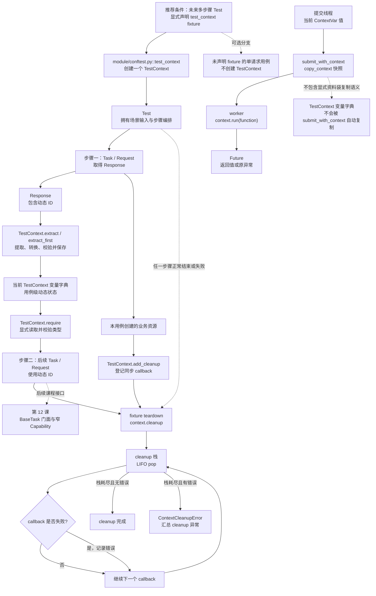

# 第 11 课：TestContext 是一次测试的资料袋

> 本课承接第 10 课：一次 SSE 流已经能够被消费并关闭，但真实业务常常需要把前一步产生的 request ID、task ID、资源 ID 和清理动作交给后续步骤。TestContext 提供可选的用例级变量容器与清理栈；它包围多步骤业务流程，但不是每次 Request 的固定处理节点。

## 1. 课程信息

| 项目 | 内容 |
| --- | --- |
| 建议时长 | 60～90 分钟 |
| 核心问题 | 前一步产生的 ID、资源和清理动作，怎样安全交给后续步骤？ |
| 讲解重点 | 用例级所有权、提取漏斗、缺失与空值、LIFO cleanup、ContextVar 传播边界 |
| 代码入口 | `common/test_context.py`、`common/context_executor.py`、`module/conftest.py` |
| 轻量验证 | `tests/test_test_context.py`、`tests/quality/test_quality_context_executor.py`，共 34 条 |
| 安全边界 | 只使用内存 Response、临时文件和线程池，不访问真实 API |
| 课后产出 | TestContext 生命周期图、cleanup 顺序表和三分钟复述 |

### 1.1 学完本课，你应该能够

1. 解释 TestContext 为什么是可选的用例级容器，而不是 Request 管线节点。
2. 使用 `set/get/require/extract` 描述动态值的保存、提取和读取。
3. 区分“未匹配、默认值、转换值”和实际已保存变量的当前语义。
4. 解释 cleanup 为什么按 LIFO 执行，以及多个 cleanup 失败怎样继续执行后汇总。
5. 区分显式 TestContext 对象与 ContextVar 快照，并说明线程池为什么使用 `submit_with_context()`。

### 1.2 本课刻意不展开

- 不把 TestContext 加入所有 Test → Task → Request 调用链。
- 不设计跨用例共享状态；跨用例依赖本身应被拆除。
- 不展开异步 cleanup；当前 cleanup 回调是同步调用。
- 不展开真实资源删除接口、账单结算或外部数据恢复。
- 不展开 Runtime Hooks、Quality 产物和 ContextVar 的内部变量清单；第三周学习。
- 不展开 BaseTask 与 Capability 的委托结构；第 12 课学习。
- 不展开 Runner 的并发池与串行池；第 13 课学习。

### 1.3 课堂必讲路径

| 环节 | 对应章节 | 建议时间 |
| --- | --- | ---: |
| 问题、约束与 fixture 所有权 | 第 2～5 节 | 8～10 分钟 |
| 变量与提取主流程 | 第 6～10.3 节，不含 9.5 | 18～22 分钟 |
| cleanup 主流程 | 第 13～14.3 节 | 13～16 分钟 |
| ContextVar 基本边界 | 第 16.1～16.3、16.5 节 | 7～9 分钟 |
| 离线证据、活动、总图与课堂验收 | 第 17～19、21、24.1 节 | 12～15 分钟 |
| 缓冲与提问 | 全课 | 5 分钟 |

总计约 63～77 分钟。第 9.5、10.4、11、12、14.4、15.3～15.4、16.4 节改为选讲或课后阅读，不进入必讲时间；第 17 节命令不额外计时。

### 1.4 课堂最短路径

```text
第 2～5 节：建立“一个用例一个资料袋”
-> 第 6～10.3 节：走通 Response 提取、存储、读取
-> 第 13～14.3 节：预测 LIFO 与失败汇总
-> 第 16.1～16.3、16.5 节：分开 TestContext 与 ContextVar
-> 第 18、19、21、24.1 节：活动、条件模式图、复述、验收
```

课堂只要求掌握主干。null 特殊分支、`extract_first()` 回退细节、脱敏实现、共享实例与进程隔离等内容保留为教师答疑和课后查阅，避免按全文逐行讲授。

---

## 2. 承接第十课：拿到 ID 之后，流程还没有结束

第 10 课的流式调用可以拿到 request ID；异步任务也会返回 task ID。后续步骤可能需要：

```text
创建资源
-> 提取 resource_id
-> 使用 resource_id 查询
-> 使用 resource_id 做断言
-> 测试结束删除资源
```

如果只用局部变量，短流程完全够用：

```python
resource_id = response.json()["id"]
result = task.query_resource(request_client, resource_id)
```

TestContext 不是为了替代所有局部变量。只有当一个用例存在多步骤传值、多个候选来源或统一 cleanup 时，它才提供额外价值。

### 2.1 错误做法：模块全局变量

```text
用例 A 写 global task_id
-> 用例 B 或并发 worker 覆盖
-> 用例 A 读取到别人的 ID
-> 查询或删除错误资源
```

### 2.2 错误做法：依赖用例顺序

```text
test_create 先运行
-> test_query 假设前一用例留下资源
-> 并发、重跑或单独 nodeid 执行
-> 前置状态不存在
```

一个测试用例必须拥有自己的输入、动态状态和清理动作，不能把另一个用例当隐式 fixture。

---

## 3. 当前认知障碍与因果链

### 3.1 把 TestContext 画进每次 Request

```text
看到“测试上下文”
-> 误以为所有请求都必须经过它
-> 把可选状态容器画成固定中间件
-> 单请求用例也被迫增加无意义节点
```

TestContext 由 Test 显式使用；BaseRequest 不调用它。

### 3.2 把缺失、空值和 null 当成一件事

```text
提取结果都是“看起来没内容”
-> 无法区分字段不存在、空字符串、空列表和 JSON null
-> 默认值与 required 判断失真
-> 后续步骤拿到错误语义
```

当前实现对这些值有明确但不同的规则。

### 3.3 把 cleanup 当普通顺序列表

```text
先创建父资源，再创建子资源
-> 按登记顺序先删父资源
-> 子资源仍依赖父资源
-> 清理失败或留下残留
```

cleanup 是栈，不是队列。

### 3.4 把 TestContext 与 ContextVar 混成同一个机制

```text
看到“context”
-> 以为 submit_with_context 会复制 TestContext 字典
-> worker 没有显式接收资料袋
-> 动态业务变量仍然不可用
```

`submit_with_context()` 传播 ContextVar 快照；TestContext 仍是普通 Python 对象。

### 3.5 TOC：本课真正的约束

本课主要约束是“状态没有明确所有者”：

```text
动态值属于谁？
cleanup 属于谁？
线程池中的运行身份属于谁？
```

解除约束需要三条独立规则：

```text
动态业务值 -> 当前 TestContext 实例
业务资源清理 -> 当前 TestContext cleanup 栈
隐式运行上下文 -> 提交时的 ContextVar 快照
```

---

## 4. 第一性原理：状态必须有范围、所有者和终点

任何测试状态都应回答三个问题。

### 4.1 范围

这个值只属于：

- 当前请求；
- 当前测试用例；
- 当前 worker；
- 还是整个测试运行？

request ID、task ID 和本用例创建的资源 ID 通常属于当前测试用例。

### 4.2 所有者

谁可以创建、读取和删除它？

```text
Test 创建或取得动态值
-> TestContext 保存
-> 同一 Test 的后续步骤显式读取
```

### 4.3 终点

状态何时失效，资源何时清理？

```text
pytest fixture setup 创建 TestContext
-> Test 执行多步骤流程
-> fixture teardown 调用 cleanup
-> 用例生命周期结束
```

没有终点的测试状态会逐渐变成共享污染。

---

## 5. `test_context` fixture：按需创建，不是 autouse

`module/conftest.py`：

```python
@pytest.fixture
def test_context() -> TestContext:
    context = TestContext()
    try:
        yield context
    finally:
        context.cleanup()
```

### 5.1 真实生命周期

```text
Test 函数声明 test_context 参数
-> pytest 调用 fixture
-> 创建新的 TestContext
-> yield 给当前 Test
-> Test 执行
-> 无论 Test 正常还是失败，fixture 进入 finally
-> context.cleanup()
```

### 5.2 它不是 autouse

未声明 `test_context` 参数的用例，不会自动创建 TestContext：

```python
def test_single_request():
    ...
```

需要资料袋时才显式声明：

```python
def test_multi_step(test_context):
    ...
```

### 5.3 fixture 的可用范围

当前 fixture 定义在 `module/conftest.py`，服务于该 pytest 目录树。`tests/test_test_context.py` 对 fixture 的测试是直接驱动其生成器，不应误认为所有仓库目录都自动获得同一个 fixture 实例。

### 5.4 fixture cleanup 与 TestContext cleanup

二者不是同一个对象：

| 角色 | 职责 |
| --- | --- |
| pytest fixture | 决定何时创建与何时调用 cleanup |
| TestContext | 保存变量与 cleanup 回调，并执行 LIFO |

---

## 6. 变量容器：最小读写合同

TestContext 内部变量属于当前实例：

```text
TestContext A -> _variables A
TestContext B -> _variables B
```

### 6.1 `set()`

```python
test_context.set("task_id", "task-001")
```

- 校验变量名；
- 写入或覆盖同名变量；
- 返回原 value，便于链式赋值。

### 6.2 `get()` 与 `require()`

```python
task_id = test_context.require("task_id", expected_type=str)
```

`require()` 委托 `get()`，区别主要在表达意图：调用方明确要求变量必须存在。

`get(name, default=...)` 在变量缺失时返回 default，但不会把 default 写入 TestContext。

当前 `get()` 在缺失分支会直接返回 default，因此不会再对这个 fallback 执行 `expected_type` 校验；`expected_type` 只校验上下文中实际存在的值。它与 `extract(default)` 的“转换、类型检查并保存”语义不同。

### 6.3 `has()`、`delete()` 与 `clear()`

- `has()` 判断变量名是否已保存；
- `delete()` 删除并返回变量，缺失时抛异常；
- `clear()` 只清空变量字典。

重要边界：

```text
clear variables
≠ 清空 cleanup 栈
```

变量被删除，也不代表已经登记的业务资源 cleanup 被取消。

### 6.4 `snapshot()`

`snapshot()` 返回变量字典的浅拷贝：

```python
snapshot = test_context.snapshot()
```

它不包含 cleanup 回调，也不是深拷贝。若 value 本身是可变对象，snapshot 与上下文仍可能引用同一个 value。

### 6.5 变量名规则

当前变量名必须匹配：

```text
[A-Za-z_][A-Za-z0-9_.-]*
```

首字符只能是字母或下划线；后续可包含数字、点和短横线。非法名称抛 `ContextVariableError`。

---

## 7. `extract()`：从 Response 到变量的决策漏斗

`extract()` 不是单纯的 JSONPath 工具。它按固定顺序完成：

```text
校验变量名
-> 校验恰好一个提取来源
-> 从来源提取候选值
-> 判断缺失、空值、default 和 required
-> 判断 None 是否允许
-> 可选 transform
-> expected_type 校验
-> set() 保存
-> 返回最终值
```

### 7.1 恰好一个来源

一次 `extract()` 必须且只能选择：

- `json_path`；
- `header`；
- `cookie`；
- `regex`。

同时传 JSONPath 与 Header 会抛 `ContextExtractionError`；一个来源都不传也会失败。

### 7.2 提取成功后自动保存

```python
request_id = test_context.extract(
    "request_id",
    response,
    header="x-oneapi-request-id",
    expected_type=str,
)
```

返回值与保存值是同一个最终结果：

```text
extract return value
=
test_context.require("request_id")
```

### 7.3 TestContext 不主动发请求

Response 已经由 Test、Task 或 Request 取得。TestContext 只读取传入的 Response：

```text
Response -> extract -> variable
```

不能画成：

```text
TestContext -> BaseRequest -> HTTP
```

---

## 8. 四种提取来源

### 8.1 JSONPath

```python
test_context.extract("task_id", response, json_path="$.task_id")
```

- JSONPath 必须以 `$` 开头；
- Response 必须能解析 JSON；
- 默认返回第一个匹配；
- `multiple=True` 时返回所有匹配组成的 list。

### 8.2 Header

```python
test_context.extract(
    "request_id",
    response,
    header="x-oneapi-request-id",
)
```

requests 的 headers 大小写不敏感；字符串值会执行 `strip()`。

### 8.3 Cookie

```python
test_context.extract("session_id", response, cookie="session_id")
```

从 `response.cookies` 读取；字符串值同样会 strip。

### 8.4 Regex

可以从 `response.text`：

```python
test_context.extract(
    "image_url",
    response,
    regex=r"https://[^\s]+",
)
```

也可以显式传 `source_text`，并使用数字或命名 group：

```python
test_context.extract(
    "task_id",
    regex=r"task=(?P<task_id>task-\d+)",
    group="task_id",
    source_text="task=task-123",
)
```

Regex 仍是四种来源之一；`source_text` 只是 Regex 的输入，不是第五种独立来源。

---

## 9. 缺失、空值、默认值与 null

这是本课最容易产生错误测试的部分。

### 9.1 当前什么算“没有提取到值”

`_has_extracted_value()` 把以下情况视为没有值：

- 没有任何匹配；
- 空字符串 `""`；
- 空列表 `[]`。

数值 `0` 和布尔值 `False` 不属于缺失。

### 9.2 `required=True`

默认 `required=True`。没有值且没有 default 时，抛 `ContextExtractionError`，不会保存变量。

### 9.3 `required=False` 且没有 default

```text
返回 None
-> 不保存变量
-> has(name) 仍为 False
```

返回 None 不等于上下文中存在一个值为 None 的变量。

### 9.4 default 的两种不同语义

`get()` 的 default：

```text
变量缺失 -> 返回 default -> 不保存
```

`extract()` 的 default：

```text
来源没有值 -> 使用 default -> transform/type check -> 保存
```

不能把这两个 default 混为一谈。

### 9.5 JSON null（选讲）

JSON 字段存在但值为 null 时，提取结果是 Python `None`：

```text
allow_none=False 且 required=True
-> ContextExtractionError
```

`required=True` 时显式设置 `allow_none=True`：

```text
保存 name -> None
has(name) == True
get(name) is None
```

当前源码只在 `required=True` 时执行“不允许 None”的门禁。因此：

```text
required=False + 来源明确返回 JSON null
-> 即使 allow_none 保持默认 False
-> 仍保存 name -> None
```

这与“没有匹配且 required=False”不同：后者返回 None 但不保存。现有课堂测试覆盖默认 required 下拒绝 null，以及 `allow_none=True` 保存 null；没有直接覆盖 `required=False + null`，该分支结论来自当前源码。

“变量不存在”与“变量存在且值为 None”是两个状态。

---

## 10. transform 与 expected_type 的顺序

当前顺序是：

```text
提取原始值
-> 应用 default（如需要）
-> transform(value)
-> expected_type 校验
-> 保存
```

例如：

```python
count = test_context.extract(
    "count",
    response,
    json_path="$.count",
    required=False,
    default="2",
    transform=int,
    expected_type=int,
)
```

最终保存的是整数 `2`，不是字符串 `"2"`。

### 10.1 transform 失败

transform 抛出的普通 Exception 会包装成 `ContextExtractionError`，并保留原异常为 cause。

### 10.2 expected_type 失败

值存在但类型不匹配时，抛 `ContextVariableTypeError`。检查可发生在：

- `get()/require()` 读取时；
- `extract()/extract_first()` 保存前。

### 10.3 为什么 transform 先于类型检查

因为 transform 的目的就是把外部表示转换成用例需要的类型：

```text
"2" -> int -> 2 -> expected_type=int
```

### 10.4 transform 不是数据清洗万能入口（选讲）

transform 应保持小而确定。若包含网络请求、资源创建或复杂业务分支，会把 TestContext 变成隐藏 Task，破坏职责边界。

---

## 11. `extract_first()`：多个兼容来源的优先级（选讲）

不同上游可能把同一 ID 放在不同位置：

```python
task_id = test_context.extract_first(
    "task_id",
    response,
    sources=[
        {"json_path": "$.task_id"},
        {"json_path": "$.id"},
        {"json_path": "$.request_id"},
    ],
    expected_type=str,
)
```

### 11.1 当前决策顺序

```text
按 sources 顺序尝试
-> 第一个不属于“未匹配、空字符串、空列表”的结果
-> transform/type check
-> 保存并立即返回
```

当前 `_has_extracted_value(None)` 为 True，所以 JSON null 会停止来源搜索，再进入 `required/allow_none` 处理；它不会被当成“继续尝试下一个来源”。

### 11.2 它解决什么问题

它适合兼容已知的响应差异，避免在 Test 中重复：

```text
if task_id else id else request_id
```

### 11.3 它不解决什么问题

- 不判断哪个字段在业务上更可信；
- 不合并多个来源；
- 不遍历多个 Response；
- 不替代 Schema 断言。

优先级由调用方给出的 sources 顺序决定。

### 11.4 单个来源错误会继续回退（课后边界）

每个 source 在规范化或提取时若抛 `ContextExtractionError`，当前实现会先把错误文本记录到 `source_errors`，再继续尝试下一来源：

```text
来源一 -> ContextExtractionError -> 记录，继续
来源二 -> 成功 -> 保存并返回
```

只要后续来源成功，前面记录的错误不会再抛出，也不会进入返回值；所有来源均失败时，最终 `ContextExtractionError` 才会包含各来源的错误摘要。这意味着兼容回退可以容忍前一来源失败，但也可能让错误配置在后续来源成功时保持不可见，调用方仍需谨慎安排 sources 顺序。

---

## 12. 错误类型与脱敏边界（课后阅读）

### 12.1 当前异常族

```text
TestContextError (AssertionError)
├─ ContextVariableError
│  ├─ ContextVariableNotFound
│  └─ ContextVariableTypeError
├─ ContextExtractionError
└─ ContextCleanupError
```

这些异常属于测试上下文合同失败，不是 HTTP 传输异常。

### 12.2 提取错误会提供什么

根据场景，错误信息可能包含：

- 变量名；
- JSONPath、Header、Cookie 或 Regex 描述；
- Response status_code；
- Response header 名称；
- 脱敏并截断的 body。

### 12.3 当前脱敏回退

当前目标是错误摘要不泄露：

- Authorization 值；
- Cookie 值；
- api_key 等敏感字段值；
- cleanup 异常中的敏感文本。

响应摘要只列 Header 名称，不列 Header 值；合法 JSON 按敏感 key 结构化脱敏。若 body 看起来是 JSON 但解析失败，`redact_text_body()` 现在采用 fail-closed 回退，整个 malformed JSON body 替换为 `<redacted>`，不再把无法可靠解析的原文写入异常。回归测试覆盖带引号的 malformed `api_key` 不泄露；body 最终仍受最大长度限制。

---

## 13. cleanup 是后进先出的资源栈

### 13.1 为什么是 LIFO

假设资源依赖关系：

```text
先创建 Group
-> 再在 Group 中创建 Asset
```

登记顺序：

```python
test_context.add_cleanup(delete_group, group_id)
test_context.add_cleanup(delete_asset, asset_id)
```

清理顺序必须反过来：

```text
delete_asset
-> delete_group
```

这与函数调用栈、`with` 嵌套和事务补偿的逆序思想一致：后创建的依赖资源先释放。

### 13.2 登记时机

推荐：

```text
资源成功创建并取得 ID
-> 立即 add_cleanup
-> 再进入后续步骤
```

若等到所有断言结束才登记，中间失败会让资源失去清理机会。

### 13.3 callback 合同

`add_cleanup(callback, *args, **kwargs)`：

- callback 必须 callable；
- 参数在登记时保存；
- cleanup 时同步调用；
- callback 返回值会被忽略；
- callback 必须自己在失败时抛异常。

如果删除接口返回 500 但 callback 不断言也不抛异常，TestContext 不会自动识别清理失败。

### 13.4 当前不支持的自动能力（选讲）

- 不自动 await coroutine；
- 不根据 Response status_code 判断 callback 成功；
- 不自动重试 cleanup；
- 不自动生成资源依赖图。

---

## 14. cleanup 失败：继续清理，最后汇总

`cleanup()` 的核心算法：

```text
errors = []
while 栈非空:
    pop 最后登记的 callback
    try 执行
    若抛 BaseException:
        保存原异常
        继续下一个 callback
若 errors 非空:
    抛 ContextCleanupError(errors)
```

### 14.1 第一个失败不会阻止后续 cleanup

登记：

```text
first
fail
last
```

实际执行：

```text
last
fail -> 记录错误
first
-> 最后统一抛 ContextCleanupError
```

### 14.2 聚合保留什么

`ContextCleanupError.errors` 保存原异常列表；消息包含异常类型和脱敏后的文本。

### 14.3 cleanup 是幂等收口，但失败 callback 不会自动重试

callback 在执行前已经从栈中 pop。第一次 cleanup 后栈被耗尽：

```text
第二次 cleanup()
-> 没有 callback
-> 直接返回
```

这证明收口幂等，不表示第一次失败的删除动作已经成功，也不表示会重试。

### 14.4 “不掩盖前面的错误”的准确边界（选讲）

TestContext 自己只负责：

```text
不让第一个 cleanup 失败阻止后续 cleanup
-> 汇总所有 cleanup 异常
```

它不会接收或合并 Test body 的原始异常。fixture 在 pytest teardown 阶段调用 cleanup；当 call 阶段与 teardown 阶段都失败时，如何同时展示由 pytest 报告生命周期负责。当前 34 条课堂测试没有直接证明最终报告如何呈现双重失败。

---

## 15. 隔离：一个实例属于一个用例

### 15.1 多实例隔离

```text
context A: request_id = request-001
context B: request_id = request-002
```

二者拥有不同变量字典，不会互相覆盖。

### 15.2 线程测试证明了什么

当前测试在线程池的每个 worker 内新建一个 TestContext：

```text
worker 0 -> context 0
worker 1 -> context 1
...
```

它证明“不同实例在不同线程中互不共享变量”。

### 15.3 它没有证明什么（选讲）

它没有让一个 TestContext 变成线程安全对象。当前 `dict` 与 cleanup `list` 没有锁：

```text
不要把同一个 TestContext 实例交给多个线程并发写入
```

若 worker 需要业务变量，优先显式传入不可变参数，或为每个 worker 创建独立对象。

### 15.4 TestContext 也不是跨 worker 存储（课后阅读）

pytest-xdist worker 是独立进程。普通 Python 对象不会自动跨进程共享；本课不引入进程间状态。

---

## 16. ContextVar 与 TestContext 是两条独立机制

### 16.1 TestContext

```text
显式 Python 对象
-> Test 通过 fixture 参数取得
-> Test 显式调用 set/extract/require/add_cleanup
```

保存的是动态业务值和 cleanup 回调。

### 16.2 ContextVar

```text
隐式绑定在当前执行上下文
-> 例如当前 case、operation、Runtime Hooks
-> 普通函数可在不增加参数时读取
```

线程池不会自动继承提交线程当前的 ContextVar 值。

### 16.3 `submit_with_context()`

当前实现：

```python
def submit_with_context(executor, function, /, *args, **kwargs):
    context = copy_context()
    return executor.submit(context.run, function, *args, **kwargs)
```

真实顺序：

```text
调用 submit_with_context
-> 在提交线程执行 copy_context()
-> 得到当前 ContextVar 快照
-> executor.submit(context.run, function, ...)
-> worker 在该快照内执行 function
-> 返回 Future
```

### 16.4 快照边界（选讲）

每次提交都创建自己的 Context：

```text
value = first -> submit task A -> A 捕获 first
value = second -> submit task B -> B 捕获 second
```

它传播提交时的 ContextVar 绑定快照，不是持续共享的全局映射，也不会把 worker 内的重新绑定自动写回提交线程。

`copy_context()` 不会深拷贝绑定值。若某个 ContextVar 绑定的是可变 dict 或 list，复制后的 Context 仍可能引用同一个可变对象；“每个任务有独立 Context”指绑定映射独立，不代表绑定的数据对象完全隔离。当前课堂测试使用不可变字符串，没有证明可变对象被深拷贝。

### 16.5 不会被自动解决的问题

`submit_with_context()`：

- 不复制 TestContext 的 `_variables`；
- 不自动把 `test_context` fixture 注入 worker；
- 不让同一个 requests.Session 变得线程安全；
- 不为每个线程创建 Request Client；
- 不吞掉 worker 的返回值或异常。

用例内部使用线程池时，每个线程仍应创建并关闭自己的 Request Client。

---

## 17. 轻量验证：34 条离线测试

### 17.1 为什么安全

- Response 在内存中构造；
- JSON、Header、Cookie 和 Regex 都读取本地对象；
- cleanup 使用 list callback 或 pytest 临时文件；
- ContextVar 测试只创建本地线程池；
- 不需要真实账号、API Key 或外部资源。

### 17.2 安全命令

```powershell
$hadDotenvPath = Test-Path Env:API_CASE_DOTENV_PATH
$previousDotenvPath = $env:API_CASE_DOTENV_PATH
$hadQualityEnable = Test-Path Env:QUALITY_ENABLE
$previousQualityEnable = $env:QUALITY_ENABLE
$pytestExitCode = 1
$evidenceRoot = $null
try {
  $env:API_CASE_DOTENV_PATH = (Resolve-Path -LiteralPath '.env.example' -ErrorAction Stop).Path
  $env:QUALITY_ENABLE = '0'
  $evidenceRoot = Join-Path ([System.IO.Path]::GetTempPath()) ('api-case-lesson11-' + [guid]::NewGuid().ToString('N'))
  New-Item -ItemType Directory -Path $evidenceRoot -ErrorAction Stop | Out-Null
  & .\.venv\Scripts\python.exe -m pytest tests/test_test_context.py tests/quality/test_quality_context_executor.py --basetemp "$evidenceRoot\pytest-temp" --alluredir "$evidenceRoot\allure-results" -p no:cacheprovider -q
  $pytestExitCode = $LASTEXITCODE
}
finally {
  if ($hadDotenvPath) {
    $env:API_CASE_DOTENV_PATH = $previousDotenvPath
  }
  else {
    Remove-Item Env:API_CASE_DOTENV_PATH -ErrorAction SilentlyContinue
  }
  if ($hadQualityEnable) {
    $env:QUALITY_ENABLE = $previousQualityEnable
  }
  else {
    Remove-Item Env:QUALITY_ENABLE -ErrorAction SilentlyContinue
  }
}
if ($null -ne $evidenceRoot) {
  Write-Host "Lesson evidence: $evidenceRoot"
}
if ($pytestExitCode -ne 0) {
  throw "Lesson 11 offline tests failed with exit code $pytestExitCode"
}
```

### 17.3 当前结果

```text
34 passed
```

其中：

- `tests/test_test_context.py`：31 条；
- `tests/quality/test_quality_context_executor.py`：3 条。

### 17.4 明确证明范围

31 条 TestContext 测试覆盖：

- 变量读写、删除、clear 与 snapshot；
- 变量名、缺失变量与类型错误；
- JSONPath、Header、Cookie、Regex；
- multiple、extract_first、default、required、默认拒绝 null、`allow_none=True` 保存 null、transform；
- 错误摘要脱敏；
- malformed JSON 使用 fail-closed 脱敏且不泄露带引号的敏感值；
- cleanup LIFO、继续执行、错误聚合和二次调用；
- 不同实例与每线程独立实例隔离；
- fixture teardown 调用 cleanup；
- 临时文件 cleanup。

3 条 ContextExecutor 测试覆盖：

- 每次提交捕获自己的 ContextVar 快照；
- 40 个并发任务不复用同一个 Context；
- Future 保留函数返回值和原异常。

### 17.5 不能证明什么

这些测试不证明：

- 真实资源删除一定成功；
- 一个共享 TestContext 实例可以被多线程并发修改；
- TestContext 会自动进入 worker；
- requests.Session 可以跨线程共享；
- cleanup callback 返回非 2xx Response 会自动失败；
- async callback 会被 await；
- call 失败与 teardown 失败在最终报告中的具体展示；
- Runtime Hooks 与 Quality 的全部 ContextVar 都已正确归属。
- `copy_context()` 会深拷贝 ContextVar 绑定的可变对象。

---

## 18. 课堂活动：三个 cleanup 的真实顺序

### 18.1 题目

```python
calls = []

test_context.add_cleanup(calls.append, "delete-group")
test_context.add_cleanup(fail_delete_asset)
test_context.add_cleanup(calls.append, "delete-temp-file")

test_context.cleanup()
```

`fail_delete_asset` 会先向 calls 追加 `"delete-asset"`，再抛 RuntimeError。

请预测：

1. calls 的最终顺序；
2. 第一个失败后是否还执行 `delete-group`；
3. cleanup 最终抛什么；
4. 再调用一次 cleanup 会怎样。

### 18.2 参考答案

```text
执行顺序：
delete-temp-file
-> delete-asset（失败并记录）
-> delete-group

最终：
抛 ContextCleanupError
errors 中包含原 RuntimeError

第二次 cleanup：
栈已耗尽，直接返回
```

### 18.3 验收重点

学习者必须同时说出：

- LIFO；
- 失败后继续；
- 最后汇总；
- 不自动重试失败 callback。

---

## 19. 第十一版累积链路总图：推荐的条件式使用模式

当前 `module/` 业务 Test 尚未声明 `test_context` fixture；只有 `module/conftest.py` 提供 fixture 定义。下图不是现有业务用例调用链，而是由 `tests/test_test_context.py` 单元测试和框架规范支撑的推荐条件模式：当未来某个多步骤业务 Test 显式声明 fixture 时，TestContext 按需包围流程，但不插入 Request 与 Response 之间。ContextVar 线程传播仍是独立分支。



### 19.1 实线表示推荐模式内部关系，不是当前业务实线

一旦业务 Test 选择该模式，图中实线表示模式内部应有的对象流与控制流：

```text
Response -> extract -> store -> require -> 后续步骤
资源 -> add_cleanup -> teardown -> LIFO
```

其实现证据来自 TestContext、fixture 源码和单元测试；当前没有可引用的 `module/test_*.py` 业务调用链。课程不得把推荐路径讲成已经落地的业务主链。

### 19.2 为什么 Optional 使用虚线

TestContext 不是所有测试的固定节点。未声明 fixture 的单请求用例继续沿原有 Test → Task/Request → Response → Assertions 运行。

### 19.3 为什么 ContextVar 单独成图

`copy_context()` 操作的是隐式 ContextVar 上下文；TestContext 是显式对象。二者都涉及“上下文”，但数据结构、传递方式和所有者不同。

---

## 20. 常见误区

课堂必讲误区一至六和误区八；null 相关的误区七以及误区九至十六作为选讲或课后自查。

### 误区一：每个 Request 都必须经过 TestContext

不对。它是 Test 按需使用的用例级容器。

### 误区二：有局部变量也必须改成 TestContext

不对。单步骤或短链路使用局部变量更直接。

### 误区三：TestContext 可以跨用例传值

不应这样做。一个实例服务一个用例；跨用例依赖应拆除。

### 误区四：`get(default)` 会保存 default

不会。它只返回 default。

### 误区五：`extract(default)` 也不保存 default

不对。提取缺失时，default 经过转换与类型检查后会保存。

### 误区六：required=False 返回 None 就表示变量已存在

不一定。无 default 且没有值时返回 None，但不保存。

### 误区七：JSON null 与字段缺失相同

不同。null 是已提取的候选值。默认 `required=True` 时需要 `allow_none=True`；当前 `required=False` 分支即使未开启 allow_none 也会保存 None。字段未匹配且 required=False 则返回 None 但不保存。

### 误区八：clear 会同时取消 cleanup

不会。clear 只清空变量字典。

### 误区九：cleanup 按登记顺序执行（课后自查）

不会。它按 LIFO 逆序执行。

### 误区十：第一个 cleanup 失败会立即停止（课后自查）

不会。错误先保存，剩余 callback 继续执行。

### 误区十一：第二次 cleanup 会重试第一次失败动作（课后自查）

不会。callback 已从栈中 pop；第二次调用只是幂等返回。

### 误区十二：callback 返回 500 Response 会被自动识别（课后自查）

不会。callback 必须自己断言或抛异常。

### 误区十三：线程测试证明同一个 TestContext 是线程安全的（课后自查）

没有。测试为每个 worker 创建独立实例。

### 误区十四：`submit_with_context()` 会复制 TestContext（课后自查）

不会。它复制当前 ContextVar 绑定；绑定的可变对象也不会被深拷贝。

### 误区十五：传播 ContextVar 后就能共享 Request Client（课后自查）

不能。每个线程仍应创建并关闭自己的 Request Client。

### 误区十六：ContextCleanupError 会合并 Test body 原异常（课后自查）

不会。它只汇总 cleanup callback 异常；pytest 负责 call 与 teardown 阶段报告。

---

## 21. 三分钟复述

```text
TestContext 是一个可选的用例级资料袋。它解决同一个测试内多步骤动态值传递和业务资源清理，不是每次 Request 的必经节点。局部变量能清楚完成的短流程不必使用它；模块全局变量和依赖用例顺序则会破坏隔离。

当前 test_context fixture 不是 autouse。Test 声明参数后，pytest 为该用例创建一个新 TestContext，yield 给 Test，并在 teardown 的 finally 中调用 cleanup。TestContext 内部有两个独立结构：变量字典和 cleanup 栈。clear 只清变量，不取消 cleanup；snapshot 是变量字典的浅拷贝。

extract 先要求 json_path、header、cookie、regex 四种来源恰好选一个，再提取候选值，处理 required/default，然后执行 transform、expected_type 校验并保存。没有匹配且 required=False、无 default 时返回 None 但不保存。get 的 default 只返回不保存，extract 的 default 会经过转换和类型检查后保存。null 与 extract_first 的特殊回退规则作为课后阅读。

资源成功创建并取得 ID 后应立即 add_cleanup。cleanup 使用 LIFO，后创建的依赖资源先删除。某个 callback 失败时先记录异常，继续执行剩余 callback，最后抛 ContextCleanupError 汇总。callback 返回值被忽略，失败必须自己抛异常。栈在执行时被 pop，所以第二次 cleanup 幂等返回，但不会重试失败动作。

TestContext 与 ContextVar 是两条机制。TestContext 是显式对象；submit_with_context 在提交线程 copy_context，为每个任务传播提交时的 ContextVar 绑定快照，Future 保留返回值和原异常。它不会复制 TestContext 字典，不会把共享 TestContext 或 requests.Session 变成线程安全对象；绑定值本身也不会被深拷贝。
```

---

## 22. 课堂小测

### 22.1 课堂必答

1. TestContext 是每个 Request 的必经节点吗？A 是 / B 否，按需使用（B）
2. `get("x", default=1)` 会保存 x 吗？A 会 / B 不会（B）
3. `extract(..., default="2", transform=int)` 保存什么？A `"2"` / B `2`（B）
4. required=False、无匹配且无 default 时会保存 None 吗？A 会 / B 不会（B）
5. clear 会清空 cleanup 栈吗？A 会 / B 不会（B）
6. cleanup 登记 A、B、C，执行顺序是什么？A A-B-C / B C-B-A（B）
7. B cleanup 失败后是否执行 A？A 执行 / B 不执行（A）
8. `submit_with_context()` 复制什么？A TestContext 字典 / B ContextVar 绑定快照（B）

### 22.2 课后自查

1. 默认 required=True 时，JSON null 怎样保存？A 自动保存 / B 需要 `allow_none=True`（B）
2. 第二次 cleanup 会重试失败 callback 吗？A 会 / B 不会（B）
3. callback 返回 500 Response 会自动失败吗？A 会 / B 不会（B）
4. 每线程独立 TestContext 测试能证明共享实例线程安全吗？A 能 / B 不能（B）
5. extract_first 的第一个来源返回 JSON null 时会自动尝试下一来源吗？A 会 / B 不会，先进入 required/allow_none 处理（B）
6. copy_context 会深拷贝 ContextVar 绑定的 dict 吗？A 会 / B 不会（B）

---

## 23. 课后作业：画资料袋生命周期，不写代码

### 23.1 必做内容

1. 画出 Response → extract → require → 后续步骤，以及 resource → add_cleanup → LIFO cleanup 两条分支。
2. 预测三组 cleanup 的执行顺序、错误列表和第二次 cleanup 结果。
3. 完成一次三分钟因果链复述，必须区分 TestContext 与 ContextVar。

### 23.2 不要求完成

- 不调用真实创建或删除接口。
- 不新增跨用例共享状态。
- 不实现异步 cleanup。
- 不修改 ContextVar 或 Quality。
- 不把全部局部变量改成 TestContext。
- 不提交长篇源码抄录。

---

## 24. 验收标准

### 24.1 课堂必答

1. TestContext 解决什么问题，不解决什么问题？
2. 为什么它不是 Request 管线节点？
3. fixture 何时创建并清理 TestContext？
4. `get(default)` 与 `extract(default)` 有何不同？
5. required=False 且没有 default 时怎样表现？
6. clear、snapshot 与 cleanup 栈有什么边界？
7. 为什么 cleanup 使用 LIFO，某个 callback 失败后为何继续？
8. TestContext 与 ContextVar 的本质区别是什么？

### 24.2 课后自查

1. 缺失、空字符串、空列表、0、False 和 null 怎样分类？
2. transform 与 expected_type 的顺序是什么？
3. `extract_first()` 的优先级由谁决定？
4. 单个来源抛 ContextExtractionError 后怎样回退？
5. ContextCleanupError 汇总什么，不汇总什么？
6. 为什么第二次 cleanup 不会重试失败 callback？
7. callback 返回非 2xx 为什么不会自动失败？
8. 不同 TestContext 实例隔离能否证明共享实例线程安全？
9. `submit_with_context()` 在何时捕获快照？
10. 为什么 copy_context 不等于深拷贝绑定值？
11. 它为什么不能替代显式业务参数和每线程 Request Client？

合格复述必须包含：

- 可选的用例级容器；
- 变量字典与 cleanup 栈；
- 提取漏斗和空值语义；
- LIFO、继续清理、最终汇总；
- callback 返回值与失败责任；
- 实例隔离但非共享线程安全；
- TestContext 与 ContextVar 分离；
- submit 时快照而非自动共享。

---

## 25. 下一课接口

TestContext 解决“一个用例怎样保存动态状态并可靠清理”，但它不决定业务逻辑应该写在哪个 Task：

```text
某个新动作只属于视频领域？
-> 放入 VideoTask

多个模块确实复用同一种媒体能力？
-> 考虑窄 Capability

为了方便继续往 BaseTask 塞方法？
-> 不允许
```

第 12 课将展开：

```text
BaseTask：兼容门面
-> 委托现有 task_capabilities

领域 Task：新领域逻辑默认落点

窄 Capability：确有跨模块复用时的单一能力
```

TestContext 仍然只包围用例状态与 cleanup，不拥有这些业务实现。
