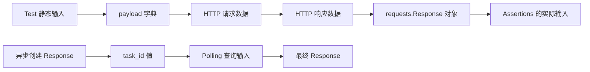
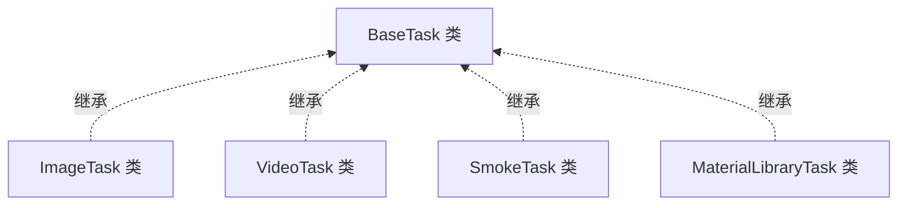
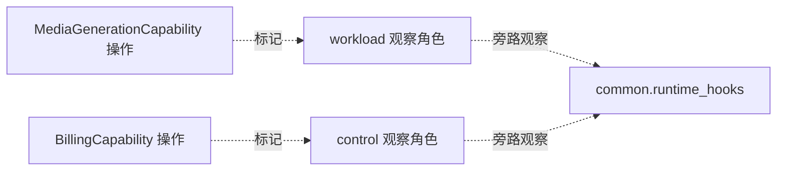

# 第 12 课：BaseTask 兼容门面与窄 Capability

> 本课承接第 11 课：TestContext 负责一个用例的动态状态与 cleanup，但不决定业务实现放在哪里。第 12 课转向 Task 层的变化边界：BaseTask 保留已有公共入口，领域 Task 承接新领域逻辑，只有已经证明跨模块复用的稳定能力才进入窄 Capability。

## 1. 课程信息

| 项目 | 内容 |
| --- | --- |
| 建议时长 | 60～90 分钟 |
| 核心问题 | 多个模块都需要媒体生成和账单查询时，代码应该放在哪里？ |
| 讲解重点 | 兼容门面、领域 Task、组合式 Capability、调用链、workload/control |
| 代码入口 | `common/base_task.py`、`common/task_capabilities/`、`module/smoke/task.py`、`module/video_model/task.py` |
| 轻量验证 | `tests/test_base_task.py`、两份 Smoke billing assertion 测试 |
| 安全边界 | 使用 Fake Request Client 和内存 Response，不访问真实模型、账单或 usage 接口 |
| 课后产出 | 能力落位决策树、两条真实调用链和三分钟复述 |

### 1.1 学完本课，你应该能够

1. 解释 BaseTask 为什么是兼容门面，而不是新增领域逻辑的默认扩展点。
2. 沿源码复述 BaseTask 如何把媒体和账单能力委托给两个窄 Capability。
3. 区分继承关系、函数调用链和 Request Client 对象流。
4. 根据变化范围判断新动作进入领域 Task，还是复用或扩展窄 Capability。
5. 区分 workload 与 control 流量，并说明该标签不改变 HTTP 业务控制流。

### 1.2 本课刻意不展开

- 不要求把现有 BaseTask 方法迁出或删除；它们仍是稳定兼容入口。
- 不为了“代码更少”提前创建新的 Capability。
- 不展开 Runtime Hooks、Semantic 和 Metrics 的内部采集；第三周学习。
- 不展开 Runner 的权威收集与分池；第 13 课学习。
- 不执行真实媒体生成、余额、usage 或计费校验。
- 不修改当前继承结构和公共方法签名。
- 不把 Assertions、Request 端点或 Test 静态输入塞进 Capability。

### 1.3 课堂必讲路径

| 环节 | 对应章节 | 建议时间 |
| --- | --- | ---: |
| 问题、约束与三种角色 | 第 2～5 节 | 12～15 分钟 |
| 媒体兼容链与复合流程 | 第 6～8 节 | 18～21 分钟 |
| Billing 与 workload/control | 第 9～10 节 | 12～15 分钟 |
| 落位决策与反模式 | 第 11～12 节 | 10～12 分钟 |
| 离线证据、活动、总图和验收 | 第 13～17、20 节 | 14～17 分钟 |
| 课堂小测 | 第 18 节 | 3～5 分钟 |
| 缓冲与提问 | 全课 | 5 分钟 |

总计约 74～90 分钟。第 13 节命令不额外计时；第 8.4、9.4 和 10.4 节可选讲。

### 1.4 课堂最短路径

```text
第 2～5 节：分清门面、领域 Task、Capability
-> 第 6～8 节：追踪媒体兼容链
-> 第 9～10 节：追踪 Billing 与流量角色
-> 第 11、14 节：完成三个动作的落位判断
-> 第 15、17、18、20 节：更新关系图组、复述、小测、验收
```

---

## 2. 承接第十一课：状态容器不拥有业务实现

TestContext 可以保存：

```text
task_id
request_id
cleanup callback
```

但它不应该实现：

```text
怎样创建媒体任务
怎样轮询媒体结果
怎样查询余额和 usage
怎样构造某个视频模型 payload
```

这些行为属于 Task、Capability 或 Request。第 11 课解决“状态归谁”；第 12 课解决“业务行为因什么原因变化，应放在哪里”。

---

## 3. 当前认知障碍与因果链

### 3.1 看到继承，就继续往父类加方法

```text
多个领域 Task 都继承 BaseTask
-> 误以为所有新方法都应写进 BaseTask
-> BaseTask 同时知道视频、素材、协议、账单等细节
-> 任一领域变化都触发公共基类回归
```

继承提供已有入口，不代表父类拥有所有未来变化。

### 3.2 看到两个模块有相似代码，就立即抽 Capability

```text
两个方法长得相似
-> 只按代码形状去重
-> 未来两领域规则分别变化
-> Capability 堆满条件分支
-> 共享抽象反而成为耦合中心
```

复用的依据是“相同责任、相同变化原因”，不是暂时相似。

### 3.3 把 Capability 当成新的万能 Task

```text
不再扩张 BaseTask
-> 把所有新逻辑改塞进一个 Capability
-> 名字变了，膨胀问题没变
```

Capability 必须窄：单一能力、显式依赖、稳定输入输出。

### 3.4 把继承关系画成函数调用

```text
VideoTask 继承 BaseTask
≠ 每次调用都先执行 VideoTask 再执行 BaseTask
```

Python 通过 MRO 找到方法；只有方法体显式调用另一个方法时，才形成调用边。

### 3.5 TOC：本课真正的约束

当前架构的约束是公共变化点过度集中：

```text
新增领域行为
-> 修改 BaseTask
-> 所有子类都继承变化
-> 回归范围扩大
-> BaseTask 成为交付瓶颈
```

解除约束的规则：

```text
已有公共入口 -> BaseTask 保持兼容
单领域新行为 -> 对应领域 Task
已证明跨模块复用 -> 窄 Capability
HTTP 发送与中间件 -> BaseRequest
响应真假判断 -> Assertions
```

---

## 4. 第一性原理：一起变化的代码才应该放在一起

判断代码位置，先问变化原因。

| 变化 | 谁最应该拥有 |
| --- | --- |
| 某视频模型新增 storyboard 参数 | VideoTask |
| 素材库新增真人认证流程 | MaterialLibraryTask |
| 多模块共同使用的媒体创建、ID 提取、轮询 | MediaGenerationCapability |
| 多模块共同使用的余额与 usage 查询 | BillingCapability |
| HTTP timeout、Retry、Middleware | BaseRequest / common |
| 某响应是否符合业务预期 | 领域 Assertions |
| 兼容旧调用方的公共方法签名 | BaseTask |

### 4.1 “公共”有两种含义

```text
公共入口：
调用方已经依赖，必须保持兼容

公共实现：
多个模块确实共享同一责任
```

BaseTask 主要承担第一种；Capability 承担经过证明的第二种。

### 4.2 门面与实现可以同时存在

```text
调用方继续调用 BaseTask.create_chat_completion()
-> BaseTask 保持签名和 Allure 步骤
-> MediaGenerationCapability 执行共享机制
```

兼容不等于复制实现。

---

## 5. 三个角色：门面、领域 Task、窄 Capability

### 5.1 BaseTask：Legacy 兼容门面

当前 `BaseTask`：

- 保留文本、图片、异步媒体和 Billing 公共入口；
- 提供已有 Allure 业务步骤；
- 处理部分兼容路由、默认参数和 pytest skip 翻译；
- 构造并委托窄 Capability；
- 让既有领域 Task 通过继承继续获得公共方法。

它不是：

- 新模型 payload 的存放地；
- 某个领域专用端点的集合；
- 所有业务工作流的父类仓库；
- 新能力默认修改点。

### 5.2 领域 Task：新领域逻辑的默认落点

当前真实例子：

- `VideoTask.create_minimax_h3_generation()` 组合模型专用 Policy 与公共媒体流程；
- `MaterialLibraryTask` 保存 Ark、Volc 素材业务动作和 payload builder；
- `SmokeTask` 保存流式消费、Smoke payload 和账单场景包装。

领域 Task 可以复用 BaseTask 的已有入口，但新增领域语义留在自己的模块。

### 5.3 窄 Capability：组合对象，不是基类

当前只有两个 Task Capability：

```text
MediaGenerationCapability
BillingCapability
```

它们是 dataclass 对象，不继承 BaseTask。BaseTask 在需要时构造对象并显式传入 Request Client。

Capability 不拥有：

- requests.Session；
- Test 静态场景输入；
- 最终业务断言；
- pytest 用例生命周期。

### 5.4 Request Client：真正发送请求

Capability 接收 `request_client`：

```text
BaseRequest 或其子类实例
```

然后调用通用 `post()`、`get()` 或 `poll_get()`。Request Client 继续拥有 Session、headers 合并、Middleware、Retry 和 HTTP 发送。

---

## 6. BaseTask 怎样构造窄 Capability

### 6.1 MediaGenerationCapability

`BaseTask._media_capability()` 把当前门面配置传入：

```text
image_generations_path
chat_completions_path
media_generations_path
media_task_path_template
task_id_field
task_id_aliases
```

返回一个 frozen `MediaGenerationCapability`。

### 6.2 BillingCapability

`BaseTask._billing_capability()` 传入：

```text
account_balance_path
usage_records_path
```

Capability 本身不保存 Request Client；每次方法调用显式接收 client。

### 6.3 为什么不是 BaseTask 多重继承

组合关系：

```text
BaseTask
-> 创建 Capability 对象
-> 调用 Capability 方法
```

好处是：

- Capability 不污染所有领域 Task 的 MRO；
- 依赖显式；
- 可独立测试；
- 一个 Capability 只描述一种共享能力。

---

## 7. 简单媒体调用的真实路径

以继承入口 `create_chat_completion()` 为例：

```text
Test 或 SmokeTask 场景方法
-> BaseTask.create_chat_completion()
-> BaseTask._media_capability()
-> MediaGenerationCapability.create_chat_completion()
-> request_client.post("/v1/chat/completions", json=payload)
-> BaseRequest.request()
-> Response
```

### 7.1 Capability 调用的是通用 Request Client 方法

当前 Capability 不调用：

```text
SmokeRequest.create_chat_completion()
VideoRequest.create_xxx()
ImageRequest.create_xxx()
```

它直接调用传入 client 的 `post()`。因此这是“Request Client 路径”，不是“领域 Request 方法路径”。

### 7.2 领域 Request 方法仍然有效

另一些领域动作会走：

```text
MaterialLibraryTask.create_ark_virtual_portrait_group()
-> MaterialLibraryRequest.create_ark_asset_group()
-> BaseRequest.post()
```

两条路径并存，不能把其中一条宣传成所有 Task 的统一模板。

### 7.3 Response 返回给谁

Capability 返回原始 Response；BaseTask 门面继续返回同一个 Response。最终业务断言仍由 Test 或 Assertions 完成。

---

## 8. 异步媒体复合流程

`create_and_poll_media_generation()` 不只是一次转发。

### 8.1 BaseTask 门面做什么

BaseTask 创建 MediaGenerationCapability，并传入三个绑定 callback：

```text
create = self.create_media_generation
extract_task_id = self.extract_task_id
poll = self.poll_media_generation_result
```

### 8.2 Capability 做什么

```text
进入 async_task 逻辑作用域
-> create_call(request_client, payload)
-> extract_call(create_response)
-> poll_call(request_client, task_id, Policy, timeout, Retry)
-> 返回最终 Response
```

### 8.3 为什么传 callback

callback 保留门面方法与子类可能的定制点，同时让复合流程由 Capability 统一组织。当前默认 callback 最终仍会回到 MediaGenerationCapability 的单步方法。

这不是：

```text
Capability 继承 BaseTask
```

而是：

```text
BaseTask 把可调用对象交给 Capability 组合
```

### 8.4 Runtime operation scope（选讲）

Capability 使用 `common.runtime_hooks.operation_scope` 标记 HTTP、Polling 或 Async Task 逻辑调用。Quality 关闭时不改变业务返回；具体采集和嵌套规则第三周再学习。

---

## 9. Billing：门面保留适配，Capability 保留共享机制

Billing 链比媒体链多一层兼容适配，不能简单说“BaseTask 每个方法都只转发一行”。

### 9.1 BaseTask 保留的兼容路由

例如 `query_usage_records_for_billing()`：

```text
传 model_response
-> 先提取 request_id
-> 按 request_id 查询

传 request_id
-> 直接按 request_id 查询

两者都没传
-> ValueError
```

这是稳定公共入口的参数适配。

### 9.2 中性的 Key 查找与 pytest 翻译

`BillingCapability.lookup_control_api_key()` 返回：

```text
ControlApiKeyLookup
├─ environment_variable
├─ value
└─ is_configured
```

它不直接调用 pytest。`BaseTask.get_required_control_api_key()` 再把“未配置”翻译为 `pytest.skip`。这让 Capability 的核心查找结果保持中性。

### 9.3 Capability 的共享 Billing 机制

BillingCapability 拥有：

- 余额查询；
- usage 按 request ID 查询；
- usage 结算轮询；
- 余额结算等待；
- request ID Header 提取；
- Response body 格式化。

它把 control key 放进当前请求的显式 headers，不修改 Request Client 的 Session headers。离线测试验证 update/reset header 均未被调用。

### 9.4 当前边界（选讲）

BaseTask 仍保留等待后查询、参数分派和 pytest skip 等兼容逻辑，所以“真实实现全部在 Capability”也是过度表述。准确说法是：可复用机制已下沉，公共门面仍承担兼容适配。

---

## 10. workload 与 control 是流量角色

### 10.1 workload

产生主要被测业务结果：

- chat completion；
- image generation；
- media task create；
- media polling。

MediaGenerationCapability 使用 `RuntimeTrafficRole.WORKLOAD`。

### 10.2 control

为了验证或观察 workload 而发起的辅助查询：

- account balance；
- usage records；
- usage settlement polling。

BillingCapability 使用 `RuntimeTrafficRole.CONTROL`。

### 10.3 角色不会改变什么

workload/control 标签不会自动改变：

- GET 或 POST；
- timeout；
- Retry 资格；
- PollingState；
- Response；
- 断言结果。

它提供稳定的观察语义，第三周 Metrics 才会消费这些事实。

### 10.4 control 不等于“不重要”（选讲）

账单断言可能决定测试是否通过，但该请求仍是 control，因为它用于验证主要模型调用，不是模型结果本身。业务重要性与流量角色不是同一维度。

---

## 11. 新行为落位决策树

先问作用范围，再问变化原因。

```text
这是现有 BaseTask 已提供的媒体或账单入口吗？
├─ 是 -> 继续复用兼容入口，不复制流程
└─ 否
   -> 只属于一个领域吗？
      ├─ 是 -> 对应 module/<domain>/task.py
      └─ 否
         -> 至少两个模块已稳定复用，且规则因同一原因变化吗？
            ├─ 否 -> 先留在领域 Task，等待证据
            └─ 是 -> 新建或扩展职责单一的窄 Capability
```

### 11.1 何时留在领域 Task

- 模型专用 payload；
- 某领域专用状态和错误语义；
- 单模块业务流程；
- 仍在快速变化的需求；
- 只是代码形状相似。

### 11.2 何时考虑 Capability

必须同时满足：

1. 已经出现跨模块调用方；
2. 输入输出合同可以稳定命名；
3. 变化原因相同；
4. 不需要大量领域条件分支；
5. 依赖可以通过参数显式传入。

### 11.3 为什么不再向 BaseTask 加方法

BaseTask 的目标是保持兼容面稳定。新增公共实现进入 BaseTask 会扩大所有子类的认知和回归范围，即使某些子类永远不会使用它。

---

## 12. 三个常见反模式

### 12.1 万能 BaseTask

```text
create_video_storyboard()
create_material_group()
verify_face_asset()
query_vendor_xxx()
```

这些方法的变化原因不同，不应集中在公共门面。

### 12.2 万能 Capability

```text
BusinessCapability
-> if video
-> if image
-> if material
-> if billing
```

这只是把万能父类换了名字。

### 12.3 领域 Task 互相引用

```text
VideoTask -> ImageTask -> SmokeTask
```

模块间互相借方法会形成隐式依赖。真正共享的稳定能力应下沉到窄 Capability，而不是让领域 Task 横向引用。

---

## 13. 轻量验证：33 条离线测试

### 13.1 安全命令

```powershell
$hadDotenvPath = Test-Path Env:API_CASE_DOTENV_PATH
$previousDotenvPath = $env:API_CASE_DOTENV_PATH
$hadQualityEnable = Test-Path Env:QUALITY_ENABLE
$previousQualityEnable = $env:QUALITY_ENABLE
$pytestExitCode = 1
$evidenceRoot = $null
try {
  $env:API_CASE_DOTENV_PATH = (Resolve-Path -LiteralPath '.env.example' -ErrorAction Stop).Path
  $env:QUALITY_ENABLE = '0'
  $evidenceRoot = Join-Path ([System.IO.Path]::GetTempPath()) ('api-case-lesson12-' + [guid]::NewGuid().ToString('N'))
  New-Item -ItemType Directory -Path $evidenceRoot -ErrorAction Stop | Out-Null
  & .\.venv\Scripts\python.exe -m pytest tests/test_base_task.py tests/test_smoke_billing_assertions.py tests/test_smoke_billing_interval.py --basetemp "$evidenceRoot\pytest-temp" --alluredir "$evidenceRoot\allure-results" -p no:cacheprovider -q
  $pytestExitCode = $LASTEXITCODE
}
finally {
  if ($hadDotenvPath) {
    $env:API_CASE_DOTENV_PATH = $previousDotenvPath
  }
  else {
    Remove-Item Env:API_CASE_DOTENV_PATH -ErrorAction SilentlyContinue
  }
  if ($hadQualityEnable) {
    $env:QUALITY_ENABLE = $previousQualityEnable
  }
  else {
    Remove-Item Env:QUALITY_ENABLE -ErrorAction SilentlyContinue
  }
}
if ($null -ne $evidenceRoot) {
  Write-Host "Lesson evidence: $evidenceRoot"
}
if ($pytestExitCode -ne 0) {
  throw "Lesson 12 offline tests failed with exit code $pytestExitCode"
}
```

### 13.2 当前结果

```text
33 passed
```

分布：

- `tests/test_base_task.py`：22 条；
- `tests/test_smoke_billing_assertions.py`：6 条；
- `tests/test_smoke_billing_interval.py`：5 条。

### 13.3 22 条 BaseTask 测试证明什么

- 公共媒体入口向正确 path 发送 payload；
- Polling 参数和 Policy 进入 Request Client；
- 创建、ID 提取和轮询能够组合；
- task ID 的既有别名保持兼容；
- Billing 查询使用显式 control headers，不修改 Session headers；
- usage 结算轮询携带 control metadata；
- request ID Header 缺失会失败；
- Key lookup 缺失返回中性结果；
- ImageTask、VideoTask 保留真实类身份与 BaseTask MRO。

这些测试主要从公共行为观察结果；“BaseTask 方法具体委托哪个 Capability”还需要结合当前源码确认。

### 13.4 11 条 billing assertion 测试证明什么

两份测试只验证 SmokeAssertions 的 Decimal 账单区间：

- 单次扣费允许 `±0.01`；
- 边界值通过；
- 越界值失败；
- 多次 usage 求和使用相同容差。

它们用于说明 Billing 流程最终仍需 Assertions，但不直接证明 BillingCapability 的 HTTP 委托。

### 13.5 不能证明什么

这些测试不证明：

- 真实模型或媒体任务成功；
- 真实余额和 usage 一定结算；
- 默认 5 秒等待一定足够；
- 真实控制 Key 已配置；
- 新行为一定应该抽 Capability；
- 所有领域 Task 都使用同一请求路径；
- workload/control 指标产物正确；
- 真实账单与平台账本一致。

---

## 14. 课堂活动：三个新动作放在哪里

三个题目都描述尚未落地的新业务动作。只能在以下三种结论中选择：

```text
领域 Task
/ 复用或窄扩展现有 Capability
/ 新建窄 Capability
```

无论选择哪一种，都不得向 BaseTask 增加新领域入口。

### 14.1 动作 A

```text
MiniMax-H3 计划新增 storyboard 参数映射，
仅 video_model 需要，规则仍在变化，当前尚未实现。
```

判断：`VideoTask`。

原因：单领域、模型专用、变化未稳定。

### 14.2 动作 B

```text
image、video、smoke 都提出一个尚未实现的新需求：
取消异步媒体任务，并等待任务进入取消终态。
端点和状态合同与现有媒体任务生命周期一致。
```

判断：窄扩展现有 `MediaGenerationCapability`，由需要该动作的领域 Task 组合使用。

原因：需求跨模块，且取消属于既有媒体任务生命周期责任；无需新建 Capability，更不能向 BaseTask 增加新入口。

### 14.3 动作 C

```text
image 与 video 都提出独立于媒体生成的新内容安全审核流程：
提交资源 -> 获得审核 task_id -> 轮询审核结论。
审核端点、状态合同和变化原因已经稳定且相同，
现有 MediaGenerationCapability 与 BillingCapability 均无法表达。
```

判断：新建职责单一的 `ContentModerationCapability`，由 ImageTask 和 VideoTask 显式组合。

原因：已经出现跨模块稳定复用，但责任既不属于媒体生成生命周期，也不属于 Billing；仍不得向 BaseTask 增加公共入口。

### 14.4 验收重点

不能只回答文件名，必须说明：

- 使用模块数；
- 是否同一责任；
- 是否同一变化原因；
- 是否已有 Capability 能承担同一责任；
- 为什么不修改 BaseTask。

---

## 15. 第十二版累积关系图组

调用链、对象流、继承关系和观察关系回答的是四个不同问题，不能用同一种实线串成一条含义不明的流水线。本节拆成四张图；每张图只表达一种关系。

### 15.1 函数调用链：谁调用谁

```mermaid
flowchart TD
    subgraph DOMAIN_PATH["领域 Request 调用链"]
        DOMAIN_TEST["Test"]
        DOMAIN_TASK["领域 Task.domain_method()"]
        DOMAIN_REQUEST["领域 Request.domain_method()"]
        DOMAIN_VERB["request_client.post() / get()<br/>BaseRequest 实现"]
        DOMAIN_BASE_REQUEST["BaseRequest.request()"]

        DOMAIN_TEST -->|调用| DOMAIN_TASK
        DOMAIN_TASK -->|调用| DOMAIN_REQUEST
        DOMAIN_REQUEST -->|调用| DOMAIN_VERB
        DOMAIN_VERB -->|调用| DOMAIN_BASE_REQUEST
    end

    subgraph CAPABILITY_PATH["兼容门面与 Capability 调用链"]
        CAPABILITY_CALLER["Test 或领域 Task"]
        FACADE_METHOD["BaseTask 兼容方法"]
        CAPABILITY_METHOD["MediaGenerationCapability.method()<br/>或 BillingCapability.method()"]
        CAPABILITY_VERB["request_client.post() / get()<br/>BaseRequest 实现"]
        BASE_REQUEST["BaseRequest.request()"]
        CAPABILITY_POLL["request_client.poll_get()<br/>BaseRequest 实现"]
        POLL_POLICY["BaseRequest._poll_get_with_policy()"]

        CAPABILITY_CALLER -->|调用| FACADE_METHOD
        FACADE_METHOD -->|调用| CAPABILITY_METHOD
        CAPABILITY_METHOD -->|同步请求方法调用| CAPABILITY_VERB
        CAPABILITY_VERB -->|调用| BASE_REQUEST
        CAPABILITY_METHOD -->|轮询方法调用| CAPABILITY_POLL
        CAPABILITY_POLL -->|调用| POLL_POLICY
    end
```



这张图的每条箭头都只表示“源节点调用目标节点”。分支表示方法族的两种可能出口，不表示一次请求同时经过同步与 Polling 两条链。`BaseTask 兼容方法 -> Capability.method()` 仅概括直接委托的终端方法：create-and-poll 的真实编排还会经过 callback，部分 Billing 入口还会经过 BaseTask 的参数分派、Key 查找或 skip 翻译等适配，详见第 8、9 节。`BaseRequest 实现` 写在 Request Client 方法节点内部，只说明运行时方法归属，不额外画一条“归属”箭头。图中没有 Response 和 Assertions，因为它不表达对象流。Capability 调用的是 Request Client 的通用方法，不会先调用领域 Request 的同名方法。

### 15.2 对象流：数据怎样变化



这里的箭头只表示数据或对象流转，不表示 `payload` 直接调用 Response，也不表示 Assertions 是 BaseRequest 的内部步骤。Billing 的 `±0.01` 判断接收 Response 对象，但仍属于 Assertions。

### 15.3 继承关系：能力从哪里获得



虚线只表示类继承与 MRO，不表示运行时一定先调用子类方法再调用 BaseTask。只有 Test 调用继承方法，或领域方法显式调用 `self.create_and_poll_media_generation()` 时，才进入第 15.1 节的门面调用链。

### 15.4 观察关系：运行时角色怎样标记



虚线表示 metadata 与旁路观察，不是 HTTP 调用。Quality 关闭时，该观察关系不应改变业务 Response 和原始异常。

---

## 16. 常见误区

### 误区一：多个领域 Task 继承 BaseTask，所以新方法都加 BaseTask

错误。继承保留兼容入口，新领域行为默认进入领域 Task。

### 误区二：BaseTask 已经没有任何实现

错误。它仍保留兼容分派、默认参数、callback 组装和 pytest skip 翻译。

### 误区三：Capability 是 BaseTask 的子类

错误。当前两个 Capability 是组合对象。

### 误区四：Capability 会调用领域 Request 同名方法

当前媒体和 Billing Capability 调用 Request Client 的通用 `post/get/poll_get`。

### 误区五：两个模块有相似代码就必须抽 Capability

相似不是充分条件；还要有稳定复用和相同变化原因。

### 误区六：ImageTask 是空类，所以可以直接用 BaseTask 别名替代

不能。真实类身份、MRO、导入路径和未来领域扩展点都需要保留。

### 误区七：control 表示请求不影响测试结果

错误。control 是观察角色，不是重要性等级。

### 误区八：Billing assertion 应放进 BillingCapability

错误。Capability 负责共享查询，最终金额预期属于 Assertions。

### 误区九：不扩张 BaseTask，就把全部逻辑放进一个 BusinessCapability

这仍是万能对象，应按单一能力拆分。

### 误区十：领域 Task 可以互相 import 复用

不同模型 Task 不应横向依赖；稳定共享能力下沉到窄 Capability。

---

## 17. 三分钟复述

```text
BaseTask 是兼容门面。它保留现有文本、图片、异步媒体和 Billing 公共入口，使 ImageTask、VideoTask、SmokeTask 等子类继续通过稳定签名使用已有能力。但新领域逻辑不再默认加入 BaseTask，因为父类的每次扩张都会扩大所有子类的认知和回归范围。

新领域行为默认进入对应模块 Task。VideoTask 可以包装模型专用 PollingPolicy 并复用公共媒体流程；MaterialLibraryTask 通过 MaterialLibraryRequest 表达素材领域端点；SmokeTask 保存流式消费和 Smoke 场景。领域 Task 继承 BaseTask 是能力来源关系，不是固定函数调用链。

BaseTask 通过组合构造 MediaGenerationCapability 和 BillingCapability。媒体 Capability 执行文本、图片、异步创建、task ID 提取和 Polling；BillingCapability 执行余额、usage、结算轮询和 request ID 提取。Capability 显式接收 Request Client，调用通用 post、get、poll_get，不拥有 Session、Test 输入和最终断言。

create_and_poll_media_generation 是复合链：BaseTask 把 create、extract、poll 三个绑定 callback 交给媒体 Capability，由 Capability 按创建、提取 ID、轮询顺序执行。Billing 门面还保留参数分派、Key 缺失到 pytest.skip 的翻译等兼容适配，所以不能说 BaseTask 已经只是空壳。

只有多个模块已经稳定复用、合同能够清楚命名、并因同一原因变化时，才新建或扩展窄 Capability。单领域、模型专用或仍在变化的逻辑留在领域 Task。已有公共流程优先复用，不复制，也不重复抽象。

workload 表示模型或媒体主业务调用，control 表示余额和 usage 等辅助查询。它们是运行时观察角色，不改变 HTTP 方法、Retry、Polling、Response 或断言结果。
```

---

## 18. 课堂小测

1. 新视频模型专用 payload 默认放哪里？A BaseTask / B VideoTask（B）
2. BaseTask 当前主要角色？A 兼容门面 / B 所有新逻辑仓库（A）
3. Capability 与 BaseTask 是什么关系？A 组合 / B 继承（A）
4. MediaGenerationCapability 调用什么？A 领域 Request 同名方法 / B Request Client 的通用方法（B）
5. 两段相似代码足以抽 Capability 吗？A 足够 / B 不足够（B）
6. ImageTask 为空能否改成 `ImageTask = BaseTask`？A 能 / B 不能（B）
7. 余额查询属于什么角色？A workload / B control（B）
8. control 标签会改变 Response 吗？A 会 / B 不会（B）

---

## 19. 课后作业：完成能力落位表，不写代码

### 19.1 必做内容

1. 为三个新业务动作填写“领域 Task / 复用或窄扩展现有 Capability / 新建窄 Capability”及因果理由。
2. 画出 BaseTask → Capability → Request Client 与领域 Task → 领域 Request 两条链。
3. 完成一次三分钟复述，必须区分继承与调用。

### 19.2 不要求完成

- 不修改 BaseTask。
- 不创建示范 Capability。
- 不执行真实媒体或 Billing 用例。
- 不展开 Runtime Hooks 内部采集。
- 不重构现有模块 Task。
- 不提交长篇源码抄录。

---

## 20. 验收标准

完成本课后，应能回答：

1. BaseTask 为什么称为兼容门面？
2. 为什么新领域逻辑不继续加入 BaseTask？
3. 领域 Task 与 Capability 的选择条件是什么？
4. 继承关系和函数调用链有什么区别？
5. 当前两个 Capability 分别负责什么？
6. 简单媒体调用的真实路径是什么？
7. create-and-poll 为什么传入三个 callback？
8. Capability 是否调用领域 Request 方法？
9. BaseTask 在 Billing 链中仍保留哪些适配？
10. workload 与 control 怎样区分？
11. 33 条离线测试能证明什么，不能证明什么？
12. 为什么 billing assertion 不属于 BillingCapability？

合格复述必须包含：

- BaseTask 的兼容职责；
- 领域 Task 是新逻辑默认落点；
- 跨模块稳定复用才进入窄 Capability；
- 组合而非 Capability 继承；
- Request Client 通用方法路径；
- 领域 Request 方法是另一条有效路径；
- workload/control 只是观察角色；
- Assertions 保留最终业务判断。

---

## 21. 下一课接口

到本课为止，我们已经知道单个用例怎样：

```text
发请求
-> Retry / Polling / SSE
-> 保存上下文
-> 调用领域 Task 或公共 Capability
-> 完成断言与清理
```

但很多用例一起运行时，还需要回答：

```text
完整用例集合是谁收集的？
哪些进入并行池？
哪些必须串行？
同一个 nodeid 会不会丢失或重复？
```

第 13 课将进入 Runner：

```text
CLI 与 pytest 参数
-> 唯一权威收集
-> 并发池 / 串行池
-> 集合守恒
-> 执行
```

Task 决定一个业务动作怎样执行；Runner 决定很多测试怎样被可靠调度。两者不能混成同一层。
