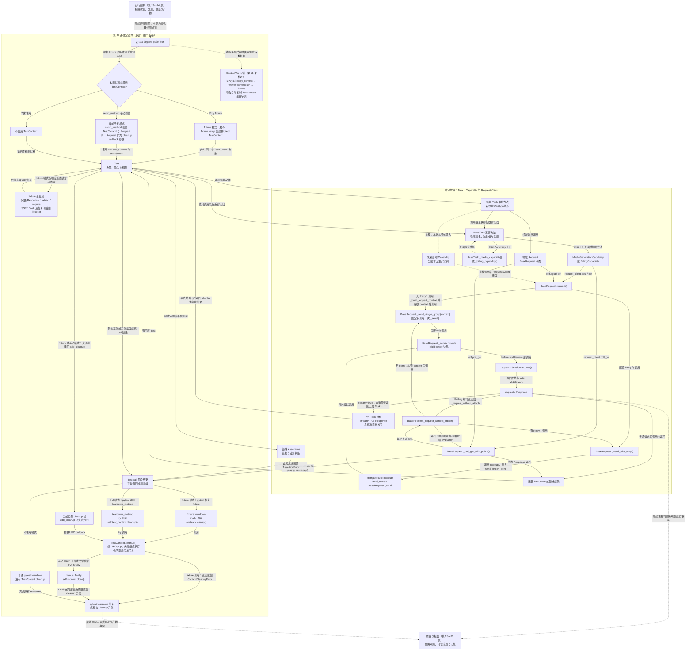
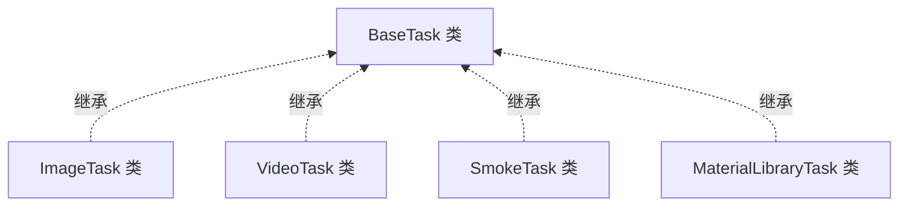
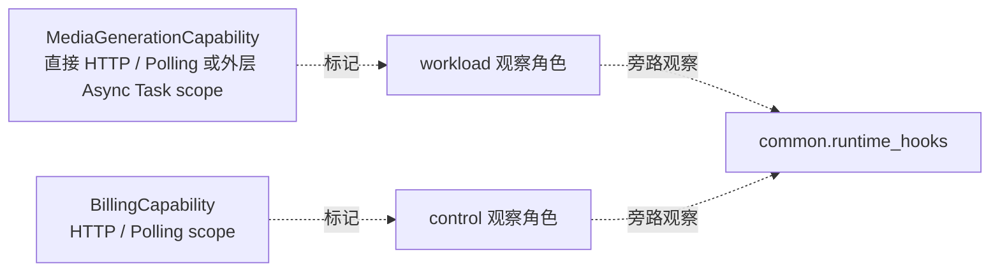

# 第 12 课：BaseTask 兼容门面与窄 Capability

> 本课承接第 11 课：TestContext 负责一个用例的动态状态与 cleanup，但不决定业务实现放在哪里。第 12 课转向 Task 层的变化边界：BaseTask 保留已有公共入口，领域 Task 承接新领域逻辑，只有已经证明跨模块复用的稳定能力才进入窄 Capability。

## 1. 课程信息

| 项目 | 内容 |
| --- | --- |
| 建议时长 | 60～90 分钟 |
| 核心问题 | 多个模块都需要媒体生成和账单查询时，代码应该放在哪里？ |
| 讲解重点 | 兼容门面、领域 Task、组合式 Capability、调用链、workload/control |
| 代码入口 | `common/base_task.py`、`common/task_capabilities/`、`module/smoke/task.py`、`module/video_model/task.py`、`module/material_library/task.py`、`module/image_model/task.py` |
| 轻量验证 | 必讲 `tests/test_base_task.py`；两份 Smoke billing assertion 测试作为选读证据 |
| 安全边界 | 使用 Fake Request Client 和内存 Response，不访问真实模型、账单或 usage 接口 |
| 课后产出 | 能力落位表、能力来源与实际兼容调用链、推荐新能力链、三分钟复述 |

### 1.1 学完本课，你应该能够

1. 解释 BaseTask 为什么是兼容门面，而不是新增领域逻辑的默认扩展点。
2. 沿源码复述 BaseTask 如何把媒体和账单能力委托给两个窄 Capability。
3. 区分继承关系、函数调用链，以及 Request Client 作为参数的依赖传递。
4. 根据变化范围判断新动作进入领域 Task，还是复用或扩展窄 Capability。
5. 区分 workload 与 control 流量，并说明该标签不改变 HTTP 业务控制流。

### 1.2 本课刻意不展开

- 不要求把现有 BaseTask 方法迁出或删除；它们仍是稳定兼容入口。
- 不为了“代码更少”提前创建新的 Capability。
- 不展开 Runtime Hooks、Semantic 和 Metrics 的内部采集；第三周学习。
- 不展开 Runner 的权威收集与分池；第 13 课学习。
- 不执行真实媒体生成、余额、usage 或计费校验。
- 不修改当前继承结构和公共方法签名。
- 不把最终 Assertions、pytest 场景输入或 Session 生命周期塞进 Capability；已有 Capability 可以持有其稳定共享能力所需的 path 配置。

### 1.3 课堂必讲路径

| 环节 | 对应章节 | 建议时间 |
| --- | --- | ---: |
| 问题、约束与三种角色 | 第 2～5 节 | 12～14 分钟 |
| 当前兼容链与推荐新能力链 | 第 6～8 节 | 18～20 分钟 |
| Billing 与 workload/control | 第 9～10 节 | 10～12 分钟 |
| 落位决策、反模式与课堂活动 | 第 11～12、14 节 | 11～13 分钟 |
| 核心离线证据、第 11 课边界回顾、本课增量主图与继承补图 | 第 13.1～13.3、15.1、15.3 节 | 13～15 分钟 |
| 必讲误区、复述与课堂验收 | 第 16 节必讲项、第 17～18 节 | 8～10 分钟 |
| 缓冲与提问 | 全课 | 5 分钟 |

总计约 77～89 分钟。第 13 节命令课前运行，不占课堂时间；第 8.4、9.4、10.4、13.4、15.2 和 15.4 节为选读。第 16 节课堂只讲误区一、三、五、九，其余进入题库。

### 1.4 课堂最短路径

```text
第 2～5 节：分清门面、领域 Task、Capability
-> 第 6～8 节：区分当前兼容链与推荐新能力链
-> 第 9～10 节：追踪 Billing 与流量角色
-> 第 11～12、14 节：完成三个动作的落位判断并识别反模式
-> 第 13.1～13.3 节：读取核心离线证据
-> 第 15.1、15.3 节：区分调用链与继承关系
-> 第 16 节必讲误区、17～18 节：复述并完成课堂验收
```

---

## 2. 承接第十一课：状态容器不拥有业务实现

TestContext 可以保存：

```text
task_id
request_id
cleanup callback
```

但它不应该实现：

```text
怎样创建媒体任务
怎样轮询媒体结果
怎样查询余额和 usage
怎样构造某个视频模型 payload
```

这些行为属于 Task、Capability 或 Request。第 11 课解决“状态归谁”；第 12 课解决“业务行为因什么原因变化，应放在哪里”。

---

## 3. 当前认知障碍与因果链

### 3.1 看到继承，就继续往父类加方法

```text
多个领域 Task 都继承 BaseTask
-> 误以为所有新方法都应写进 BaseTask
-> BaseTask 同时知道视频、素材、协议、账单等细节
-> 任一领域变化都触发公共基类回归
```

继承提供已有入口，不代表父类拥有所有未来变化。

### 3.2 看到两个模块有相似代码，就立即抽 Capability

```text
两个方法长得相似
-> 只按代码形状去重
-> 未来两领域规则分别变化
-> Capability 堆满条件分支
-> 共享抽象反而成为耦合中心
```

复用的依据是“相同责任、相同变化原因”，不是暂时相似。

### 3.3 把 Capability 当成新的万能 Task

```text
不再扩张 BaseTask
-> 把所有新逻辑改塞进一个 Capability
-> 名字变了，膨胀问题没变
```

Capability 必须窄：单一能力、显式依赖、稳定输入输出。

### 3.4 把继承关系画成函数调用

```text
VideoTask 继承 BaseTask
≠ 每次调用都先执行 VideoTask 再执行 BaseTask
```

Python 通过 MRO 找到方法；只有方法体显式调用另一个方法时，才形成调用边。

### 3.5 TOC：本课真正的约束

当前架构的约束是公共变化点过度集中：

```text
新增领域行为
-> 修改 BaseTask
-> 所有子类都继承变化
-> 回归范围扩大
-> BaseTask 成为交付瓶颈
```

解除约束的规则：

```text
已有公共入口 -> BaseTask 保持兼容
单领域新行为 -> 对应领域 Task
已证明跨模块复用 -> 窄 Capability
HTTP 发送与中间件 -> BaseRequest
响应真假判断 -> Assertions
```

---

## 4. 第一性原理：一起变化的代码才应该放在一起

判断代码位置，先问变化原因。

| 变化 | 谁最应该拥有 |
| --- | --- |
| 某视频模型新增 storyboard 参数 | VideoTask |
| 素材库新增真人认证流程 | MaterialLibraryTask |
| 多模块共同使用的媒体创建、ID 提取、轮询 | MediaGenerationCapability |
| 多模块共同使用的余额与 usage 查询 | BillingCapability |
| HTTP timeout、Retry、Middleware | BaseRequest / common |
| 某响应是否符合业务预期 | 领域 Assertions |
| 兼容旧调用方的公共方法签名 | BaseTask |

### 4.1 “公共”有两种含义

```text
公共入口：
调用方已经依赖，必须保持兼容

公共实现：
多个模块确实共享同一责任
```

BaseTask 主要承担第一种；Capability 承担经过证明的第二种。

### 4.2 门面与实现可以同时存在

```text
调用方继续调用 BaseTask.create_chat_completion()
-> BaseTask 保持签名和 Allure 步骤
-> MediaGenerationCapability 执行共享机制
```

兼容不等于复制实现。

---

## 5. 三个角色：门面、领域 Task、窄 Capability

### 5.1 BaseTask：Legacy 兼容门面

当前 `BaseTask`：

- 保留文本、图片、异步媒体和 Billing 公共入口；
- 提供已有 Allure 业务步骤；
- 处理部分兼容路由、默认参数和 pytest skip 翻译；
- 构造并委托窄 Capability；
- 让既有领域 Task 通过继承继续获得公共方法。

它不是：

- 新模型 payload 的存放地；
- 某个领域专用端点的集合；
- 所有业务工作流的父类仓库；
- 新能力默认修改点。

### 5.2 领域 Task：新领域逻辑的默认落点

当前真实例子：

- `VideoTask.create_minimax_h3_generation()` 组合模型专用 Policy 与公共媒体流程；
- `MaterialLibraryTask` 保存 Ark、Volc 素材业务动作和 payload builder；
- `SmokeTask` 保存流式消费、Smoke payload 和账单场景包装。

领域 Task 可以复用 BaseTask 的已有入口，但新增领域语义留在自己的模块。

### 5.3 窄 Capability：组合对象，不是基类

当前只有两个 Task Capability：

```text
MediaGenerationCapability
BillingCapability
```

它们是 frozen dataclass 组合对象，不继承 BaseTask。涉及 HTTP 或 Polling 的终端门面方法按需构造对象，并把 Request Client 显式传入 Capability；`format_response_body()`、`get_request_id_from_response()` 等静态适配则直接调用 BillingCapability 的类级 helper，不需要持有实例状态。

当前生产源码中，只有 `BaseTask` 直接构造这两个 Capability；尚无“领域 Task 直接构造或注入新 Capability”的生产实例。因此必须区分：

```text
能力来源（源码事实，不是调用链）：
领域 Task --继承--> BaseTask

实际兼容调用链（源码事实）：
Test / 领域 Task 场景方法
-> BaseTask 兼容方法（可由领域 Task 实例继承获得）
-> 已有 Capability
-> Request Client

推荐新能力链（设计规范，当前暂无生产实例）：
领域 Task 本地方法 -> 显式构造或注入窄 Capability -> Request Client
```

推荐链不是要求所有领域 Task 都持有 Capability。只有满足第 11 节跨模块稳定复用条件的新能力，才采用该组合方式；单领域逻辑仍直接留在领域 Task。

Capability 不拥有：

- requests.Session；
- Test 静态场景输入；
- 最终业务断言；
- pytest 用例生命周期。

### 5.4 Request Client：真正发送请求

Capability 接收 `request_client`：

```text
BaseRequest 或其子类实例
```

然后调用通用 `post()`、`get()` 或 `poll_get()`。Request Client 继续拥有 Session、headers 合并、Middleware、Retry 和 HTTP 发送。

---

## 6. 当前兼容链与推荐的新能力链

### 6.1 MediaGenerationCapability

`BaseTask._media_capability()` 把当前门面配置传入：

```text
image_generations_path
chat_completions_path
media_generations_path
media_task_path_template
task_id_field
task_id_aliases
```

返回一个 frozen `MediaGenerationCapability`。

### 6.2 BillingCapability

`BaseTask._billing_capability()` 传入：

```text
account_balance_path
usage_records_path
```

Capability 本身不保存 Request Client；每次方法调用显式接收 client。

### 6.3 推荐的新 Capability 怎样接入领域 Task

新共享能力一旦满足抽取条件，接入顺序应是：

```text
在 common/task_capabilities/ 定义职责单一的 Capability
-> 由需要该能力的领域 Task 显式构造，或由测试/fixture 创建后通过构造参数传入
-> 领域 Task 的本地业务方法委托 Capability
-> Capability 显式接收 Request Client
-> Capability 调用 request_client.post()/get()/poll_get()
```

fixture 只负责显式创建 Capability 或 Task，再由测试代码通过构造参数完成装配；pytest 不会自动向任意普通 Task 对象注入 fixture。

例如未来真的实现 `ContentModerationCapability` 时，推荐关系是：

```text
ImageTask.moderate_content()
-> ImageTask 持有或接收 ContentModerationCapability
-> ContentModerationCapability.submit_and_poll(request_client, payload)
-> Request Client

VideoTask.moderate_content()
-> VideoTask 持有或接收同一个窄 Capability 类型
-> ContentModerationCapability.submit_and_poll(request_client, payload)
-> Request Client
```

这是推荐设计示意，不是当前源码调用链。新能力不得为了提供公共入口而再向 `BaseTask` 增加 `moderate_content()`；否则所有领域 Task 又被迫继承一个并非都需要的方法。

### 6.4 为什么不是 BaseTask 多重继承

组合关系：

```text
BaseTask
-> 创建 Capability 对象
-> 调用 Capability 方法
```

好处是：

- Capability 不污染所有领域 Task 的 MRO；
- 依赖显式；
- 可独立测试；
- 一个 Capability 只描述一种共享能力。

---

## 7. 简单媒体调用的真实路径

以继承入口 `create_chat_completion()` 为例，先只看函数调用：

```text
Test 或 SmokeTask 场景方法
-> 调用 BaseTask.create_chat_completion()

BaseTask.create_chat_completion()
├─ 调用 self._media_capability()
└─ 调用该工厂返回对象的
   MediaGenerationCapability.create_chat_completion()
   -> 调用 request_client.post("/v1/chat/completions", json=payload)
   -> BaseRequest.post() 调用 BaseRequest.request()
```

`_media_capability()` 返回 Capability 对象，不会调用 `create_chat_completion()`；后两个调用都是 `BaseTask.create_chat_completion()` 方法体发起的。把它们写成 `_media_capability() -> Capability.create_chat_completion()` 会虚构调用边。

### 7.1 Capability 调用的是通用 Request Client 方法

当前 Capability 不调用：

```text
SmokeRequest.create_chat_completion()
VideoRequest.create_xxx()
ImageRequest.create_xxx()
```

它直接调用传入 client 的 `post()`。因此这是“Request Client 路径”，不是“领域 Request 方法路径”。

### 7.2 领域 Request 方法仍然有效

另一些领域动作会走：

```text
MaterialLibraryTask.create_ark_virtual_portrait_group()
-> MaterialLibraryRequest.create_ark_asset_group()
-> BaseRequest.post()
```

两条路径并存，不能把其中一条宣传成所有 Task 的统一模板。

### 7.3 Response 返回给谁

返回链与上面的调用链方向相反：

```text
BaseRequest.request()
-> 返回原始 Response 给 BaseRequest.post()
-> 返回同一个 Response 给 MediaGenerationCapability.create_chat_completion()
-> 返回同一个 Response 给 BaseTask.create_chat_completion()
-> 返回给最初的 Test 或 SmokeTask 场景方法
```

Response 是返回对象，不是下一个调用者。最终业务断言仍由 Test 或 Assertions 完成。

---

## 8. 异步媒体复合流程

`create_and_poll_media_generation()` 不只是一次转发。

### 8.1 BaseTask 门面做什么

`BaseTask.create_and_poll_media_generation()` 先调用 `_media_capability()` 获得一个 Capability 对象，再调用该对象的复合方法，并传入三个绑定 callback：

```text
create = self.create_media_generation
extract_task_id = self.extract_task_id
poll = self.poll_media_generation_result
```

### 8.2 Capability 做什么

```text
进入 async_task 逻辑作用域
-> create_call(request_client, payload)
-> extract_call(create_response)
-> poll_call(request_client, task_id, Policy, timeout, Retry)
-> 返回最终 Response
```

### 8.3 为什么传 callback

callback 保留门面方法与子类可能的定制点，同时让复合流程由 Capability 统一组织。当前默认 callback 最终仍会回到 MediaGenerationCapability 的单步方法。

当前默认实现还有一个容易忽略的边界：三个 BaseTask 单步 callback 各自在执行时再次调用 `_media_capability()`，因此 create、extract、poll 不依赖“同一个 Capability 实例”保存状态。这里复用的是稳定合同与配置，不是对象身份；Capability 本身是 frozen、无 Request Client 状态的组合对象。

这不是：

```text
Capability 继承 BaseTask
```

而是：

```text
BaseTask 把可调用对象交给 Capability 组合
```

### 8.4 Runtime operation scope（选讲）

Capability 使用 `common.runtime_hooks.operation_scope` 标记 HTTP、Polling 或 Async Task 逻辑调用。Quality 关闭时不改变业务返回；具体采集和嵌套规则第三周再学习。

---

## 9. Billing：门面保留适配，Capability 保留共享机制

Billing 链比媒体链多一层兼容适配，不能简单说“BaseTask 每个方法都只转发一行”。

### 9.1 BaseTask 保留的兼容路由

例如 `query_usage_records_for_billing()`：

```text
传 model_response
-> 先提取 request_id
-> 按 request_id 查询

传 request_id
-> 直接按 request_id 查询

两者都没传
-> ValueError
```

这是稳定公共入口的参数适配。

### 9.2 中性的 Key 查找与 pytest 翻译

`BillingCapability.lookup_control_api_key()` 返回：

```text
ControlApiKeyLookup
├─ environment_variable
├─ value
└─ is_configured
```

它不直接调用 pytest。`BaseTask.get_required_control_api_key()` 再把“未配置”翻译为 `pytest.skip`。这让 Capability 的核心查找结果保持中性。

### 9.3 Capability 的共享 Billing 机制

BillingCapability 拥有：

- 余额查询；
- usage 按 request ID 查询；
- usage 结算轮询；
- 余额结算等待；
- request ID Header 提取；
- Response body 格式化。

它把 control key 放进当前请求的显式 headers，不修改 Request Client 的 Session headers。离线测试验证 update/reset header 均未被调用。

### 9.4 当前边界（选讲）

BaseTask 仍保留等待后查询、参数分派和 pytest skip 等兼容逻辑，所以“真实实现全部在 Capability”也是过度表述。准确说法是：可复用机制已下沉，公共门面仍承担兼容适配。

---

## 10. workload 与 control 是流量角色

### 10.1 workload

产生主要被测业务结果：

- chat completion；
- image generation；
- media task create；
- media polling。

MediaGenerationCapability 中进入 HTTP、Polling 或外层 Async Task scope 的操作使用 `RuntimeTrafficRole.WORKLOAD`。纯 ID 提取等本地方法不会因为属于该 Capability 就自动产生 workload 请求。

### 10.2 control

为了验证或观察 workload 而发起的辅助查询：

- account balance；
- usage records；
- usage settlement polling。

BillingCapability 中余额、usage HTTP 请求和结算 Polling 的观察元数据使用 `RuntimeTrafficRole.CONTROL`。Key 查找、request ID 提取、Response 格式化和单纯等待本身不创建带 control 角色的请求。

### 10.3 角色不会改变什么

workload/control 标签不会自动改变：

- GET 或 POST；
- timeout；
- Retry 资格；
- PollingState；
- Response；
- 断言结果。

它提供稳定的观察语义，第三周 Metrics 才会消费这些事实。

### 10.4 control 不等于“不重要”（选讲）

账单断言可能决定测试是否通过，但该请求仍是 control，因为它用于验证主要模型调用，不是模型结果本身。业务重要性与流量角色不是同一维度。

---

## 11. 新行为落位决策树

先问作用范围，再问变化原因。

```text
这是现有 BaseTask 已提供的媒体或账单入口吗？
├─ 是 -> 继续复用兼容入口，不复制流程
└─ 否
   -> 只属于一个领域吗？
      ├─ 是 -> 对应 module/<domain>/task.py
      └─ 否
         -> 至少两个模块已稳定复用，且规则因同一原因变化吗？
            ├─ 否 -> 先留在领域 Task，等待证据
            └─ 是 -> 新建或扩展职责单一的窄 Capability
                     -> 由需要它的领域 Task 显式构造或注入后组合使用
                     -> 不增加 BaseTask 入口
```

### 11.1 何时留在领域 Task

- 模型专用 payload；
- 某领域专用状态和错误语义；
- 单模块业务流程；
- 仍在快速变化的需求；
- 只是代码形状相似。

### 11.2 何时考虑 Capability

必须同时满足：

1. 已经出现跨模块调用方；
2. 输入输出合同可以稳定命名；
3. 变化原因相同；
4. 不需要大量领域条件分支；
5. 依赖可以通过参数显式传入。

### 11.3 新 Capability 由谁接入

Capability 只定义共享机制，不主动进入所有模块。需要它的领域 Task 才是接入所有者：

```text
领域 Task 决定何时调用、传什么领域参数
-> Capability 执行跨模块稳定共享机制
-> Request Client 负责 HTTP、Retry、Polling 和 Middleware
```

领域 Task 显式构造适合配置固定且对象轻量的 Capability；需要替换 Fake、共享配置或独立测试时，可以由测试或 fixture 显式创建 Capability/Task，再通过构造参数完成装配。无论采用哪种方式，依赖都必须在领域 Task 的构造或本地方法中可见。

### 11.4 为什么不再向 BaseTask 加方法

BaseTask 的目标是保持兼容面稳定。新增公共实现进入 BaseTask 会扩大所有子类的认知和回归范围，即使某些子类永远不会使用它。

---

## 12. 三个常见反模式

### 12.1 万能 BaseTask

```text
create_video_storyboard()
create_material_group()
verify_face_asset()
query_vendor_xxx()
```

这些方法的变化原因不同，不应集中在公共门面。

### 12.2 万能 Capability

```text
BusinessCapability
-> if video
-> if image
-> if material
-> if billing
```

这只是把万能父类换了名字。

### 12.3 领域 Task 互相引用

```text
VideoTask -> ImageTask -> SmokeTask
```

模块间互相借方法会形成隐式依赖。真正共享的稳定能力应下沉到窄 Capability，而不是让领域 Task 横向引用。

---

## 13. 轻量验证：22 条核心测试与 11 条选读测试

### 13.1 安全命令

```powershell
$hadDotenvPath = Test-Path Env:API_CASE_DOTENV_PATH
$previousDotenvPath = $env:API_CASE_DOTENV_PATH
$hadQualityEnable = Test-Path Env:QUALITY_ENABLE
$previousQualityEnable = $env:QUALITY_ENABLE
$pytestExitCode = 1
$evidenceRoot = $null
try {
  $env:API_CASE_DOTENV_PATH = (Resolve-Path -LiteralPath '.env.example' -ErrorAction Stop).Path
  $env:QUALITY_ENABLE = '0'
  $evidenceRoot = Join-Path ([System.IO.Path]::GetTempPath()) ('api-case-lesson12-' + [guid]::NewGuid().ToString('N'))
  New-Item -ItemType Directory -Path $evidenceRoot -ErrorAction Stop | Out-Null
  & .\.venv\Scripts\python.exe -m pytest tests/test_base_task.py --basetemp "$evidenceRoot\pytest-temp" --alluredir "$evidenceRoot\allure-results" -p no:cacheprovider -q
  $pytestExitCode = $LASTEXITCODE
}
finally {
  if ($hadDotenvPath) {
    $env:API_CASE_DOTENV_PATH = $previousDotenvPath
  }
  else {
    Remove-Item Env:API_CASE_DOTENV_PATH -ErrorAction SilentlyContinue
  }
  if ($hadQualityEnable) {
    $env:QUALITY_ENABLE = $previousQualityEnable
  }
  else {
    Remove-Item Env:QUALITY_ENABLE -ErrorAction SilentlyContinue
  }
}
if ($null -ne $evidenceRoot) {
  Write-Host "Lesson evidence: $evidenceRoot"
}
if ($pytestExitCode -ne 0) {
  throw "Lesson 12 offline tests failed with exit code $pytestExitCode"
}
```

### 13.2 当前结果

```text
22 passed
```

课堂核心证据只运行 `tests/test_base_task.py` 的 22 条测试。它们直接服务本课“兼容门面、Capability 委托、Request Client 边界和真实类身份”的主线。

### 13.3 22 条 BaseTask 测试证明什么

- 公共媒体入口向正确 path 发送 payload；
- Polling 参数和 Policy 进入 Request Client；
- 创建、ID 提取和轮询能够组合；
- task ID 的既有别名保持兼容；
- Billing 查询使用显式 control headers，不修改 Session headers；
- usage 结算轮询携带 control metadata；
- request ID Header 缺失会失败；
- Key lookup 缺失返回中性结果；
- ImageTask、VideoTask 保留真实类身份与 BaseTask MRO。

这些测试主要从公共行为观察结果；“BaseTask 方法具体委托哪个 Capability”还需要结合当前源码确认。

### 13.4 11 条 billing assertion 测试证明什么（选读）

这 11 条测试不占课堂时间。需要课后核对 Assertions 边界时，再运行：

```powershell
.\.venv\Scripts\python.exe -m pytest `
  tests/test_smoke_billing_assertions.py `
  tests/test_smoke_billing_interval.py -q
```

两份测试只验证 SmokeAssertions 的 Decimal 账单区间：

- 单次扣费允许 `±0.01`；
- 边界值通过；
- 越界值失败；
- 多次 usage 求和使用相同容差。

它们用于说明 Billing 流程最终仍需 Assertions，但不直接证明 BillingCapability 的 HTTP 委托，因此不能作为本课“Capability 委托成立”的主证据。

### 13.5 不能证明什么

这些测试不证明：

- 真实模型或媒体任务成功；
- 真实余额和 usage 一定结算；
- 默认 5 秒等待一定足够；
- 真实控制 Key 已配置；
- 新行为一定应该抽 Capability；
- 所有领域 Task 都使用同一请求路径；
- workload/control 指标产物正确；
- 真实账单与平台账本一致。

---

## 14. 课堂活动：三个新动作放在哪里

三个题目都描述尚未落地的新业务动作。只能在以下三种结论中选择：

```text
领域 Task
/ 复用或窄扩展现有 Capability
/ 新建窄 Capability
```

无论选择哪一种，都不得向 BaseTask 增加新领域入口。

### 14.1 动作 A

```text
MiniMax-H3 计划新增 storyboard 参数映射，
仅 video_model 需要，规则仍在变化，当前尚未实现。
```

判断：`VideoTask`。

原因：单领域、模型专用、变化未稳定。

### 14.2 动作 B

```text
image、video、smoke 都提出一个尚未实现的新需求：
取消异步媒体任务，并等待任务进入取消终态。
端点和状态合同与现有媒体任务生命周期一致。
```

判断：窄扩展现有 `MediaGenerationCapability`，由需要该动作的领域 Task 通过本地方法显式组合使用。

原因：需求跨模块，且取消属于既有媒体任务生命周期责任；无需新建 Capability，更不能向 BaseTask 增加新入口。当前源码尚无领域 Task 直接组合 Capability 的生产实例，因此这是推荐落地方式，不是对现有调用链的描述。

### 14.3 动作 C

```text
image 与 video 都提出独立于媒体生成的新内容安全审核流程：
提交资源 -> 获得审核 task_id -> 轮询审核结论。
审核端点、状态合同和变化原因已经稳定且相同，
现有 MediaGenerationCapability 与 BillingCapability 均无法表达。
```

判断：新建职责单一的 `ContentModerationCapability`，由 ImageTask 和 VideoTask 显式构造或注入后组合。

原因：已经出现跨模块稳定复用，但责任既不属于媒体生成生命周期，也不属于 Billing；仍不得向 BaseTask 增加公共入口。该 Capability 目前不存在，课堂只设计依赖方向，不把它画成当前源码实线。

### 14.4 验收重点

不能只回答文件名，必须说明：

- 使用模块数；
- 是否同一责任；
- 是否同一变化原因；
- 是否已有 Capability 能承担同一责任；
- 为什么不修改 BaseTask。

---

## 15. 第十二版累积链路总图：继承 TestContext 边界，展开 Task 与 Capability

累积图的原则不是提前画完未来课程，而是让已掌握边界保持稳定，再增量展开本课约束。因此第 15.1 节继承第 11 课的 TestContext 与 ContextVar 成果，只展开本课新增的 Task、BaseTask 与 Capability 关系；运行编排和质量报告仅保留后续课程接口。第 15.2～15.4 节是对象、继承和观察关系补图，不能替代累积主图。

### 15.1 累积主图：继承第 11 课，只增量展开 Task 与 Capability

本图以第 11 课累积图为底稿，继续保留 fixture 模式、当前手动模式、不使用 TestContext 模式、cleanup 栈和 ContextVar 传播。为控制课堂负荷，第 11 课已经讲清的内部步骤折叠在稳定节点中；本课只展开 BaseTask、领域 Task、Capability 及其进入 Request Client 的真实边界。第 13～22 课只保留两个虚线接口，不提前展开内部节点。

课堂讲图按约 13～15 分钟控制：第 11 课稳定区只用约 2 分钟确认三种模式、cleanup 栈和 ContextVar 仍然存在；约 9～11 分钟讲本课业务增量与三条 Request 分支；最后约 1～2 分钟说明未来课程只保留接口。教师不逐边重讲已经在第 11 课验收过的细节。



读图规则：

1. 第 11 课的三种 TestContext 模式、cleanup 栈和 ContextVar 传播仍在主图中；本课只折叠其内部细节，不删除既有边界。
2. 当前能力来源是“领域 Task --继承--> BaseTask”，继承关系仍由第 15.3 节补图表达；运行时只有 Test 或领域 Task 实际调用兼容方法时才进入 BaseTask 链。
3. BaseTask 兼容方法调用 Capability 工厂，接收返回对象后再调用其业务方法；工厂本身不调用 Capability 方法。
4. 普通请求无 Retry 时：`request()` 调用 `_build_request_context()`并接收 context，再调用 `_send_single_group(context)`；`_send_single_group()`固定只调用一次 `_send()`。
5. 普通请求有 Retry 时：`request()`直接调用 `_send_with_retry()`，后者调用 `RetryExecutor.execute(send_once=_send)`；不会先经过 `_send_single_group()`。每次 `_send()`返回 Response 或把传输异常交回 RetryExecutor；可重试且预算充足时再次尝试，只有不可重试、次数耗尽或时间预算不足后的最终未恢复异常才向外抛出。主图刻意不把一次尝试的 Session 异常直接连到 Test call 结束。
6. Polling 每轮由 `_poll_get_with_policy()`调用 `_request_without_attach()`；后者再按是否配置 Retry 选择 `_send_single_group()`或 `_send_with_retry()`，不会回到 `BaseRequest.request()`。
7. Retry 和 Polling 由 Request Client 按策略执行；SSE 只通过 `stream=True`取得未消费 Response，再由上层 Task 负责消费和关闭。Response 或领域结果返回 Test 后，Test 才调用 Assertions。
8. Test call 正常结束或最终未恢复的请求、Polling、业务或断言异常向外抛出后，pytest 才进入对应 teardown；Assertions、cleanup 栈和 Request Client 都不会直接启动 pytest teardown。
9. 第 13～22 课只保留两个虚线接口。虚线表示后续课程或尚未落地的推荐关系，不是本课需要展开的真实内部调用链。

### 15.2 对象流：参数、上下文与返回值（选读）

```mermaid
flowchart LR
    STATIC_INPUT["Test 静态输入"]
    PAYLOAD["payload 字典"]
    PATH_KWARGS["path + kwargs"]
    CONTEXT["RequestContext"]
    SEND_INPUT["method + url + kwargs"]
    RESPONSE["requests.Response"]
    TEST_INPUT["Test 接收的完整结果"]
    ASSERT_INPUT["Assertions 实际输入"]

    CREATE_RESPONSE["异步创建 Response"]
    TASK_ID["task_id 值"]
    POLL_INPUT["Polling 查询输入"]
    FINAL_RESPONSE["最终 Response"]

    STATIC_INPUT -->|构造| PAYLOAD
    PAYLOAD -->|作为 json 等调用级参数| PATH_KWARGS
    PATH_KWARGS -->|构造| CONTEXT
    CONTEXT -->|发送前读取| SEND_INPUT
    SEND_INPUT -->|Session 返回| RESPONSE
    RESPONSE -->|沿调用栈逐层返回| TEST_INPUT
    TEST_INPUT -->|Test 传入| ASSERT_INPUT

    CREATE_RESPONSE -->|提取字段| TASK_ID
    TASK_ID -->|构造路径或参数| POLL_INPUT
    POLL_INPUT -->|达到终态后获得| FINAL_RESPONSE
```



这里的箭头只表示数据构造、作为输入和对象返回，不表示 `payload`、RequestContext 或 Response 会调用下一个函数。RequestContext 是每次请求独立创建的可变载体，Middleware 可以写入其 attributes；独立不等于不可变。Billing 的 `±0.01` 判断接收 Response 对象，但仍属于 Assertions。

### 15.3 继承关系：能力从哪里获得



虚线只表示类继承与 MRO，不表示运行时一定先调用子类方法再调用 BaseTask。只有 Test 调用继承方法，或领域方法显式调用 `self.create_and_poll_media_generation()` 时，才进入第 15.1 节的门面调用链。

### 15.4 观察关系：运行时角色怎样标记（选读）



虚线表示 metadata 与旁路观察，不是 HTTP 调用。直接媒体单步方法进入 HTTP 或 Polling scope，复合 create-and-poll 进入外层 Async Task scope；嵌套单步 scope 会复用活动 operation。Billing control 当前标记实际的 HTTP 或 Polling 观察操作。本地 Key 查找、ID 提取、格式化和单纯等待不自动产生流量角色。Runtime Hooks 的普通 `Exception` 由安全包装隔离；Quality 关闭时使用 Noop Hooks，均不应改变业务 Response 和原始业务异常。

---

## 16. 常见误区

课堂必讲误区一、三、五、九，分别守住 BaseTask、组合关系、抽象时机和 Capability 粒度四条边界。其余六项作为课后题库，不逐条占用课堂时间。

### 误区一：多个领域 Task 继承 BaseTask，所以新方法都加 BaseTask

错误。继承保留兼容入口，新领域行为默认进入领域 Task。

### 误区二：BaseTask 已经没有任何实现

错误。它仍保留兼容分派、默认参数、callback 组装和 pytest skip 翻译。

### 误区三：Capability 是 BaseTask 的子类

错误。当前两个 Capability 是组合对象。

### 误区四：Capability 会调用领域 Request 同名方法

当前媒体和 Billing Capability 调用 Request Client 的通用 `post/get/poll_get`。

### 误区五：两个模块有相似代码就必须抽 Capability

相似不是充分条件；还要有稳定复用和相同变化原因。

### 误区六：ImageTask 是空类，所以可以直接用 BaseTask 别名替代

不能。真实类身份、MRO、导入路径和未来领域扩展点都需要保留。

### 误区七：control 表示请求不影响测试结果

错误。control 是观察角色，不是重要性等级。

### 误区八：Billing assertion 应放进 BillingCapability

错误。Capability 负责共享查询，最终金额预期属于 Assertions。

### 误区九：不扩张 BaseTask，就把全部逻辑放进一个 BusinessCapability

这仍是万能对象，应按单一能力拆分。

### 误区十：领域 Task 可以互相 import 复用

不同模型 Task 不应横向依赖；稳定共享能力下沉到窄 Capability。

---

## 17. 三分钟复述

```text
BaseTask 是兼容门面。它保留现有文本、图片、异步媒体和 Billing 公共入口，使 ImageTask、VideoTask、SmokeTask 等子类继续通过稳定签名使用已有能力。但新领域逻辑不再默认加入 BaseTask，因为父类的每次扩张都会扩大所有子类的认知和回归范围。

新领域行为默认进入对应模块 Task。VideoTask 可以包装模型专用 PollingPolicy 并复用公共媒体流程；MaterialLibraryTask 通过 MaterialLibraryRequest 表达素材领域端点；SmokeTask 保存流式消费和 Smoke 场景。领域 Task 继承 BaseTask 是能力来源关系，不是固定函数调用链。

BaseTask 通过组合按需构造 MediaGenerationCapability 和 BillingCapability；少数静态适配直接调用 BillingCapability helper。媒体 Capability 执行文本、图片、异步创建、task ID 提取和 Polling；BillingCapability 执行余额、usage、结算轮询和 request ID 提取。涉及请求的 Capability 方法显式接收 Request Client，调用通用 post、get、poll_get，不拥有 Session、Test 输入和最终断言。

create_and_poll_media_generation 是复合链：BaseTask 把 create、extract、poll 三个绑定 callback 交给媒体 Capability，由 Capability 按创建、提取 ID、轮询顺序执行。Billing 门面还保留参数分派、Key 缺失到 pytest.skip 的翻译等兼容适配，所以不能说 BaseTask 已经只是空壳。

只有多个模块已经稳定复用、合同能够清楚命名、并因同一原因变化时，才新建或扩展窄 Capability。单领域、模型专用或仍在变化的逻辑留在领域 Task。已有公共流程优先复用，不复制，也不重复抽象。

当前能力来源是“领域 Task --继承--> BaseTask”，这不是函数调用链。实际兼容调用链是“Test / 领域 Task 场景方法 -> BaseTask 兼容方法（可由领域 Task 实例继承获得）-> 已有 Capability -> Request Client”。未来新增窄 Capability 时，不再增加 BaseTask 入口，而由需要它的领域 Task 在本地方法中显式构造或注入后委托。当前仓库还没有这条推荐链的生产实例，所以关系图必须用虚线表示设计规范。

Media workload 标记实际的 HTTP、Polling 或 Async Task 观察操作；Billing control 当前标记实际的 HTTP 或 Polling 观察操作。本地 Key 查找、ID 提取、格式化和单纯等待不自动产生流量角色。角色只提供运行时观察语义，不改变 HTTP 方法、Retry、Polling、Response 或断言结果。
```

---

## 18. 课堂验收：小测与复述

本节合并原课堂小测与开放式验收。课堂只完成六个核心问题和一次复述，其余问题进入课后题库。

### 18.1 六个核心问题

1. 新视频模型专用 payload 默认放哪里？A BaseTask / B VideoTask（B）
2. 当前已有媒体入口的能力来源和实际调用链分别是什么？A 能力来源是领域 Task --继承--> BaseTask；实际调用是 Test / 领域 Task 场景方法 -> BaseTask 兼容方法 -> 已有 Capability -> Request Client / B 继承本身就是调用链（A）
3. 未来新增窄 Capability 应怎样接入？A 给 BaseTask 增加公共方法 / B 由需要它的领域 Task 显式构造或注入（B）
4. Capability 与 BaseTask、领域 Task 的关系是什么？A 组合 / B Capability 继承（A）
5. 两段相似代码足以抽 Capability 吗？A 足够 / B 还需要跨模块稳定复用和相同变化原因（B）
6. workload/control 是否覆盖 Capability 内所有方法？A 是 / B Media workload 只标记实际的 HTTP、Polling 或 Async Task 观察操作，Billing control 当前只标记实际的 HTTP 或 Polling 观察操作（B）

### 18.2 合格复述

复述必须包含：

- BaseTask 的兼容职责；
- 领域 Task 是新逻辑默认落点；
- 能力来源是领域 Task --继承--> BaseTask，该关系不是函数调用；
- 实际兼容调用链是 Test / 领域 Task 场景方法 -> BaseTask 兼容方法（可由领域 Task 实例继承获得）-> 已有 Capability -> Request Client；
- 推荐新能力链是领域 Task 本地方法 -> 显式构造或注入窄 Capability -> Request Client；
- 推荐链当前没有生产实例，图中必须使用虚线；
- 跨模块稳定复用才进入窄 Capability；
- Capability 通过组合使用，不进入领域 Task 的继承树；
- Media workload 标记实际的 HTTP、Polling 或 Async Task 观察操作，Billing control 当前标记实际的 HTTP 或 Polling 观察操作；
- Assertions 保留最终业务判断。

### 18.3 课后题库（不占课堂时间）

1. create-and-poll 为什么传入三个 callback？
2. BaseTask 在 Billing 链中仍保留哪些参数适配和 pytest 翻译？
3. 当前两个 Capability 分别负责什么？
4. Capability 的 Request Client 路径与领域 Request 路径有什么区别？
5. 22 条 BaseTask 核心测试能证明什么，不能证明什么？
6. 为什么 11 条 billing assertion 测试不能证明 Capability 的 HTTP 委托？

---

## 19. 课后作业：完成能力落位表，不写代码

### 19.1 必做内容

1. 为三个新业务动作填写“领域 Task / 复用或窄扩展现有 Capability / 新建窄 Capability”及因果理由。
2. 分开画出“领域 Task --继承--> BaseTask”的能力来源、当前实际兼容调用链和推荐的新 Capability 接入链；推荐链使用虚线，并注明当前暂无生产实例。
3. 完成一次三分钟复述，必须区分继承与调用。

### 19.2 不要求完成

- 不修改 BaseTask。
- 不创建示范 Capability。
- 不执行真实媒体或 Billing 用例。
- 不展开 Runtime Hooks 内部采集。
- 不重构现有模块 Task。
- 不提交长篇源码抄录。

---

## 20. 下一课接口

到本课为止，我们已经知道单个用例怎样：

```text
Test
-> 领域 Task 或 BaseTask 兼容入口
-> 领域 Request 或窄 Capability
-> Request Client
-> Response 与 Assertions
```

Retry 和 Polling 由 Request Client 按策略执行；SSE 通过 `stream=True`取得流式 Response，再由上层 Task 负责消费和关闭。TestContext 是跨步骤保存动态值和注册 cleanup 的可选容器。这些机制不是每个用例都会依次经过的固定线性步骤。

但很多用例一起运行时，还需要回答：

```text
完整用例集合是谁收集的？
哪些进入并行池？
哪些必须串行？
同一个 nodeid 会不会丢失或重复？
```

第 13 课将进入 Runner：

```text
CLI 与 pytest 参数
-> 唯一权威收集
-> 并发池 / 串行池
-> 集合守恒
-> 执行
```

Task 决定一个业务动作怎样执行；Runner 决定很多测试怎样被可靠调度。两者不能混成同一层。
