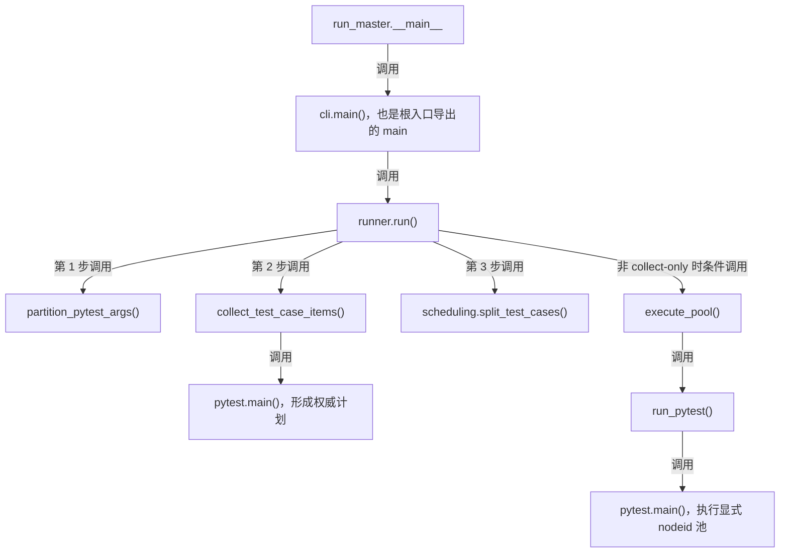
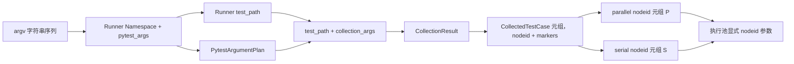
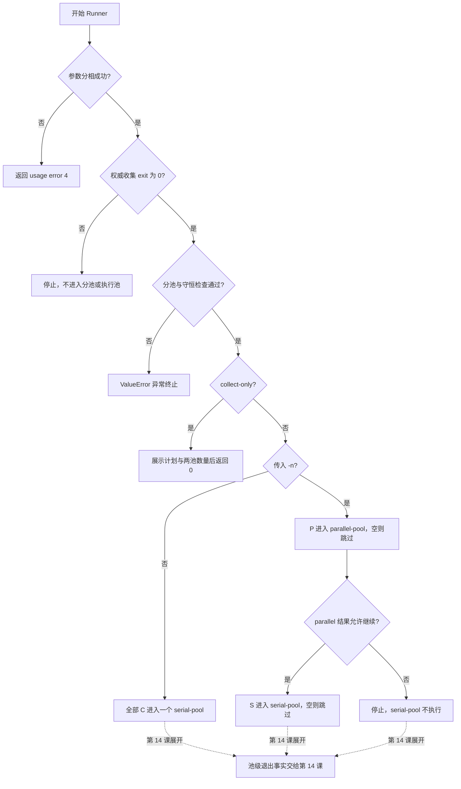

# 第 13 课：Runner 像车站调度系统

> 本课承接第 12 课：Task 决定一个业务动作怎样执行，Runner 决定很多测试怎样被可靠调度。核心不是“开几个 worker”，而是先形成一份不可变的权威 nodeid/marker 计划，再保证每个测试不丢、不重地进入正确执行池。

---

## 1. 课程信息

| 项目 | 内容 |
| --- | --- |
| 建议时长 | 60～90 分钟 |
| 核心问题 | 很多测试一起执行时，怎样保证不丢、不重，并让必须串行的测试进入独立串行阶段？ |
| 讲解重点 | CLI 分相、pytest 参数分相、权威收集、marker 计划、集合守恒、两种执行模式 |
| 代码入口 | `run_master.py`、`run_orchestration/cli.py`、`run_orchestration/runner.py`、`run_orchestration/pytest_execution.py`、`run_orchestration/scheduling.py` |
| 轻量验证 | 大纲指定的 3 个 Runner 离线测试文件，共 30 条测试 |
| 安全边界 | 只运行框架单元测试；不运行无目标 Runner，不收集或执行真实业务目录 |
| 课后产出 | 一张“权威收集 → 分池 → 执行”的集合流转图和一次三分钟复述 |

### 1.1 学完本课，你应该能够

1. 区分 Runner 自己的 CLI 参数和透传给 pytest 的参数。
2. 解释 `partition_pytest_args()` 为什么把选择参数只放进权威收集。
3. 说明 `collect_test_case_items()` 怎样取得最终 nodeid 和完整 marker 集合。
4. 用 `C = P ⊎ S` 验证并行池与串行池没有丢失、重叠或重复。
5. 区分“未传 `-n` 的单池串行执行”和“传入 `-n` 的并发优先、串行收尾”。
6. 准确说明 `--collect-only` 能证明什么、不能证明什么。

### 1.2 本课刻意不展开

- 不展开 pytest 退出码合并、JUnit、Allure 和 Runner execution result；第 14 课学习。
- 不展开 pytest-xdist 的调度算法、worker 崩溃恢复和性能调优。
- 不展开 Quality 身份、Metrics 或 Flaky；第三周学习。
- 不执行 `module/`、`module/smoke` 或任何真实接口测试。
- 不把 collect-only 当成 fixture setup、测试体或接口成功的证明。

### 1.3 课堂必讲路径

| 环节 | 对应章节 | 建议时间 |
| --- | --- | ---: |
| 问题、类比与核心约束 | 第 2～4 节 | 8～10 分钟 |
| 入口与单一所有权 | 第 5～6 节 | 10～12 分钟 |
| 参数分相与权威收集 | 第 7～9 节 | 18～21 分钟 |
| 集合守恒与执行模式 | 第 10～12 节 | 15～18 分钟 |
| 离线证据与课堂活动 | 第 13～14 节 | 10～12 分钟 |
| 总图、复述、小测与验收 | 第 15、17～18、20 节 | 9～12 分钟 |
| 缓冲与提问 | 全课 | 5 分钟 |

总计约 75～90 分钟。第 16 节误区用于穿插纠偏，不单独占用一轮讲解时间；第 7.2、9.2、10.3、12.1 节可选讲，更深的退出码分支留到第 14 课。

### 1.4 课堂最短路径

```text
第 2～5 节：分清 Runner 的输入、角色和唯一所有者
-> 第 7～8 节：追踪参数分相与一次权威收集
-> 第 10～11 节：验证 C = P ⊎ S 和两种执行模式
-> 第 13～14 节：观察离线证据并完成集合活动
-> 第 15、17、18、20 节：更新总图、复述、小测、验收
```

---

## 2. 承接第十二课：从一个业务动作转向一组测试

第 12 课解决的是变化边界：

```text
Test
-> 领域 Task 或 BaseTask 兼容入口
-> 领域 Request 或窄 Capability
-> Request Client
-> Response 与 Assertions
```

这条链回答“一个测试怎样完成业务动作”。

当测试数量增加后，先出现的是另一个问题：

```text
哪些测试属于本轮？
每个测试的稳定身份是什么？
哪些可以并行？
哪些必须避免 xdist 并发？
最终有没有漏掉或重复执行？
```

这些问题不应由 Task、Request 或 Assertions 回答。它们属于 Runner 的执行编排边界。

### 2.1 车站类比

可以把一次 Runner 调度理解成：

```text
目标目录与选择条件 = 本轮车票规则
pytest 权威收集 = 形成最终乘客名单
nodeid = 每位乘客的唯一票号
marker = 乘客携带的调度标签
parallel / serial = 两个互斥候车区
显式 nodeid 执行 = 按最终名单放行
```

类比的重点是“名单先确定，调度后进行”。

类比也有边界：执行池调用 pytest 时，pytest 仍会为显式 nodeid 完成正常的导入、收集准备和生命周期处理。所谓“不重新点名”是指 Runner 不再用 `-k`、`-m`、`--ignore` 重新计算全量选择结果，也不重新判断 serial marker；不是说执行阶段完全没有 pytest 收集行为。

---

## 3. 当前认知障碍与因果链

### 3.1 每个执行池重新应用一次选择条件

```text
并行池再次解释 -k / -m / --ignore
-> 串行池也再次解释同一组条件
-> 插件、导入状态或收集环境可能发生变化
-> 两个池看到的候选集合不再来自同一快照
-> 无法证明测试不丢、不重
```

正确方向是：选择条件只形成一次权威计划，执行池只接收最终 nodeid。

### 3.2 看见 `@pytest.mark.serial` 就认为一定“最后单独跑”

```text
用例带 serial marker
-> 误以为任何命令都会创建两个执行池
-> 忽略 -n 是并发优先模式的开关
-> 对实际调用次数和顺序作出错误判断
```

当前实现只有传入 `-n/--numprocesses` 时，才执行 parallel pool 后再执行 serial pool。未传 `-n` 时，所有权威 nodeid 进入同一个普通 pytest 调用。

### 3.3 把 collect-only 当成运行成功

```text
成功形成测试项
-> 误认为 fixture setup 已执行
-> 继续误认为 HTTP、测试体和 teardown 已验证
-> 把收集证据扩大成运行证据
```

collect-only 能证明参数化与收集钩子完成到足以形成测试项；fixture setup、测试体、HTTP 和 teardown 尚未执行。

### 3.4 从控制台文本重新统计最终计划

```text
解析 “N tests collected” 文本
-> 输出格式受 pytest 版本、插件和 verbosity 影响
-> 统计事实依赖展示文本
-> Runner 计划与后续机器产物可能漂移
```

当前 Runner 直接使用 `CollectionResult.cases`。控制台只是展示，不是计划事实来源。

### 3.5 TOC：本课真正的约束

系统目标不是“尽可能并发”，而是：

```text
对同一份已选择集合
-> 建立稳定身份
-> 只分类一次
-> 每个 nodeid 最多进入一个池
-> 每个已收集 nodeid 都进入最终计划
```

限制系统可靠性的瓶颈是“计划是否唯一且守恒”，不是 worker 数量。

解除约束的顺序：

```text
参数分相
-> 一次权威收集
-> 取得 nodeid + marker
-> 纯算法分池
-> 显式 nodeid 执行
```

---

## 4. 第一性原理：调度必须先有身份、全集和不变量

### 4.1 身份：nodeid

pytest nodeid 表达一个最终测试项，例如：

```text
module/example/test_api.py::TestChat::test_create[case-01]
```

它可以包含：

- 文件；
- 测试类；
- 测试函数；
- 参数化 ID。

Runner 不应该用函数名、文件名或控制台行号代替 nodeid，因为这些信息不足以唯一识别参数化后的测试项。

### 4.2 全集：权威收集集合 C

设权威收集得到的 nodeid 集合为 `C`。

`C` 已经应用本轮目标路径和已识别的选择条件，因此分池阶段不再决定“这个测试是否属于本轮”，只决定“这个已选测试进入哪个池”。

### 4.3 分类标签：markers

每个 `CollectedTestCase` 保存：

```text
nodeid: str
markers: frozenset[str]
```

marker 来自 pytest 最终测试项，不是 Runner 靠文件名猜测。当前 `_CaseCollector` 使用 `item.iter_markers()`，因此可以看到函数、类和模块层级作用到测试项上的 marker。

### 4.4 集合守恒

令：

```text
P = 未带指定 serial marker 的 nodeid
S = 带指定 serial marker 的 nodeid
```

必须同时满足：

```text
P ∩ S = ∅
P ∪ S = C
每个 nodeid 在 C 中唯一
```

可以简写为：

```text
C = P ⊎ S
```

符号 `⊎` 表示互斥并集。只有在 nodeid 唯一时，才可以进一步用数量检查：

```text
|C| = |P| + |S|
```

数量相等只是辅助证据；真正合同仍是唯一性、互斥和并集相等。

---

## 5. 五个角色与单一所有权

| 角色 | 当前职责 | 不负责什么 |
| --- | --- | --- |
| `run_master.py` | 本地与 Jenkins 的稳定根入口，重导出公共 API | 不实现 pytest 收集和分池 |
| `run_orchestration/cli.py` | 解析 Runner 参数，把未知参数保留给 pytest | 不决定测试属于哪个池 |
| `run_orchestration/runner.py` | 按顺序协调分相、收集、分池与执行 | 不直接解析 pytest 测试项 |
| `run_orchestration/pytest_execution.py` | 唯一调用 `pytest.main()`，拥有权威收集和池执行适配 | 不决定 serial 分类规则 |
| `run_orchestration/scheduling.py` | 对已收集对象执行纯分池与守恒检查 | 不调用 pytest，不读控制台文本 |

`master_service.py` 仍是稳定兼容门面：

- `collect_test_case_items()` 延迟委托给 `pytest_execution.py`；
- `split_test_cases()` 延迟委托给 `scheduling.py`；
- 旧调用方可以继续使用原公共导入。

它不是第二个收集实现，也不是第二个分池算法所有者。

### 5.1 为什么 `pytest.main()` 只能有一个代码所有者

如果多个模块都能直接启动 pytest：

```text
入口 A 有自己的参数处理
入口 B 有自己的插件与环境处理
入口 C 有自己的退出码处理
-> 同一个命令在不同入口产生不同执行事实
```

当前架构测试要求：在 `run_orchestration/` 内，只有 `pytest_execution.py` 出现 `pytest.main()` 调用。

这表示代码所有权唯一，不表示一次 Runner 运行只调用一次 pytest：

- 权威计划收集调用一次；
- 非 collect-only 模式下，每个非空执行池还会调用 pytest；
- 没有 `-n` 时只有一个执行池；
- 有 `-n` 时最多有 parallel、serial 两个执行池。

---

## 6. CLI 第一层分相：Runner 参数与 pytest 参数

`cli.parse_args()` 使用 `argparse.parse_known_args()`。

已知参数由 Runner 消费，未知参数保留为 `pytest_args`。

### 6.1 Runner 自己拥有的参数

| 参数 | 作用 |
| --- | --- |
| 位置参数 `target` | 本轮测试目标 |
| `--test-path` | 显式测试目标，优先于位置参数 |
| `-n/--numprocesses` | 启用并发优先模式并指定 xdist worker 数 |
| `--dist` | xdist 分发策略 |
| `--serial-marker` | 指定串行分类 marker，默认 `serial` |
| `--parallel-first` | 兼容参数；当前不会独立启用并发，仍需传入 `-n` |

目标路径优先级为：

```text
--test-path
-> 位置参数 target
-> 默认 module
```

默认 `module` 可能包含真实接口、付费请求或共享状态场景，因此课堂上禁止运行不带目标的 `run_master.py`。

### 6.2 透传给 pytest 的参数

例如只做纸面分析：

```powershell
.\.venv\Scripts\python.exe run_master.py module/example_model -n 2 -k selected -q
```

CLI 分相结果应理解为：

```text
test_path = module/example_model
numprocesses = 2
pytest_args = [-k, selected, -q]
```

这里不执行命令；它只是说明 `-n` 属于 Runner，而 `-k`、`-q` 继续进入第二层 pytest 参数分相。

---

## 7. pytest 第二层分相：`partition_pytest_args()`

输入是一串额外 pytest 参数，输出是 frozen `PytestArgumentPlan`：

```text
collection_args
execution_args
selection_args
collect_only
```

### 7.1 四类处理规则

| 参数类型 | 当前例子 | 权威收集 | 正式执行 |
| --- | --- | ---: | ---: |
| collect-only 控制 | `--collect-only`、`--co`、`--collectonly` | 转成布尔开关 | 不透传 |
| 选择条件 | `-k`、`-m`、`--ignore`、`--ignore-glob`、`--deselect` | 是 | 否 |
| 执行产物或 worker 参数 | `--junitxml`、`--alluredir`、`-n`、`--dist` | 否 | 是 |
| 未识别或插件参数 | 例如 `-q`、其他插件参数 | 是 | 是 |

从根 CLI 进入时，`-n/--numprocesses` 和 `--dist` 已在第一层被 Runner 消费，并通过 `runner.run()` 的独立参数传入；它们只有在调用方直接放进 `extra_pytest_args` 时，才由本函数按“执行参数”处理。表格描述的是 `partition_pytest_args()` 的完整公共合同，不表示普通 CLI 会重复传递 worker 参数。

`selection_args` 单独保留已识别的选择条件，供后续 Runner 执行事实记录；本课只关注它不会再次进入正式执行。

### 7.2 为什么未知参数要两边共享（选讲）

Runner 没有复制 pytest 和所有插件的完整参数解析器。

如果擅自把未知参数只放一边，可能破坏已有插件行为。因此当前策略是：

```text
已知选择参数 -> 只进入 collection_args
已知执行参数 -> 只进入 execution_args
未知/插件参数 -> collection_args 与 execution_args 都保留
```

这也构成一个边界：框架明确保证表中已识别的选择参数不会二次选测；未知插件参数若带有选择语义，其行为仍由插件负责，不能被讲成 Runner 已经理解了所有 pytest 插件。

### 7.3 当前离线测试中的参数示例

输入：

```text
-q
-k selected
--ignore=tests/ignored
--junitxml=reports/result.xml
--alluredir custom-allure
--collect-only
```

输出：

```text
collect_only = True

selection_args =
  -k selected
  --ignore=tests/ignored

collection_args =
  -q
  -k selected
  --ignore=tests/ignored

execution_args =
  -q
  --junitxml=reports/result.xml
  --alluredir custom-allure
```

选择参数缺少值时，`partition_pytest_args()` 抛出 `ValueError`；`runner.run()` 将其翻译为 pytest usage error 退出码 4。退出码的完整合并规则留到第 14 课。

---

## 8. `collect_test_case_items()`：形成唯一权威计划

### 8.1 实际 pytest 参数

函数内部组装：

```text
--collect-only
-q
-o addopts=
<collection_args>
<test_path>
```

其中 `-o addopts=` 清空配置文件中的默认 `addopts`，防止隐式 worker 或其他默认执行参数干扰本次显式计划收集。

然后调用：

```python
pytest.main(args, plugins=[collector])
```

Runner 的一次 `run()` 只调用一次该权威计划收集函数。

### 8.2 `_CaseCollector` 读取什么

插件在 `pytest_collection_finish(session)` 中遍历 `session.items`。

每个最终测试项被转换成：

```text
CollectedTestCase(
    nodeid=item.nodeid,
    markers=frozenset(marker.name for marker in item.iter_markers()),
)
```

因此权威计划不是控制台字符串，而是结构化对象。

### 8.3 `CollectionResult` 保存什么

```text
raw_pytest_exit_code
cases
stdout
stderr
```

- `cases` 是最终 `CollectedTestCase` 元组；
- stdout、stderr 用于收集失败诊断；
- 原始退出码决定是否允许进入分池；
- 控制台文字不参与分池计算。

如果 pytest 产生重复 nodeid，collector 记录重复项并抛出 `RuntimeError`。这在分池前阻止一个身份被静默折叠。

### 8.4 “唯一权威收集”的准确含义

它表示：

```text
target + 已识别选择条件
-> 只在计划阶段共同决定最终 nodeid/marker 集合
-> scheduling 只消费该集合
-> 执行池不再接收这些已识别选择条件
```

它不表示：

- 整个 Runner 生命周期只调用一次 pytest；
- 显式 nodeid 执行时 pytest 不再导入测试模块；
- 执行阶段不再形成 pytest item；
- 任意未知插件参数都绝不影响执行；
- collect-only 已经完成 fixture setup。

---

## 9. Marker 是收集事实，不是文件名规则

### 9.1 三个层级都可能贡献 marker

```python
pytestmark = pytest.mark.file_marker

@pytest.mark.class_marker
class TestExample:
    @pytest.mark.serial
    def test_case(self):
        pass
```

`item.iter_markers()` 会使该测试项看到：

```text
file_marker
class_marker
serial
```

同文件内另一个没有函数级 `serial` 的测试仍可继承 `file_marker`，但不会凭空得到 `serial`。

### 9.2 自定义串行 marker（选讲）

`split_test_cases(cases, serial_marker=...)` 不把字符串 `serial` 写死在算法中。

默认值来自 `DEFAULT_SERIAL_MARKER = "serial"`；CLI 可以通过 `--serial-marker` 修改本轮分类标签。

### 9.3 Marker 只决定池，不决定是否属于本轮

是否属于本轮已经由 target、`-k`、`-m` 等条件在权威收集中决定。

分池阶段只做：

```text
指定 serial marker 在 case.markers 中？
├─ 是 -> serial pool
└─ 否 -> parallel pool
```

---

## 10. `split_test_cases()`：纯分池与集合守恒

### 10.1 当前算法

```text
建立空的 parallel、serial、seen
-> 按权威收集顺序遍历每个 case
-> nodeid 已在 seen：立即报重复
-> 加入 seen
-> 带指定 serial marker：加入 serial
-> 否则：加入 parallel
-> 检查两池交集为空
-> 检查两池并集等于 seen
-> 返回两个 tuple
```

它不调用 pytest、不访问文件系统、不解析控制台，也不创建 worker。

### 10.2 三道门禁

第一道：输入唯一。

```text
同一 nodeid 第二次出现
-> ValueError: duplicate nodeid in execution plan
```

第二道：池互斥。

```text
set(parallel) ∩ set(serial) = ∅
```

第三道：并集完整。

```text
set(parallel) ∪ set(serial) = seen
```

### 10.3 顺序边界（选讲）

算法按权威收集顺序 append，因此每个池内部的 nodeid 顺序保持稳定。

但传入 `-n` 后，parallel pool 内的实际完成顺序由 pytest-xdist 调度，不等于 nodeid 列表顺序。稳定的是计划顺序，不是并发完成时间。

---

## 11. 三种控制模式

### 11.1 collect-only：只展示计划，不进入执行池

权威收集成功并完成分池后，Runner 输出：

```text
Collected test cases: N
- <nodeid 1>
- <nodeid 2>
...
Parallel pool cases: P
Serial pool cases: S
N tests collected
```

然后返回 0。

此路径不会：

- 调用 `execute_pool()`；
- 准备 Runner 的 Allure 生命周期；
- 创建 Quality run_id 或质量产物；
- 写正式 Runner execution result。

但导入 `runner.py` 时仍会导入并校验普通框架 `config.py`。所以首次离线运行仍需合法环境模板；“Quality 未加载”不能扩大成“任何配置都不需要”。

### 11.2 未传 `-n`：一个普通串行池

Runner 虽然已经计算 `parallel_cases` 和 `serial_cases`，但实际执行使用权威计划的全部 `case_nodeids`：

```text
execute_pool(
    stage_id="serial-pool",
    planned_nodeids=case_nodeids,
    ...
)
```

结果是：

- 只启动一次正式 pytest；
- 所有测试按普通 pytest 模式执行；
- serial marker 不会再创建第二个收尾池；
- 每个权威 nodeid 仍只进入这一个执行池。

### 11.3 传入 `-n`：并发优先、串行收尾

正常路径为：

```text
parallel_cases 非空
-> 添加 -n <workers> 与可选 --dist
-> 执行 parallel-pool
-> parallel 结果允许继续
-> serial_cases 非空
-> 移除 -n / --numprocesses / --dist
-> 单进程执行 serial-pool
```

空池不会启动 pytest：

- parallel 为空：跳过 parallel，仍可运行 serial；
- serial 为空：只运行 parallel；
- 两池的 nodeid 都来自同一权威集合。

“串行”在这里准确表示 Runner 不为该池传入 xdist 并发参数。它不是跨 Jenkins Job、跨进程或跨机器的全局锁。

parallel pool 返回普通测试失败 1 时，当前实现仍会运行 serial pool，以便收集更多失败证据；返回 2、3、4、5 或发生 Runner 执行异常时会停止后续池。为什么这样合并退出事实，由第 14 课展开。

### 11.4 执行池怎样消费最终计划

`execute_pool()` 组装：

```text
args = [*planned_nodeids, *effective_execution_args]
```

然后通过 `run_pytest(args)` 调用 pytest。

因此正式执行的第一输入是显式 nodeid，而不是原始 target、`-k`、`-m` 或 `--ignore`。

pytest 仍会为这些显式 nodeid 完成正常收集准备；区别是候选范围已经被权威计划锁定，Runner 不再重新解释已识别选择条件或重新分池。

---

## 12. 进入分池前后的控制门

### 12.1 参数门（选讲，第 14 课前置）

已识别的带值参数缺少值：

```text
partition_pytest_args()
-> ValueError
-> runner.run() 输出 Invalid pytest arguments
-> 返回 usage error 4
```

此时不会开始权威收集。

### 12.2 收集门

只有 `CollectionResult.raw_pytest_exit_code == 0` 才进入分池。

```text
收集异常
-> 返回 Runner 失败

收集原始退出码非 0
-> 不分池、不执行测试池

收集成功
-> 取得 cases
-> split_test_cases()
```

权威空集合对应 pytest exit 5，不应被解释成“0 条测试所以成功”。完整退出码与执行事实记录留到第 14 课。

### 12.3 分池门

分池的输入不是任意字符串列表，而是已收集的 `CollectedTestCase` 序列。

只有唯一性、互斥和并集检查全部成立，才能把 nodeid 交给执行阶段。

---

## 13. 轻量验证：30 条 Runner 离线测试

### 13.1 为什么安全

本课使用大纲指定文件：

```text
tests/test_master_service_parallel_serial.py
tests/test_run_orchestration_boundaries.py
tests/test_run_orchestration_public_contract.py
```

这些测试使用临时测试文件、内存 `CollectionResult`、monkeypatch 和 AST 检查；不会调用真实模型、账单或业务接口。但“无外部网络”不自动等于“不会覆盖本地运行产物”，因此还必须隔离内外两层 pytest：

- `tests/conftest.py` 的 autouse fixture 把嵌套 `run_master.run()` 的默认 Allure raw 和 `execution-result.json` 重定向到当前测试的 `tmp_path`；
- `tests/conftest.py` 在测试模块导入前把进程级报告与历史报告开关设为关闭；外层命令也显式设置相同开关，避免 `.env.example` 的默认报告配置生效；
- 外层课堂命令再使用独立的 `--basetemp` 和 `--alluredir`，不能指望外层 `--alluredir` 自动传给嵌套 Runner。

### 13.2 安全命令

导入框架配置前先指向合法模板，临时关闭 Quality、Allure HTML 和 history，并为外层 pytest 创建独立临时目录。命令结束后逐值恢复调用者原环境，只在确认目标是本次系统临时目录的直接子目录后递归清理：

```powershell
$environmentNames = @(
  'API_CASE_DOTENV_PATH',
  'QUALITY_ENABLE',
  'GENERATE_ALLURE_REPORT',
  'GENERATE_HISTORY_REPORT'
)
$previousEnvironment = @{}
foreach ($name in $environmentNames) {
  $previousEnvironment[$name] =
    [Environment]::GetEnvironmentVariable(
      $name,
      [EnvironmentVariableTarget]::Process
    )
}

$tempBase = (Get-Item -LiteralPath ([IO.Path]::GetTempPath())).FullName
$tempRoot = Join-Path `
  $tempBase `
  ('api-case-lesson13-' + [guid]::NewGuid().ToString('N'))
$pytestTemp = Join-Path $tempRoot 'pytest'
$outerAllure = Join-Path $tempRoot 'outer-allure-results'
New-Item -ItemType Directory -Path $tempRoot -Force | Out-Null
$pytestExitCode = 1

try {
  [Environment]::SetEnvironmentVariable(
    'API_CASE_DOTENV_PATH',
    '.env.example',
    [EnvironmentVariableTarget]::Process
  )
  [Environment]::SetEnvironmentVariable(
    'QUALITY_ENABLE',
    '0',
    [EnvironmentVariableTarget]::Process
  )
  [Environment]::SetEnvironmentVariable(
    'GENERATE_ALLURE_REPORT',
    'FALSE',
    [EnvironmentVariableTarget]::Process
  )
  [Environment]::SetEnvironmentVariable(
    'GENERATE_HISTORY_REPORT',
    'FALSE',
    [EnvironmentVariableTarget]::Process
  )

  & .\.venv\Scripts\python.exe -m pytest `
    tests/test_master_service_parallel_serial.py `
    tests/test_run_orchestration_boundaries.py `
    tests/test_run_orchestration_public_contract.py `
    --basetemp $pytestTemp `
    --alluredir $outerAllure `
    -q -p no:cacheprovider
  $pytestExitCode = $LASTEXITCODE
}
finally {
  foreach ($name in $environmentNames) {
    [Environment]::SetEnvironmentVariable(
      $name,
      $previousEnvironment[$name],
      [EnvironmentVariableTarget]::Process
    )
  }

  if (Test-Path -LiteralPath $tempRoot) {
    $resolvedTempRoot = (Get-Item -LiteralPath $tempRoot).FullName
    $resolvedParent = Split-Path -Parent $resolvedTempRoot
    $resolvedLeaf = Split-Path -Leaf $resolvedTempRoot
    if (
      $resolvedParent -eq $tempBase -and
      $resolvedLeaf -like 'api-case-lesson13-*'
    ) {
      Remove-Item -LiteralPath $resolvedTempRoot -Recurse -Force
    }
    else {
      Write-Warning "Refused to clean unexpected path: $resolvedTempRoot"
    }
  }
}

if ($pytestExitCode -ne 0) {
  throw "Lesson 13 offline tests failed: $pytestExitCode"
}
```

当前实测：

```text
30 passed
```

### 13.3 与本课直接相关的证明范围

这些测试明确覆盖：

- 函数、类和模块 marker 能进入 `CollectedTestCase.markers`；
- 默认 `serial` marker 能把样例计划分成两个池；
- 未传 `-n` 时全部样例 nodeid 只进入一个执行调用；
- 传入 `-n` 时 parallel pool 先于 serial pool；
- parallel 或 serial 空池不会启动多余执行；
- collect-only 在权威收集之后不会进入正式 `run_pytest` 执行路径；
- 已识别选择参数与执行参数按阶段分开；
- `run_master.py` 公共入口保持稳定；
- `pytest.main()` 在 orchestration 包内只有 `pytest_execution.py` 一个代码所有者。

其中部分测试还覆盖退出码、JUnit、Allure、Quality 降级和执行事实写入；这些属于第 14 课，不因“30 条通过”而在本课提前展开。

### 13.4 不能证明什么

30 条通过不能证明：

- 真实 pytest-xdist worker 已产生预期性能提升；
- 任意业务 fixture setup、测试体或 teardown 可用；
- 当前真实业务目录的并发/串行数量是多少；
- 真实接口不会失败或不会产生费用；
- 未识别插件参数绝不带选择语义；
- serial pool 能阻止其他进程或其他 Jenkins Job 并发访问共享资源；
- 所有退出码、JUnit 和 Allure 证据都已在本课解释完成。

`test_run_collect_only_prints_pool_counts_without_execution` 使用模拟的权威收集结果，并断言后续正式 `run_pytest` 不应被调用。它证明 Runner 的早停边界，不证明 pytest 收集阶段会执行 fixture setup；后者本来就不在 collect-only 阶段发生。

---

## 14. 课堂活动：为一份权威计划分池

### 14.1 题目

假设 `-k selected` 已经在权威收集阶段完成，最终 `CollectionResult.cases` 按顺序包含：

| 编号 | nodeid | markers |
| --- | --- | --- |
| A | `test_api.py::test_selected_health` | `{}` |
| B | `test_billing.py::test_selected_charge` | `{serial}` |
| C | `test_media.py::TestCreate::test_selected_create[image]` | `{smoke}` |
| D | `test_account.py::test_selected_balance` | `{serial}` |

回答：

1. `P` 与 `S` 分别是什么？
2. 如何证明 `C = P ⊎ S`？
3. 未传 `-n` 时会启动几个正式执行池？
4. 传入 `-n 2` 时正常执行顺序是什么？
5. 正式执行参数中还应不应该带 `-k selected`？
6. collect-only 输出四个测试项，能否证明 `test_charge` 的 fixture 可用？

### 14.2 参考答案

```text
P = [A, C]
S = [B, D]
```

守恒检查：

```text
P ∩ S = ∅
P ∪ S = {A, B, C, D} = C
四个 nodeid 均唯一
```

未传 `-n`：

```text
一个 serial-pool
planned_nodeids = [A, B, C, D]
```

传入 `-n 2` 的正常路径：

```text
parallel-pool [A, C]，带 -n 2
-> parallel 结果允许继续
-> serial-pool [B, D]，不带 xdist 参数
```

`-k selected` 已经参与权威收集，不再进入正式执行参数。collect-only 没有执行 fixture setup，所以不能证明 fixture 可用。

### 14.3 验收重点

答案不能只写“2 个并发、2 个串行”，还必须指出：

- 选择已经发生；
- nodeid 是执行输入；
- 两池互斥且并集完整；
- `-n` 决定是否真的分两阶段执行；
- collect-only 证明范围止于收集计划。

---

## 15. 第十三版累积关系图组

本课继续把函数调用、对象流和控制结果分开。相同节点出现在不同图中，是因为三个图回答不同问题，不代表箭头可以混用。

### 15.1 函数调用链：谁调用谁



每条实线只表示函数调用。`partition_pytest_args()`、`collect_test_case_items()` 和 `split_test_cases()` 都返回对象给 `runner.run()`；它们彼此不按图中编号互相调用。

### 15.2 对象流：计划怎样变化



这里的箭头只表示输入被解析、转换或传递成下一个对象。它不表示 `PytestArgumentPlan` 自己调用 `CollectionResult`，也不表示两个池在同一时刻执行。

### 15.3 控制结果：何时停止、展示或执行



这张图只表示控制分支和结果，不表示对象流。当前 `split_test_cases()` 位于 Runner 主执行 `try` 之外；如果重复 nodeid 或守恒门禁触发 `ValueError`，异常会直接向调用方传播，不会被翻译成标准 Runner 退出码。正常权威收集已先拒绝重复 nodeid，这一分支仍是分池算法面对损坏或注入计划时的防御边界。`parallel 结果允许继续` 的详细退出码规则是下一课内容。

### 15.4 集合关系

```text
权威计划 C
├─ P：不含指定 serial marker
└─ S：含指定 serial marker

P ∩ S = ∅
P ∪ S = C
C = P ⊎ S
```

集合关系不使用函数调用箭头，因为它表达的是成员归属与不变量。

---

## 16. 常见误区

### 误区一：`run_master.py` 自己实现了全部 Runner 逻辑

错误。它是稳定根入口；CLI、协调、pytest 生命周期和分池分别有独立所有者。

### 误区二：唯一权威收集表示整个运行只调用一次 pytest

错误。权威计划只形成一次；每个非空执行池还会用显式 nodeid 调用 pytest。

### 误区三：执行池完全不发生 pytest 收集

错误。pytest 仍处理显式 nodeid；Runner 只是不会再次用已识别选择条件计算全量计划。

### 误区四：所有 pytest 参数都应该同时传给收集和执行

错误。`-k/-m/--ignore/--deselect` 等已识别选择参数只进入权威收集。

### 误区五：Runner 已理解所有插件参数语义

错误。未知或插件参数被两阶段共享，框架没有复制所有插件的解析器。

### 误区六：带 serial marker 就一定有第二个执行池

错误。只有传入 `-n` 才执行并发优先、串行收尾；未传时全部 nodeid 进入一个普通串行池。

### 误区七：serial pool 是全局互斥锁

错误。它只表示当前 Runner 不为该池传 xdist 参数，不能约束其他进程或其他构建。

### 误区八：控制台显示的 collected 数量是机器计划来源

错误。机器计划来自 `CollectionResult.cases`；控制台只是人类可读展示。

### 误区九：数量相等就足以证明集合守恒

错误。两个池可能一边重复、一边漏项但数量碰巧相等；还必须验证唯一、互斥和并集。

### 误区十：collect-only 成功证明 fixture 可用

错误。fixture setup 尚未执行，其依赖、资源和结果都未验证。

### 误区十一：master_service.py 是第二个权威收集所有者

错误。它是兼容门面，真实收集仍委托 `pytest_execution.py`。

### 误区十二：parallel 列表顺序等于测试完成顺序

错误。计划顺序保持稳定；xdist 下的实际完成顺序可能不同。

---

## 17. 三分钟复述

```text
run_master.py 是稳定根入口。cli.parse_args() 先把 target、-n、--dist 和 serial marker 等 Runner 参数取出，未知参数保留给 pytest。runner.run() 再调用 partition_pytest_args()，把已识别选择参数只放进权威收集，把 JUnit、Allure 和 worker 等执行参数放进正式执行；未知插件参数为兼容而两边共享。

collect_test_case_items() 使用 --collect-only、-q 和清空 addopts 的参数调用 pytest.main()。_CaseCollector 从 session.items 取得每个最终测试项的 nodeid 和 iter_markers() 结果，形成 CollectionResult。控制台文本只用于展示和诊断，不是计划来源。

scheduling.split_test_cases() 对同一份 CollectedTestCase 序列做纯分类。带指定 serial marker 的进入 S，其余进入 P，并检查 nodeid 唯一、P 与 S 交集为空、两池并集等于权威集合 C，也就是 C = P ⊎ S。

collect-only 在分池后打印计划并停止，不执行 fixture setup、测试体或 HTTP。未传 -n 时全部 C 进入一个普通串行池；传入 -n 时 P 使用 xdist 先执行，结果允许继续后 S 不带 xdist 执行。执行池接收显式 nodeid，不再接收已识别选择条件，但 pytest 仍会完成显式 nodeid 的正常收集准备。

本课只证明计划和调度边界。池级原始退出码、JUnit、Allure 和 Runner 最终执行事实在第 14 课展开。
```

---

## 18. 课堂小测

1. 本轮测试全集由谁形成？A 控制台解析 / B pytest 权威收集（B）
2. `-k` 当前进入哪一阶段？A 只进权威收集 / B 只进正式执行（A）
3. `--junitxml` 当前进入哪一阶段？A 权威选择 / B 正式执行（B）
4. 未识别插件参数怎样处理？A 丢弃 / B 两阶段共享（B）
5. `P ∩ S` 应等于什么？A `C` / B 空集（B）
6. 未传 `-n` 时 serial marker 会创建第二个池吗？A 会 / B 不会（B）
7. collect-only 会执行 fixture setup 吗？A 会 / B 不会（B）
8. 唯一权威收集表示执行池不再处理显式 nodeid 吗？A 是 / B 否（B）
9. serial pool 能锁住另一个 Jenkins Job 吗？A 能 / B 不能（B）
10. 计划顺序能否保证 xdist 完成顺序？A 能 / B 不能（B）

---

## 19. 课后作业：完成集合流转图，不写代码

### 19.1 必做内容

1. 在累积图中增加“CLI 分相 → 权威收集 → `C = P ⊎ S` → 执行模式”节点，并区分调用、对象流和控制结果。
2. 使用第 14 节四个 nodeid 完成一张集合守恒检查表。
3. 完成一次三分钟复述，必须说明“唯一权威收集”和“执行阶段正常收集准备”的区别。

### 19.2 不要求完成

- 不新增 Runner 代码或测试。
- 不运行真实业务目录。
- 不测 xdist 性能。
- 不生成 JUnit 或 Allure 报告。
- 不提前分析全部退出码合并规则。

---

## 20. 验收标准

完成本课后，应能回答：

1. 为什么选择条件不能在两个池中重新解释？
2. CLI 参数分相和 pytest 参数分相分别解决什么问题？
3. `PytestArgumentPlan` 的四个字段是什么？
4. `CollectionResult.cases` 为什么比控制台 collected 文本更权威？
5. `_CaseCollector` 从哪里取得 nodeid 和 markers？
6. 为什么 marker 分类必须发生在权威收集之后？
7. `C = P ⊎ S` 包含哪三个检查？
8. 未传 `-n` 与传入 `-n` 的执行方式有什么区别？
9. 为什么“唯一权威收集”不等于“pytest 只收集一次”？
10. collect-only 为什么不能证明 fixture 或真实接口可用？
11. 当前 30 条离线测试证明了哪些调度合同？
12. 哪些退出码会阻断 serial pool，为什么本课不展开最终合并？

合格答案必须包含：

- nodeid + marker 的结构化计划；
- 已识别选择参数只进入权威收集；
- `P ∩ S = ∅`、`P ∪ S = C` 和 nodeid 唯一；
- `-n` 是两阶段执行开关；
- collect-only 不进入 setup、call、teardown；
- 执行池消费显式 nodeid，但 pytest 仍做正常准备；
- 退出与报告证据留到第 14 课。

---

## 21. 下一课接口

本课已经回答：

```text
哪些测试属于本轮
-> 怎样取得 nodeid + marker
-> 怎样分成互斥且完整的两个池
-> 怎样按一个池或两个池执行
```

但“调用已经结束”还不等于“结果已经被可信保存”。下一课需要回答：

```text
parallel 与 serial 各自返回什么原始退出码？
哪些退出码允许继续，哪些必须停止？
JUnit 保存什么统计事实？
Allure 为什么每池写临时 raw，最后只合并一次？
Runner execution result 与 pytest 原始事实是什么关系？
```

第 14 课进入：

```text
PoolExecutionResult
-> pytest 原始退出码
-> Runner 最终退出码
-> JUnit / Allure
-> 第二周答辩
```

Runner 的调度目标是“不丢、不重、分对池”；第 14 课的证据目标是“不篡改原始结果，并让后续系统能够消费”。
