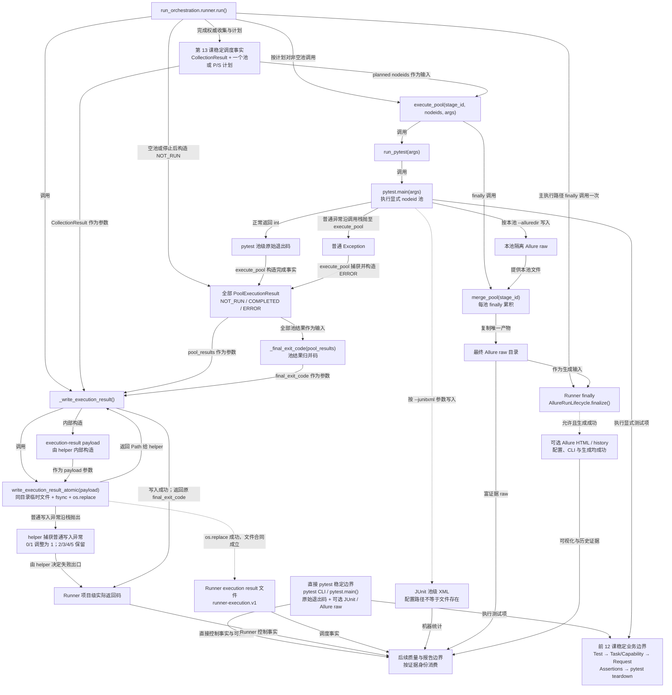
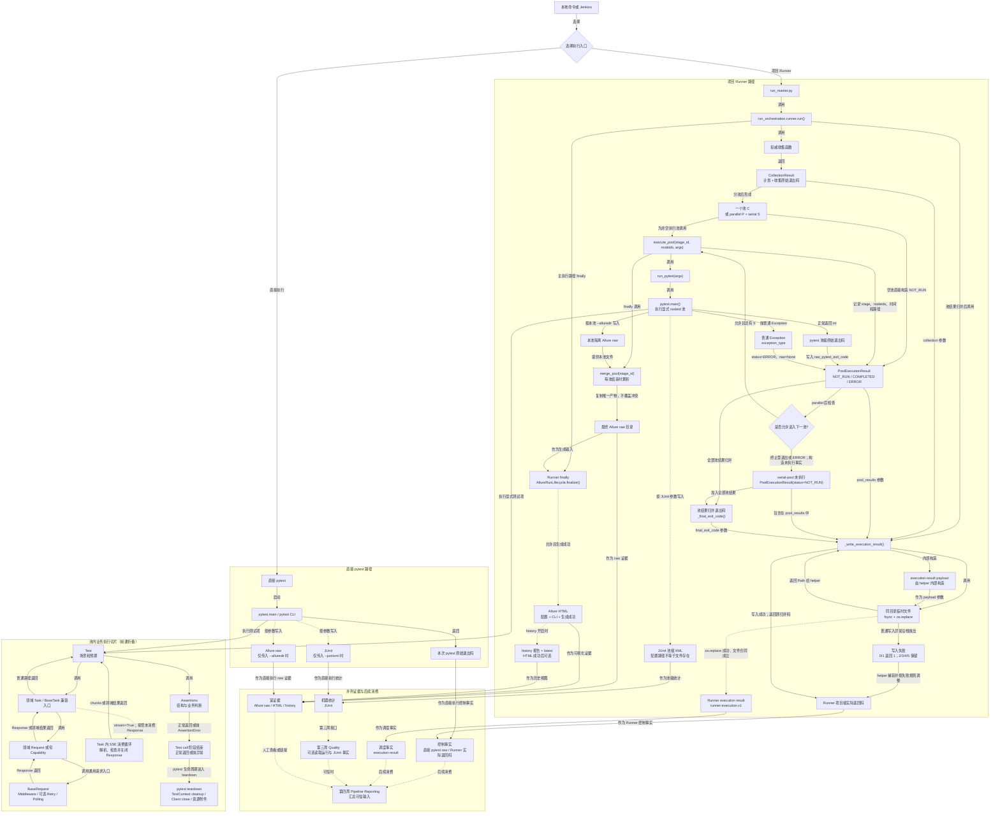

# 第 14 课：退出码、JUnit、Allure 与第二周答辩

> 本课承接第 13 课：Runner 已经形成权威计划并按一个池或两个池执行。第 14 课回答“执行之后怎样留下可信事实”：pytest 池级原始退出码、`PoolExecutionResult`、Runner 项目级最终退出码、JUnit、Allure 和 Runner execution result 分别证明什么，哪些关系可以串联，哪些证据必须保持并列。

---

## 1. 课程信息

| 项目 | 内容 |
| --- | --- |
| 建议时长 | 60～90 分钟 |
| 核心问题 | 测试已经结束时，怎样既保留 pytest 原始事实，又生成可被 Jenkins、Allure 和后续治理消费的项目级证据？ |
| 讲解重点 | 池级退出码、继续/停止门禁、项目级归并、PoolExecutionResult、execution-result、JUnit、Allure raw/HTML/history |
| 代码入口 | `run_orchestration/pytest_execution.py`、`run_orchestration/runner.py`、`run_orchestration/artifacts.py`、`run_orchestration/allure_lifecycle.py`、`module/conftest.py` |
| 轻量验证 | 30 条精确离线测试，只验证退出与产物合同，不执行真实业务接口 |
| 安全边界 | 使用仓库内专用 `--basetemp`；关闭真实 HTML/history 生成；所有 Runner 默认产物由测试 fixture 重定向 |
| 课后产出 | 一张证据并列图、一张退出码决策表和一次第二周三分钟答辩 |

### 1.1 学完本课，你应该能够

1. 区分 pytest 池级原始退出码、`PoolExecutionResult` 和 Runner 项目级最终退出码。
2. 解释退出码 `1` 为什么允许继续串行池，而 `2/3/4/5` 为什么会停止后续池。
3. 说明 `CollectionResult + PoolExecutionResult + 最终退出码` 怎样形成 Runner execution result，以及写入失败怎样影响出口。
4. 区分 JUnit、Allure raw、Allure HTML、history 和 Runner execution result 的证据职责。
5. 沿第二周总图复述 Retry、Polling、SSE、TestContext、Capability、Runner 与证据产物之间的边界。

### 1.2 本课刻意不展开

- 不展开 JUnit XML 的完整元素规范和 Jenkins 插件实现。
- 不安装或真实调用 Allure CLI；课堂测试使用 Fake 生成器或关闭 HTML/history。
- 不展开 Quality 归并、完整性判断和 Pipeline Reporting；第三、四周学习。
- 不执行 `module/`、`module/smoke` 或任何真实模型、媒体、余额、usage 用例。
- 不把 Allure 生成失败改造成新的业务测试失败规则。
- 不修改当前退出码优先级和产物 Schema。

### 1.3 课堂必讲路径

| 环节 | 对应章节 | 建议时间 |
| --- | --- | ---: |
| 问题、约束与证据分类 | 第 2～4 节 | 8～10 分钟 |
| 原始退出码、池结果与归并 | 第 5～8 节 | 15～17 分钟 |
| execution-result 与 JUnit | 第 9～11 节 | 12～14 分钟 |
| Allure 与失败边界 | 第 12～13 节 | 14～16 分钟 |
| 离线证据与课堂活动 | 第 14～15 节 | 9～11 分钟 |
| 累积总图、第二周串讲、复述与 6 道小测 | 第 16～20 节 | 12～14 分钟 |
| 缓冲与提问 | 全课 | 5 分钟 |

总计约 75～87 分钟。第 16.2～16.3 节完整图和详细读图规则只供教师备课或课后复盘；课堂只讲第 16.1 节压缩证据图。第 18 节误区只穿插讲误区一、二、五、七、八，其余作为教师题库；第 20.2 节教师清单不要求课堂逐条作答。

### 1.4 课堂最短路径

```text
第 2～4 节：先分清不同证据回答什么问题
-> 第 5～8 节：计算池级退出与 Runner 最终出口
-> 第 9～12 节：区分 execution-result、JUnit 与 Allure 生命周期
-> 第 13～15 节：判断失败边界并完成离线活动
-> 第 16～20 节：更新累积总图、完成第二周复述和小测
```

---

## 2. 承接第十三课：调度结束不等于证据已经可信保存

第 13 课已经回答：

```text
哪些测试属于本轮
-> 怎样形成 CollectionResult
-> 怎样得到 C = P ⊎ S
-> 未传 -n 时 C 进入一个池
-> 传入 -n 时 P、S 进入两个阶段
```

但执行结束后仍有六个不同问题：

```text
pytest 进程返回了什么？
某个执行池是否真正启动并正常返回？
多个池最终应该返回哪个项目级退出码？
每个 testcase 的统计事实在哪里？
附件、步骤和富诊断在哪里？
Runner 怎样保存本轮计划与池级事实？
```

如果把这些问题压缩成一句“报告生成了”，就无法判断失败发生在测试、Runner、文件写入还是报告工具。

---

## 3. 当前认知障碍与因果链

### 3.1 把最后一个池的退出码当成最终退出码

```text
parallel 返回 1
-> serial 返回 0
-> 只看最后一个 0
-> 整轮被误判为成功
```

项目级出口必须归并全部已执行池，而不是覆盖前一个事实。

### 3.2 把 `COMPLETED` 理解成“测试通过”

```text
pytest.main() 正常返回 1
-> execute_pool() 没有抛 Python 异常
-> PoolExecutionStatus.COMPLETED
-> 误解为测试通过
```

`COMPLETED` 只表示池调用正常结束；测试是否通过仍由 `raw_pytest_exit_code` 判断。

### 3.3 把 JUnit、Allure 和 execution-result 串成一条下游链

```text
Runner 最终退出码
-> JUnit
-> Allure
-> execution-result
```

这是错误模型。JUnit 和 Allure 都由 pytest 执行阶段产生；Runner execution result 则由 CollectionResult、PoolExecutionResult 和最终退出码组合写入。三者是并列证据，不是谁生成谁。

### 3.4 把 Allure raw 当成 HTML 报告

```text
存在 allure-results
-> 误以为 allure-report/index.html 已生成
```

raw 是生成报告的输入。HTML 还依赖配置、Allure CLI 和生成命令成功；history 又依赖 HTML 成功后继续执行。

### 3.5 报告失败全部 fail-open 或全部 fail-closed

```text
“报告只是观察”
-> 所有文件写失败都忽略
-> 可能返回虚假成功

“产物很重要”
-> 任意 Allure 展示失败都覆盖 pytest 退出码
-> 业务事实被展示工具篡改
```

不同产物必须按合同分级：Runner execution result 是项目级执行合同，写失败不能制造成功；Allure HTML/history 是派生展示，当前实现对普通异常 fail-open。

### 3.6 TOC：本课真正的约束

第二周的瓶颈不再是“测试能否运行”，而是“多个事实出口能否保持一致且不互相覆盖”：

```text
同一轮运行产生多个事实
-> 如果职责不清
-> 后生成的文件覆盖前面的退出事实
-> Jenkins、人工报告和后续治理看到不同结论
```

解除约束的规则：

```text
pytest 原始退出码 -> 原样保留池级事实
PoolExecutionResult -> 描述池调用状态
Runner 最终退出码 -> 只做明确归并
execution-result -> 保存计划、池事实和最终出口
JUnit -> 保存 testcase 统计
Allure -> 保存步骤、附件与可视化证据
```

---

## 4. 第一性原理：一种证据只回答一种问题

| 证据 | 核心问题 | 不能替代什么 |
| --- | --- | --- |
| `CollectionResult` | 本轮计划收集是否成功，最终 nodeid/marker 是什么 | 不能证明测试已执行 |
| `PoolExecutionResult` | 某个池是否运行、是否抛 Runner 异常、原始退出码和配置的 JUnit 路径是什么 | 不能提供 testcase 统计 |
| Runner 最终退出码 | 调用方应把整轮运行视为成功、测试失败还是终止错误 | 不能解释每个用例为什么失败 |
| Runner execution result | 本轮目标、选择条件、计划、池级事实和最终出口是什么 | 不能替代 JUnit 或 Allure 内容 |
| JUnit XML | testcase 数量、失败、错误、跳过和耗时等机器统计 | 不能保存完整步骤和附件 |
| Allure raw / HTML / history | 步骤、附件、标签和人类可读诊断怎样展示 | 不能成为退出码权威来源 |

### 4.1 同一轮运行允许同时存在多个真相维度

例如：

```text
parallel pytest 正常返回 1
serial pytest 正常返回 0
-> 两个 PoolExecutionResult 都是 COMPLETED
-> Runner 最终退出码是 1
-> 两份 JUnit 可以分别记录两个池的 testcase 统计
-> 两池 Allure raw 累积进入同一个最终 raw 目录
-> execution-result 保存两个池和 final_exit_code=1
```

这些事实不矛盾，因为它们回答的问题不同。

### 4.2 证据关系必须先区分“来源”与“消费”

```text
pytest 执行
├─ 返回原始退出码
├─ 按参数写 JUnit
└─ 按参数写 Allure raw

Runner
├─ 用原始退出码构造 PoolExecutionResult
├─ 归并最终退出码
└─ 用计划、池结果和最终退出码写 execution-result
```

JUnit、Allure 与 execution-result 不应画成连续调用链。

---

## 5. pytest 池级原始退出码

当前框架显式命名 pytest 的六个标准退出码：

| 退出码 | 当前常量 | 含义 |
| ---: | --- | --- |
| 0 | `PYTEST_EXIT_OK` | pytest 调用成功且没有测试失败 |
| 1 | `PYTEST_EXIT_TESTS_FAILED` | 至少一个测试失败 |
| 2 | `PYTEST_EXIT_INTERRUPTED` | 执行被中断 |
| 3 | `PYTEST_EXIT_INTERNAL_ERROR` | pytest 内部错误 |
| 4 | `PYTEST_EXIT_USAGE_ERROR` | 命令或参数使用错误 |
| 5 | `PYTEST_EXIT_NO_TESTS_COLLECTED` | 没有收集到测试 |

### 5.1 哪些属于终止型退出码

当前集合：

```text
PYTEST_TERMINATING_EXIT_CODES = {2, 3, 4, 5}
```

它们表示后续池不应继续，因为继续执行可能失去明确意义，或运行环境已经不可信。

### 5.2 为什么退出码 1 不立即停止串行池

测试失败 `1` 表示 pytest 仍正常完成了本池执行。当前 Runner 选择继续串行池，以收集更多失败证据：

```text
parallel raw exit = 1
-> 不属于 terminating set
-> serial pool 继续
-> 最终归并仍为 1
```

“继续”不等于忽略失败，只是延迟到项目级出口统一表达。

### 5.3 非标准非零退出码怎样处理

`merge_exit_codes()` 遇到非 `0/1/2/3/4/5` 的非零值时归一为 `1`。这是防御性处理：未知非零不能被当成成功，但框架也不会编造新的项目退出码语义。

---

## 6. `PoolExecutionResult`：一个执行池的结构化事实

源码模型：

```python
@dataclass(frozen=True)
class PoolExecutionResult:
    stage_id: str
    planned_nodeids: tuple[str, ...]
    status: PoolExecutionStatus
    raw_pytest_exit_code: int | None = None
    started_at: datetime | None = None
    completed_at: datetime | None = None
    exception_type: str | None = None
    junit_path: Path | None = None
```

### 6.1 三种状态

| 状态 | 准确含义 | `raw_pytest_exit_code` |
| --- | --- | --- |
| `NOT_RUN` | 空池，或因前一池终止而没有执行 | `None` |
| `COMPLETED` | `pytest.main()` 返回了一个整数退出码 | 有值，可以是 0、1、2、3、4、5 |
| `ERROR` | `execute_pool()` 捕获到普通 Python `Exception` | `None`，并记录 `exception_type` |

因此：

```text
COMPLETED ≠ PASSED
ERROR ≠ pytest exit 1
```

### 6.2 时间与 JUnit 路径的边界

- `COMPLETED` 和 `ERROR` 记录开始、结束时间；
- `NOT_RUN` 默认没有时间；
- `junit_path` 来自执行参数中的配置路径；
- 路径存在于 PoolExecutionResult，不代表对应 XML 一定已经成功生成；
- `NOT_RUN` 结果也可能保存预期 JUnit 路径，但不会因此产生文件。

### 6.3 `execute_pool()` 的真实调用与返回

```text
execute_pool(stage_id, planned_nodeids, pytest_args)
├─ nodeids 为空
│  -> 返回 NOT_RUN
└─ nodeids 非空
   -> 记录 started_at
   -> AllureRunLifecycle.pool_args() 改写本池 raw 目录
   -> run_pytest([nodeids + args])
      ├─ 正常返回 int -> COMPLETED + raw exit
      └─ 抛普通 Exception -> ERROR + exception_type
   -> finally: merge_pool(stage_id)
```

`KeyboardInterrupt` 和 `SystemExit` 不属于 `Exception` 捕获范围，会继续沿调用栈传播；不能把它们描述成普通 `ERROR` 结果。

---

## 7. 并发池之后为什么有“继续或停止”门禁

当前判断：

```text
parallel_result.status == ERROR
或 raw exit 属于 {2, 3, 4, 5}
-> 停止 serial pool

否则
-> serial pool 可以继续
```

### 7.1 五个典型分支

| parallel 结果 | serial 是否运行 | 原因 |
| --- | --- | --- |
| `COMPLETED, raw=0` | 是 | 并发池成功 |
| `COMPLETED, raw=1` | 是 | 测试失败但 pytest 正常完成，继续收集证据 |
| `COMPLETED, raw=2/3/4/5` | 否 | 终止型 pytest 事实 |
| `ERROR, raw=None` | 否 | Runner/pytest 调用异常 |
| parallel 空池 `NOT_RUN` | 是，只要 serial 非空 | 没有并发测试不是错误 |

### 7.2 被阻止的串行池仍有结果对象

Runner 使用 `_not_run_pool()` 创建：

```text
PoolExecutionResult(
    stage_id="serial-pool",
    planned_nodeids=<原 S>,
    status=NOT_RUN,
    raw_pytest_exit_code=None,
    junit_path=<配置路径或 None>,
)
```

这让“计划存在但没有执行”成为结构化事实，而不是从缺失日志中猜测。

---

## 8. Runner 项目级最终退出码怎样归并

### 8.1 `_final_exit_code()` 先看 Runner ERROR

```text
任一 PoolExecutionResult.status == ERROR
-> final exit = 1

否则
-> 收集所有非 None 的 raw_pytest_exit_code
-> merge_exit_codes()
```

### 8.2 `merge_exit_codes()` 的优先级

```text
没有 raw code -> 0
-> 按池结果顺序寻找第一个 terminating code 2/3/4/5
-> 没有 terminating，但存在 1 -> 1
-> 存在其他未知非零 -> 1
-> 全部为 0 -> 0
```

| 输入 | 输出 | 解释 |
| --- | ---: | --- |
| `[]` | 0 | 没有已执行池的原始失败事实 |
| `[0]` | 0 | 单池成功 |
| `[0, 1]` | 1 | 任一测试失败保留 |
| `[1, 0]` | 1 | 后续成功不能覆盖前池失败 |
| `[1, 2]` | 2 | 终止型事实优先 |
| `[3, 2]` | 3 | 返回序列中的第一个终止型事实 |
| `[7]` | 1 | 未知非零归一为测试失败级别 |

表中部分组合用于单元测试归并函数，不一定都能从正常 parallel-first 控制流到达；例如 parallel 返回终止型退出码后，serial 不会继续产生第二个 raw code。

### 8.3 项目级最终退出码不是“新测试结果”

它只把池级事实转换成稳定进程出口：

```text
PoolExecutionResult 序列
-> 明确优先级归并
-> Runner final_exit_code
```

不能反向用 final exit 推断每个池的具体失败数量或 testcase 详情。

---

## 9. 哪些路径会写 Runner execution result

Runner execution result 不是每次调用都必然存在。

| 路径 | Runner 返回 | 是否调用 `_write_execution_result()` |
| --- | ---: | --- |
| pytest 参数分相抛 `ValueError` | 4 | 否，尚无 CollectionResult |
| 权威收集函数直接抛异常 | 1 | 否，尚无可保存的 CollectionResult |
| CollectionResult 原始退出码非 0，非 collect-only | 保留收集退出码或写入失败后的值 | 是，`pool_results=[]` |
| collect-only 收集成功 | 0 | 否，不进入正式执行产物生命周期 |
| collect-only 收集返回非 0 | 原始收集退出码 | 否 |
| 正常单池或双池执行完成 | 归并后的最终退出码 | 是 |
| lifecycle 创建后的意外 Runner 异常在写入前逃到外层 `except` | 1 | 不保证写入 |

所以准确表述是：execution result 覆盖“已有结构化 CollectionResult 的非 collect-only 收集失败”和“正常进入池执行归并的路径”，不是所有早期错误的万能兜底文件。

---

## 10. Runner execution result：项目级执行合同

### 10.1 三类输入

```text
CollectionResult
+ 全部 PoolExecutionResult
+ _final_exit_code() 计算出的项目级归并退出码
-> Runner execution result
```

JUnit 和 Allure 不参与这个 JSON 的生成。写入成功时，这个归并退出码也就是 Runner 的实际返回码；写入失败时不会得到新的 execution-result 文件，Runner 再按第 10.4 节规则调整实际返回码。

### 10.2 当前 Schema

```text
schema_version = runner-execution.v1
test_target
selection_args
planned_case_count
planned_nodeids
collection_exit_code
pool_results[]
  ├─ stage_id
  ├─ planned_nodeids
  ├─ status
  ├─ raw_pytest_exit_code
  ├─ started_at
  ├─ completed_at
  ├─ exception_type
  └─ junit_path
final_exit_code
```

它保存的是调度与退出事实，不保存：

- JUnit testcase 统计；
- Allure step、附件和标签；
- pytest 完整 stdout/stderr；
- HTML 报告是否生成成功；
- Quality 最终归并是否可信。

### 10.3 为什么使用同目录临时文件和 `os.replace()`

`write_execution_result_atomic()`：

```text
在目标目录创建临时文件
-> 写 JSON
-> flush + fsync 文件
-> os.replace(temp, target)
-> finally 清理未替换的临时文件
```

目标是避免调用方读到“只写了一半的最终 JSON”。这是当前实现的原子替换设计，不应扩大成“任何文件系统、断电和目录元数据都绝对不会丢失”的无限保证。

### 10.4 写入失败为什么不能制造成功

当前 `_write_execution_result()` 规则：

| 原 final exit | execution-result 写入失败后的返回 |
| ---: | ---: |
| 0 | 1 |
| 1 | 1 |
| 2 / 3 / 4 / 5 | 保留原终止型退出码 |

因果关系：

```text
测试原本成功但项目级合同没有保存
-> 不能返回 0

pytest 已经给出更强的终止型事实
-> 文件写失败不能把 2/3/4/5 降级成 1
```

---

## 11. JUnit：pytest 产生的 testcase 机器统计

### 11.1 什么时候生成

JUnit 只有在执行参数包含 `--junitxml` 时才由 pytest 写入：

```text
调用方显式传入 --junitxml
或 Quality 启用且当前没有自定义 JUnit 路径
-> 执行池参数包含 JUnit 路径
```

Quality 为什么需要 JUnit，留到第三周；本课只确认参数和文件职责。

### 11.2 单池与双池路径

未传 `-n`：

```text
全部 C -> serial-pool
-> 使用原 JUnit 路径
```

传入 `-n`：

```text
reports/result.xml
├─ parallel-pool -> reports/result-parallel.xml
└─ serial-pool   -> reports/result-serial.xml
```

`replace_junitxml_suffix()` 同时支持：

```text
--junitxml=reports/result.xml
--junitxml reports/result.xml
```

### 11.3 Runner 不归并 JUnit XML

当前 Runner：

- 为池生成不同路径；
- 在 PoolExecutionResult 中记录配置路径；
- 不把两份 XML 合并成一份；
- 不从 XML 反推 Runner 最终退出码。

因此 JUnit 是池级统计证据。后续 Quality 或 Jenkins 可以读取多份文件，但这是消费关系，不是 Runner execution result 的生成关系。

### 11.4 `junit_path` 不是文件存在性证明

以下情况都可能有路径但没有可用 XML：

- 池被标记为 `NOT_RUN`；
- pytest 调用在写文件前抛 Python 异常；
- pytest/JUnit 插件写文件失败；
- 外部过程删除或移动文件。

必须把“配置了路径”和“文件已存在且可解析”分开验证。

---

## 12. Allure：池级隔离 raw，逐池归并，最后一次生成展示

### 12.1 `prepare()`：正式执行前建立本轮所有权

只有成功完成权威收集且不是 collect-only，Runner 才创建 pooled `AllureRunLifecycle`：

```text
确定最终 results_dir
-> 清理本轮最终 raw 目录
-> 在 results_dir 的父目录创建 .allure-run-* 临时根目录
```

准备失败的普通 `Exception` 被记录为 fail-open；这不表示后续每个未受保护的编程错误都必然被吞掉。

### 12.2 `pool_args()`：每个池写自己的 raw 目录

```text
parallel-pool -> <temp_root>/parallel-pool
serial-pool   -> <temp_root>/serial-pool
```

原参数中的 `--alluredir` 和 `--clean-alluredir` 会被移除，再替换成本池目录。这样两个 pytest 调用不会互相清理同一个最终 raw 目录。

### 12.3 `merge_pool()`：每个池结束时累积到最终 raw

真实时序是：

```text
parallel pytest 结束
-> execute_pool finally 调用 merge_pool("parallel-pool")
-> parallel raw 复制到最终 results_dir

serial pytest 结束
-> execute_pool finally 调用 merge_pool("serial-pool")
-> serial raw 继续复制到同一最终 results_dir
```

所以不能讲成“全部池结束后才统一合并一次 raw”。最终目录是逐池累积；全部池结束后只进行一次可选 HTML 生成。

即使 `run_pytest()` 抛出普通异常，`finally` 仍会尝试归并该池已经写出的部分 raw。

### 12.4 同名产物冲突怎样处理

```text
最终目录没有同名文件 -> 复制
同名且内容完全相同 -> 跳过重复副本
同名但内容不同，或类型冲突 -> 不覆盖，记录 conflict
```

发生 conflict 时临时池目录会保留，便于诊断；不会静默用后池文件覆盖前池证据。

### 12.5 `finalize()`：HTML 和 history 是条件分支

Runner 主执行路径结束后，在 `finally` 中调用一次：

```text
GENERATE_ALLURE_REPORT=FALSE
-> 跳过 HTML

允许生成 HTML，但找不到 Allure CLI
-> 跳过 HTML

Allure CLI 生成失败
-> 记录 stdout/stderr，停止后续 history

HTML 成功 + GENERATE_HISTORY_REPORT=TRUE
-> 生成单文件 history 报告
-> 更新 history_report/latest
-> 按 keep_limit 清理旧历史
```

`finalize()` 的普通异常当前 fail-open，不覆盖 Runner 已经计算的 pytest 退出事实。

### 12.6 Runner 与直接 pytest 只有一个 Allure 生命周期所有者

Runner 执行池时设置：

```text
API_CASE_RUNNER_MANAGED_ALLURE=1
```

`module/conftest.py` 检测到该标记后跳过自己的直接 pytest Allure 生命周期，避免同一池同时被两个所有者清理和生成报告。直接 pytest、非 worker、非 collect-only 场景仍可由 `module/conftest.py` 管理自己的生命周期。

---

## 13. 失败边界：哪些改变出口，哪些只留下诊断

| 事件 | 结构化事实 | 当前对 Runner 出口的影响 |
| --- | --- | --- |
| pytest 返回 1 | `COMPLETED, raw=1` | serial 可继续，最终为 1 |
| pytest 返回 2/3/4/5 | `COMPLETED, raw=<原值>` | 停止后续池，保留终止型退出码 |
| `run_pytest()` 抛普通异常 | `ERROR, raw=None, exception_type` | 停止后续池，最终为 1 |
| execution-result 写入失败 | 没有可信项目级 JSON | 原 0 升为 1；原 2/3/4/5 保留 |
| Allure `prepare/merge/finalize` 受保护区域抛普通异常 | 日志诊断，可能缺 raw/HTML/history | fail-open，不改 pytest/Runner 出口 |
| Quality 初始化或 finalize 抛普通异常 | warning | fail-open；第三周展开 |
| `KeyboardInterrupt` / `SystemExit` | 不包装成普通 Pool ERROR | 沿调用栈传播 |

### 13.1 关键决策原则

```text
会影响“本轮是否可信执行完成”的项目级合同失败
-> 不允许产生虚假 0

只影响派生展示的普通失败
-> 记录诊断，不覆盖更原始的 pytest 事实
```

这不是按“文件重要不重要”判断，而是按它是否属于调用方依赖的控制合同判断。

---

## 14. 轻量验证：30 条退出与产物离线测试

### 14.1 安全命令

该命令只运行精确测试节点。由于部分测试会在 `tmp_path` 中再次调用 Runner/pytest，外层 `--basetemp` 仍放在仓库根目录的本次专用目录；真实 Allure HTML/history 显式关闭。命令还会保存并清空 `PYTEST_ADDOPTS`，外层 pytest 再传入 `-o addopts=`，避免环境变量或项目默认参数扩大测试目标。

```powershell
$environmentNames = @(
  'API_CASE_DOTENV_PATH',
  'QUALITY_ENABLE',
  'GENERATE_ALLURE_REPORT',
  'GENERATE_HISTORY_REPORT',
  'PYTEST_ADDOPTS'
)
$previousEnvironment = @{}
foreach ($name in $environmentNames) {
  $previousEnvironment[$name] =
    [Environment]::GetEnvironmentVariable(
      $name,
      [EnvironmentVariableTarget]::Process
    )
}

$lessonTargets = @(
  'tests/test_master_service_parallel_serial.py::test_run_continues_serial_pool_after_parallel_failure',
  'tests/test_master_service_parallel_serial.py::test_run_with_quality_disabled_does_not_add_default_junit',
  'tests/test_master_service_parallel_serial.py::test_runner_merges_pool_raw_results_into_custom_alluredir',
  'tests/test_master_service_parallel_serial.py::test_replace_junitxml_suffix',
  'tests/test_master_service_parallel_serial.py::test_pytest_arguments_are_partitioned_by_execution_phase',
  'tests/test_master_service_parallel_serial.py::test_authoritative_empty_selection_returns_pytest_exit_5',
  'tests/test_master_service_parallel_serial.py::test_terminating_parallel_exit_stops_serial_pool',
  'tests/test_master_service_parallel_serial.py::test_runner_writes_pool_level_execution_facts',
  'tests/test_master_service_parallel_serial.py::test_execution_result_write_failure_never_creates_false_success',
  'tests/test_master_service_parallel_serial.py::test_runner_exception_stops_following_pool_and_returns_nonzero',
  'tests/test_stage0_known_defects.py::test_pool_exit_code_merge_keeps_current_success_and_failure_contract',
  'tests/test_stage0_known_defects.py::test_pool_exit_code_merge_preserves_terminating_pytest_facts',
  'tests/test_allure_run_lifecycle.py',
  'tests/test_allure_history_report.py'
)

$trimSeparators = [char[]]@('\', '/')
$repositoryRoot = (Get-Item -LiteralPath '.').FullName.TrimEnd($trimSeparators)
$tempBase = $repositoryRoot.TrimEnd($trimSeparators)
$tempRoot = Join-Path `
  $tempBase `
  ('.api-case-lesson14-' + [guid]::NewGuid().ToString('N'))
$pytestTemp = Join-Path $tempRoot 'pytest'
$outerAllure = Join-Path $tempRoot 'outer-allure-results'
New-Item -ItemType Directory -Path $tempRoot -Force | Out-Null
$pytestExitCode = 1

try {
  [Environment]::SetEnvironmentVariable(
    'API_CASE_DOTENV_PATH',
    (Resolve-Path -LiteralPath '.env.example' -ErrorAction Stop).Path,
    [EnvironmentVariableTarget]::Process
  )
  [Environment]::SetEnvironmentVariable(
    'QUALITY_ENABLE',
    '0',
    [EnvironmentVariableTarget]::Process
  )
  [Environment]::SetEnvironmentVariable(
    'GENERATE_ALLURE_REPORT',
    'FALSE',
    [EnvironmentVariableTarget]::Process
  )
  [Environment]::SetEnvironmentVariable(
    'GENERATE_HISTORY_REPORT',
    'FALSE',
    [EnvironmentVariableTarget]::Process
  )
  [Environment]::SetEnvironmentVariable(
    'PYTEST_ADDOPTS',
    '',
    [EnvironmentVariableTarget]::Process
  )

  & .\.venv\Scripts\python.exe -m pytest `
    -o addopts= `
    @lessonTargets `
    --basetemp $pytestTemp `
    --alluredir $outerAllure `
    -q -p no:cacheprovider
  $pytestExitCode = $LASTEXITCODE
}
finally {
  foreach ($name in $environmentNames) {
    [Environment]::SetEnvironmentVariable(
      $name,
      $previousEnvironment[$name],
      [EnvironmentVariableTarget]::Process
    )
  }

  if (Test-Path -LiteralPath $tempRoot) {
    $resolvedTempRoot =
      (Get-Item -LiteralPath $tempRoot).FullName.TrimEnd($trimSeparators)
    $resolvedParent =
      (Split-Path -Parent $resolvedTempRoot).TrimEnd($trimSeparators)
    $resolvedLeaf = Split-Path -Leaf $resolvedTempRoot
    if (
      $resolvedParent -eq $tempBase -and
      $resolvedLeaf -like '.api-case-lesson14-*'
    ) {
      Remove-Item -LiteralPath $resolvedTempRoot -Recurse -Force
    }
    else {
      Write-Warning "Refused to clean unexpected path: $resolvedTempRoot"
    }
  }
}

if ($pytestExitCode -ne 0) {
  throw "Lesson 14 offline tests failed: $pytestExitCode"
}
```

### 14.2 当前结果

```text
30 passed
```

### 14.3 这些测试直接证明什么

- 成功、测试失败和终止型退出码的当前归并优先级；
- parallel 返回 1 后 serial 继续，返回 2/3/4/5 后 serial 停止；
- Runner 异常产生非零出口；
- execution-result 保存 pool 级事实；
- execution-result 写失败不会制造成功，也不会覆盖更强终止型退出码；
- JUnit 路径能够按 parallel/serial 后缀分开；
- Quality 关闭且调用方未指定 JUnit 时不会自动新增路径；
- Runner 使用临时池 raw 并归并到调用方指定的最终 Allure 目录；
- pooled Allure 生命周期为不同池分配不同目录，最终 HTML/history 生成函数只按合同调用；
- history latest 与保留数量 helper 的边界。

其中退出码归并共展开 10 个参数化场景；`test_allure_history_report.py` 通过 `module/conftest.py` 的兼容别名验证共享 history cleanup helper。

### 14.4 这些测试不能证明什么

- 本机真实 Allure CLI 和 Java 一定可用；
- 真实 HTML 内容一定正确；
- JUnit 文件一定已经生成且统计可信；
- 所有文件系统都提供完全相同的原子替换和崩溃恢复语义；
- Allure 同名冲突已经被自动修复；
- Quality 完整性归并已经通过；
- 任何真实业务接口执行成功。

---

## 15. 课堂活动：五个出口场景怎样判定

### 15.1 题目

| 场景 | 已知事实 |
| --- | --- |
| A | parallel `COMPLETED/raw=1`，serial `COMPLETED/raw=0` |
| B | parallel `COMPLETED/raw=4`，S 中仍有两个计划 nodeid |
| C | parallel 的 `run_pytest()` 抛 `OSError` |
| D | 单池 raw=0，但 execution-result 写入抛 `OSError` |
| E | 两池 raw 已归并，最终 exit=0，但系统找不到 Allure CLI |

学习者填写：

```text
serial 是否运行？
PoolExecutionResult.status 是什么？
Runner 最终返回什么？
execution-result、JUnit、Allure raw/HTML 分别能否据此确认？
```

### 15.2 参考答案

| 场景 | 结论 |
| --- | --- |
| A | serial 已运行；两个池均 `COMPLETED`；最终为 1；不能因 serial=0 覆盖 parallel 失败 |
| B | serial 被记录为 `NOT_RUN`；parallel 保留 raw=4；最终为 4 |
| C | parallel 为 `ERROR/raw=None/exception_type=OSError`；serial 停止；最终为 1 |
| D | 池执行成功，但项目级合同未保存；Runner 返回 1，不能返回虚假成功 |
| E | Runner 仍返回 0；最终 raw 可以存在；HTML 与 history 未生成，只记录跳过诊断 |

### 15.3 验收重点

不能只给一个数字，必须指出数字来自：

- pytest raw；
- PoolExecutionResult status；
- stop-after-parallel 门禁；
- final exit 归并；
- execution-result 写入合同；
- Allure 派生展示分支。

---

## 16. 第十四版累积链路总图：调度事实与证据分支

课堂主图只展开本课的退出与证据分支；第 13 课调度和前 12 课业务链各折叠为一个稳定边界。完整继承图仅供教师备课或课后复盘，避免学生在 12～14 分钟内同时处理几十个节点。

### 16.1 课堂压缩证据图（必讲）



课堂只要求学生回答四个问题：谁调用 `pytest.main()`；谁把 raw 变成 `PoolExecutionResult`；谁决定 Runner 实际返回码；JUnit、Allure 与 execution-result 为什么是并列证据。

### 16.2 完整继承图（教师复盘）

本图保留直接 pytest、项目 Runner、池内业务执行和后续质量接口。调用、对象输入、返回值、生命周期和可选产物均写在边标签中，不作为课堂逐节点讲解内容。



### 16.3 读图规则（教师复盘）

1. 直接 pytest 只有本次 pytest 原始退出码，不自动拥有 Runner 最终退出码或 Runner execution result。
2. 真实池调用链是 `execute_pool() -> run_pytest() -> pytest.main()`；`PoolExecutionResult` 接收 pytest raw 或异常类型，它不是 pytest 的调用者。
3. 终止 parallel 后，Runner 还会为未执行的 serial 构造 `NOT_RUN` 结果，再把全部池结果交给 `_final_exit_code()`。
4. JUnit 和 Allure raw 从 pytest 池执行分支产生，不是 Runner 归并退出码或实际返回码的下游。
5. `_write_execution_result()` 接收 CollectionResult、全部 PoolExecutionResult 和 final exit，在函数内部构造 payload，再调用 `write_execution_result_atomic(payload)`。
6. `write_execution_result_atomic()` 成功时返回 `Path` 给 `_write_execution_result()`；它不决定也不返回 Runner 退出码。helper 写入成功时返回原归并码，写入失败时按 `0/1 -> 1，2/3/4/5 -> 原值` 调整。
7. `merge_pool()` 在每个池的 `execute_pool finally` 中调用；`finalize()` 才是在 Runner 主路径结束后调用一次。
8. Allure raw、HTML 和 history 是三个不同层级，后者不能反向证明前面的 pytest 结果为成功。
9. 普通 Response 按 BaseRequest → 领域 Request/Capability → Task → Test 返回；Test 再调用 Assertions。Assertions 不直接触发 teardown。
10. 虚线表示条件产物、后续课程消费或折叠分支；实线边仍通过标签区分调用、输入和返回。

---

## 17. 第二周串讲：从一次请求到项目级证据

```text
普通请求
-> BaseRequest.request()
   ├─ 调用 _build_request_context()
   │  └─ 返回 RequestContext 给 request()
   └─ 调用 _send_single_group(context)
      -> _send(context)
      -> Middleware + Session.request
-> Response 逐层返回

配置 Retry
-> 单次请求尝试循环
-> 每次尝试重新经过 _send / Middleware / HTTP
-> 方法资格、响应/异常资格、次数和时间预算共同决定是否继续

Polling
-> 业务查询循环
-> 每轮 GET 内部可选 Retry
-> HTTP 状态与业务 PollingState 仍需分别判断

SSE
-> stream=True Response
-> 资源所有者 Task 逐行消费
-> 合同检查
-> finally close

TestContext
-> 可选保存跨步骤动态值
-> LIFO cleanup
-> 手动模式 finally 关闭 Request Client

领域 Task / BaseTask / Capability
-> BaseTask 保持兼容入口
-> 新领域逻辑进入领域 Task
-> 稳定跨模块机制进入窄 Capability

Runner
-> 一次权威收集形成 C
-> 未传 -n：C 进入一个池
-> 传入 -n：C = P ⊎ S，parallel 先执行，serial 按门禁收尾

池执行产生并列证据
├─ raw exit -> PoolExecutionResult -> `_final_exit_code()` 归并退出码
│                                  -> `_write_execution_result()`
│                                     ├─ 写入成功：Runner 原样返回归并码
│                                     └─ 写入失败：按 0/1→1、2/3/4/5 保留调整
├─ JUnit 池级统计
└─ Allure 池级 raw -> 每池 merge_pool -> 最终 raw
                           -> 最后一次可选 HTML/history

CollectionResult + 全部 PoolExecutionResult + 归并退出码
-> Runner execution result
```

第二周的完整目标不是“所有测试都并发”，而是：

```text
请求循环有边界
资源生命周期有所有者
跨步骤状态有容器
共享能力有变化边界
测试集合不丢不重
原始退出事实不被报告工具篡改
```

---

## 18. 常见误区

### 误区一：PoolExecutionStatus.COMPLETED 表示测试通过

错误。它只表示 pytest 调用返回；raw exit=1 时测试仍失败。

### 误区二：最终退出码等于最后一个池的退出码

错误。Runner 归并全部池，并让终止型事实优先。

### 误区三：parallel 返回 1 后必须停止 serial

错误。当前实现继续 serial，以收集更多失败证据。

### 误区四：PoolExecutionStatus.ERROR 应记录 raw exit=1

错误。ERROR 表示 Python 异常，raw 为 None；最终归并再返回 1。

### 误区五：PoolExecutionResult.junit_path 不为空就证明 XML 存在

错误。它首先是配置路径事实，NOT_RUN 也可能带该路径。

### 误区六：JUnit 由 Runner final exit 生成

错误。JUnit 由 pytest 按执行参数写入。

### 误区七：两池 Allure raw 在全部池结束后才合并一次

错误。每个池结束时 `merge_pool()` 都累积一次，HTML 才在最后最多生成一次。

### 误区八：任何报告失败都应该覆盖 pytest 出口

错误。execution-result 写入失败不能制造成功；Allure 派生展示失败当前 fail-open。

### 误区九：只要 Runner 返回非零，execution-result 一定存在

错误。参数错误、收集函数直接抛异常、collect-only 等早期路径不保证写入。

### 误区十：Allure raw 存在就证明 HTML 和 history 已生成

错误。HTML 与 history 均有独立条件和失败分支。

### 误区十一：execution-result 包含 JUnit 统计与 Allure 附件

错误。它只保存计划、池级调度事实和最终退出码。

### 误区十二：Allure merge 冲突会以后池文件覆盖前池文件

错误。当前实现保留冲突池目录并记录诊断，不静默覆盖。

---

## 19. 三分钟复述

```text
第 13 课形成权威计划并决定一个池或两个池；第 14 课保存执行后的多类事实。pytest 每个执行池返回自己的原始退出码。PoolExecutionResult 再记录 stage_id、计划 nodeid、状态、raw exit、时间、异常类型和配置的 JUnit 路径。COMPLETED 只表示 pytest 调用返回，不表示测试通过；ERROR 表示调用抛普通 Exception，raw exit 为 None。

parallel 返回测试失败 1 时，当前 Runner 仍执行 serial，以收集更多证据；返回 2、3、4、5 或 PoolExecutionStatus.ERROR 时停止后续池。最终退出码先把任一 ERROR 归为 1，否则保留序列中第一个终止型退出码；没有终止型退出码但任一池为 1，则最终为 1；全部成功才为 0。

Runner execution result 由 CollectionResult、全部 PoolExecutionResult 和写入前的项目级归并退出码组成，使用临时文件、fsync 和 os.replace 写入。写入成功时 Runner 实际返回码与归并码相同；写入失败时，原本成功的 0 必须变成 1，不能制造虚假成功，1 仍为 1，已经存在的 2、3、4、5 则保留。这个 JSON 保存调度事实，不包含 JUnit testcase 统计或 Allure 附件。

JUnit 由 pytest 按 --junitxml 写入。单池使用原路径，双池增加 parallel、serial 后缀。PoolExecutionResult 中的 junit_path 只是配置路径，不保证文件一定存在。Runner 当前不把两份 JUnit 合并成一份，也不从 XML 反推最终退出码。

Allure Runner 生命周期先清理最终 raw 目录，再给每个池分配隔离临时目录。每个池结束时 execute_pool 的 finally 调用 merge_pool，把本池 raw 累积到最终目录；不是全部池结束后才合并一次。Runner 主路径结束后 finalize 最多生成一次 HTML，HTML 成功且 history 开启时才生成 history 和 latest。Allure 普通生成异常 fail-open，不覆盖 pytest 原始事实。

因此退出码、Runner execution result、JUnit 和 Allure 是并列证据：退出码控制流程，execution-result 保存调度合同，JUnit 提供机器统计，Allure 提供富诊断。后续 Quality 和 Pipeline Reporting 只能在明确证据身份与完整性之后消费它们。
```

---

## 20. 课堂小测与教师验收

### 20.1 六道核心小测

1. `COMPLETED/raw=1` 表示什么？A pytest 返回但测试失败 / B Runner 异常（A）
2. parallel raw=1 后 serial 是否继续？A 当前继续 / B 必须停止（A）
3. 哪些 raw code 属于终止型？A 1/2/3/4 / B 2/3/4/5（B）
4. `junit_path` 不为空能否证明 XML 存在？A 能 / B 不能（B）
5. Allure raw 在何时合并？A 每池结束时 / B 全部池结束后一次（A）
6. execution-result 的直接输入是什么？A CollectionResult + PoolExecutionResult + final exit / B JUnit + Allure HTML（A）

### 20.2 教师验收清单（不占课堂逐题时间）

合格复述必须包含：

- raw exit、PoolExecutionResult、final exit 三层；
- exit 1 继续与 2/3/4/5 停止；
- COMPLETED 与 PASSED 的区别；
- execution-result 的三类输入和写入失败规则；
- JUnit 路径与文件存在性的区别；
- Allure 逐池 raw 归并与最终一次 HTML 生成；
- JUnit、Allure、execution-result 的并列证据关系；
- 第二周主链至少四个能力边界。

---

## 21. 课后作业：完成证据分支图，不写代码

### 21.1 必做内容

1. 在累积总图中补充“pytest raw → PoolExecutionResult → final exit”，并把 JUnit、Allure 和 execution-result 画成正确的并列分支。
2. 完成第 15 节五个场景的证据判定表，至少写出 serial 是否运行、final exit 和可确认的产物边界。
3. 完成一次第二周三分钟复述，必须准确说出 Allure 是逐池 merge raw、最后一次可选生成 HTML。

### 21.2 不要求完成

- 不安装 Allure CLI。
- 不生成真实 HTML 或 history。
- 不修改退出码规则。
- 不编写 JUnit 解析器。
- 不运行真实业务目录。
- 不提前实现 Quality 或 Pipeline Reporting。

---

## 22. 下一课接口

第二周结束后，我们已经拥有：

```text
pytest 生命周期事实
Runner 调度事实
池级退出码
JUnit 统计入口
Allure 富证据
```

但第三周会遇到新的约束：

```text
Quality 想观察请求、Retry、Polling、SSE 和 Test
-> common 不能直接 import quality
-> 观察失败也不能控制业务请求
```

第 15 课将进入 Runtime Hooks：

```text
业务代码
-> 发出中性 Runtime 事实
-> Noop Hooks 或可选观察实现
-> 业务出口保持独立
```

第 14 课解决“运行结束后有哪些可信证据”；第 15 课开始解决“运行过程中怎样旁路观察，而不让观察者接管生产线”。
