# 第 15 课：Runtime Hooks 是旁观者接口

> 第 14 课回答“测试结束后有哪些可信证据”；第 15 课开始回答“测试运行过程中怎样旁路观察”。本课的核心不是把 Quality 塞进业务链，而是建立一个中性接口：业务代码继续拥有 Response、原始异常和控制流，外部观察者只能接收运行事实。

---

## 1. 课程信息

| 项目 | 内容 |
| --- | --- |
| 建议时长 | 60～90 分钟 |
| 核心问题 | Quality 想观察请求，但为什么不能让 `common` 直接依赖 `quality`？ |
| 主要认知约束 | 学习者容易把“旁路观察”误认为业务主链依赖，并把 fail-open 扩大成“任何错误都不会影响业务” |
| 讲解重点 | 中性 `RuntimeHooks` 协议、provider、`NoopRuntimeHooks`、`RuntimeObserver`、普通 HTTP operation、精确 fail-open 边界、Quality adapter 的反向依赖 |
| 代码入口 | `common/runtime_hooks/`、`common/base_request.py`、`common/request_middleware.py`、`quality/runtime_adapter.py` |
| 轻量验证 | 10 条精确离线测试；验证默认 Noop、provider/lease 合同、adapter 映射和 `common` 无静态 Quality 依赖 |
| 安全边界 | 禁用第三方 pytest 插件自动加载和项目默认 addopts；使用内存 Response、Fake Collector 和子进程导入检查，不访问真实 API |
| 课后产出 | 一张依赖与旁路观察图；两个核心场景和三分钟复述在课堂完成，教师题库不要求提交 |

### 1.1 学完本课，你应该能够

1. 解释为什么中性协议位于 `common`，而 `quality.runtime_adapter` 单向依赖并实现该协议；明确不存在 `common -> quality` 静态依赖。
2. 沿一次普通 HTTP 请求复述 `BaseRequest.request()` 怎样启动 operation、执行原请求路径，并按 Response 或异常结束观察生命周期。
3. 说明 `RuntimeObserver` 只负责建立观察生命周期，不拥有原业务控制流；能够用 Retry、Polling 或 SSE 举例说明。
4. 解释 provider 默认返回 `NoopRuntimeHooks` 的意义，以及外部绑定实现为什么不能成为业务运行前提。
5. 对业务成功、业务失败和观察回调失败三类场景判断最终 Response、原始异常与观察结果，并说出 fail-open 的精确边界。

### 1.2 本课刻意不展开

- 不展开 Quality、Semantic、Metrics 和 Flaky 的配置开关；第 16 课学习。
- 不展开 `NoopQualityRunLifecycle`、`EnabledQualityRunLifecycle`、`run_id` 和 `execution_id`；第 16 课学习。`worker_id` 的身份层级在第 16 课引入，pytest 进程内确定与使用在第 17 课展开。
- 不展开 pytest 插件何时安装 adapter、Case 生命周期和 worker JSONL；第 17 课学习。
- 不展开 Adapter 写入的完整 Semantic、Metrics、Integrity Schema。
- 不逐个讲完 `RuntimeHooks` 的全部方法；本课按 operation、request、polling、stream 四组理解。
- 不展开 Retry attempt、Polling 状态和 SSE stream lease 的完整事件时序；只说明它们怎样接入中性观察边界。
- 不修改 Hooks、Adapter、Collector 或 Quality 配置，不布置实现任务。

### 1.3 课堂必讲路径

| 环节 | 对应章节 | 建议时间 |
| --- | --- | ---: |
| 第 14 课承接、摄像头类比与 TOC 约束 | 第 2～4 节 | 8～10 分钟 |
| 依赖方向、中性合同和四个角色 | 第 5～8 节 | 12～14 分钟 |
| 普通 HTTP 成功、非 2xx 与异常路径 | 第 9～10 节 | 15～17 分钟 |
| Noop、fail-open 与 Adapter 边界 | 第 11～12 节 | 12～14 分钟 |
| 原控制权与观察权边界表 | 第 13.4 节 | 3～4 分钟 |
| 离线证据与两个核心场景 | 第 15 节、第 16.1、16.3 节 | 8～10 分钟 |
| 累积总图、三分钟复述与 3 道核心小测 | 第 17～20 节 | 12～14 分钟 |
| 缓冲与提问 | 全课 | 5 分钟 |

总计约 75～88 分钟。第 12.3～12.4、13.1～13.3 和第 14 节为教师备课或课后选读，不进入必讲时间；第 16.2、16.4 只作为教师题库，不进入核心时间且不作为作业；第 18 节只穿插讲误区一、二、四、六，其余作为题库；第 20.3 节教师清单不逐条占用课堂时间。

### 1.4 课堂最短路径

```text
第 2～4 节：先确认观察者不能拥有业务出口
-> 第 5～8 节：分清协议、provider、Noop、Observer 与 Adapter
-> 第 9～10 节：追踪一次普通 HTTP 的业务链和观察旁路
-> 第 11～13.4 节：限定 fail-open，并用一张表确认原控制权
-> 第 15 节、第 16.1、16.3 节：观察四项离线证据，判断两个核心场景
-> 第 17～20 节：更新累积图、完成复述和三道核心小测
```

---

## 2. 承接第十四课：结束后的证据已经分清，过程中仍缺观察接口

第 14 课已经区分：

```text
pytest 原始退出事实
Runner 调度与最终返回事实
JUnit 机器统计
Allure 富证据
Runner execution result
```

这些事实主要回答“运行结束后发生了什么”。但 Quality 还想知道运行过程中：

```text
一次 operation 是 HTTP、Polling、SSE 还是异步任务？
一次请求组执行了多少次 attempt？
Polling 观察过哪些状态？
SSE 是否完整消费？
```

最直接但错误的做法是：

```text
common/base_request.py
-> import quality.collector
-> 每次请求直接写 Quality
```

这会把可选观察能力变成业务运行前提。

---

## 3. 当前认知障碍与因果链

### 3.1 把观察者放进业务主链

错误模型：

```text
BaseRequest
-> Quality
-> HTTP
-> Assertions
```

因果后果：

```text
Quality 未安装或初始化失败
-> HTTP 无法发送

Quality 回调失败
-> Response 无法返回

观察 Schema 改变
-> common 被迫跟着变化
```

Runtime Hooks 必须是旁路，不能成为 HTTP 与 Assertions 之间的下一跳。

### 3.2 把 Protocol 当成 Quality 的基类

`RuntimeHooks` 是结构化 `Protocol`。`QualityRuntimeHooks` 当前没有继承它；只要提供约定的方法，就能作为实现使用。

```text
QualityRuntimeHooks is RuntimeHooks 子类
```

不是当前事实。准确关系是：

```text
QualityRuntimeHooks
-. 结构化实现中性合同 .-> RuntimeHooks Protocol
```

### 3.3 把 Noop 理解成“公共路径完全不存在”

默认 Noop 时，metadata、lease、observation 和 request-group 等 common 对象仍可能创建。Noop 的含义是：

```text
不创建 provider 原生观察对象
不写 Quality 产物
不要求业务代码判断 Quality 是否存在
```

它不是“完全跳过所有 Runtime Observer 代码”。

### 3.4 把 fail-open 扩大成绝对隔离

错误结论：

> 只要错误来自 Runtime Hooks，就绝对不会影响业务。

当前实现只对符合协议的 provider 回调所抛出的普通 `Exception` 做安全降级。它不保证隔离：

- `KeyboardInterrupt`、`SystemExit` 等 `BaseException`；
- provider 返回违反协议的对象；
- `RuntimeObserver` 自身的调用合同错误；
- hook 在抛异常前已经产生的阻塞、I/O 或共享对象副作用。

### 3.5 TOC：本课真正的约束

第三周的第一处瓶颈不是“怎样采集更多字段”，而是“怎样让观察能力可插拔且不反向拥有业务”：

```text
Quality 想观察更多事实
-> 如果 common 直接依赖 Quality
-> 可选能力成为业务瓶颈
-> Quality 故障可能覆盖原 Response、原异常或 pytest 事实
-> 所有后续治理都建立在不可信入口上
```

解除约束的最小方案：

```text
common 定义中性合同和安全生命周期
-> provider 默认返回 Noop
-> 外部可选绑定 Adapter
-> Adapter 反向依赖 common 合同
-> 业务出口不经过 Quality 节点
```

---

## 4. 第一性原理与摄像头类比：生产者拥有业务，观察者只消费事实

### 4.1 三类权力必须分开

| 权力 | 当前所有者 | Runtime Hooks 是否拥有 |
| --- | --- | --- |
| 发送 HTTP、执行 Retry / Polling | Request Client | 否 |
| 返回 Response 或抛原始异常 | 业务调用栈 | 否 |
| 判断业务是否符合预期 | Test / Assertions | 否 |
| 接收 operation、request、polling、stream 观察事件 | 当前 Runtime Hooks 实现 | 是 |

观察者能够知道发生了什么，不代表它可以决定业务怎样发生。

### 4.2 摄像头类比的适用边界

可以把 Runtime Hooks 理解成流水线摄像头：

```text
生产线继续生产
摄像头读取过程事实
摄像头关闭时生产线仍能运行
摄像头普通故障不应修改产品
```

但类比不能被扩大成“摄像头绝对无副作用”。当前 Hooks 仍在同一进程内同步执行，能够接触 `RequestContext`、Response 和 error；因此安全主要依赖合同与异常隔离，不是进程级沙箱。

### 4.3 本课的权威出口

```text
业务成功 -> 返回原 Response 或领域结果
业务失败 -> 抛原业务异常
断言失败 -> 抛 AssertionError
观察普通异常 -> 尽量降级，不制造新的业务成功或失败
```

Runtime 观察事实不是 JUnit、Allure、Runner final exit 或 Assertions 的替代品。

---

## 5. 依赖方向：箭头必须从可选实现指向中性合同

### 5.1 静态依赖

```text
common 业务代码
-> common.runtime_hooks 中性协议、provider 和 lifecycle

quality.runtime_adapter
-> common.runtime_hooks 中性协议与模型
-> quality 内部采集能力
```

不存在：

```text
common -> import quality
```

`tests/quality/test_common_quality_boundary.py` 会 AST 扫描 `common/**/*.py`，发现任何静态 `quality` import 都失败。

### 5.2 运行时调用不等于静态依赖

外层代码可以把 `QualityRuntimeHooks` 对象绑定到 provider。之后 common lifecycle 会通过中性合同调用当前对象：

```text
外部创建 Adapter
-> bind_runtime_hooks(adapter)
-> common lifecycle 取得当前 hooks 对象
-> 按 RuntimeHooks 合同调用
```

这是运行时注入，不是 `common` 源码静态导入 `quality`。

### 5.3 为什么合同必须中性

中性模型只描述业务运行事实，例如：

- operation kind、name、traffic role、model ID；
- request method、path、protocol 和 configured attempts；
- operation、polling、stream 的 outcome；
- native handle 和 ownership 信息。

它不直接暴露：

- Quality 文件路径；
- Collector 存储格式；
- Metrics 或 Semantic 的最终 Schema；
- run ID、execution ID、worker ID 的创建规则。

这些变化属于外部实现或后续课程，不应反向污染 common 合同。

---

## 6. 四个角色：合同、选择器、生命周期门面和外部适配器

| 角色 | 核心职责 | 不负责什么 |
| --- | --- | --- |
| `RuntimeHooks` Protocol | 定义中性观察方法签名 | 不决定使用哪个实现，不发送 HTTP |
| provider | 保存并返回当前 Hooks；默认 Noop；支持 token 恢复 | 不创建 Quality 运行身份，不验证完整协议 |
| `RuntimeObserver` | 把业务入口转换为 operation / polling 等观察生命周期 | 不拥有 HTTP、Retry、Polling 或 SSE 控制流 |
| `QualityRuntimeHooks` | 把中性事件映射到 Quality 内部实现 | 不被 common 静态导入，不替代业务出口 |

### 6.1 `RuntimeHooks` 是结构化协议

简化示意：

```python
class RuntimeHooks(Protocol):
    def begin_operation(
        self,
        metadata: RuntimeOperationMetadata,
    ) -> RuntimeOperationStart:
        ...

    def finish_operation(
        self,
        native_handle: object | None,
        outcome: RuntimeOperationOutcome,
    ) -> None:
        ...
```

`QualityRuntimeHooks` 不需要继承这个 Protocol；类型关系来自方法结构。

### 6.2 provider 只做当前实现选择

```text
get_runtime_hooks() -> 当前 ContextVar 中的 Hooks
bind_runtime_hooks(hooks) -> 返回 token
reset_runtime_hooks(token) -> 恢复上一层绑定
```

`bind_runtime_hooks()` 当前只拒绝 `None`，不会在绑定时逐项验证所有方法或返回对象合同。

### 6.3 `RuntimeObserver` 是门面，不是后端

源码 docstring 已经明确：

> Owns runtime observation lifecycles without owning HTTP control flow.

它提供 metadata 规范化和 start 门面；start 方法返回具体 Observation，由 `BaseRequest` 等调用者的局部变量持有，再调用该 Observation 的 finish 方法。门面负责建立观察对象，但不能决定：

- 是否发送请求；
- 是否继续 Retry；
- Polling 是否到达业务终态；
- SSE 由谁关闭；
- Assertions 是否通过。

---

## 7. 中性合同传递什么：事件分组与对象流

### 7.1 不逐个背方法，先按四组理解

| 事件组 | 代表事实 | 不代表什么 |
| --- | --- | --- |
| operation | 一个 HTTP、Polling、SSE 或异步业务操作开始、结束或分离 | 不等于 pytest 用例，不决定业务成功 |
| request group / request | 一组请求及其中的实际 attempt | 不决定 Retry 是否继续 |
| polling | 一次业务查询循环、状态观察和等待 | 不替代 `PollingState` 的业务判定 |
| stream | 流式 Response 被绑定、逐行观察和结束 | 不拥有 Response close |

完整 Protocol 方法属于代码参考；课堂重点是“同一批中性事实可以被 Noop 或外部 Adapter 消费”。

### 7.2 operation 对象流

```text
调用级 kwargs
--由 RuntimeObserver.normalize_metadata 构造-->
RuntimeOperationMetadata
--作为参数传给 RuntimeObserver.start_operation-->
common lifecycle.begin_operation()
--调用当前 Hooks 并返回-->
RuntimeOperationLease
--由 start_operation 构造并返回-->
RuntimeOperationObservation
--由 BaseRequest 局部变量 operation 持有-->
finish_response() / finish_error()
```

这些是对象构造和持有关系，不是一条“对象调用下一个对象”的函数链。

### 7.3 metadata 怎样进入 common

`normalize_metadata()` 支持三种来源：

1. 调用方传入 `RuntimeOperationMetadata` 实例；
2. 兼容字段 `_quality_operation_name`、`_quality_traffic_role`；
3. 当前 Hooks 从 kwargs 中推断 `model_id`。

它会从请求 kwargs 中移除这些观察字段，避免把它们传给 `requests.Session.request()`。

如果显式 `runtime_metadata` 不是 `RuntimeOperationMetadata`，当前实现会直接抛 `TypeError`；普通 mapping 也不被接受。这是调用合同错误，不属于 provider 回调 fail-open。

### 7.4 outcome 是观察结果，不是业务返回对象

`RuntimeOperationOutcome.SUCCESS / FAILED / TIMEOUT / INTERRUPTED` 用于描述观察到的 operation 结果。它不会作为新的业务 Response 返回给 Test。

```text
正常：业务调用方仍接收原 Response
失败：业务异常仍沿调用栈抛出
旁路：Hooks 接收 outcome
```

---

## 8. Provider 与 Noop：可选能力必须有默认中性路径

### 8.1 provider 使用 ContextVar 保存当前实现

当前 provider 的最小接口：

```python
def get_runtime_hooks() -> RuntimeHooks:
    return _RUNTIME_HOOKS.get()

def bind_runtime_hooks(hooks: RuntimeHooks) -> Token[RuntimeHooks]:
    if hooks is None:
        raise TypeError("hooks must not be None")
    return _RUNTIME_HOOKS.set(hooks)

def reset_runtime_hooks(token: Token[RuntimeHooks]) -> None:
    _RUNTIME_HOOKS.reset(token)
```

token 的意义是恢复上一层绑定，而不是简单把当前实现清空。嵌套绑定时，reset 必须使用对应 token。

### 8.2 默认值是单例 `NoopRuntimeHooks`

未绑定外部实现时：

```text
get_runtime_hooks()
-> NoopRuntimeHooks
```

业务代码不需要写：

```python
if quality_enabled:
    ...
```

是否存在外部观察实现，由 provider 解决；业务主链只调用中性入口。

### 8.3 Noop 的准确含义

`NoopRuntimeHooks.begin_operation()` 返回默认 `RuntimeOperationStart()`：

```text
native_handle = None
owned = False
```

因此它不会创建 provider 原生 operation，也不会设置 active operation 或写 Quality 产物。

但 common 仍可能创建：

- `RuntimeOperationMetadata`；
- 非 owned lease；
- `RuntimeOperationObservation`；
- request group 等公共包装对象。

所以准确表述是“默认无观察后端副作用”，不是“Runtime Observer 整条路径完全不存在”。

### 8.4 Quality 完全不可导入时仍能运行

边界测试在新 Python 子进程中拦截所有 `quality` 导入，然后：

```text
import BaseRequest / BaseTask / iter_sse_lines
-> 使用内存 Response 替换 session.request
-> BaseRequest.get() 返回 JSON
-> sys.modules 中仍没有 quality
```

这比“搜索不到 import”更强：它同时证明 common 的导入和模拟 HTTP 路径不要求 Quality 存在。

---

## 9. 普通 HTTP：业务主链和观察旁路同时存在

### 9.1 `BaseRequest.request()` 的真实结构

以下代码省略部分参数，只保留控制关系：

```python
metadata = self._runtime_observer.normalize_metadata(...)
operation = self._runtime_observer.start_operation(metadata)
try:
    if retry_policy is not None:
        response = self._send_with_retry(...)
    else:
        context = self._build_request_context(...)
        response = self._send_single_group(context)
except BaseException as error:
    operation.finish_error(error)
    raise
operation.finish_response(response, stream=stream)
return response
```

关键点：

1. operation 包围原请求路径，但不替换原请求路径；
2. `finish_error()` 后仍执行原样 `raise`；
3. `finish_response()` 后仍返回原 `response`；
4. Retry 与非 Retry 分支继续由 `BaseRequest` 控制。

### 9.2 函数调用链

```text
BaseRequest.request()
├─ 调用 RuntimeObserver.normalize_metadata()
├─ 调用 RuntimeObserver.start_operation()并接收operation Observation
├─ 调用原请求分支
│  ├─ 无 Retry：_build_request_context() + _send_single_group()
│  └─ 有 Retry：_send_with_retry()
└─ 按业务出口调用operation.finish_response()或operation.finish_error()
```

这里不能画成：

```text
RuntimeObserver -> HTTP -> Quality -> Response
```

`RuntimeObserver` 不调用 HTTP；`BaseRequest.request()` 分别调用观察门面和请求分支。

### 9.3 request 事件发生在 `_send()` 边界

默认 middleware 配置中，`RuntimeObservationMiddleware` 位于第一位。自定义列表只有在包含该 middleware，且对应 before / after / exception 阶段实际执行到它时，才会发送中性事件：

```text
before_request
-> hooks.request_started(context)

Session.request 返回
-> after_response
-> hooks.request_succeeded(context, response)

Session.request 抛普通请求异常
-> on_exception
-> hooks.request_failed(context, error)
```

这些回调接收的是实际 `RequestContext`、Response 或 error。它们不是复制后的只读沙箱对象。

传入自定义 `middlewares` 会替换默认列表，不是追加。若自定义列表遗漏该 middleware，或前序 middleware 提前抛错导致没有执行到它，operation 和 request group 仍可能存在，但相应的单次 attempt 事件会缺失。

### 9.4 Retry 使用一个 request group，多个 attempt context

配置 Retry 时：

```text
_send_with_retry()
-> 启动一个 request group
-> RetryExecutor 每次尝试创建 RequestContext
-> 每个 attempt 调用 _send(context)
-> group 在 finally 中结束
```

request group 观察不会决定是否继续 Retry；资格、次数和时间预算仍由 Retry 机制拥有。

---

## 10. Response、非 2xx 与异常：观察结果不能覆盖业务出口

### 10.1 attempt 事件与最终 operation 不是同一层

```text
任意一次 Session.request 返回 Response
-> 在对应 after 阶段实际执行到 RuntimeObservationMiddleware 时记录request_succeeded
-> 若位于 Retry 分支，RetryExecutor 再按 Policy 判断是否继续
-> 若没有配置 Retry，该 Response 就是原请求分支的最终 Response
```

`request_succeeded` 只表示该 attempt 获得了 Response，不表示状态码为 2xx，也不表示整个 operation 已成功结束。例如第一次 attempt 返回 503 后仍可能继续 Retry，下一次返回 200。

### 10.2 只有原请求分支的最终 Response 决定 operation outcome

当前 `RuntimeOperationObservation.finish_response()` 只把 2xx 视为观察成功：

```text
原请求分支最终返回2xx Response
-> operation outcome = SUCCESS
-> BaseRequest返回原Response

原请求分支最终返回3xx / 4xx / 5xx Response
-> operation outcome = FAILED
-> BaseRequest仍返回这个最终Response
```

`FAILED` 是最终 operation 的观察结果，不等于自动抛 HTTP 异常。调用方仍需按业务合同检查状态码和响应体。

### 10.3 请求或业务异常

```text
原请求分支抛 error
-> operation.finish_error(error)
-> error 原样沿调用栈抛出
```

Hooks 不能把它转换成成功 Response，也不能把它替换成新的“观察失败”业务结果。

### 10.4 Assertions 仍在观察旁路之外

```text
Response / 领域结果返回 Test
-> Test 调用 Assertions
-> 正常返回或抛 AssertionError
```

Runtime Hooks 可以观察请求阶段，但不拥有最终业务验收条件。

---

## 11. Fail-open：当前保证什么，不保证什么

### 11.1 common lifecycle 的安全壳

```python
def _safe_call(function, *args, **kwargs) -> None:
    try:
        function(*args, **kwargs)
    except Exception:
        return

def _safe_result(function, default, *args, **kwargs):
    try:
        return function(*args, **kwargs)
    except Exception:
        return default
```

它捕获 provider 回调直接抛出的普通 `Exception`：

- 无返回值回调失败时忽略该观察动作；
- 有返回值回调失败时使用中性默认值；
- `finish_operation()` 失败后仍在 `finally` 中恢复 active operation token。

### 11.2 业务异常优先保留

已有测试构造：

```text
业务代码抛 ValueError("business failed")
-> Hooks.finish_operation() 又抛 RuntimeError("observer failed")
-> 最终仍抛原 ValueError
```

这证明的是“符合协议的结束回调所抛普通异常不替换原业务异常”，不是证明所有 Runtime 相关错误都被吞掉。

### 11.3 不在保证范围内的边界

| 场景 | 当前结果 |
| --- | --- |
| provider 回调抛普通 `Exception` | common lifecycle 尽量降级 |
| provider 回调抛 `KeyboardInterrupt` / `SystemExit` | 不属于 `_safe_call()` 捕获范围 |
| provider 返回 `None` 等错误合同对象 | 后续属性访问可能抛错 |
| 非法 `runtime_metadata` | `normalize_metadata()` 可抛 `TypeError` |
| hook 在抛错前已修改共享对象、阻塞或执行 I/O | fail-open 不负责回滚副作用 |
| RuntimeObserver 自身代码错误 | 不自动等同于 provider 回调失败 |

因此本课统一表述为：

> Runtime Hooks 对符合协议的 provider 回调所抛出的普通 `Exception` 采用 fail-open；不保证隔离 `BaseException`、错误返回值、共享对象副作用或 Observer 自身合同错误。

### 11.4 为什么不把 fail-open 写成 `except BaseException`

`KeyboardInterrupt`、`SystemExit` 表达进程或用户中断意图。无条件吞掉会让系统无法正确停止，也会制造“测试仍在继续”的虚假状态。

---

## 12. `QualityRuntimeHooks`：外部适配器，不是 common 的下游目录

### 12.1 Adapter 的依赖方向

```text
quality.runtime_adapter
├─ import common.runtime_hooks 中性模型
├─ 调用 quality.semantic_context
├─ 调用 quality.request_metrics / collector
└─ 把 Quality 原生 handle 包装成 RuntimeOperationStart
```

`QualityRuntimeHooks` 当前没有继承 `RuntimeHooks`，而是结构化满足 Protocol。

### 12.2 begin / finish 的映射

```text
RuntimeOperationMetadata
-> semantic_context.begin_operation(...)
-> Quality 原生 OperationHandle
-> RuntimeOperationStart(native_handle=handle, owned=handle.owned)
```

结束时，Adapter 再把中性 `RuntimeOperationOutcome` 转成 Quality 内部 outcome。

### 12.3 教师备课：两层异常隔离不能混为一层

本小节用于解释源码边界，不进入课堂合格复述。

第一层是 common lifecycle：

```text
所有中性 hook 调用
-> _safe_call / _safe_result
-> 捕获普通 Exception
```

第二层是 Adapter 的局部 request metrics 捕获：

```text
request_started / request_succeeded / request_failed
-> _capture_request_call()
-> 普通 Exception 时尝试记录 request_capture_failed integrity
```

其他 semantic operation、group、polling、stream 方法没有统一 Adapter 内部 `try/except`；通过 common lifecycle 调用时，主要依赖第一层隔离。

### 12.4 教师备课：测试中的脱敏边界

Adapter 测试让 `record_response()` 抛出包含 `token=secret` 的异常，最终持久化的 integrity message 不包含 secret。

准确表述是“当前下游记录链最终进行了脱敏”，不能扩大成“Adapter 在构造原始错误 message 时已经保证没有敏感信息”。

### 12.5 本课到此停止

本课只需要知道 Adapter 能映射中性事件。以下内容留到后续课程：

- 哪个配置决定是否启用；
- 谁创建 run / execution / worker 身份；
- pytest 插件何时绑定和恢复 Adapter；
- 具体 Collector 写哪些 JSONL；
- Aggregator 怎样归并和治理。

---

## 13. Retry、Polling、SSE：共享观察接口，不改变原控制边界

第 13.1～13.3 节用于教师备课或课后选读。课堂必讲只使用第 13.4 节边界表，不重新展开第 8～10 课的完整控制流。

### 13.1 Retry

```text
一个 request group
-> 多个 attempt RequestContext
-> 列表包含RuntimeObservationMiddleware且对应阶段实际执行到它时，
   _send发出request started / succeeded / failed
-> RetryExecutor 仍决定是否继续
```

Hooks 只接收 attempt 和等待事实，不决定方法是否具备重试资格，也不修改次数与时间预算。已执行的 Retry 等待由 common Observation 累加，在 `finish_request_group()` 时以总秒数传给 Hooks，不存在独立的逐次 retry-wait Protocol 回调。

### 13.2 Polling

```text
poll_get 启动 polling observation
-> 每轮内部请求仍可选 Retry
-> evaluator 决定 PollingState
-> observation 记录状态与等待
-> 成功或最终异常结束 polling 与 operation
```

Runtime Hooks 不参与 `evaluate_polling_response()` 的状态分类。

### 13.3 SSE

```text
stream=True 请求获得未消费 Response
-> 满足当前绑定条件时把 stream lease 放到 Response
-> 上层 Task 调用 iter_sse_lines() 消费
-> Task 仍负责 close
```

Hooks 可以观察流是否完成、中断或报错，但不会成为 Response 的资源所有者。

### 13.4 三条边界必须保持

| 机制 | 控制所有者 | Runtime Hooks 只观察 |
| --- | --- | --- |
| Retry | `RetryExecutor` 与 Policy | middleware对应阶段实际执行到时的attempt；累计等待；group结束 |
| Polling | `_poll_get_with_policy()` 与 evaluator | 状态、等待、最终 outcome |
| SSE | 上层 Task / 消费循环 | chunk 与 stream outcome |

---

## 14. 选读：owned、lease 与 ContextVar 为什么存在

本节只供教师备课和课后自查，不进入三分钟复述与合格标准。

### 14.1 `owned` 决定谁负责结束 operation

provider 的 `begin_operation()` 返回：

```text
RuntimeOperationStart(native_handle, owned)
```

只有 `owned=True` 才会把 lease 设置为 active operation，并在结束时调用 provider 的 finish / detach。

Noop 默认 `owned=False`，因此不创建 provider 原生 operation。

### 14.2 嵌套 operation 不是无条件去重

只有父 operation 已经成为 active operation 时，嵌套调用才借用父 hooks 和 native handle：

```text
父 lease owned=True
-> 设置 active operation
-> 子 operation 复用父 handle
-> 子 lease owned=False
-> 子层不重复 begin / finish
```

如果父 provider 返回 `owned=False`，就没有 active operation 可供复用。

### 14.3 lease 与 RequestContext 固定开始时的 Hooks

operation、request-group、polling 和 stream lease 保存开始时使用的 hooks；单次 request 没有独立 request lease，而是在 `RequestContext.attributes` 中保存 request started 时的 hooks。中途重新绑定 provider 后，结束事件仍发送给开始时的实现。

这样避免：

```text
Adapter A 开始 operation
-> provider 切换到 B
-> B 收到一个从未开始过的结束事件
```

### 14.4 ContextVar 不会自动传播到任意线程

provider 绑定属于当前 ContextVar 上下文。测试证明的是：

```text
submit_with_context()
-> copy_context()
-> executor.submit(context.run, ...)
-> worker 看见提交时的 Hooks 绑定
```

不能扩大成普通 `ThreadPoolExecutor.submit()` 会自动传播。

---

## 15. 轻量验证：10 条 Runtime Hooks 与依赖边界离线测试

### 15.1 安全命令

该命令只运行三个精确离线文件。它清空项目默认 pytest addopts，禁用第三方插件自动加载，把 `--basetemp` 放到仓库内专用目录，并在结束后恢复进程环境和安全清理临时目录。教师应在课前原样预跑；课堂只展示命令边界、`10 passed` 结果和第 15.3 节四项证据，不逐行讲解脚本。

```powershell
$environmentNames = @(
  'API_CASE_DOTENV_PATH',
  'QUALITY_ENABLE',
  'PYTHONDONTWRITEBYTECODE',
  'PYTEST_DISABLE_PLUGIN_AUTOLOAD'
)
$previousEnvironment = @{}
foreach ($name in $environmentNames) {
  $previousEnvironment[$name] =
    [Environment]::GetEnvironmentVariable(
      $name,
      [EnvironmentVariableTarget]::Process
    )
}

$trimSeparators = [char[]]@('\', '/')
$repositoryRoot = (Get-Item -LiteralPath '.').FullName.TrimEnd($trimSeparators)
$tempRoot = Join-Path `
  $repositoryRoot `
  ('.api-case-lesson15-' + [guid]::NewGuid().ToString('N'))
$pytestTemp = Join-Path $tempRoot 'pytest'
New-Item -ItemType Directory -Path $tempRoot -Force | Out-Null
$pytestExitCode = 1

try {
  [Environment]::SetEnvironmentVariable(
    'API_CASE_DOTENV_PATH',
    (Resolve-Path -LiteralPath '.env.example' -ErrorAction Stop).Path,
    [EnvironmentVariableTarget]::Process
  )
  [Environment]::SetEnvironmentVariable(
    'QUALITY_ENABLE',
    '0',
    [EnvironmentVariableTarget]::Process
  )
  [Environment]::SetEnvironmentVariable(
    'PYTHONDONTWRITEBYTECODE',
    '1',
    [EnvironmentVariableTarget]::Process
  )
  [Environment]::SetEnvironmentVariable(
    'PYTEST_DISABLE_PLUGIN_AUTOLOAD',
    '1',
    [EnvironmentVariableTarget]::Process
  )

  & .\.venv\Scripts\python.exe -m pytest `
    -o addopts= `
    -p no:cacheprovider `
    --basetemp $pytestTemp `
    tests/quality/test_common_runtime_hooks.py `
    tests/quality/test_runtime_adapter.py `
    tests/quality/test_common_quality_boundary.py `
    -q
  $pytestExitCode = $LASTEXITCODE
}
finally {
  foreach ($name in $environmentNames) {
    [Environment]::SetEnvironmentVariable(
      $name,
      $previousEnvironment[$name],
      [EnvironmentVariableTarget]::Process
    )
  }

  if (Test-Path -LiteralPath $tempRoot) {
    $resolvedTempRoot =
      (Get-Item -LiteralPath $tempRoot).FullName.TrimEnd($trimSeparators)
    $resolvedParent =
      (Split-Path -Parent $resolvedTempRoot).TrimEnd($trimSeparators)
    $resolvedLeaf = Split-Path -Leaf $resolvedTempRoot
    if (
      $resolvedParent -eq $repositoryRoot -and
      $resolvedLeaf -like '.api-case-lesson15-*'
    ) {
      Remove-Item -LiteralPath $resolvedTempRoot -Recurse -Force
    }
    else {
      Write-Warning "Refused to clean unexpected path: $resolvedTempRoot"
    }
  }
}

if ($pytestExitCode -ne 0) {
  throw "Lesson 15 offline tests failed: $pytestExitCode"
}
```

### 15.2 当前结果

```text
10 passed
```

### 15.3 十条测试分别冻结什么

| 测试组 | 数量 | 主要证据 |
| --- | ---: | --- |
| `test_common_runtime_hooks.py` | 6 | 默认 Noop、owned 嵌套复用、开始 Hooks 固定、显式 ContextVar 传播、stream lease、业务异常优先 |
| `test_runtime_adapter.py` | 2 | Adapter 映射 operation/group/request；request metrics 失败记录 integrity 且不直接抛出 |
| `test_common_quality_boundary.py` | 2 | `common` 无静态 Quality import；Quality 完全不可导入时模拟 HTTP 仍可工作 |

课堂不逐条讲十个测试。核心只观察四项：

1. 默认 provider 是 Noop；
2. 开始和结束使用同一 Hooks；
3. 普通 hook 结束异常不替换业务异常；
4. `common` 不需要 Quality 才能导入和完成内存 HTTP。

### 15.4 不能证明什么

这 10 条测试不能证明：

- 真实 API 请求、真实模型或真实计费流程成功；
- 任意 `BaseException` 都会被隔离；
- 错误 provider 返回值不会影响业务；
- hook 的阻塞、I/O 或共享对象修改会被回滚；
- 所有 BaseRequest Retry、Polling、SSE 集成分支都已覆盖；
- 第 16 课配置与运行身份正确；
- 第 17 课 pytest 插件和 worker 分片正确；
- 所有 Quality 最终产物都完整可信。

---

## 16. 课堂活动：两个核心场景与两个教师题库场景

课堂先独立完成场景 A、C，再对照教师答案；场景 B、D 只供教师按需追问，不进入核心时间，也不作为课后作业。只判断当前实现事实，不设计新代码。

### 16.1 场景 A：没有安装 Quality Adapter

```text
provider 保持默认
Session.request 返回 200 Response
```

答案：

- 当前 Hooks：`NoopRuntimeHooks`；
- 业务出口：返回原 200 Response；
- Quality 产物：不因 Runtime Hooks 自动产生；
- common 是否需要 import Quality：不需要。

### 16.2 教师题库 B：最终 HTTP 返回 503

```text
Session.request 返回 status_code=503 的 Response
未配置retry_policy
没有额外 HTTP 状态断言
```

答案：

- operation 观察结果：`FAILED`；
- 业务出口：仍返回这个 503 Response；
- 是否自动抛异常：否；
- 后续责任：Test / Assertions 仍需判断 HTTP 与业务合同。

### 16.3 场景 C：业务异常与观察结束异常同时出现

```text
业务路径抛 ValueError("business failed")
Hooks.finish_operation() 抛 RuntimeError("observer failed")
```

答案：

- `_safe_call()` 隔离普通 RuntimeError；
- 最终抛出原 `ValueError`；
- 不能把业务失败改写成观察失败。

### 16.4 教师题库 D：Hooks 抛 `SystemExit`

答案：

- `SystemExit` 是 `BaseException`，不属于当前 `_safe_call()` 的 `Exception` 捕获范围；
- 不能声称业务一定继续；
- 这也是为什么合格复述必须说“普通 Exception”，不能只说“所有观察异常”。

### 16.5 一张判断表

| 场景 | 业务 Response / 原异常 | 观察结果 | 是否允许观察覆盖业务出口 |
| --- | --- | --- | --- |
| 默认 Noop + 200 | 返回原 Response | 无后端副作用 | 否 |
| Adapter + 最终 503 | 返回原 503 Response | operation failed | 否 |
| 业务 `ValueError` + hook `RuntimeError` | 抛原 `ValueError` | 该观察结束动作失败 | 否 |
| hook `SystemExit` | 当前实现不保证隔离 | 中断可能传播 | 不属于 fail-open 保证 |

---

## 17. 第十五版累积链路总图：在业务链侧边增加中性观察接口

本图继承第 14 课的 pytest、Runner、JUnit、Allure 和 execution-result 边界，只展开本课 Runtime Hooks 旁路。`-->` 表示调用、异常或 pytest 生命周期控制，`==>` 表示对象输入、返回值或事实产物，`-.->` 表示条件产物、类型/依赖、可选绑定或后续课程接口。

```mermaid
flowchart TD
    ENTRY["本地命令或 Jenkins"]
    MODE{"选择执行入口"}

    subgraph DIRECT["直接 pytest 路径（第 14 课既有）"]
        DIRECT_CMD["直接 pytest"]
        DIRECT_PYTEST["pytest.main / pytest CLI"]
        DIRECT_EXIT["本次 pytest 原始退出码"]
        DIRECT_JUNIT["JUnit<br/>仅传入 --junitxml 时"]
        DIRECT_RAW["Allure raw<br/>仅传入 --alluredir 时"]

        DIRECT_CMD -->|启动| DIRECT_PYTEST
        DIRECT_PYTEST ==>|返回| DIRECT_EXIT
        DIRECT_PYTEST -. "按参数写入" .-> DIRECT_JUNIT
        DIRECT_PYTEST -. "按参数写入" .-> DIRECT_RAW
    end

    subgraph RUNNER_PATH["项目 Runner 与并列证据（第 14 课既有，折叠）"]
        RUN_MASTER["run_master.py"]
        RUNNER["run_orchestration.runner.run()"]
        COLLECT["权威收集函数"]
        COLLECTION["CollectionResult<br/>计划 + 收集原始退出码"]
        PLAN["一个池 C<br/>或 parallel P + serial S"]
        EXECUTE["execute_pool(stage_id, nodeids, args)"]
        PYTEST_POOL["pytest.main()<br/>执行显式 nodeid 池"]
        POOL_RAW["pytest 池级原始退出码"]
        POOL_RESULT["全部 PoolExecutionResult<br/>含 COMPLETED / ERROR / NOT_RUN"]
        MERGED_EXIT["写入前项目级归并退出码<br/>_final_exit_code()"]

        JUNIT_POOL["JUnit 池级 XML"]
        ALLURE_POOL_RAW["本池隔离 Allure raw"]
        ALLURE_MERGE["merge_pool(stage_id)<br/>每池结束时归并"]
        FINAL_RAW["最终 Allure raw"]
        ALLURE_FINALIZE["finalize()<br/>Runner 主路径 finally"]
        ALLURE_VIEW["Allure HTML / history<br/>满足条件才生成"]

        EXEC_PAYLOAD["execution-result payload"]
        WRITE_BOUNDARY["execution-result 写入边界<br/>Runner 调用原子写入并处理结果"]
        EXEC_RESULT["Runner execution result"]
        WRITE_FAIL["普通写入异常"]
        RETURN_EXIT["Runner 项目级实际返回码"]

        RUN_MASTER -->|调用| RUNNER
        RUNNER -->|调用| COLLECT
        COLLECT ==>|返回| COLLECTION
        COLLECTION ==>|分池后形成| PLAN
        RUNNER -->|按计划逐池调用| EXECUTE
        PLAN ==>|提供 stage 与 nodeids| EXECUTE
        EXECUTE -->|调用| PYTEST_POOL
        PYTEST_POOL ==>|正常返回 int| POOL_RAW
        EXECUTE ==>|返回池事实| POOL_RESULT
        POOL_RAW ==>|写入 raw_pytest_exit_code| POOL_RESULT
        RUNNER ==>|空池或终止后构造 NOT_RUN| POOL_RESULT
        POOL_RESULT ==>|全部池结果归并| MERGED_EXIT

        PYTEST_POOL -. "按 JUnit 参数写入" .-> JUNIT_POOL
        PYTEST_POOL -. "按本池 --alluredir 写入" .-> ALLURE_POOL_RAW
        EXECUTE -->|finally 调用| ALLURE_MERGE
        ALLURE_POOL_RAW ==>|提供本池文件| ALLURE_MERGE
        ALLURE_MERGE ==>|逐池归并| FINAL_RAW
        RUNNER -->|主路径 finally 调用| ALLURE_FINALIZE
        FINAL_RAW ==>|作为生成输入| ALLURE_FINALIZE
        ALLURE_FINALIZE -. "配置、CLI 与生成均成功" .-> ALLURE_VIEW

        COLLECTION ==>|提供计划与收集事实| EXEC_PAYLOAD
        POOL_RESULT ==>|提供全部池事实| EXEC_PAYLOAD
        MERGED_EXIT ==>|提供 payload.final_exit_code| EXEC_PAYLOAD
        EXEC_PAYLOAD ==>|作为写入输入| WRITE_BOUNDARY
        WRITE_BOUNDARY ==>|写入成功才生成| EXEC_RESULT
        WRITE_BOUNDARY ==>|写入成功：实际返回原归并码| RETURN_EXIT
        WRITE_BOUNDARY -->|普通写入异常| WRITE_FAIL
        WRITE_FAIL ==>|按 0/1 与 2/3/4/5 规则形成实际返回码| RETURN_EXIT
    end

    subgraph BUSINESS["业务执行链（保持原控制权）"]
        TEST["Test<br/>场景、输入与预期"]
        TASK["领域 Task / BaseTask 兼容入口"]
        REQUEST["领域 Request 或窄 Capability"]
        BASE["BaseRequest.request()"]
        POLLING["BaseRequest.poll_get()<br/>独立 Polling 入口"]
        REQUEST_BRANCH["原请求分支<br/>无 Retry 或 _send_with_retry()"]
        SEND["每次 attempt 的 _send(context)<br/>Middleware + Session.request"]
        SSE["Task 内 SSE 消费循环<br/>解析、检查并关闭 Response"]
        ASSERTIONS["Assertions<br/>结构与业务判断"]
        CALL_END["Test call 阶段结束"]
        TEARDOWN["pytest teardown<br/>cleanup / close / 资源附件"]

        TEST -->|调用| TASK
        TASK -->|调用| REQUEST
        REQUEST -->|普通或 stream 请求调用| BASE
        REQUEST -->|Polling 场景调用| POLLING
        BASE -->|调用无 Retry 或 Retry 分支| REQUEST_BRANCH
        REQUEST_BRANCH -->|每次 attempt 调用| SEND
        SEND ==>|attempt Response| REQUEST_BRANCH
        REQUEST_BRANCH ==>|最终 Response| BASE
        BASE ==>|Response 返回| REQUEST
        POLLING ==>|最终 Response 返回| REQUEST
        REQUEST ==>|Response 或领域结果返回| TASK
        TASK ==>|普通路径返回| TEST
        TASK -->|stream=True 时消费并关闭| SSE
        SSE ==>|chunks 或领域结果返回| TEST
        TEST -->|调用| ASSERTIONS
        ASSERTIONS -->|正常完成 call 阶段| CALL_END
        ASSERTIONS -->|抛 AssertionError| CALL_END
        REQUEST_BRANCH -->|最终未恢复异常沿调用栈抛出| CALL_END
        POLLING -->|最终异常沿调用栈抛出| CALL_END
        CALL_END -->|pytest 生命周期进入| TEARDOWN
    end

    subgraph RUNTIME["第 15 课新增：Runtime Hooks 旁路"]
        OBSERVER["RuntimeObserver<br/>normalize / start 门面"]
        OP_OBSERVATION["RuntimeOperationObservation<br/>由 BaseRequest 局部变量持有"]
        POLL_OBSERVATION["RuntimePollingObservation<br/>由 poll_get() 局部变量持有"]
        REQUEST_MIDDLEWARE["RuntimeObservationMiddleware<br/>默认存在；自定义列表可替换掉"]
        LIFECYCLE["common.runtime_hooks.lifecycle<br/>安全调用与 lease"]
        PROVIDER["Runtime Hooks Provider<br/>当前 ContextVar 实现"]
        STARTING_HOOKS["开始时固定的 Hooks 对象<br/>lease 或 RequestContext 保存"]
        NOOP["NoopRuntimeHooks<br/>默认无后端副作用"]
        PROTOCOL["RuntimeHooks Protocol<br/>中性合同"]
        ADAPTER["QualityRuntimeHooks<br/>外部可选 Adapter"]
        QUALITY_NEXT["第 16 课：开关、run / execution 身份与 stage env<br/>第 17 课：pytest 插件绑定 Adapter 与 worker 采集"]

        BASE -->|调用 normalize_metadata / start_operation| OBSERVER
        POLLING -->|调用 normalize_metadata / start_polling| OBSERVER
        OBSERVER -->|start 方法内调用 begin_operation / begin_polling_session| LIFECYCLE
        OBSERVER ==>|构造并返回| OP_OBSERVATION
        OBSERVER ==>|start_polling 构造并返回| POLL_OBSERVATION
        BASE -->|最终 Response 调用 finish_response| OP_OBSERVATION
        BASE -->|异常分支调用 finish_error| OP_OBSERVATION
        POLLING -->|状态、等待、成功或异常调用| POLL_OBSERVATION
        POLL_OBSERVATION -->|observe / finish polling，并结束 operation| LIFECYCLE
        OP_OBSERVATION -->|普通 Response、异常或未进入 2xx owned stream 分支：finish_operation| LIFECYCLE
        OP_OBSERVATION -->|2xx + stream + owned：bind_stream_response / detach_operation| LIFECYCLE
        SSE -->|observe_stream_line；消费结束 finish_stream| LIFECYCLE
        SEND -->|列表包含且对应阶段实际执行到时调用| REQUEST_MIDDLEWARE
        REQUEST_MIDDLEWARE -->|request started / succeeded / failed| LIFECYCLE

        NOOP ==>|默认实例存入| PROVIDER
        ADAPTER -. "外层 bind_runtime_hooks(adapter)；common 不静态 import quality" .-> PROVIDER
        LIFECYCLE -->|无 active operation 时调用 get_runtime_hooks| PROVIDER
        PROVIDER ==>|返回当前 Hooks 对象| STARTING_HOOKS
        LIFECYCLE ==>|保存到 lease / RequestContext，后续固定使用| STARTING_HOOKS
        LIFECYCLE -->|_safe_call / _safe_result 调用；普通 Exception 中性降级| STARTING_HOOKS
        LIFECYCLE -. "静态依赖方法签名" .-> PROTOCOL
        NOOP -. "结构化实现" .-> PROTOCOL
        ADAPTER -. "quality -> common；结构化实现" .-> PROTOCOL
        ADAPTER -. "后续课程展开启用与安装边界" .-> QUALITY_NEXT
    end

    ENTRY -->|选择| MODE
    MODE -->|直接执行| DIRECT_CMD
    MODE -->|项目 Runner| RUN_MASTER
    DIRECT_PYTEST -->|执行测试项| TEST
    PYTEST_POOL -->|执行显式测试项| TEST
```



### 17.1 读图规则

1. `-->` 只读作调用、异常或生命周期控制；`==>` 只读作对象输入、返回值或事实产物；`-.->` 不表示运行时必经调用。
2. Runner 先归并全部 `PoolExecutionResult` 得到写入前退出码，再把 `CollectionResult + PoolExecutionResult + final_exit_code` 写入 execution-result；写入成功或失败才决定实际返回码。JUnit 与 Allure 是 pytest 的并列证据分支，不是退出码下游。
3. `BaseRequest.request()` 只有无 Retry 与 Retry 两个请求分支；Polling 从独立 `poll_get()` 入口进入。attempt Response 先回到请求分支，只有最终 Response 才结束 operation。
4. `RuntimeObserver.start_operation()` 返回 `RuntimeOperationObservation`；`BaseRequest` 持有并调用 finish。单次 request 事件只在对应阶段实际执行到 `RuntimeObservationMiddleware` 时产生；默认列表把它放在第一位，自定义列表可能替换或延后它。
5. provider 默认保存 Noop，外层可选绑定 Adapter；lease 或 `RequestContext` 固定开始时的 Hooks。普通 provider `Exception` 在 lifecycle 中中性降级，但 `BaseException`、错误返回值和共享副作用不在保证内。
6. Response 或领域结果仍沿 Request / Task 返回 Test，Test 再调用 Assertions；Quality 节点不在返回链、异常控制流或 pytest teardown 控制链中。

---

## 18. 常见误区

课堂必讲误区一、二、四、六，其余作为教师题库或课后自查。

### 误区一：Quality 想观察 BaseRequest，所以 common 应直接 import quality

错误。中性合同属于 common；Quality Adapter 反向依赖 common。静态依赖方向不能倒置。

### 误区二：Runtime Hooks 是 HTTP 与 Assertions 之间的必经节点

错误。业务 Response 直接沿 Request / Task 返回 Test；观察是侧边调用，不是返回链下一跳。

### 误区三：`QualityRuntimeHooks` 必须继承 `RuntimeHooks`

错误。`RuntimeHooks` 是结构化 Protocol，当前 Adapter 没有继承它。

### 误区四：fail-open 表示所有 Runtime 相关异常都被吞掉

错误。当前安全壳主要捕获符合协议 provider 回调中的普通 `Exception`，不保证隔离 `BaseException`、错误返回对象或共享副作用。

### 误区五：Noop 表示 metadata、lease 和 observation 都不会创建

错误。Noop 不创建 provider 原生对象和后端副作用，但 common 包装对象仍可能存在。

### 误区六：最终 HTTP 503 被观察为 FAILED，所以 `BaseRequest.request()` 一定抛异常

错误。只有原请求分支最终返回的非 2xx Response 才把 operation 结束为 failed，但原 Response 仍返回；中间 attempt 的 503 还可能被 Retry 恢复。HTTP 与业务断言由调用方负责。

### 误区七：RuntimeObserver 决定 Retry 是否继续

错误。RetryExecutor 与 RetryPolicy 拥有继续条件；Observer 接收 attempt 事实，并把已经发生的等待累计到 request group 结束事实中。

### 误区八：ContextVar 绑定会自动传播到任意新线程

错误。当前测试证明的是 `submit_with_context()` 显式复制上下文，不是普通 submit 自动传播。

### 误区九：Runtime 观察事实可以替代 JUnit 或 Runner execution result

错误。它们回答不同问题；Runtime 事实不能覆盖 pytest 或 Runner 的权威退出事实。

### 误区十：`NoopRuntimeHooks` 就是第 16 课的 `NoopQualityRunLifecycle`

错误。前者是运行时观察协议的默认实现；后者是整轮 Quality 生命周期的关闭分支，属于不同层级。

---

## 19. 三分钟复述

```text
第 15 课解决运行过程中的旁路观察。中性 Runtime Hooks 合同放在 common；quality.runtime_adapter 单向依赖并结构化实现该合同，因此不存在 common -> quality 的静态依赖。

BaseRequest.request 调用 RuntimeObserver 规范化 metadata、启动 operation，并接收返回的 RuntimeOperationObservation；随后仍执行原来的无 Retry 或 Retry 请求分支。每个 attempt 的 Response 先回到请求分支，只有最终 Response 才调用 finish_response；异常调用 finish_error 后仍沿原调用栈抛出。

provider 默认保存 NoopRuntimeHooks。Noop 不创建观察后端原生对象或 Quality 产物，但 common 的 metadata、lease 和 Observation 仍可能创建。外层可绑定 Adapter；lease 或 RequestContext 会固定开始时的 Hooks。

common lifecycle 只对符合协议 provider 回调抛出的普通 Exception 做中性降级，不保证隔离 BaseException、错误返回对象或共享副作用。Response 和原异常不经过 Quality；Observer 也不拥有 Retry、Polling、SSE、Assertions 或 pytest 控制权。Runtime 事实不能替代 pytest、Runner、JUnit、Allure 或 execution-result。
```

---

## 20. 课堂小测与教师验收

### 20.1 三道核心小测

1. 当前静态依赖方向是什么？A `common -> quality` / B `quality.runtime_adapter -> common.runtime_hooks`（B）
2. 原请求分支最终返回 503、且调用方没有额外状态断言时，Response 是否仍可能返回？A 是 / B 否（A）
3. hook 的 `RuntimeError` 与业务 `ValueError` 同时出现时，当前测试期望抛什么？A 原 `ValueError` / B hook `RuntimeError`（A）

### 20.2 教师题库（不进入核心时间）

4. 默认 provider 返回什么？A `NoopRuntimeHooks` / B `NoopQualityRunLifecycle`（A）
5. `_safe_call()` 是否捕获 `SystemExit`？A 捕获 / B 不捕获（B）
6. RuntimeObserver 是否决定 Retry 继续、Polling 终态或 SSE close？A 决定 / B 不决定（B）

### 20.3 教师验收清单（不占课堂逐题时间）

合格复述必须包含：

- 一个核心依赖方向：Adapter 依赖 common 合同；
- 一条普通 HTTP 观察旁路；
- Response 和原异常不经过 Quality 节点；
- Noop 不产生后端副作用，但 common 包装对象仍可能存在；
- fail-open 只保证 provider 回调普通 `Exception` 的当前安全边界；
- Observer 不拥有原业务控制流；
- Runtime 事实不替代 pytest、Runner、JUnit 或 Allure 事实。

选读内容如 `owned`、lease 固定、ContextVar 线程传播和 Adapter 内部 Schema 不作为合格门槛。

---

## 21. 课后作业：更新旁路图，不写代码

### 21.1 必做内容

1. 在累积图中增加 `BaseRequest -> RuntimeObserver -> returned Observation -> lifecycle -> provider` 旁路，并用类型/依赖线标出 Noop、可选 Adapter 与 Protocol；明确 Response 与原异常不经过 Quality 节点。

第 16.1、16.3 节和第 19 节三分钟复述在课堂完成，不作为课后提交物；第 16.2、16.4 节仅供教师题库使用；文字稿选做。

### 21.2 不要求完成

- 不实现新 Runtime Hooks。
- 不修改 `QualityRuntimeHooks`。
- 不创建 Collector 或 JSONL Schema。
- 不配置真实 Quality 运行。
- 不运行真实 API、模型、Billing 或媒体用例。
- 不提前实现第 16 课运行身份和生命周期。

---

## 22. 下一课接口

第 15 课已经建立：

```text
common 中性 Runtime Hooks 合同
-> provider 默认 Noop
-> 外部可选绑定 Adapter
-> 普通观察异常不覆盖业务出口
```

但仍有一个尚未回答的问题：

```text
谁决定 Quality 是否启用？
一次完整运行怎样获得 run_id？
parallel-pool 和 serial-pool 怎样获得 execution_id？
Quality 关闭时为什么不能创建目录、身份和补充 JUnit 参数？
这些身份怎样传入 pytest stage，并为后续 worker 身份提供父级上下文？
```

第 16 课进入 Quality 开关、运行身份与生命周期：

```text
quality/config.py
-> create_quality_run_lifecycle()
   ├─ 关闭或不可用 -> NoopQualityRunLifecycle
   └─ 开启 -> EnabledQualityRunLifecycle
              -> run_id
              -> execution_id
              -> pytest stage environment
              -> JUnit 补充参数
```

第 15 课解决“观察接口怎样不接管业务”；第 16 课解决“外层怎样决定启用 Quality，并为运行和执行池建立可关联身份”。pytest 进程内安装 Adapter、确定 worker 身份和写 worker 原始账本属于第 17 课。
