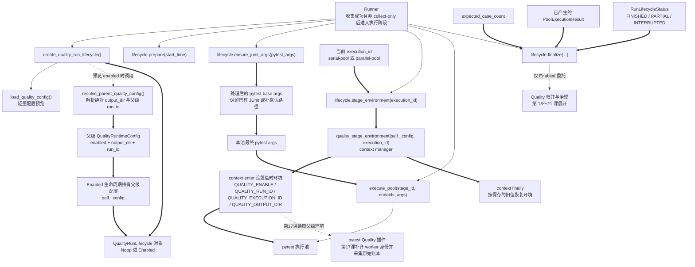
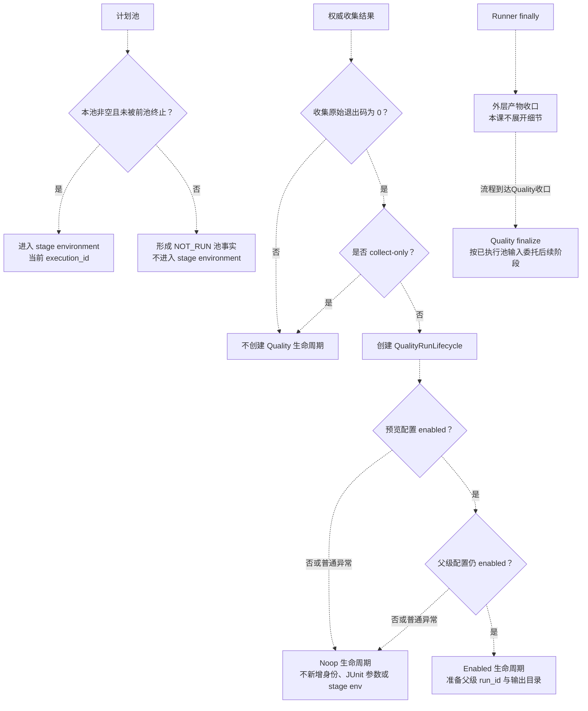

# 第 16 课：Quality 开关、运行身份与生命周期

> 第 15 课建立了中性 Runtime Hooks：业务代码不依赖 Quality，外部观察者也不拥有业务出口。第 16 课继续解决外层控制问题：什么时候启用 Quality，怎样为一次 Runner 运行和各执行池建立可关联身份，以及关闭 Quality 时怎样保持无新增副作用。

---

## 1. 课程信息

| 项目 | 内容 |
| --- | --- |
| 建议时长 | 60～90 分钟 |
| 核心问题 | Quality 从哪里开启，Runner 怎样在“不启用就不产生副作用”的前提下，为一次运行和各执行池建立可关联身份？ |
| 主要认知约束 | 学习者容易把配置对象、Runner 生命周期、pytest 进程身份和最终 Quality 产物混成一层 |
| 讲解重点 | 主开关与子开关依赖、Noop / Enabled 生命周期、Runner 调用顺序、run / execution / worker 身份边界、JUnit 参数与 stage environment、精确 fail-open 范围 |
| 代码入口 | `quality/config.py`、`run_orchestration/quality_lifecycle.py`、`run_orchestration/environment.py`、`run_orchestration/runner.py`、`run_orchestration/pytest_execution.py`、`quality/identifiers.py`、`quality/runtime_context.py`；`quality/pytest_plugin_runtime.py` 仅静态确认下一课的 worker 边界 |
| 轻量验证 | 55 条离线测试；验证配置依赖、Noop 无新增副作用、Runner 身份传播、JUnit 参数、环境恢复和标识符合同 |
| 安全边界 | 禁用第三方 pytest 插件自动加载和项目默认 addopts；测试只使用 monkeypatch、临时目录、内存对象和受控子进程，不访问真实 API |
| 课后产出 | 一张 Quality 生命周期与身份链图；课堂判断和三分钟复述不要求提交 |

### 1.1 学完本课，你应该能够

1. 解释 `QUALITY_ENABLE` 与 Semantic、Metrics、Flaky 子开关的依赖关系，并区分主开关非法与子开关非法的结果。
2. 复述 `create_quality_run_lifecycle()` 怎样选择 `NoopQualityRunLifecycle` 或 `EnabledQualityRunLifecycle`，以及关闭路径为什么只加载轻量配置。
3. 沿 Runner 真实顺序说明 `prepare()`、`ensure_junit_args()`、`stage_environment()` 和 `finalize()` 分别发生在哪里。
4. 区分 `run_id`、当前 Runner 使用的 `execution_id` 与第 17 课才在 pytest 进程内确定的 `worker_id`。
5. 判断 Noop、Enabled、collect-only、无 `-n` 和启用 `-n` 场景中的身份、环境、JUnit 参数与副作用边界。

### 1.2 本课刻意不展开

- 不展开 pytest 插件何时创建 `QualityRunContext`、绑定 Adapter 和写 worker 分片；第 17 课学习。
- 不展开 Case、Request、Integrity JSONL Schema。
- 不展开 Semantic、Metrics、Flaky 的归并算法和质量结论；本课只说明配置依赖与 `finalize()` 委托边界。
- 不把 `build_execution_id()` 误画进当前 Runner 主链；当前 Runner 直接使用 `parallel-pool` 和 `serial-pool`。
- 不运行真实 API、模型、Billing、媒体下载或真实 Jenkins 构建。
- 不修改 Quality 配置、生命周期或 pytest 插件代码。

### 1.3 课堂必讲路径

| 环节 | 对应章节 | 建议时间 |
| --- | --- | ---: |
| 第 15 课承接、身份类比与 TOC 约束 | 第 2～4 节 | 8～9 分钟 |
| 主开关、子开关依赖与配置对象 | 第 5～7 节，6.3 只作教师备注 | 9～11 分钟 |
| 生命周期类型、工厂与 Runner 调用顺序 | 第 8～10 节 | 14～16 分钟 |
| run / execution / worker、环境与 JUnit 边界 | 第 11～13 节，11.2 与 12.2 只作教师备注 | 11～13 分钟 |
| Noop 副作用与精确 fail-open | 第 14 节，14.3 只作教师备注 | 6～7 分钟 |
| 离线证据与两个核心场景 | 第 15 节、第 16.1～16.2 节 | 8～9 分钟 |
| 本课增量图、复述与 3 道核心小测 | 第 17～20 节 | 9～10 分钟 |
| 缓冲与提问 | 全课 | 5 分钟 |

总计约 70～80 分钟。第 6.3、11.2、12.2 和 14.3 节只作为教师备注；第 16.3～16.4 节只作为教师题库；第 18 节只穿插必讲误区，其余作为课后自查；第 20.3 节教师清单不逐条占用课堂时间。

### 1.4 课堂最短路径

```text
第 2～4 节：确认可选治理不能成为Runner执行前提
-> 第 5～7 节：先判断配置是否有效、哪些子能力真正开启
-> 第 8～10 节：追踪Noop/Enabled选择与Runner四个生命周期动作
-> 第 11～13 节：分清run、execution、worker以及JUnit和环境传播
-> 第 14～16 节：限定fail-open，用离线证据判断两个核心场景
-> 第 17～20 节：更新累积图、完成复述和三道小测
```

---

## 2. 承接第十五课：旁观者接口已经中立，但谁来决定是否安装观察能力

第 15 课已经建立：

```text
common.runtime_hooks
-> provider默认NoopRuntimeHooks
-> 外部可选绑定QualityRuntimeHooks
-> Response和原异常不经过Quality节点
```

但它没有回答外层控制问题：

```text
Quality是否开启？
谁生成本轮run_id？
parallel-pool和serial-pool怎样共享同一run_id？
pytest执行阶段怎样获得自己的execution_id？
Quality关闭时为什么不能自动创建目录和JUnit参数？
```

本课关注的是 Runner 控制面，不是 HTTP 业务面。

### 2.1 两条链必须分开

```text
业务执行链：
Test -> Task -> Request -> BaseRequest -> HTTP

Quality控制链：
环境配置 -> QualityRunLifecycle -> Runner阶段边界
```

Quality 控制链可以准备观察环境和证据输入，但不能改写 Test、Task、Request 的业务职责。

### 2.2 直接 pytest 与项目 Runner 不是同一入口

- 项目 Runner 在权威收集成功且不是 collect-only 后创建 `QualityRunLifecycle`。
- 直接 pytest 不调用 `run_orchestration.runner.run()`，因此不经过本课的 Runner 生命周期。
- 直接 pytest 怎样由插件自行解析配置和补齐手动身份，属于第 17 课。

---

## 3. 认知障碍：最容易混淆的不是开关，而是身份所有权

### 3.1 把配置读取当成启用副作用

错误直觉：

```text
load_quality_config()
-> 创建reports/quality
-> 生成run_id
-> 安装pytest插件
```

真实边界：`load_quality_config()` 只构造不可变配置对象，不创建目录，也不安装插件。生成父级 `run_id` 是 `resolve_parent_quality_config()` 在 Quality 有效开启时的职责。

### 3.2 把 run、execution、worker 当成一个编号

```text
一个编号到处复用
-> 无法区分整轮运行、执行池和pytest进程
-> 并行事实不能可靠归并
```

真正需要的是层级身份：

```text
run_id
└─ execution_id
   └─ worker_id
```

### 3.3 把“fail-open”扩大成所有生命周期错误都不影响Runner

当前实现只在若干边界捕获普通 `Exception`。`ensure_junit_args()` 没有统一安全壳，`BaseException` 也不属于普通异常捕获范围。因此不能声称“Quality 任何错误都不会影响 Runner”。

### 3.4 TOC：本课真正的约束

本课的瓶颈不是记住多少环境变量，而是回答一个判断：

> 当前事实属于整轮运行、执行池、pytest worker，还是仅仅属于一个配置值？

因果链：

```text
身份层级不清
-> 环境传播边界不清
-> JUnit、worker分片和最终归并无法对账
-> Quality即使产出很多文件也不可信
```

---

## 4. 第一性原理与类比：总闸、批次号、生产线号和工位号

可以把 Quality 看成工厂质检系统：

| 框架对象 | 工厂类比 | 核心职责 |
| --- | --- | --- |
| `QUALITY_ENABLE` | 质检总闸 | 决定本轮是否接入 Quality 生命周期 |
| `QualityRuntimeConfig` | 本轮质检配置单 | 保存开关、身份输入和输出位置，不执行测试 |
| `run_id` | 整批货的批次号 | 关联同一次 Runner 运行中的所有执行池 |
| `execution_id` | 生产线编号 | 区分 `parallel-pool`、`serial-pool` 等执行阶段 |
| `worker_id` | 工位编号 | 在 pytest 进程内区分 master 或 xdist worker |
| Noop 生命周期 | 总闸关闭后的空操作面板 | 保持 Runner 调用接口稳定，但不新增 Quality 副作用 |

类比的边界：配置单不会自己启动生产线；`run_id` 也不会自己安装 pytest 插件。

---

## 5. `QUALITY_ENABLE`：主开关默认关闭，非法值不是“半开启”

### 5.1 可接受值

`parse_boolean_setting()` 会先去除首尾空白并转为小写：

| 结果 | 当前接受值 |
| --- | --- |
| `True` | `1`、`true`、`yes`、`on` |
| `False` | 未设置、空字符串、`0`、`false`、`no`、`off` |

其他值抛 `ValueError`。例如 `QUALITY_ENABLE=sometimes` 不会被猜测为 True 或 False。

### 5.2 主开关非法时的外层结果

```text
load_quality_config()
-> QUALITY_ENABLE非法
-> 抛ValueError

create_quality_run_lifecycle()
-> 捕获普通Exception
-> 输出Quality collection disabled警告
-> 返回NoopQualityRunLifecycle
```

所以“配置解析抛错”和“Runner 最终继续执行”是两个不同层级的事实。

### 5.3 默认关闭的意义

默认关闭不是功能缺失，而是可选能力的安全默认值：

- 不要求本地开发者准备 Quality 目录；
- 不自动生成父级 `run_id`；
- 不自动增加 JUnit 参数；
- 不把 Quality 后续模块变成 Runner 的默认依赖。

---

## 6. 子开关不是平级按钮：它们有依赖图

### 6.1 当前依赖关系

```text
QUALITY_ENABLE
├─ QUALITY_SEMANTIC_ENABLE
│  └─ QUALITY_METRICS_ENABLE
└─ QUALITY_FLAKY_HISTORY_ENABLE
   └─ QUALITY_FLAKY_STATE_ENABLE
```

准确关系：

| 能力 | 必要条件 | 条件不满足时 |
| --- | --- | --- |
| Semantic | Quality 开启 + Semantic 请求开启 | `semantic_enabled=False` |
| Metrics | Quality + Semantic + Metrics 请求开启 | `metrics_enabled=False`，可附依赖警告 |
| Flaky history | Quality + history 请求开启 | `flaky_history_enabled=False` |
| Flaky state | Quality + history + state 请求开启 | `flaky_state_enabled=False`，可附依赖警告 |

### 6.2 子开关非法不会关闭Quality主开关，但可能触发依赖级联

Semantic、Metrics、Flaky history 和 Flaky state 的解析函数会捕获自己的 `ValueError`，返回关闭状态和 warning；它们不会因此把主 `enabled` 自动改成 False。但依赖能力会继续按有效状态计算：Semantic 关闭会使 Metrics 关闭，Flaky history 关闭会使 Flaky state 关闭。

例如：

```text
QUALITY_ENABLE=1
QUALITY_METRICS_ENABLE=sometimes
-> Quality主生命周期仍可开启
-> metrics_enabled=False
-> metrics_warning记录非法值
```

### 6.3 教师备注：Flaky 数据库路径 warning

本课只需要一个结论：Flaky history 的路径风险会形成 warning，但不会反向改变父级 Quality 生命周期是否开启。它属于“子能力输入合同有风险”，不是本课身份链的主节点。

完整路径校验清单留到第 21 课 Flaky 治理讲解；课堂复述不要求记忆路径缺失、绝对路径、网络共享、父目录权限和普通文件等细节。

---

## 7. `QualityRuntimeConfig`：配置事实，不是运行身份上下文

### 7.1 配置对象保存什么

```text
QualityRuntimeConfig
├─ enabled
├─ run_id / execution_id输入
├─ output_dir
├─ semantic / metrics开关与warning
└─ flaky history / state开关、路径与warning
```

它是 `frozen=True` 的 dataclass。不可变指的是字段不能普通赋值修改，不代表字段所引用的所有外部资源都自动不可变。

### 7.2 空白身份会归一化为缺失

```text
QUALITY_RUN_ID="   " -> None
QUALITY_EXECUTION_ID="	" -> None
```

`load_quality_config()` 不生成替代身份，只记录“当前未提供”。

### 7.3 输出目录分两步处理

```text
load_quality_config()
-> 保存Path；默认reports/quality
-> 不创建目录

resolve_parent_quality_config()
-> 相对路径基于PROJECT_ROOT解析为绝对路径
```

即使 Quality 关闭，父级解析也可以返回绝对 `output_dir` 配置事实；但 Noop 生命周期不会因此创建该目录。

### 7.4 配置对象不等于 pytest worker 上下文

第 16 课只把父级身份通过 stage environment 送到 pytest 边界，不提前创建 worker 级运行上下文。pytest 进程内怎样补齐 worker 身份和采集原始账本，留到第 17 课展开。

---

## 8. `QualityRunLifecycle`：Runner 调用稳定接口，具体实现决定是否产生副作用

### 8.1 中性生命周期合同

```python
class QualityRunLifecycle(Protocol):
    enabled: bool

    def prepare(self, start_time): ...
    def ensure_junit_args(self, pytest_args): ...
    def stage_environment(self, execution_id): ...
    def finalize(self, *, start_time, expected_case_count,
                 pool_results, status): ...
```

Protocol 只定义 Runner 可调用的方法，不决定当前返回 Noop 还是 Enabled。

### 8.2 Noop 路径保持调用形状，不新增 Quality 动作

| 方法 | `NoopQualityRunLifecycle` 当前行为 |
| --- | --- |
| `prepare()` | 直接返回 |
| `ensure_junit_args()` | 返回内容相同的新列表，不增加 JUnit 参数 |
| `stage_environment()` | 返回 `nullcontext()`，不修改环境 |
| `finalize()` | 直接返回 |

Noop 的价值是让 Runner 不需要到处写：

```python
if quality_enabled:
    ...
```

但“无新增副作用”不等于“清空所有外部状态”。如果进程原本已有 `QUALITY_RUN_ID` 或 `QUALITY_EXECUTION_ID`，Noop 不会替 Runner 删除它们；它只是不新增、不覆盖。

### 8.3 Enabled 路径负责四个外层动作

```text
prepare
-> 尝试写初始run.json

ensure_junit_args
-> 已有--junitxml则保留
-> 否则增加Quality默认JUnit路径

stage_environment
-> 在执行池范围内设置父级身份和输出目录

finalize
-> 根据已执行池、预期用例数和生命周期状态委托Quality归并
```

这些动作属于 Runner 控制面，不是 Test call 阶段的下一调用节点。

---

## 9. 生命周期工厂：先做轻量预览，只有有效开启才加载父级环境实现

### 9.1 两阶段选择链

```text
create_quality_run_lifecycle()
-> 延迟import quality.config.load_quality_config
-> 读取preview
   ├─ 解析异常 -> 警告 + Noop
   ├─ preview.enabled=False -> Noop
   └─ preview.enabled=True
      -> 延迟import resolve_parent_quality_config
      -> 解析父级配置
         ├─ 异常或最终disabled -> Noop
         └─ enabled -> EnabledQualityRunLifecycle(runtime_config)
```

### 9.2 为什么要先 preview

关闭路径测试在新 Python 子进程中证明：

```text
QUALITY_ENABLE=FALSE
-> create_quality_run_lifecycle()
-> sys.modules中只出现quality和quality.config
```

这不是说 Python 绝对没有任何其他模块，而是证明 Quality 关闭时没有继续加载 Quality 运行时、Collector、Semantic 等后端实现。

### 9.3 工厂只捕获普通 `Exception`

配置加载和父级解析中的普通异常会降级为 Noop。`KeyboardInterrupt`、`SystemExit` 等 `BaseException` 不属于当前捕获范围。

### 9.4 类型关系不是调用关系

```text
NoopQualityRunLifecycle
-. 结构化满足 .-> QualityRunLifecycle Protocol

EnabledQualityRunLifecycle
-. 结构化满足 .-> QualityRunLifecycle Protocol
```

Runner 调用的是工厂返回对象，不是先调用 Protocol 再跳转到实现。

---

## 10. Runner 真实顺序：Quality 生命周期只在可执行运行中建立

### 10.1 生命周期创建之前还有两个门禁

```text
partition_pytest_args
-> 权威pytest收集
-> 检查收集原始退出码
-> collect-only判断
-> 通过后才创建Allure与Quality生命周期
```

因此：

- 收集失败或无可执行测试时，不创建本课的 Quality Runner 生命周期；
- `--collect-only` 成功后直接返回，不生成父级 `run_id`，也不进入 pytest 执行池；
- 不能把 `run()` 入口直接连到 `create_quality_run_lifecycle()`，中间存在真实门禁。

### 10.2 Runner 主顺序

```text
quality_run_lifecycle = create_quality_run_lifecycle()
quality_start_time = datetime.now(UTC)
quality_run_lifecycle.prepare(quality_start_time)

try:
    每个计划池：
    -> ensure_junit_args(base_args)
    -> 构造parallel或serial专用参数
    -> 若本池非空且未被前池终止：
       -> with stage_environment(stage_id)
       -> execute_pool(stage_id, nodeids, args)
    -> 否则构造NOT_RUN池事实
finally:
    -> allure_lifecycle.finalize()
    -> quality_run_lifecycle.finalize(...)
```

`prepare()` 在 Runner 的池执行 `try/finally` 之前调用；当前 Enabled 实现会自行捕获普通初始化异常，但这不等于 Runner 对任意自定义生命周期都提供相同保护。进入 `finally` 后，Runner 会按固定顺序收口外层产物；这些收口动作的边角异常不作为本课主线展开。

### 10.3 无 `-n` 与启用 `-n`

无 `-n`：

```text
全部case
-> 单一serial-pool
-> 一个execution_id=serial-pool
```

启用 `-n`：

```text
parallel case非空
-> parallel-pool环境
-> 并发pytest执行

serial case非空且未被终止
-> serial-pool环境
-> 串行pytest执行
```

空池或因前一池终止而跳过的池会形成 `NOT_RUN` 事实，但不会进入对应 `stage_environment()`。

### 10.4 `finalize()` 接收的不是“所有计划池都已执行”

Enabled 生命周期先过滤 `status=NOT_RUN` 的 `PoolExecutionResult`，再把实际执行池的：

- `stage_id`；
- JUnit 路径；
- 预期用例数；
- 运行生命周期状态；

交给 `finalize_quality_run()`。因此 `expected_execution_ids` 表示已执行池，不包含 `NOT_RUN` 池。

---

## 11. `run_id`：一次 Runner 运行的父级关联键

### 11.1 来源优先级

```text
resolve_parent_quality_config()
-> Quality关闭：不生成
-> Quality开启：
   ├─ 已配置QUALITY_RUN_ID -> 使用去空白后的值
   └─ 未配置 -> new_parent_run_id()
```

### 11.2 教师备注：Jenkins 与本地 run ID 形态

课堂只需要记住：未配置 `QUALITY_RUN_ID` 时，父级生命周期会生成一个新的 run ID；同一次 Runner 运行内只生成一次。Jenkins 环境变量同时存在时会参与命名，本地运行会走本地命名前缀。

具体字符串格式和清洗规则不进入三分钟复述，也不作为本课核心验收点。

### 11.3 “稳定”不等于跨运行固定

标识符测试传入固定时间和固定 UUID，所以相同输入得到确定输出。真实未配置运行会使用当前 UTC 时间和随机 UUID：

- 同一 Runner 运行内，各执行池共享一个 `run_id`；
- 不同真实运行通常得到不同 `run_id`；
- 不能把随机 run ID 当成跨运行用例身份。

### 11.4 同一run只生成一次

父级配置在生命周期创建阶段生成一次 run ID。后续 `parallel-pool` 与 `serial-pool` 的 stage environment 都使用该值，不为每个池重新生成。

---

## 12. `execution_id`：当前Runner直接使用语义池名，不调用`build_execution_id()`

### 12.1 当前真实值

| Runner 场景 | `execution_id` |
| --- | --- |
| 未启用 `-n` | `serial-pool` |
| 启用 `-n` 的并发池 | `parallel-pool` |
| 启用 `-n` 的串行收尾池 | `serial-pool` |

Runner 直接把这些 `stage_id` 传给 `stage_environment()`。

### 12.2 教师备注：`build_execution_id()` 不是当前主链

项目里存在 `build_execution_id()` 工具函数，但当前 Runner 主链没有调用它。课堂只需要判断真实执行池身份是 `parallel-pool` 或 `serial-pool`，不要把工具函数测试通过误画成 Runner 调用节点。

### 12.3 execution身份必须与run身份组合理解

单独的 `serial-pool` 会在多次运行中重复。真正可关联的层级是：

```text
run_id=run-A + execution_id=serial-pool
run_id=run-B + execution_id=serial-pool
```

它们属于两个不同执行阶段事实，不能只按 `execution_id` 全局去重。

### 12.4 stage environment设置什么

Enabled 上下文进入时临时设置：

```text
QUALITY_ENABLE=1
QUALITY_RUN_ID=<父级run_id>
QUALITY_EXECUTION_ID=<当前stage_id>
QUALITY_OUTPUT_DIR=<已解析绝对路径>
```

退出时逐项恢复进入前的值；原来不存在的变量会删除，原来存在的变量会恢复。

### 12.5 它不管理所有Quality变量

`quality_stage_environment()` 只主动覆盖上述四项。Semantic、Metrics、Flaky 等开关若已存在于进程环境，会按普通环境继承规则继续存在；本上下文不会重新写入或清理它们。

---

## 13. JUnit 与 `worker_id`：一个在Runner准备，一个在pytest进程确定

### 13.1 Enabled 为什么补 JUnit 参数

后续 Quality 归并需要把 Case、失败和机器统计对齐。Enabled 生命周期会检查当前 pytest 参数：

```text
已有--junitxml
-> 原样保留调用方路径

没有--junitxml
-> 增加<quality_output>/junit/quality.xml
```

Noop 只返回内容相同的参数列表，不新增路径。

### 13.2 多池运行会继续加后缀

生命周期先确保存在 JUnit 参数，随后 Runner 的参数构造器按池改名：

```text
quality.xml
├─ parallel-pool -> quality-parallel.xml
└─ serial-pool   -> quality-serial.xml
```

这避免两个池写同一个文件。未启用 `-n` 时不经过池后缀改写，仍使用默认或用户提供的路径。

### 13.3 参数存在不等于文件已经生成

`ensure_junit_args()` 只修改参数。JUnit 文件仍要由后续 pytest 执行成功写出；配置路径、`PoolExecutionResult.junit_path` 或 finalize 输入都不能单独证明文件存在且完整。

### 13.4 `worker_id` 不由生命周期创建

本课只建立：

```text
Runner stage environment
-> run_id + execution_id进入pytest边界
```

第 17 课才会在具体 pytest 进程内补齐 `worker_id` 并采集 worker 原始账本。本课不展开不同执行模式下的 worker 来源、Collector 或 Adapter 内部接线。

因此当前图只能画到：

```text
stage environment
-. 第17课插件补齐worker身份并采集原始账本 .-> pytest Quality插件
```

---

## 14. 精确边界：Noop无新增副作用，Enabled也不是绝对fail-open

### 14.1 当前普通异常边界

| 边界 | 普通 `Exception` 当前处理 |
| --- | --- |
| 生命周期工厂读取 preview / 父级配置 | 警告并返回 Noop |
| `Enabled.prepare()` | 警告并继续 |
| 初始 `run.json` 写入 | 内层再次捕获并警告 |
| `Enabled.finalize()` | 警告并继续 |
| 最终 `run.json` 写入 | 内层捕获并警告 |
| `Enabled.stage_environment()` 创建上下文管理器 | 创建失败时警告并返回 `nullcontext()` |
| `ensure_junit_args()` | 没有统一 `try/except` 安全壳 |

### 14.2 上下文恢复不等于吞掉业务异常

```text
进入quality_stage_environment
-> 保存旧环境
-> 设置当前run/execution
-> pytest执行抛异常
-> finally恢复旧环境
-> 原异常继续交给Runner处理
```

环境恢复保证的是状态收口，不是把 pytest 异常转换成成功。

### 14.3 教师备注：`BaseException` 与 finally 顺序

课堂只需要记住：本课所谓 fail-open 主要针对普通 `Exception`，不能扩大成 `KeyboardInterrupt`、`SystemExit` 等 `BaseException` 都会被隔离。

Allure finalize 与 Quality finalize 的先后、以及 `BaseException` 在不同 finally 边界上的传播，作为教师追问保留，不进入三分钟复述。

### 14.4 生命周期状态不是测试通过状态

```text
FINISHED
-> Runner执行流程完整结束

PARTIAL
-> PoolExecutionResult出现ERROR，或Runner普通异常

INTERRUPTED
-> KeyboardInterrupt / SystemExit
```

pytest 返回测试失败退出码，但执行池正常返回时，生命周期仍可能是 `FINISHED`。测试是否通过应读取 pytest / Runner 退出事实，不能用 Quality `RunLifecycleStatus` 替代。

### 14.5 Noop的准确表述

> Noop 生命周期不创建父级身份、不增加 JUnit 参数、不主动修改 stage environment，也不写 Quality 产物；它不负责清洗调用前已经存在的外部环境。

---

## 15. 轻量验证：55条配置、生命周期、身份与Runner接线离线测试

### 15.1 安全命令

该命令只运行四个精确离线文件。教师应课前原样预跑；课堂只观察第 15.3 节核心证据，不逐行讲解脚本。

安全边界来自三层：

- `API_CASE_DOTENV_PATH=.env.example` 与 `QUALITY_ENABLE=0` 避免读取开发者真实环境并默认关闭 Quality；
- `PYTEST_DISABLE_PLUGIN_AUTOLOAD=1`、`-o addopts=` 和精确测试文件避免加载无关插件或执行业务用例；
- `tests/conftest.py` 的 `isolate_framework_runner_artifacts` 会把 Runner 默认 Allure 与 execution-result 产物重定向到 `tmp_path`，`--basetemp` 只负责 pytest 临时目录隔离，不能单独证明 Runner 产物隔离。

```powershell
$environmentNames = @(
  "API_CASE_DOTENV_PATH",
  "QUALITY_ENABLE",
  "PYTHONDONTWRITEBYTECODE",
  "PYTEST_DISABLE_PLUGIN_AUTOLOAD"
)
$previousEnvironment = @{}
foreach ($name in $environmentNames) {
  $previousEnvironment[$name] =
    [Environment]::GetEnvironmentVariable(
      $name,
      [EnvironmentVariableTarget]::Process
    )
}

$trimSeparators = [char[]]@("\", "/")
$tempParent = (Resolve-Path -LiteralPath $env:TEMP -ErrorAction Stop).Path.TrimEnd($trimSeparators)
$tempRoot = Join-Path `
  $tempParent `
  ("llm_api_case_lesson16_" + [guid]::NewGuid().ToString("N"))
$pytestTemp = Join-Path $tempRoot "pytest"
New-Item -ItemType Directory -Force -Path $tempRoot | Out-Null
$pytestExitCode = 1

try {
  [Environment]::SetEnvironmentVariable(
    "API_CASE_DOTENV_PATH",
    (Resolve-Path -LiteralPath ".env.example" -ErrorAction Stop).Path,
    [EnvironmentVariableTarget]::Process
  )
  [Environment]::SetEnvironmentVariable(
    "QUALITY_ENABLE",
    "0",
    [EnvironmentVariableTarget]::Process
  )
  [Environment]::SetEnvironmentVariable(
    "PYTHONDONTWRITEBYTECODE",
    "1",
    [EnvironmentVariableTarget]::Process
  )
  [Environment]::SetEnvironmentVariable(
    "PYTEST_DISABLE_PLUGIN_AUTOLOAD",
    "1",
    [EnvironmentVariableTarget]::Process
  )

  & .\.venv\Scripts\python.exe -m pytest `
    -o addopts= `
    -p no:cacheprovider `
    --basetemp $pytestTemp `
    tests/quality/test_quality_config.py `
    tests/quality/test_quality_lifecycle.py `
    tests/quality/test_quality_identifiers.py `
    tests/quality/test_quality_run_master.py `
    -q
  $pytestExitCode = $LASTEXITCODE
}
finally {
  foreach ($name in $environmentNames) {
    [Environment]::SetEnvironmentVariable(
      $name,
      $previousEnvironment[$name],
      [EnvironmentVariableTarget]::Process
    )
  }

  if (Test-Path -LiteralPath $tempRoot) {
    $resolvedTempRoot =
      (Resolve-Path -LiteralPath $tempRoot -ErrorAction Stop).Path.TrimEnd($trimSeparators)
    $resolvedParent =
      (Split-Path -Parent $resolvedTempRoot).TrimEnd($trimSeparators)
    $resolvedLeaf = Split-Path -Leaf $resolvedTempRoot
    if (
      $resolvedParent -eq $tempParent -and
      $resolvedLeaf -like "llm_api_case_lesson16_*"
    ) {
      Remove-Item -LiteralPath $resolvedTempRoot -Recurse -Force
    }
    else {
      Write-Warning "Refused to clean unexpected path: $resolvedTempRoot"
    }
  }
}

if ($pytestExitCode -ne 0) {
  throw "Lesson 16 offline tests failed: $pytestExitCode"
}
```

### 15.2 当前结果

```text
55 passed
```

### 15.3 四组测试分别冻结什么

| 测试组 | 数量 | 主要证据 |
| --- | ---: | --- |
| `test_quality_config.py` | 25 | 主开关取值、子开关依赖、空白身份、输出目录和 Flaky 路径 warning |
| `test_quality_lifecycle.py` | 3 | 关闭路径轻量导入、Noop 无新增副作用、Enabled JUnit / 环境 / 状态映射 |
| `test_quality_identifiers.py` | 14 | run、execution、case、invocation、request event 和 failure 标识合同 |
| `test_quality_run_master.py` | 13 | collect-only门禁、父级run只生成一次、池身份、环境恢复、JUnit与finalize接线 |

课堂只观察六项：

1. Quality 关闭时工厂只加载轻量配置并返回 Noop；
2. Noop 不新增文件、JUnit 参数和 stage environment；
3. collect-only 不生成或注入 Quality 身份；
4. `parallel-pool` 与 `serial-pool` 共享同一个父级 `run_id`；
5. stage environment 退出后恢复原环境；
6. Enabled 在缺少 JUnit 参数时补默认路径，已有路径时保留。

### 15.4 不能证明什么

这 55 条测试不能证明：

- 真实 Jenkins、真实 xdist worker 或远程节点已经工作；
- 第 17 课插件已创建 `QualityRunContext` 或 worker 分片；
- 配置的 JUnit 路径对应文件一定存在且完整；
- Semantic、Metrics、Flaky 的最终治理结果正确；
- 真实 API、模型、Billing 或媒体用例成功；
- 所有 `BaseException` 都被 Quality 生命周期隔离。

---

## 16. 课堂活动：两个核心场景与两个教师题库场景

课堂先独立判断 A、B，再对照答案。C、D 只供教师按需追问，不进入核心时间，也不作为课后作业。

### 16.1 场景 A：Quality关闭，但外部已有旧身份变量

```text
QUALITY_ENABLE=0
QUALITY_RUN_ID=outside-run
QUALITY_EXECUTION_ID=outside-execution
Runner执行一个serial-pool
```

答案：

- 生命周期类型：`NoopQualityRunLifecycle`；
- 是否生成新 `run_id`：否；
- 是否增加 JUnit 参数：否；
- 是否清理旧身份：否，Noop 不修改外部现有环境；
- 是否进入 Quality finalize 后端：否。

### 16.2 场景 B：Quality开启，无显式run ID，未启用`-n`

```text
QUALITY_ENABLE=1
QUALITY_RUN_ID未设置
pytest参数中没有--junitxml
全部测试进入单一串行池
```

答案：

- 父级配置生成一个 `run_id`；
- 当前 `execution_id=serial-pool`；
- Runner 增加默认 Quality JUnit 参数；
- stage environment 仅在该池执行范围内覆盖四个父级变量，退出后恢复；
- `worker_id` 尚未由本课生命周期创建。

### 16.3 教师题库 C：启用`-n`，parallel与serial池都有测试

答案：

- 两个执行池共享同一 `run_id`；
- execution IDs 依次是 `parallel-pool`、`serial-pool`；
- 每个池进入自己的 stage environment；
- JUnit 路径分别加 `parallel`、`serial` 后缀；
- 当前 Runner 不调用 `build_execution_id()`。

### 16.4 教师题库 D：主开关非法

```text
QUALITY_ENABLE=sometimes
```

答案：

- `load_quality_config()` 单独调用会抛 `ValueError`；
- 生命周期工厂捕获普通异常并返回 Noop；
- Runner 输出 Quality disabled 警告后仍可执行原测试路径；
- 不能把该状态描述成“Quality 部分开启”。

### 16.5 一张判断表

| 场景 | 生命周期 | 新父级身份 | JUnit参数 | 环境处理 |
| --- | --- | --- | --- | --- |
| Quality关闭 | Noop | 不生成 | 不增加 | 不修改，也不清洗旧值 |
| Enabled单串行池 | Enabled | 一个run ID | 缺少时补默认路径 | 临时设置serial-pool后恢复 |
| Enabled双池 | Enabled | 两池共享一个run ID | 分池后缀 | 每个实际执行池独立进入并恢复 |
| 主开关非法 | Noop | 不生成 | 不增加 | 工厂警告后降级 |

---

## 17. 第十六版本课增量图：只展开 Quality 生命周期

本节只保留第 16 课新增节点：Quality 配置、生命周期对象、父级 `run_id`、执行池 `execution_id`、JUnit 参数准备、stage environment 和 finalize 委托。第 14～15 课已有的业务链、Runtime Hooks 内部、Allure 明细和 Runner execution-result 细节不在本图重复展开。

本节使用两张图，避免把“函数调用”和“控制结果”画成同一种关系：

- 17.1 只表示主调用与对象流。
- 17.2 只表示门禁、跳过和降级等控制结果。

### 17.1 主调用与对象流图

本图中：`-->` 只表示函数调用；`==>` 只表示对象、参数、环境值或事实输入输出；`-.->` 表示后续课程接口或可选委托，不表示本课必经调用。



### 17.2 门禁与控制结果图

本图只表示判断、跳过和降级结果，不表示函数调用。`-.->` 在本图中统一表示控制结果。



### 17.3 读图规则

1. 第 16 课图只讲 Runner 外层生命周期，不重复第 14 课 Runner execution-result 细节，也不重复第 15 课 Runtime Hooks 内部对象。
2. 直接 pytest 不调用 Runner 的 `create_quality_run_lifecycle()`；它是第 17 课 pytest 插件的并列入口，本课只保留为后续接口。
3. `load_quality_config()` 返回配置事实，生命周期工厂返回 Noop 或 Enabled 对象，pytest 插件以后才补齐 worker 身份；三者不是同一个对象。
4. `ensure_junit_args()` 与 `stage_environment()` 都由 Runner 调用；前者准备 pytest 参数，后者只包住真实执行池。
5. `stage_environment()` 只提供父级 run、当前 execution 和输出目录；`worker_id`、Collector、Adapter 和 worker JSONL 都不在本课展开。
6. JUnit 参数只是写入请求，不证明 JUnit 文件已经生成。
7. `RunLifecycleStatus.FINISHED` 只表示当前生命周期完整走到结束，不表示 pytest 全部通过。

### 17.4 本课新增节点的最小闭环

```text
收集成功且非 collect-only
-> Runner 创建 QualityRunLifecycle
-> 轻量预览选择 Noop 或 Enabled
-> Enabled 解析一个父级 run_id
-> Runner 对每个计划池准备 JUnit 参数
-> 非空且未终止的池以当前语义池名作为 execution_id 进入临时环境
-> pytest 执行池
-> 退出 stage context 后恢复环境
-> Runner finally 中按固定顺序进入 Quality finalize

父级临时环境
-. 第17课插件补齐worker身份并采集原始账本 .->
pytest Quality插件
```

---
## 18. 常见误区

### 18.1 “`QUALITY_ENABLE=1`，所有子能力就一定开启”

错误。Semantic 依赖 Quality，Metrics 继续依赖 Semantic，Flaky state 依赖 Quality 与 history；子开关非法或依赖不满足时可以局部降级。

### 18.2 “Noop会清理所有旧Quality环境变量”

错误。Noop 的合同是“不新增本次 Quality 副作用”，不是替调用方清洗外部环境。进入 Runner 前已经存在的旧变量仍可能保留。

### 18.3 “配置对象已经包含本次worker身份”

错误。父级 `QualityRuntimeConfig` 在 Runner 层只有 run 与当前 stage 所需配置；`worker_id` 要等 pytest 插件进入具体进程后再确定。

### 18.4 “`build_execution_id()`测试通过，所以Runner一定使用它”

错误。工具函数存在且有独立合同，不等于真实主链调用它。当前 Runner 直接使用 `parallel-pool` 和 `serial-pool`。

### 18.5 “补了`--junitxml`，JUnit文件已经存在”

错误。参数只是写入请求。只有 pytest 实际运行并完成相应写入后，路径才可能对应文件。

### 18.6 “Quality是可选能力，所以所有失败都必然fail-open”

错误。当前工厂、Enabled `prepare()` 和 `finalize()` 主要对普通 `Exception` 做降级；`ensure_junit_args()` 没有统一安全壳，`BaseException` 也不在普通捕获范围。

### 18.7 “`FINISHED`表示全部测试通过”

错误。它表示 Runner 没有按当前生命周期规则被中断，测试是否通过仍看 pytest 池级事实和 Runner 最终执行事实。

课堂必讲 18.1、18.3、18.5、18.7；其余可穿插讲解或作为课后自查，不增加独立时间段。

---

## 19. 三分钟复述

建议按“开关选择 → 父级身份 → 执行池身份 → pytest进程接口 → 退出边界”复述：

```text
Quality默认关闭。Runner只有在权威收集成功且不是collect-only时，才创建QualityRunLifecycle。工厂先轻量读取配置：关闭或普通初始化异常返回Noop；有效开启才解析绝对输出目录，并为整次Runner运行保留一个父级run_id，再返回Enabled生命周期。

Runner 调用 prepare，然后对每个计划池准备 JUnit 参数；只有非空且未被前池终止的池才进入 stage environment 并执行 pytest。无 `-n` 时，全部测试进入 `serial-pool`；启用 `-n` 时，parallel 与 serial 测试按计划进入各自语义池。当前 Runner 直接把 `parallel-pool` 或 `serial-pool` 作为 `execution_id`。stage environment 临时设置 enable、run ID、execution ID 和 output dir，执行结束后恢复原环境。

`worker_id` 不由 Runner 生命周期生成。第 17 课 pytest 插件会在具体进程内补齐 worker 身份并采集 worker 原始账本，本课只保留这个虚线接口。补 JUnit 参数不等于文件已生成；`FINISHED` 不等于测试通过。Noop 不新增 Quality 副作用，但也不清理外部旧变量；Enabled 的 fail-open 范围不能扩大为所有错误都不影响 Runner。
```

---

## 20. 课堂小测与教师验收

### 20.1 三道核心小测

1. `QUALITY_ENABLE=0`，但进程外部已有 `QUALITY_RUN_ID=old-run`。Noop 是否会主动删除它？A 会 / B 不会（B）
2. Quality 开启、未传 `-n`，Runner 当前使用什么 `execution_id`？A `serial-pool` / B `serial-pool-1` / C `master`（A）
3. `ensure_junit_args()` 返回含 `--junitxml` 的参数后，能否直接断言 XML 文件已经生成？A 能 / B 不能（B）

### 20.2 教师题库（不进入核心时间）

4. `QUALITY_ENABLE=sometimes` 时，单独调用 `load_quality_config()` 与通过生命周期工厂调用的外层结果是否相同？A 相同 / B 不同（B：前者抛 `ValueError`，后者捕获普通异常并降级 Noop）
5. collect-only 是否创建 Quality 生命周期？A 创建 / B 不创建（B）
6. `worker_id=master` 是 Runner 的 `stage_environment()` 写入的吗？A 是 / B 否（B）
7. `RunLifecycleStatus.FINISHED` 能否证明 pytest 全部通过？A 能 / B 不能（B）
8. `ensure_junit_args()` 抛出 `BaseException` 时，当前代码是否承诺中性降级？A 承诺 / B 不承诺（B）

### 20.3 教师验收清单（不逐条占用课堂时间）

合格复述必须包含：

- Quality 生命周期的创建门禁：收集成功且非 collect-only；
- Noop 与 Enabled 的选择依据，以及 Noop“不新增但不清洗”的边界；
- 一个 run 下真正执行的一个或两个池共享 `run_id`，并使用自己的语义池名作为 `execution_id`；空池或终止池只形成 `NOT_RUN`，不进入对应 stage environment；
- `worker_id` 在第 17 课 pytest 进程内确定，不由本课生命周期生成；
- JUnit参数、JUnit文件、pytest退出事实和Runner最终事实彼此不同；
- `FINISHED` 与测试通过不同，fail-open 也不是无条件保证。

子开关全部取值、标识符构造细节和教师题库答案不作为三分钟复述的额外背诵项。

---

## 21. 课后作业：只更新生命周期与身份链，不写代码

### 21.1 必做内容

1. 在第 15 课累积图上增加本课 Quality 分支：标出创建门禁、Noop / Enabled、单一 `run_id`、每池 `execution_id`、JUnit参数准备、stage environment与恢复，并用虚线把父级环境连接到第 17 课 `worker_id` 接口。

课堂场景 A、B、三分钟复述和三道核心小测不作为课后提交物；文字稿选做。

### 21.2 不要求完成

- 不实现新生命周期或新标识符。
- 不修改 Runner、pytest 插件或 Quality 配置。
- 不创建 worker JSONL、Schema、Metrics 或 Flaky 结果。
- 不运行真实 xdist、Jenkins、API、模型、Billing 或媒体用例。
- 不提前完成第 17 课插件采集链。

---

## 22. 下一课接口

第 16 课已经建立：

```text
Runner执行门禁
-> Noop或Enabled生命周期
-> 一个父级run_id
-> 每个实际执行池的execution_id
-> 临时stage environment
-> pytest执行池
-> 环境恢复与finalize
```

但父级身份进入 pytest 进程后，仍有三个问题没有回答：

```text
pytest 插件在什么时点读取 Quality 配置和父级环境？
具体 pytest 进程怎样补齐 worker 身份？
插件怎样把运行事件写成可归并的 worker 原始账本？
```

第 17 课进入 pytest 插件与 worker 原始账本，但第 16 课只保留虚线接口：

```text
stage environment
-. 第17课插件补齐worker身份并采集原始账本 .->
pytest Quality插件
```

直接 pytest 是并列插件入口：它不经过 Runner 生命周期。它怎样补齐手动身份，以及多进程执行怎样避免 worker 账本串线，都在第 17 课展开。

第 16 课解决“Runner是否启用Quality、父级身份怎样进入执行池”；第 17 课解决“pytest进程怎样把父级身份补成worker上下文，并把运行事件写成可归并的原始账本”。
