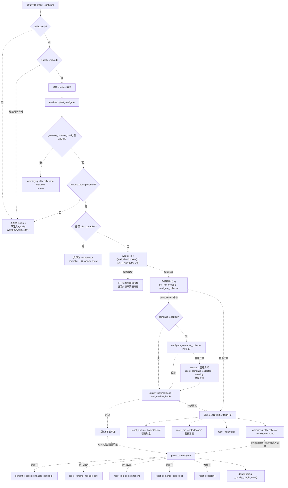

# 第 17 课：pytest 插件把生命周期写成 worker 原始账本

> 第 16 课解决了 Runner 是否启用 Quality、怎样生成父级 `run_id`，以及怎样把每个真实执行池的 `execution_id` 放进 pytest stage environment。第 17 课继续进入 pytest 进程内部：插件怎样读取这些父级身份，怎样确定 `worker_id`，怎样把 pytest hook 和 Runtime Hooks 汇合成 Case、Request、Integrity 三类 worker 原始账本。

---

## 1. 课程信息

| 项目 | 内容 |
| --- | --- |
| 建议时长 | 60～90 分钟 |
| 核心问题 | 测试 hook、运行身份和 Runtime Hooks 怎样汇合为 Case、Request、Integrity 分片？ |
| 主要认知约束 | 学习者容易把 Runner 生命周期、pytest controller、xdist worker、JUnit properties 和 Quality worker JSONL 混成一个“质量产物” |
| 讲解重点 | 轻量插件入口、运行时插件注册、直接 pytest 与 Runner stage 两条入口、xdist controller / worker 边界、`QualityRunContext`、`QualityCaseContext`、JUnit 身份属性、Collector 三类 shard、fail-open 与完整性记录边界 |
| 代码入口 | `module/conftest.py`、`quality/pytest_plugin.py`、`quality/pytest_plugin_runtime.py`、`quality/runtime_context.py`、`quality/collector.py`、`quality/storage.py`、`quality/junit.py`、`quality/models.py` |
| 轻量验证 | 核心安全命令：38 条通过、2 条 xdist 证据跳过；完整 xdist 证据只作教师选讲 |
| 安全边界 | 核心命令保存并恢复进程环境，使用 GUID 唯一 `--basetemp`，禁用第三方 pytest 插件自动加载，不访问真实 API；xdist 证据保持禁用自动加载，仅显式加载 `xdist.plugin`，只作为教师选讲 |
| 课后产出 | 一张“父级身份 -> pytest 插件 -> worker 上下文 -> Collector -> worker JSONL”的链路图；课堂复述不要求提交代码 |

### 1.1 学完本课，你应该能够

1. 解释 `quality.pytest_plugin` 为什么只是轻量入口，Quality 关闭或 collect-only 时为什么不会加载运行时实现。
2. 区分直接 pytest、Runner stage environment、xdist controller 和 xdist worker 四种入口差异。
3. 复述 `QualityRunContext(run_id, execution_id, worker_id, output_dir)` 怎样在具体 pytest 进程内建立。
4. 说明 `case_id` 与 `invocation_id` 的区别，以及参数化用例为什么稳定身份相同、本次调用身份不同。
5. 追踪一次 pytest case 从 `pytest_runtest_protocol` 到 `pytest_runtest_logreport`，最终写入 Case JSONL 和 JUnit properties。
6. 判断哪些失败会被记录为 Integrity 分片，哪些失败不会改变 pytest 原始结果。

### 1.2 本课刻意不展开

- 不展开 Aggregator 怎样读取 shard、校验完整性和生成 FailureRecord；第 18 课学习。
- 不展开 Semantic 的 operation、request group、polling session 归并算法；第 19 课学习。本课只说明 semantic collector 是可选并列 collector。
- 不展开 Metrics 聚合、usage 完整性和 Flaky 导入；第 20～21 课学习。
- 不把 `FailureRecord` 画成 worker 原始分片；它是第 18 课归并后派生事实。
- 不把 pytest 插件写 worker JSONL 描述成 Runner 的直接写文件行为。
- 不运行真实业务用例、真实模型请求、真实 Jenkins 或真实付费接口。
- 不修改插件、Collector、Runtime Adapter 或配置代码。

### 1.3 课堂必讲路径

| 环节 | 对应章节 | 建议时间 |
| --- | --- | ---: |
| 第 16 课承接、账本类比与 TOC 约束 | 第 2～4 节 | 8～9 分钟 |
| 轻量插件入口与运行时插件注册 | 第 5～6 节 | 9～10 分钟 |
| 直接 pytest、Runner stage、xdist controller / worker | 第 7～8 节 | 10～12 分钟 |
| run / execution / worker / case / invocation 身份 | 第 9～10 节 | 11～13 分钟 |
| pytest hook 到 Case JSONL、JUnit properties 与 Request 身份闭环 | 第 11.1、第 11.3～11.4、第 12 节 | 10～12 分钟 |
| Collector、Storage、Integrity 与 fail-open | 第 13.1～13.3、第 14 节 | 8～10 分钟 |
| 离线证据、活动、本课增量图与复述 | 第 15.1、16.1～16.3、17～20 节 | 11～14 分钟 |
| 缓冲与提问 | 全课 | 5 分钟 |

总计约 72～85 分钟。第 11.2、13.4、15.2、16.4 和 20.2 作为教师选讲或题库；课堂主线只保留非 xdist 的 38 条核心证据、参数化身份、setup 失败、Request 身份闭环和 Collector 写入边界。

### 1.4 课堂最短路径

```text
第 2～4 节：确认本课只解决 worker 原始账本从哪里来
-> 第 5～6 节：轻量插件只负责决定是否加载 runtime
-> 第 7～8 节：分清直接 pytest、Runner stage、xdist controller 和 worker
-> 第 9～12 节：建立 run/context/case 身份，并追踪 Case 与 JUnit 属性写入
-> 第 13～15 节：解释 Collector 三类 shard、Integrity 和离线证据
-> 第 16～20 节：更新累积图、完成活动、误区、小测和复述
```

---

## 2. 承接第十六课：父级身份已经进入环境，但 worker 账本还没有形成

第 16 课已经建立：

```text
Runner
-> create_quality_run_lifecycle()
-> EnabledQualityRunLifecycle
-> 单一 run_id
-> 每个真实执行池的 execution_id
-> stage_environment()
-> pytest 执行池进程环境
```

但这只到达 pytest 进程边界。它还没有回答：

```text
pytest 插件什么时候读取这些环境？
非 xdist 与 xdist worker 怎样确定 worker_id？
Case 生命周期由哪个 hook 建立？
Runtime Hooks 写出的请求事实怎样找到当前 case？
写出来的原始账本为什么能被第 18 课归并？
```

本课关注的是 pytest 插件运行面，不是 Runner 控制面，也不是 Aggregator 归并面。

### 2.1 本课新增的一条主链

```text
父级 runtime config
-> pytest 轻量插件注册 runtime 插件
-> runtime 插件解析配置
-> QualityRunContext + QualityCollector 就绪
-> pytest hook / Runtime Adapter 构造 CaseResult、RequestMetric、IntegrityIssue
-> QualityCollector 追加写入 Case、Request、Integrity worker JSONL
```

这条链只说明“事实怎样被写入 worker 原始账本”。它不说明这些事实是否完整可信，也不直接形成指标。

### 2.2 两种入口都要讲，但不能混成一条

Runner stage 入口：

```text
Runner stage_environment
-> 环境变量中已有 QUALITY_ENABLE=1 / QUALITY_RUN_ID / QUALITY_EXECUTION_ID / QUALITY_OUTPUT_DIR
-> pytest 插件读取并进入当前执行池
```

直接 pytest 入口：

```text
pytest_plugins = ("quality.pytest_plugin",)
-> 插件自行 load_quality_config()
-> Quality 开启但缺身份时补 run_id
-> 默认 execution_id = manual-pytest
```

直接 pytest 不经过第 16 课的 Runner 生命周期。它是 pytest 插件自己的独立入口，不能反推为 Runner 调用了 `stage_environment()`。

---

## 3. 认知障碍：真正难点不是 hook 名称，而是身份归属

### 3.1 把轻量插件当成完整 Collector

错误模型：

```text
import quality.pytest_plugin
-> 创建 output_dir
-> 创建 Collector
-> 写 JSONL
```

真实边界：

```text
quality.pytest_plugin
-> 非 collect-only 且 Quality enabled 时
-> 延迟 import quality.pytest_plugin_runtime
-> 注册 runtime 插件
```

轻量入口的价值是：关闭路径不加载重实现，collect-only 不产生 Quality 输出。

### 3.2 把 xdist controller 当成 worker

错误模型：

```text
controller
-> 写 cases-manual-pytest-master.jsonl
worker gw0
-> 再写自己的文件
```

真实边界：

```text
xdist controller
-> 只通过 workerinput 下发 runtime config

xdist worker
-> 从 workerinput 读取父级 config
-> 用 workerid 生成 worker_id
-> 写 gw0 / gw1 等 worker shard
```

controller 如果也写 master shard，会造成重复事实；当前测试明确要求 xdist 场景下不存在 master case shard。

### 3.3 把 `case_id` 和 `invocation_id` 混用

错误模型：

```text
每个参数化用例都是不同 case_id
```

真实边界：

```text
case_id
-> 来自稳定 nodeid，去掉参数部分

param_hash
-> 来自参数 id 与 callspec params

invocation_id
-> run_id + case_id + param_hash 的哈希
```

因此同一个参数化测试定义的多个参数分支共享稳定 `case_id`，但拥有不同 `invocation_id`。后续 Flaky 和 Metrics 需要同时理解这两个身份。

### 3.4 把 JUnit properties 当成 worker JSONL 的替代品

JUnit properties 只是在 pytest 标准 XML 中附带 `quality_case_id` 与 `quality_invocation_id`，用于第 18 课把 JUnit 结果和 worker Case 事实对账。它不是 Case JSONL 本身，也不包含完整请求事实。

### 3.5 TOC：本课真正的约束

本课的瓶颈不是“知道 pytest 有哪些 hook”，而是：

> 同一 run/execution 内，一个 pytest 进程怎样拥有唯一 worker 身份，并把本进程看到的 case、request 和 integrity 事实写进不会串线的原始账本？

因果链：

```text
worker 身份不清
-> 多进程事实可能写到同一文件或重复写 master
-> JUnit、Case、Request 无法可靠关联
-> Aggregator 即使读到文件也无法判断完整性
-> Metrics 和 Flaky 下游结论不可信
```

解除约束的最小方案：

```text
轻量插件延迟加载
-> runtime 插件在具体进程内建立 QualityRunContext
-> Collector 按 execution_id-worker_id 创建三类 shard
-> pytest hook 写 Case
-> Runtime Adapter 写 Request
-> Case context 缺失或构造失败、主分片追加写普通异常转成 Integrity
-> QualityRunContext 构造异常按 pytest hook 异常传播，不写 Integrity
-> JUnit properties 预留归并关联键
```

---

## 4. 第一性原理与账本类比：先分账页，再记流水

可以把每个 pytest worker 理解成一个独立工位。

| 框架对象 | 账本类比 | 核心职责 |
| --- | --- | --- |
| `run_id` | 整批账本编号 | 关联同一次运行的所有执行池和 worker |
| `execution_id` | 分账本编号 | 区分 `serial-pool`、`parallel-pool` 或 `manual-pytest` |
| `worker_id` | 账页编号 | 区分 `master`、`gw0`、`gw1` 等具体写账进程 |
| `QualityRunContext` | 当前账页封面 | 固定 run、execution、worker 和输出目录 |
| `QualityCaseContext` | 当前消费小票 | 固定 case、invocation、nodeid 和参数哈希 |
| `QualityCollector` | 记账员 | 把 Case、Request、Integrity 写到当前 worker shard |
| JUnit properties | 小票上的对账标签 | 给第 18 课关联 JUnit 和 worker facts |

类比的边界：账本只能记录事实，不能决定测试是否通过。pytest 原始 outcome 仍由 pytest 自己产生，Quality 写账失败不能伪造 pytest 通过或失败。

---

## 5. 轻量插件：`quality.pytest_plugin` 只决定是否加载 runtime

### 5.0 项目注册入口在 `module/conftest.py`

当前项目通过 `module/conftest.py` 注册 Quality 轻量插件：

```python
pytest_plugins = ("quality.pytest_plugin",)
```

这只是让 pytest 能发现插件入口，不等于 Quality 已经开启，也不等于 runtime 插件已经加载。是否进入 runtime 仍由 `quality.pytest_plugin.py::pytest_configure()` 根据 collect-only 与 Quality enabled 状态决定。

### 5.1 入口函数只有一个核心判断

`quality/pytest_plugin.py` 的 `pytest_configure()` 逻辑可以压缩为：

```text
pytest_configure(config)
├─ collect-only -> return
├─ _quality_enabled(config) 抛普通异常 -> warning + return
├─ enabled=False -> return
└─ enabled=True
   -> import quality.pytest_plugin_runtime
   -> pluginmanager.register(runtime, "quality-runtime")
```

所以轻量插件不直接创建 `QualityRunContext`，也不直接写 JSONL。

### 5.2 `_quality_enabled()` 的两条来源

xdist worker 来源：

```text
config.workerinput["quality_runtime"]
-> bool(payload["enabled"])
```

普通来源：

```text
load_quality_config().enabled
```

这解释了为什么轻量插件必须能读取 `workerinput`：worker 子进程不应该自己重新发明父级 run / execution 身份。

### 5.3 为什么 collect-only 直接返回

collect-only 的目标是判断测试能否被收集，不执行测试体，也不应该创建 worker 原始账本：

```text
--collect-only
-> pytest_configure 直接 return
-> 不 import runtime 插件
-> 不创建 output_dir
-> 不写 cases / requests / integrity
```

这和第 16 课 Runner collect-only 不创建生命周期保持一致。

### 5.4 离线证据

`tests/quality/test_quality_lazy_loading.py` 证明：

- `import quality.pytest_plugin` 只加载 `quality` 和 `quality.pytest_plugin`；
- 没有顺手加载 `quality.pytest_plugin_runtime`；
- Runner 和 Pipeline Reporting CLI 的普通导入也不加载 Quality。

这不是性能细节，而是可选能力边界。

---

## 6. runtime 插件：具体 pytest 进程才建立上下文和 Collector

### 6.1 `pytest_plugin_runtime.py::pytest_configure()`

运行时插件的主路径：

```text
pytest_configure(config)
├─ collect-only -> return
├─ _resolve_runtime_config(config)
├─ 保存 _PluginState
├─ runtime_config.enabled=False -> return
├─ 当前是 xdist controller -> return
└─ 具体执行进程
   -> _worker_id(config)
   -> QualityRunContext(...)
   -> set_run_context(run_context)
   -> configure_collector(run_context)
   -> 可选 configure_semantic_collector(run_context)
   -> bind_runtime_hooks(QualityRuntimeHooks())
```

注意：controller 路径也会保存 state，但不会创建 run context、Collector 或 Runtime Adapter。

### 6.2 `_resolve_runtime_config()` 的两条入口

workerinput 入口：

```text
workerinput["quality_runtime"]
-> QualityRuntimeConfig(
     enabled,
     run_id,
     execution_id,
     output_dir,
     semantic_enabled,
     semantic_warning,
   )
```

直接 pytest 入口：

```text
load_quality_config()
├─ disabled -> 返回原配置
└─ enabled
   -> 相对 output_dir 基于 config.rootpath 解析
   -> run_id 缺失时 build_run_id()
   -> execution_id 缺失时 manual-pytest
```

所以 `manual-pytest` 是直接 pytest 的默认 execution 身份，不是 Runner stage 名。

### 6.3 初始化失败怎样处理

这里必须拆成三层异常边界，不能笼统说“全部 fail-open”。

第一层是配置解析：

```text
_resolve_runtime_config(config)
-> 位于 try 内
-> 普通异常会 warning + return
-> 不创建 state / context / collector
```

第二层是 worker 上下文构造：

```text
worker_id = _worker_id(config)
run_context = QualityRunContext(...)
```

这一步发生在 Collector 初始化 try 之前。`_required(...)` 或 `QualityRunContext(...)` 如果抛普通异常，当前实现不会进入后续清理降级逻辑，而是按 pytest hook 异常传播。不要把它描述成 fail-open。

第三层才是 Collector 与 Runtime Hooks 的外层初始化；Semantic Collector 是这个区域里的内层可降级分支：

```text
try:
  set_run_context(run_context)
  configure_collector(run_context)
  if semantic_enabled:
    try:
      configure_semantic_collector(run_context)
    except Exception:
      reset_semantic_collector()
      warning: quality semantic collector initialization failed
      # 继续绑定 Runtime Hooks
  bind_runtime_hooks(QualityRuntimeHooks())
except Exception:
  reset_runtime_hooks(token)  # 若已经绑定
  reset_run_context(token)    # 若已经设置
  reset_collector()
  # 若 Semantic Collector 已成功配置，不在这里立即 reset
  # 后续 pytest_unconfigure 再 finalize/reset semantic
  warning: quality collector initialization failed
```

外层普通异常表示 Quality 采集初始化失败，并清理 Runtime Hooks token、run context 和主 Collector 这些局部绑定，不表示 pytest 测试体被改写。Semantic Collector 自身初始化普通异常会在内层关闭 semantic 采集并继续运行主链；但如果 Semantic Collector 已成功配置、随后 Runtime Hooks 绑定失败，外层异常不会立刻 `reset_semantic_collector()`，而是等 `pytest_unconfigure` 执行 finalize/reset。

但不要扩大为“任意 BaseException 都被隔离”。当前代码捕获的是普通 `Exception`。

---

## 7. xdist：controller 下发配置，worker 写自己的账页

### 7.1 controller 判断

```python
def _is_xdist_controller(config):
    if hasattr(config, "workerinput"):
        return False
    return bool(getattr(config.option, "numprocesses", None))
```

含义：

- 有 `workerinput`：这是 worker，不是 controller；
- 没有 `workerinput`，但有 `numprocesses`：这是 controller；
- 普通非 xdist：不是 controller。

### 7.2 controller 的唯一关键动作

`pytest_configure_node(node)` 是 optional hook，只有 xdist 环境会调用：

```text
state.config.enabled=True
-> node.workerinput["quality_runtime"] = {
     enabled,
     run_id,
     execution_id,
     output_dir,
     semantic_enabled,
     semantic_warning,
   }
```

controller 不写 `cases-...-master.jsonl`。它只把父级配置传给 worker。

### 7.3 worker_id 来源

```text
非 xdist
-> worker_id = "master"

xdist worker
-> worker_id = str(workerinput.get("workerid") or "worker")
```

所以 `master` 是非 xdist pytest 进程的 worker 身份，不是 Runner 的 execution 身份，也不是 JUnit 的 classname。

### 7.4 离线证据

`tests/quality/test_quality_pytest_plugin.py` 中的 xdist 测试证明：

```text
-n 2
-> 产生 cases-manual-pytest-gw*.jsonl
-> 不产生 cases-manual-pytest-master.jsonl
-> 4 个测试只由 worker shard 记录
```

这组证据依赖 `pytest-xdist` 插件，课堂默认为教师演示或选讲。

---

## 8. `QualityRunContext`：worker 账页的封面

### 8.1 字段合同

```python
QualityRunContext(
    run_id: str,
    execution_id: str,
    worker_id: str,
    output_dir: Path,
)
```

`__post_init__()` 会去除字符串首尾空白并拒绝空值；`output_dir` 会归一化成 `Path`。

### 8.2 ContextVar 的意义

运行上下文保存在 `_RUN_CONTEXT` 中：

```text
set_run_context(run_context) -> token
get_run_context() -> 当前上下文或 None
reset_run_context(token) -> 恢复上一层
clear_run_context() -> 清空
```

这不是全局常量，而是当前上下文里的值。测试证明 run context 和 case context 不会互相污染，不同 `contextvars.Context` 对象也彼此隔离。

### 8.3 本课只需要的结论

```text
没有 QualityRunContext
-> Collector 无法命名 worker shard
-> Runtime Adapter 无法给 RequestMetric 填 run / execution / worker
-> pytest hook 无法给 CaseResult 填父级身份
```

因此第 17 课不是“又多一个对象”，而是把第 16 课父级身份补成 worker 可写账页。

---

## 9. `QualityCaseContext`：一次用例调用的小票

### 9.1 构造位置

`pytest_runtest_protocol()` 在每个 item 执行前建立 case context：

```text
_build_case_context(item, run_id)
-> normalize_nodeid(item.nodeid)
-> build_param_hash(parameter_value)
-> build_case_id(item.nodeid)
-> build_invocation_id(run_id, case_id, param_hash)
-> set_case_context(case_context)
-> yield 交给 pytest 执行
-> finally finalize_pending + reset_case_context(token)
```

这是 hookwrapper。它包住 pytest 对当前 item 的 setup、call、teardown 过程。

### 9.2 `case_id`：稳定用例身份

`build_case_id(item.nodeid)` 本质上使用 `normalize_nodeid()` 的 `stable_nodeid`。

参数化 nodeid：

```text
module/test_api.py::test_call[openai]
module/test_api.py::test_call[qwen]
```

稳定 case：

```text
module/test_api.py::test_call
```

这让“同一个测试定义”有稳定身份。

### 9.3 `param_hash`：参数分支摘要

参数化时，哈希输入包含：

```text
{
  "parameter_id": normalized.parameter_id,
  "params": callspec.params,
}
```

非参数化时输入为 `None`。`build_param_hash()` 使用 canonical hash，得到 16 位摘要。

### 9.4 `invocation_id`：本次运行中的调用身份

```text
build_invocation_id(run_id, case_id, param_hash)
-> inv-<24位hash>
```

它不是随机 UUID。相同 run、case 和 param hash 会得到同一个 invocation ID。一次用例的 setup、call、teardown 三个 phase 共享同一个 invocation ID，方便后续按一次调用折叠。

### 9.5 离线证据

参数化测试证据证明：

```text
两个 test_param 参数分支
-> case_id 集合大小为 1
-> invocation_id 集合大小为 2
```

这正是 `case_id` 与 `invocation_id` 的分工。

---

## 10. pytest hook 怎样写 Case 分片

### 10.1 collection 阶段只做预检查和收集失败记录

`pytest_collection_modifyitems()`：

```text
collector 存在
-> 对每个 item 尝试 build_case_id(item.nodeid)
-> 构造失败时写 IntegrityIssue(code="case_context_build_failed")
```

它不写 CaseResult，因为测试还没有执行。

`pytest_collectreport()`：

```text
收集 report failed
-> IntegrityIssue(code="collection_failed")
```

收集失败也不会伪造 CaseResult。

### 10.2 protocol 阶段建立当前 case context

`pytest_runtest_protocol()` 负责把当前 item 的身份放入 ContextVar。这样后续：

- autouse fixture 能写 JUnit property；
- Runtime Adapter 能知道当前 request 属于哪个 invocation；
- `pytest_runtest_logreport()` 能写 CaseResult。

如果 case context 构造失败，插件写 IntegrityIssue，然后仍然 `yield` 给 pytest；它不阻止测试执行。

### 10.3 logreport 阶段写三类 phase

`pytest_runtest_logreport(report)` 只处理：

```text
setup
call
teardown
```

每个 report 会生成一个 `CaseResult`：

```text
run_id
execution_id
worker_id
case_id
invocation_id
nodeid
param_hash
phase
raw_status
final_status
duration_ms
start_time
end_time
```

当前 `raw_status` 与 `final_status` 相同；FailureRecord 还没有出现，后续第 18 课才会派生。

### 10.4 状态映射

```text
report.skipped + wasxfail -> xfailed
report.skipped            -> skipped
report.passed + wasxfail  -> xpassed
report.passed             -> passed
report.failed in call     -> failed
report.failed not in call -> error
```

所以 setup 失败是 `error`，不是 `failed`；当前实现不会为了 setup 失败合成一个 call 记录。

### 10.5 setup 失败证据

离线测试证明：

```text
fixture setup 抛 RuntimeError
-> records = [
     ("setup", "error"),
     ("teardown", "passed"),
   ]
-> 没有 call 记录
```

这说明插件记录的是 pytest 实际发出的 report，不自己编造测试阶段。

---

## 11. JUnit properties：给第 18 课留关联键

### 11.1 两个写入位置

autouse fixture：

```text
_quality_junit_identity_property(request, record_property)
-> 当前 case_context 存在
-> record_property("quality_case_id", case_id)
-> record_property("quality_invocation_id", invocation_id)
```

logreport 兜底：

```text
_add_junit_identity_properties(report, case_id, invocation_id)
-> report.user_properties 中缺哪个补哪个
```

两者目标一致：让 pytest 生成的 JUnit XML 能携带 Quality 身份。

### 11.2 教师选讲：JUnit parser 怎样读取

`quality/junit.py` 定义：

```text
QUALITY_CASE_ID_PROPERTY = "quality_case_id"
QUALITY_INVOCATION_ID_PROPERTY = "quality_invocation_id"
```

`parse_junit_file()` 会把 XML testcase 解析为 `JUnitCaseEvidence`，包含：

- `case_id`；
- `invocation_id`；
- `status`；
- `error_type`；
- 脱敏后的 message；
- `assert_location`；
- `duration_seconds`。

### 11.3 JUnit properties 不能替代 Case JSONL

JUnit properties 用于关联，不用于保存完整 Quality case fact。完整 CaseResult 仍在：

```text
reports/quality/shards/cases-<execution_id>-<worker_id>.jsonl
```

第 18 课会使用 JUnit properties 把标准 JUnit 结果和 worker CaseResult 对上。

### 11.4 缺失身份的含义

`parse_junit_file()` 遇到没有 Quality properties 的 testcase，会把 `case_id` 和 `invocation_id` 设为 `None`。这不是零值，也不是默认成功，而是“缺失关联身份”。第 18 课必须把它当完整性问题或降级输入处理。

---

## 12. Request 分片来自 Runtime Adapter，不来自 pytest logreport

### 12.1 插件只安装 Adapter

runtime 插件初始化时：

```text
state.runtime_hooks = QualityRuntimeHooks()
state.runtime_hooks_token = bind_runtime_hooks(state.runtime_hooks)
```

之后 `common.runtime_hooks` 的中性事件会由 `QualityRuntimeHooks` 消费。

### 12.2 RequestMetric 需要两个上下文

请求事实要写成 `RequestMetric`，至少需要：

```text
QualityRunContext
-> run_id / execution_id / worker_id / output_dir

QualityCaseContext
-> case_id / invocation_id
```

如果请求发生时没有 case context，当前请求不会写 RequestMetric，而是写 IntegrityIssue，例如 `missing_case_context`。

### 12.3 本课不展开指标字段算法

本课只说清：

```text
Runtime Adapter
-> Collector.record_request()
-> requests-<execution_id>-<worker_id>.jsonl
```

至于 status、usage、cost、retryable、polling 和 SSE 如何形成 RequestMetric，已经由第 15 课 Runtime Hooks 建立入口，第 20 课 Metrics 再深入解释。

---

## 13. Collector：每个 worker 只写自己的三类 shard

### 13.1 shard 命名规则

`QualityCollector(run_context)` 会先调用 `ensure_quality_dirs(output_dir)`，然后按：

```text
suffix = f"{execution_id}-{worker_id}.jsonl"
```

创建三类文件：

```text
shards/cases-<execution_id>-<worker_id>.jsonl
shards/requests-<execution_id>-<worker_id>.jsonl
shards/integrity-<execution_id>-<worker_id>.jsonl
```

例如：

```text
cases-serial-pool-master.jsonl
requests-manual-pytest-gw0.jsonl
integrity-parallel-pool-gw1.jsonl
```

这个命名只在同一 `output_dir` 与同一 run/execution 的视角下提供 worker 文件隔离。当前默认输出目录是 `reports/quality`，Runner stage environment 只是把 `QUALITY_OUTPUT_DIR` 转发给 pytest，并不自动建立 run 独立目录。因为 shard 文件名不包含 `run_id`，且 Collector 初始化会清空同名 shard，并发运行如果共享 workspace / `output_dir` 并复用同一 `execution_id-worker_id`，仍可能冲突。隔离必须由独立 workspace、显式唯一 `QUALITY_OUTPUT_DIR`，或后续代码把 run 维度纳入目录/文件名来保证。

### 13.2 初始化会清空当前 worker shard

Collector 构造时会对本 worker 的三类 shard 执行：

```text
path.write_text("", encoding="utf-8")
```

这会清空当前 worker 的旧 shard，但不会清空其他 worker 的 shard。测试证明重新初始化 `master` 不会删除 `gw0` 的文件。

### 13.3 同进程写入使用锁，跨 worker 通过文件隔离降冲突

Collector 内部有 `RLock`：

```text
record_case / record_request / record_integrity
-> _append()
-> with _write_lock
-> append_jsonl(path, record)
```

同一个 worker 进程内多线程写同一 shard 会被序列化。不同 worker 默认写不同文件，避免把多进程追加压力集中到同一个 JSONL。

注意：`append_jsonl()` 是追加写一行并 flush，不是 `os.replace` 原子替换。原子替换用于 `write_json_atomic()` 和 `write_jsonl_atomic()`，主要服务于 run 或 merged 产物。

### 13.4 教师选讲：JSONL 的公共合同

`append_jsonl()` 会把一条记录序列化为一行：

```text
json.dumps(..., allow_nan=False, ensure_ascii=False, separators=(",", ":"))
```

即使字段里有换行，物理文件仍是一条记录一行。`read_jsonl()` 会忽略空行，遇到非法 JSON 行会报告文件和行号。

这对第 18 课很关键：Aggregator 可以逐行读取，也能定位损坏行。

---

## 14. Integrity 与 fail-open：写账失败要留痕，但不能改写 pytest outcome

### 14.1 primary shard 写失败怎样处理

Case 或 Request 写失败：

```text
record_case / record_request
-> append_jsonl 抛普通异常
-> capture_integrity(
     code="case_write_failed" 或 "request_write_failed",
     severity=ERROR,
     related_id=invocation_id 或 request_event_id,
   )
-> 返回 False
```

这表示主事实写入失败，但尽量留下完整性证据。

### 14.2 Integrity 写失败怎样处理

Integrity 本身写失败：

```text
record_integrity
-> append_jsonl 抛普通异常
-> warning_sink("quality integrity write failed: ...")
-> 返回 False
```

如果连 integrity 都写不进去，只能报警，不能继续伪造事实。

### 14.3 Collector 主分片追加写失败不改变 pytest 原始结果

离线测试通过 monkeypatch 让 `quality.collector.append_jsonl` 抛 `OSError("disk full")`，测试体 `test_ok` 仍然 pytest passed。

这证明：

```text
Collector 写 Case / Request 主分片时 append_jsonl 抛普通异常
-> 不应改变 pytest 原始 outcome
```

但它不能证明：

```text
上下文构造都会 fail-open
插件初始化所有异常都会被隔离
所有 BaseException 都会被隔离
所有磁盘故障都有完整 integrity 记录
所有 downstream 仍能产出可信指标
```

源码反而明确：`QualityRunContext` 构造异常会传播，不是 fail-open。

下游是否可信要等第 18 课 Aggregator 判断完整性。

### 14.4 脱敏边界

Collector 的 `_safe_message()` 会调用 `redact_quality_value(..., remove_url_query=True)`。写失败消息里出现的 token 或 query secret 不应进入 integrity message。

这不是业务脱敏的全部规则，只是 Quality 诊断消息的安全边界。

---

## 15. 课堂离线证据

### 15.1 核心安全命令：禁第三方插件，跳过 xdist 证据

这组命令验证轻量加载、上下文、非 xdist 插件行为、JUnit、Collector 和 Storage。命令保存并恢复进程环境，禁用第三方 pytest 插件自动加载并清空显式插件列表，使用项目外 GUID 唯一临时目录，避免 pytester 生成文件的 nodeid 被项目根相对路径污染，也避免固定 `--basetemp` 被 pytest 递归清空；同时关闭 cacheprovider，避免写仓库 `.pytest_cache`。

```powershell
$environmentNames = @("PYTEST_DISABLE_PLUGIN_AUTOLOAD", "PYTEST_PLUGINS")
$previousEnvironment = @{}
foreach ($name in $environmentNames) {
  $previousEnvironment[$name] =
    [Environment]::GetEnvironmentVariable(
      $name,
      [EnvironmentVariableTarget]::Process
    )
}

$trimSeparators = [char[]]@("\", "/")
$tempParent = (Resolve-Path -LiteralPath $env:TEMP -ErrorAction Stop).Path.TrimEnd($trimSeparators)
$tempRoot = Join-Path `
  $tempParent `
  ("llm_api_case_lesson17_core_" + [guid]::NewGuid().ToString("N"))
$pytestTemp = Join-Path $tempRoot "pytest"
New-Item -ItemType Directory -Force -Path $tempRoot | Out-Null
$pytestExitCode = 1

try {
  [Environment]::SetEnvironmentVariable(
    "PYTEST_DISABLE_PLUGIN_AUTOLOAD",
    "1",
    [EnvironmentVariableTarget]::Process
  )
  [Environment]::SetEnvironmentVariable(
    "PYTEST_PLUGINS",
    $null,
    [EnvironmentVariableTarget]::Process
  )

  & .\.venv\Scripts\python.exe -m pytest `
    -o addopts= `
    -p no:cacheprovider `
    --basetemp $pytestTemp `
    tests/quality/test_quality_lazy_loading.py `
    tests/quality/test_quality_runtime_context.py `
    tests/quality/test_quality_pytest_plugin.py `
    tests/quality/test_quality_junit.py `
    tests/quality/test_quality_collector.py `
    tests/quality/test_quality_storage.py `
    -k "not xdist" -q
  $pytestExitCode = $LASTEXITCODE
}
finally {
  foreach ($name in $environmentNames) {
    [Environment]::SetEnvironmentVariable(
      $name,
      $previousEnvironment[$name],
      [EnvironmentVariableTarget]::Process
    )
  }

  if (Test-Path -LiteralPath $tempRoot) {
    $resolvedTempRoot =
      (Resolve-Path -LiteralPath $tempRoot -ErrorAction Stop).Path.TrimEnd($trimSeparators)
    $resolvedParent =
      (Split-Path -Parent $resolvedTempRoot).TrimEnd($trimSeparators)
    $resolvedLeaf = Split-Path -Leaf $resolvedTempRoot
    if (
      $resolvedParent -eq $tempParent -and
      $resolvedLeaf -like "llm_api_case_lesson17_core_*"
    ) {
      Remove-Item -LiteralPath $resolvedTempRoot -Recurse -Force
    }
    else {
      Write-Warning "Refused to clean unexpected path: $resolvedTempRoot"
    }
  }
}

if ($pytestExitCode -ne 0) {
  throw "Lesson 17 core offline tests failed: $pytestExitCode"
}
```

当前离线证据：

```text
38 passed, 2 deselected
```

### 15.2 教师选讲：完整 xdist 证据命令

这组命令仍禁用第三方 pytest 插件自动加载，只通过 `PYTEST_PLUGINS=xdist.plugin` 显式加载 xdist。它仍然只运行离线测试，不访问真实 API，并关闭 cacheprovider 避免写仓库 `.pytest_cache`。

```powershell
$environmentNames = @("PYTEST_DISABLE_PLUGIN_AUTOLOAD", "PYTEST_PLUGINS")
$previousEnvironment = @{}
foreach ($name in $environmentNames) {
  $previousEnvironment[$name] =
    [Environment]::GetEnvironmentVariable(
      $name,
      [EnvironmentVariableTarget]::Process
    )
}

$trimSeparators = [char[]]@("\", "/")
$tempParent = (Resolve-Path -LiteralPath $env:TEMP -ErrorAction Stop).Path.TrimEnd($trimSeparators)
$tempRoot = Join-Path `
  $tempParent `
  ("llm_api_case_lesson17_full_" + [guid]::NewGuid().ToString("N"))
$pytestTemp = Join-Path $tempRoot "pytest"
New-Item -ItemType Directory -Force -Path $tempRoot | Out-Null
$pytestExitCode = 1

try {
  [Environment]::SetEnvironmentVariable(
    "PYTEST_DISABLE_PLUGIN_AUTOLOAD",
    "1",
    [EnvironmentVariableTarget]::Process
  )
  [Environment]::SetEnvironmentVariable(
    "PYTEST_PLUGINS",
    "xdist.plugin",
    [EnvironmentVariableTarget]::Process
  )

  & .\.venv\Scripts\python.exe -m pytest `
    -o addopts= `
    -p no:cacheprovider `
    --basetemp $pytestTemp `
    tests/quality/test_quality_lazy_loading.py `
    tests/quality/test_quality_runtime_context.py `
    tests/quality/test_quality_pytest_plugin.py `
    tests/quality/test_quality_junit.py `
    tests/quality/test_quality_collector.py `
    tests/quality/test_quality_storage.py -q
  $pytestExitCode = $LASTEXITCODE
}
finally {
  foreach ($name in $environmentNames) {
    [Environment]::SetEnvironmentVariable(
      $name,
      $previousEnvironment[$name],
      [EnvironmentVariableTarget]::Process
    )
  }

  if (Test-Path -LiteralPath $tempRoot) {
    $resolvedTempRoot =
      (Resolve-Path -LiteralPath $tempRoot -ErrorAction Stop).Path.TrimEnd($trimSeparators)
    $resolvedParent =
      (Split-Path -Parent $resolvedTempRoot).TrimEnd($trimSeparators)
    $resolvedLeaf = Split-Path -Leaf $resolvedTempRoot
    if (
      $resolvedParent -eq $tempParent -and
      $resolvedLeaf -like "llm_api_case_lesson17_full_*"
    ) {
      Remove-Item -LiteralPath $resolvedTempRoot -Recurse -Force
    }
    else {
      Write-Warning "Refused to clean unexpected path: $resolvedTempRoot"
    }
  }
}

if ($pytestExitCode -ne 0) {
  throw "Lesson 17 full offline tests failed: $pytestExitCode"
}
```

当前完整证据：

```text
40 passed
```

### 15.3 这些测试分别证明什么

| 测试文件 | 证明的事实 |
| --- | --- |
| `test_quality_lazy_loading.py` | 轻量导入不会加载 runtime，Runner / Reporting 普通导入不加载 Quality |
| `test_quality_runtime_context.py` | run / case context 默认 None、token 恢复、互不污染、空身份拒绝 |
| `test_quality_pytest_plugin.py` | 插件记录参数化身份、setup 失败、关闭/collect-only 无输出、JUnit 属性、collection_failed、xdist worker shard、Collector 主分片追加写失败不改 pytest outcome |
| `test_quality_junit.py` | 解析 JUnit 身份、状态、错误类型、断言位置和脱敏消息；缺失身份为 None |
| `test_quality_collector.py` | worker shard 命名、注册与 reset、三类写入、并发写序列化、写失败转 Integrity |
| `test_quality_storage.py` | JSON 原子写、JSONL 一行一记录、非法行定位、目录显式创建、非 JSON 对象和 NaN 拒绝 |

### 15.4 这些测试不能证明什么

它们不能证明：

- 真实 API、模型、Billing 或媒体用例成功；
- Jenkins 中的真实 Runner stage 已执行；
- 任意第三方插件组合都不影响 pytest hook 顺序；
- 任意 `BaseException` 都会 fail-open；
- Aggregator 已经完成完整性校验；
- Metrics、Semantic、Flaky 下游结果可信；
- JUnit 缺失身份时仍能无损归并。

---

## 16. 课堂活动：四个场景判断

课堂先完成场景 A、B、C；场景 D 作为教师选讲。只判断当前实现事实，不设计新代码。

### 16.1 场景 A：Quality 关闭或 collect-only

```text
pytest_plugins = ("quality.pytest_plugin",)
QUALITY_ENABLE=0
或
QUALITY_ENABLE=1 + --collect-only
```

判断：

- 是否加载 `quality.pytest_plugin_runtime`：否；
- 是否创建 output_dir：否；
- 是否写 Case / Request / Integrity：否；
- pytest 收集或执行是否继续：继续按 pytest 原逻辑。

### 16.2 场景 B：参数化用例两组参数都通过

```text
@pytest.mark.parametrize("value", [1, 2])
def test_param(value):
    assert value > 0
```

判断：

- 两条 call records 的 `case_id` 是否相同：相同；
- `invocation_id` 是否相同：不同；
- `run_id` 是否相同：相同；
- `execution_id` 在直接 pytest 默认场景是什么：`manual-pytest`。

### 16.3 场景 C：setup fixture 抛异常

```text
@pytest.fixture
def broken():
    raise RuntimeError("broken")

def test_setup_error(broken):
    pass
```

判断：

- setup phase：`error`；
- call phase：不会合成；
- teardown phase：可能仍产生 pytest report；
- 是否把 setup 错误写成 `failed`：否，非 call 失败是 `error`。

### 16.4 教师选讲 D：xdist `-n 2`

判断：

- controller 是否写 `cases-manual-pytest-master.jsonl`：否；
- worker 是否写 `cases-manual-pytest-gw*.jsonl`：是；
- 同一次执行中的每个 worker 是否共享同一 `run_id`：是；
- `worker_id` 是否由 Runner stage environment 写入：否，由 pytest worker 进程内 `_worker_id()` 确定。

---

## 17. 第十七版本课增量图：展开 pytest worker 原始账本

本节只展开第 17 课新增节点：pytest 轻量插件、runtime 插件、worker 上下文、case 上下文、Collector、Runtime Adapter、JUnit identity 和 worker shard。第 16 课 Runner 生命周期保持折叠为 stage environment 输入；第 18 课 Aggregator 保持虚线接口。

本节使用两张图，避免把“函数调用”“对象流”“控制结果”和“清理动作”画成同一种关系：

- 17.1 只表示主调用与对象流。
- 17.2 只表示启用、跳过、异常边界和清理结果。

### 17.1 主调用与对象流图

本图中：`-->` 只表示函数调用或 pytest hook 调用；`==>` 只表示对象、上下文、参数输入、数据输入或事实产物；`-.->` 表示条件性事实写入、可选能力或后续课程接口，不表示本课必经调用。

```mermaid
flowchart TD
    MODULE_CONF["module/conftest.py<br/>声明 pytest_plugins"]
    PLUGIN_MANAGER["pytest/plugin manager<br/>调用 quality.pytest_plugin.py::pytest_configure"]
    STAGE_ENV["Runner stage environment<br/>QUALITY_ENABLE=1<br/>QUALITY_RUN_ID<br/>QUALITY_EXECUTION_ID<br/>QUALITY_OUTPUT_DIR"]
    DIRECT_CONFIG["直接 pytest 配置<br/>load_quality_config() 可补手动身份"]

    subgraph controller["xdist controller 进程，条件路径"]
      C_PYTEST_CONFIG["轻量插件 pytest_configure(config)"]
      C_LIGHT["_quality_enabled(config)<br/>读环境 / 配置"]
      C_IMPORT["import_module('quality.pytest_plugin_runtime')"]
      C_RUNTIME_MODULE["runtime module object"]
      C_REGISTER["pluginmanager.register(runtime)"]
      C_RUNTIME["controller runtime pytest_configure"]
      C_RESOLVE["_resolve_runtime_config(config)<br/>controller解析"]
      C_CONFIG["QualityRuntimeConfig<br/>controller对象"]
      C_NODE["pytest_configure_node(node)"]
      WORKERINPUT["workerinput['quality_runtime']"]
    end

    subgraph worker["worker 或非 xdist pytest 进程"]
      W_PYTEST_CONFIG["轻量插件 pytest_configure(config)"]
      W_LIGHT["_quality_enabled(config)<br/>quality_runtime payload优先"]
      W_IMPORT["import_module('quality.pytest_plugin_runtime')"]
      W_RUNTIME_MODULE["runtime module object"]
      W_REGISTER["pluginmanager.register(runtime)"]
      W_RUNTIME["runtime pytest_configure"]
      W_RESOLVE["_resolve_runtime_config(config)<br/>quality_runtime payload优先；缺失才读配置"]
      W_CONFIG["QualityRuntimeConfig<br/>worker对象"]
      WORKER_ID["_worker_id(config)<br/>master 或 xdist workerid"]
      BUILD_RUN_CONTEXT["QualityRunContext(...)"]
      RUN_CONTEXT["QualityRunContext<br/>run + execution + worker + output_dir"]
      SET_RUN["set_run_context(run_context)"]
      COLLECTOR["configure_collector(run_context)"]
      COLLECTOR_READY["当前进程 QualityCollector"]
      SEMANTIC["可选 configure_semantic_collector(run_context)"]
      SEMANTIC_READY["当前进程 Semantic Collector"]
      RUNTIME_HOOKS["QualityRuntimeHooks()"]
      BIND_HOOKS["bind_runtime_hooks(runtime_hooks)"]

      COLLECTION_ITEMS["pytest_collection_modifyitems"]
      COLLECT_REPORT["pytest_collectreport"]
      RUNTST_PROTOCOL["pytest_runtest_protocol"]
      BUILD_CASE_CONTEXT["QualityCaseContext(...)"]
      CASE_CONTEXT["QualityCaseContext<br/>case_id + invocation_id + nodeid + param_hash"]
      SET_CASE["set_case_context(case_context)"]
      JUNIT_FIXTURE["autouse fixture<br/>record_property"]
      LOGREPORT["pytest_runtest_logreport"]
      BUILD_CASE_RESULT["CaseResult(...)"]
      CASE_RESULT["CaseResult<br/>setup / call / teardown"]
      JUNIT_IDENTITY["JUnit properties<br/>quality_case_id / quality_invocation_id"]

      RUNTIME_EVENTS["common Runtime Hooks 事件"]
      REQUEST_CAPTURE["quality.request_metrics<br/>record_response / record_exception"]
      BUILD_REQUEST_METRIC["RequestMetric(...)"]
      REQUEST_METRIC["RequestMetric"]
      INTEGRITY_ISSUE["IntegrityIssue"]
      CASE_SHARD["cases-<execution>-<worker>.jsonl"]
      REQUEST_SHARD["requests-<execution>-<worker>.jsonl"]
      INTEGRITY_SHARD["integrity-<execution>-<worker>.jsonl"]
    end

    NEXT_AGG["第18课 Aggregator<br/>读取 JUnit 与 worker shards"]

    MODULE_CONF ==> PLUGIN_MANAGER
    PLUGIN_MANAGER --> C_PYTEST_CONFIG
    PLUGIN_MANAGER --> W_PYTEST_CONFIG

    C_PYTEST_CONFIG --> C_LIGHT
    STAGE_ENV ==> C_LIGHT
    DIRECT_CONFIG ==> C_LIGHT
    C_PYTEST_CONFIG -->|enabled=True| C_IMPORT
    C_IMPORT ==> C_RUNTIME_MODULE
    C_PYTEST_CONFIG --> C_REGISTER
    C_RUNTIME_MODULE ==> C_REGISTER
    C_REGISTER --> C_RUNTIME
    C_RUNTIME --> C_RESOLVE
    STAGE_ENV ==> C_RESOLVE
    DIRECT_CONFIG ==> C_RESOLVE
    C_RESOLVE ==> C_CONFIG
    C_CONFIG ==> C_NODE
    C_NODE ==> WORKERINPUT

    W_PYTEST_CONFIG --> W_LIGHT
    WORKERINPUT ==> W_LIGHT
    STAGE_ENV -. "无quality_runtime payload" .-> W_LIGHT
    DIRECT_CONFIG -. "无quality_runtime payload" .-> W_LIGHT
    W_PYTEST_CONFIG -->|enabled=True| W_IMPORT
    W_IMPORT ==> W_RUNTIME_MODULE
    W_PYTEST_CONFIG --> W_REGISTER
    W_RUNTIME_MODULE ==> W_REGISTER
    W_REGISTER --> W_RUNTIME
    W_RUNTIME --> W_RESOLVE
    WORKERINPUT ==> W_RESOLVE
    STAGE_ENV -. "无quality_runtime payload" .-> W_RESOLVE
    DIRECT_CONFIG -. "无quality_runtime payload" .-> W_RESOLVE
    W_RESOLVE ==> W_CONFIG
    W_RUNTIME --> WORKER_ID
    W_RUNTIME --> BUILD_RUN_CONTEXT
    W_CONFIG ==> BUILD_RUN_CONTEXT
    WORKER_ID ==> BUILD_RUN_CONTEXT
    BUILD_RUN_CONTEXT ==> RUN_CONTEXT

    W_RUNTIME --> SET_RUN
    RUN_CONTEXT ==> SET_RUN
    W_RUNTIME --> COLLECTOR
    RUN_CONTEXT ==> COLLECTOR
    COLLECTOR ==> COLLECTOR_READY
    W_RUNTIME -. "semantic_enabled=True" .-> SEMANTIC
    RUN_CONTEXT ==> SEMANTIC
    SEMANTIC ==> SEMANTIC_READY
    W_RUNTIME --> RUNTIME_HOOKS
    W_RUNTIME --> BIND_HOOKS
    RUNTIME_HOOKS ==> BIND_HOOKS

    COLLECTION_ITEMS -. "case id预检查失败" .-> INTEGRITY_ISSUE
    COLLECT_REPORT -. "collection failed" .-> INTEGRITY_ISSUE
    RUNTST_PROTOCOL --> BUILD_CASE_CONTEXT
    BUILD_CASE_CONTEXT ==> CASE_CONTEXT
    BUILD_CASE_CONTEXT -. "构造失败" .-> INTEGRITY_ISSUE
    RUNTST_PROTOCOL --> SET_CASE
    CASE_CONTEXT ==> SET_CASE
    CASE_CONTEXT ==> JUNIT_FIXTURE
    CASE_CONTEXT ==> LOGREPORT
    JUNIT_FIXTURE ==> JUNIT_IDENTITY
    LOGREPORT --> BUILD_CASE_RESULT
    RUN_CONTEXT ==> BUILD_CASE_RESULT
    CASE_CONTEXT ==> BUILD_CASE_RESULT
    BUILD_CASE_RESULT ==> CASE_RESULT
    LOGREPORT ==> JUNIT_IDENTITY

    RUNTIME_EVENTS --> RUNTIME_HOOKS
    RUNTIME_HOOKS --> REQUEST_CAPTURE
    RUN_CONTEXT ==> REQUEST_CAPTURE
    CASE_CONTEXT ==> REQUEST_CAPTURE
    REQUEST_CAPTURE --> BUILD_REQUEST_METRIC
    RUN_CONTEXT ==> BUILD_REQUEST_METRIC
    CASE_CONTEXT ==> BUILD_REQUEST_METRIC
    BUILD_REQUEST_METRIC ==> REQUEST_METRIC
    REQUEST_CAPTURE -. "缺少case context" .-> INTEGRITY_ISSUE
    REQUEST_CAPTURE -. "capture普通异常" .-> INTEGRITY_ISSUE
    CASE_RESULT ==> COLLECTOR_READY
    REQUEST_METRIC ==> COLLECTOR_READY
    INTEGRITY_ISSUE ==> COLLECTOR_READY
    COLLECTOR_READY ==> CASE_SHARD
    COLLECTOR_READY ==> REQUEST_SHARD
    COLLECTOR_READY ==> INTEGRITY_SHARD

    CASE_SHARD -. "第18课读取" .-> NEXT_AGG
    REQUEST_SHARD -. "第18课读取" .-> NEXT_AGG
    INTEGRITY_SHARD -. "第18课读取" .-> NEXT_AGG
    JUNIT_IDENTITY -. "写入JUnit XML供第18课关联" .-> NEXT_AGG
```



### 17.2 启用、异常边界与清理图

本图只表示判断、跳过、异常传播和清理结果，不表示主调用链。`-.->` 在本图中统一表示控制结果。



### 17.3 读图规则

1. `module/conftest.py` 只注册轻量插件，不代表 runtime 已加载。
2. Runner stage environment 必须包含 `QUALITY_ENABLE=1`，否则轻量插件不会继续加载 runtime。
3. 轻量插件和 runtime resolver 都优先使用 `workerinput["quality_runtime"]` payload；payload 缺失时才回退 `load_quality_config()`，即使当前进程是 xdist worker 也一样。
4. `QualityRunContext` 构造发生在 Collector 初始化 try 之前；构造异常不是当前实现的 fail-open 清理分支。
5. Collector 与 Runtime Adapter 的外层初始化普通异常会进入局部清理分支；Semantic Collector 自身普通异常有内层降级分支，关闭 semantic 后继续主链。
6. 如果 Semantic Collector 已成功配置、随后 Runtime Hooks 绑定失败，外层异常分支不会立刻 `reset_semantic_collector()`；state 保留到 `pytest_unconfigure`，再执行 finalize/reset。
7. `pytest_unconfigure` 调用的是各类 `reset_*`，不是重新调用 `set_run_context()`、`configure_collector()` 或 `bind_runtime_hooks()`。
8. Noop / disabled / collect-only 路径不注入 Quality，但 pytest 仍按原测试路径执行。
9. JUnit properties 是第 18 课关联键，worker shard 是第 18 课输入；FailureRecord 不属于本课 worker 原始分片。

---
## 18. 常见误区

课堂必讲误区一、二、三、六、七，其余作为教师追问。

### 误区一：只要 import `quality.pytest_plugin` 就会创建 Quality 输出目录

错误。轻量插件导入不创建目录，`pytest_configure()` 也要在非 collect-only 且 Quality enabled 时才注册 runtime。

### 误区二：Runner 生命周期已经确定了 `worker_id`

错误。Runner stage environment 只提供 `QUALITY_ENABLE=1`、`QUALITY_RUN_ID`、`QUALITY_EXECUTION_ID` 和 `QUALITY_OUTPUT_DIR` 这些父级环境。`worker_id` 在 pytest 进程内由 `_worker_id(config)` 确定。

### 误区三：xdist controller 也应该写一份 master shard

错误。controller 写 master shard 会制造重复事实。当前实现让 controller 下发 `workerinput`，由 worker 写 `gw*` shard。

### 误区四：参数化用例应该有不同 `case_id`

错误。参数分支共享稳定 case 定义，不同分支通过 `param_hash` 和 `invocation_id` 区分。

### 误区五：JUnit XML 里有 identity，就不需要 Case JSONL

错误。JUnit identity 是对账标签，Case JSONL 是 worker 原始事实。二者回答不同问题。

### 误区六：setup 失败时插件会自动补一个 failed call

错误。插件记录 pytest 实际 report。setup 失败是 `error`，不会合成 call phase。

### 误区七：Collector 写失败说明 pytest 测试也应该失败

错误。当前测试证明 Collector 主分片追加写的普通异常不改变 pytest outcome。它应该尽量留下 Integrity 证据或 warning，是否下游可信由第 18 课判断；这个结论不能外推到 `QualityRunContext` 构造异常或所有插件初始化异常。

### 误区八：IntegrityIssue 是最终质量结论

错误。IntegrityIssue 是原始完整性问题记录。最终是否 COMPLETE、DEGRADED 或 FAILED 由归并阶段判断。

### 误区九：`manual-pytest` 是 Runner 的执行池名称

错误。`manual-pytest` 是直接 pytest 且没有配置 execution_id 时的默认身份。Runner 当前使用 `parallel-pool` 或 `serial-pool`。

### 误区十：只禁用第三方插件自动加载就能运行 xdist 证据

不完整。`-n` 来自 `pytest-xdist`。核心安全命令禁用第三方插件自动加载并清空 `PYTEST_PLUGINS`，所以需要跳过 xdist 证据；教师选讲命令仍保持禁用自动加载，只显式设置 `PYTEST_PLUGINS=xdist.plugin`。

---

## 19. 三分钟复述

建议按“插件入口 -> worker 上下文 -> case 上下文 -> 三类 shard -> 下一课归并”复述：

```text
第 17 课解决 pytest 进程内怎样把父级 Quality 身份写成 worker 原始账本。第 16 课 Runner stage environment 会临时设置 `QUALITY_ENABLE=1`、`QUALITY_RUN_ID`、`QUALITY_EXECUTION_ID` 和 `QUALITY_OUTPUT_DIR`；其中 `QUALITY_ENABLE=1` 是轻量插件继续加载 runtime 的前提。`worker_id` 不由 Runner 生成，而是在 pytest 进程内确定。

quality.pytest_plugin 是轻量入口。collect-only 或 Quality 关闭时，它直接返回，不加载 runtime，不创建 output_dir。Quality 开启时，它延迟导入 quality.pytest_plugin_runtime 并注册 runtime 插件。直接 pytest 会由 runtime 插件读取配置，缺少 run_id 时补 build_run_id，缺少 execution_id 时使用 manual-pytest；Runner stage 则沿用父级环境传入的身份。

runtime 插件在具体执行进程里构造 QualityRunContext。非 xdist 使用 worker_id=master；xdist controller 不写账，只通过 pytest_configure_node 把 runtime config 放进 workerinput，真正 worker 用 gw0、gw1 等 workerid 写自己的 shard。Collector 根据 execution_id-worker_id 创建 cases、requests、integrity 三类 JSONL。

pytest_runtest_protocol 为每个 item 建立 QualityCaseContext。case_id 来自去掉参数的稳定 nodeid，param_hash 来自参数，invocation_id 来自 run_id、case_id 和 param_hash。pytest_runtest_logreport 按 setup、call、teardown 写 CaseResult；JUnit properties 同时写入 quality_case_id 和 quality_invocation_id，用于第 18 课关联 JUnit 和 Case facts。

Request 分片不是 pytest logreport 写的，而是插件绑定 QualityRuntimeHooks 后，由 Runtime Adapter 消费 common Runtime Hooks 事件并写 RequestMetric。RequestMetric 同时需要 Collector 持有的 `QualityRunContext` 和当前 `QualityCaseContext`；缺少 case context 会写 `missing_case_context` Integrity。`QualityRunContext` 构造异常发生在初始化 try 之前，会传播且不写 Integrity；Case context 构造失败、collection failed、request capture failed 或 Collector 主分片追加写普通异常才会尽量写 Integrity。Collector 主分片追加写失败不应改变 pytest 原始 outcome。FailureRecord 不是 worker 原始分片，它要等第 18 课 Aggregator 结合 Case、JUnit、Request 和 Integrity 后派生。
```

---

## 20. 课堂小测与教师验收

### 20.1 三道核心小测

1. `QUALITY_ENABLE=0` 或 `--collect-only` 时，`quality.pytest_plugin_runtime` 是否应该加载？A 是 / B 否（B）
2. 参数化用例 `test_param[1]` 和 `test_param[2]` 的 `case_id` 是否应相同？A 相同 / B 不同（A）
3. xdist controller 是否应该写 `cases-...-master.jsonl`？A 应该 / B 不应该（B）

### 20.2 教师题库

4. 直接 pytest 缺少 `QUALITY_EXECUTION_ID` 时默认 execution 是什么？A `manual-pytest` / B `serial-pool` / C `master`（A）
5. setup 失败是否会合成 call phase 的 failed 记录？A 会 / B 不会（B）
6. JUnit properties 是否等于完整 Case JSONL？A 是 / B 不是（B）
7. Collector 写 Case 失败时，首选记录到哪类 shard？A requests / B integrity / C merged failures（B）
8. FailureRecord 是 worker 原始分片吗？A 是 / B 不是（B）

### 20.3 教师验收清单

合格复述必须包含：

- 轻量插件与 runtime 插件的加载边界；
- direct pytest 与 Runner stage 的身份来源差异；
- xdist controller 与 worker 的职责边界；
- `run_id`、`execution_id`、`worker_id`、`case_id`、`invocation_id` 的作用域；
- CaseResult 来自 pytest logreport，RequestMetric 来自 Runtime Adapter；
- JUnit properties 是关联键，不是完整 Case fact；
- Integrity 记录 case context、collection、request capture 或主分片写入等完整性问题，但不等于最终质量结论；
- FailureRecord 属于第 18 课归并派生事实。

---

## 21. 课后作业：更新 worker 原始账本图，不写代码

### 21.1 必做内容

在第 16 课累积图上增加本课节点：

作业图必须沿用第 17.1 节图例：`-->` 只表示调用，`==>` 只表示对象、上下文或事实产物，`-.->` 表示条件性事实或后续课程接口。

```text
pytest/plugin manager --> quality.pytest_plugin pytest_configure(config)
stage/direct config -. "无quality_runtime payload" .-> _quality_enabled(config)
workerinput ==> _quality_enabled(config)
quality.pytest_plugin pytest_configure(config) --> _quality_enabled(config)
quality.pytest_plugin pytest_configure(config) --> import_module("quality.pytest_plugin_runtime") [enabled=True]
import_module("quality.pytest_plugin_runtime") ==> runtime module object
quality.pytest_plugin pytest_configure(config) --> pluginmanager.register(runtime)
runtime module object ==> pluginmanager.register(runtime)
pluginmanager.register(runtime) --> quality.pytest_plugin_runtime pytest_configure
quality.pytest_plugin_runtime pytest_configure --> _resolve_runtime_config(config)
workerinput ==> _resolve_runtime_config(config)
stage/direct config -. "无quality_runtime payload" .-> _resolve_runtime_config(config)
_resolve_runtime_config(config) ==> QualityRuntimeConfig
quality.pytest_plugin_runtime pytest_configure --> _worker_id(config)
QualityRuntimeConfig ==> QualityRunContext(...)
_worker_id(config) ==> QualityRunContext(...)
QualityRunContext ==> QualityCollector

pytest_runtest_protocol --> QualityCaseContext(...)
QualityRunContext ==> CaseResult
QualityCaseContext ==> CaseResult
QualityCaseContext ==> JUnit properties

Runtime Adapter --> quality.request_metrics
QualityRunContext ==> RequestMetric
QualityCaseContext ==> RequestMetric

case context 构造失败 -.-> IntegrityIssue
缺少 case context 的 request -.-> IntegrityIssue
collection failed -.-> IntegrityIssue
Collector 主分片追加写失败 -.-> IntegrityIssue

CaseResult ==> QualityCollector
RequestMetric ==> QualityCollector
IntegrityIssue ==> QualityCollector
QualityCollector ==> cases shard
QualityCollector ==> requests shard
QualityCollector ==> integrity shard
JUnit properties -.-> 第 18 课关联键
```

图中必须用虚线标出：

- xdist controller 只下发 workerinput；
- FailureRecord 在第 18 课派生；
- Semantic collector 是后续课程展开的可选并列分支。

### 21.2 不要求完成

- 不新增 pytest 插件 hook。
- 不修改 Collector 或 Storage。
- 不手工编辑 JSONL。
- 不运行真实业务用例。
- 不要求每个学习者运行 xdist 证据。
- 不提前实现 Aggregator、Metrics 或 Flaky。

---

## 22. 下一课接口

第 17 课已经建立：

```text
pytest worker 原始账本
├─ cases-<execution>-<worker>.jsonl
├─ requests-<execution>-<worker>.jsonl
└─ integrity-<execution>-<worker>.jsonl

JUnit XML
└─ quality_case_id / quality_invocation_id
```

但现在仍不能马上算指标，因为还有问题没有回答：

```text
worker shard 是否属于同一个 run？
expected execution 是否都有对应文件？
JSONL 是否有损坏行？
JUnit testcase 能否和 CaseResult 对上？
请求失败、断言失败和环境失败怎样分类？
完整性 FAILED 与 merge_result=None 有什么区别？
```

第 18 课进入 Aggregator：

```text
worker shards + JUnit XML
-> merge_quality_facts()
-> 完整性校验
-> JUnitCaseEvidence 关联
-> Classifier 派生 FailureRecord
-> merge_result 是否进入下游
```

第 17 课解决“事实怎样被 worker 写出来”；第 18 课解决“这些账本能不能信，能信到什么程度，以及失败事实怎样被分类”。
