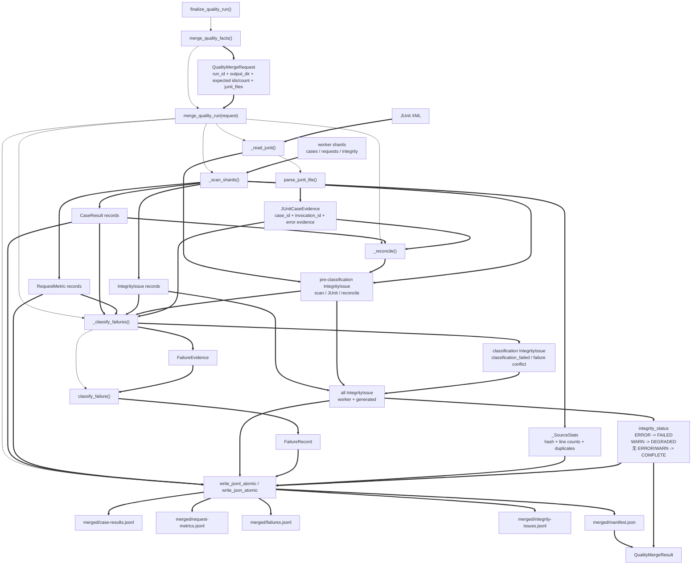
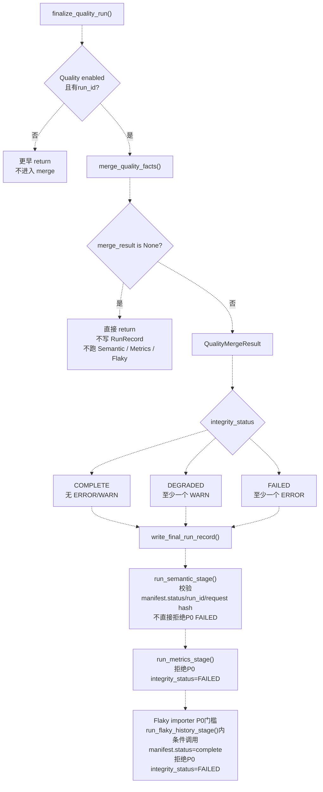

# 第18课：Aggregator 先判断账本能不能信

> 第 17 课解决了 pytest worker 怎样写出 Case、Request、Integrity 三类原始分片。第 18 课继续往后走：Aggregator 怎样读取这些分片，怎样判断账本是否完整可信，怎样把 JUnit 证据和 worker facts 对上，并在归并结果里派生 FailureRecord。

---

## 1. 本课定位：先判账本，再谈指标

### 1.1 课程合同

| 项目 | 内容 |
| --- | --- |
| 课程位置 | 第三周第 4 课，承接第 17 课 worker 原始账本，进入归并阶段 |
| 核心问题 | 有了很多 JSONL 和 JUnit XML，为什么还不能马上算指标？ |
| 代码入口 | `run_orchestration/quality_fact_merge_stage.py`、`run_orchestration/quality_pipeline.py`、`quality/aggregator.py`、`quality/junit.py`、`quality/classifier.py` |
| 讲解重点 | `merge_quality_facts()` 与 `merge_quality_run()` 边界、shard 扫描、JUnit identity 关联、完整性状态、FailureRecord 派生、本课关注的 P0 可信性门槛 |
| 安全边界 | 只运行离线单元测试；禁用第三方 pytest 插件自动加载；不访问真实 API、Jenkins、数据库或模型服务 |
| 课后产出 | 在总图中增加 `merge_result is None`、manifest 提交状态、P0 `integrity_status`、本课关注的 P0 可信性门槛，以及 `JUnitCaseEvidence -> Classifier -> FailureRecord` 链路 |

### 1.2 可验收目标

学完本课后，学生必须能做到：

1. 区分 `merge_quality_facts()` 返回 `None` 与 `QualityMergeResult.integrity_status=FAILED` 的控制差异。
2. 解释 Aggregator 如何过滤当前 run、记录 shard stats，并把扫描、JUnit、对账和分类问题合并为 P0 完整性状态。
3. 说明 JUnit evidence 当前按 `quality_invocation_id` 关联 CaseResult，`quality_case_id` 只作为必需身份字段，不作为当前匹配键。
4. 画出 manifest 提交状态、P0 `integrity_status`、Semantic / Metrics / Flaky importer 在本课关注的 P0 可信性门槛和 FailureRecord 派生链路。

### 1.3 本课不讲什么

- 不展开 Semantic 如何把多个请求还原成一次业务调用；第 19 课讲。
- 不展开 Metrics 的 usage、cost、覆盖率聚合算法；第 20 课讲。
- 不展开 Flaky 历史库、状态机和治理动作；第 21 课讲。
- 不把 `FailureRecord` 画成 worker 原始分片；它是本课归并阶段派生事实。
- 不把 `integrity_status=FAILED` 讲成 `merge_result is None`；这两者是不同控制结果。
- 不把 Classifier 讲成 Aggregator 内部硬编码规则；Aggregator 组织证据，`quality/classifier.py` 执行分类规则。

### 1.4 课堂必讲路径

| 环节 | 对应章节 | 建议时间 |
| --- | --- | ---: |
| 第 17 课承接、第一性原理与 TOC 约束 | 第 2～3 节 | 8～10 分钟 |
| Runner 入口、`None` 边界与阶段顺序 | 第 4 节 | 8～10 分钟 |
| Aggregator 输入输出与 manifest | 第 5～6 节 | 8～10 分钟 |
| shard 扫描、去重、缺失与完整性问题 | 第 7～8 节 | 10～12 分钟 |
| JUnit 证据读取与 Case 对账 | 第 9～10 节 | 8～10 分钟 |
| FailureEvidence 与 Classifier 主线 | 第 11～12.3 节 | 9～11 分钟 |
| 离线证据与本课增量图 | 第 13～14 节 | 8～10 分钟 |
| 核心活动、复述与小测 | 第 15.1～15.3、17、18.1 节 | 5～7 分钟 |
| 缓冲与提问 | 全课 | 5 分钟 |

总计约 69～85 分钟。第 12.4～12.5、15.4、16 和 18.2 是教师附录或选讲，不计入必讲预算；主线必须保留 `merge_result is None`、`integrity_status`、JUnit identity 和 FailureEvidence 派生边界。

### 1.5 课堂最短路径

```text
第 2～3 节：确认本课只解决“账本能不能信”
-> 第 4 节：分清 merge_result is None 与 integrity_status
-> 第 5～8 节：解释 Aggregator 怎样扫描 shard、过滤 run、去重和记录问题
-> 第 9～10 节：解释 JUnit properties 怎样成为关联键
-> 第 11～12 节：解释 FailureRecord 怎样由证据和 Classifier 派生
-> 第 13～14 节：用离线测试证据和本课增量图闭环
-> 第 15.1～15.3、17、18.1 节：只做核心场景、复述和小测
```

---

## 2. 从第 17 课接上：worker 写出来，不代表可以直接用

第 17 课结束时，我们有这些输入：

```text
reports/quality/shards/
├─ cases-<execution>-<worker>.jsonl
├─ requests-<execution>-<worker>.jsonl
└─ integrity-<execution>-<worker>.jsonl

JUnit XML
└─ testcase properties:
   quality_case_id
   quality_invocation_id
```

这还不是“可直接算指标”的数据集。原因很简单：worker 负责把自己看到的事实写出来，但它不知道全局是否缺页、重复、损坏、跨 run 污染，也不知道 JUnit XML 是否来自本次运行。

### 2.1 本课新增主链

```text
Runner finalize_quality_run()
-> merge_quality_facts()
-> merge_result is None ?
   ├─ 是：Quality 下游完全停止
   └─ 否：写 run record，并进入 Semantic / Metrics / Flaky 后续阶段

merge_quality_run()
-> 扫描 worker shards
-> 读取 JUnitCaseEvidence
-> 对账完整性
-> Classifier 派生 FailureRecord
-> 写 merged JSONL 与 manifest
```

这条链只说明归并阶段怎样产生可信性边界和派生事实。它不说明 Metrics 怎样聚合，也不说明 Flaky 怎样治理。

### 2.2 第一性原理

原始账本要进入指标系统，至少要回答五个问题：

```text
1. 这些记录是否属于当前 run？
2. 预期 execution 是否都有 case shard？
3. JSONL 是否可读，记录 schema 是否有效？
4. JUnit XML 能否通过 quality identity 对上 CaseResult？
5. 失败用例是否有足够证据生成稳定 FailureRecord？
```

如果这些问题没有先回答，后面的 Metrics 和 Flaky 就会把“缺失、重复、错配、损坏”误当成业务事实。

---

## 3. TOC 约束：本课真正要解除什么瓶颈

本课的 TOC 约束不是“怎么读 JSONL”，而是：

> Aggregator 怎样把多个来源的事实变成一个有完整性状态的归并结果，并让后续阶段按自己的合同继续判断可信性；本课只画 P0 相关门槛。

因果链：

```text
worker shard 只是局部事实
-> 可能缺 execution、缺 case、混入其他 run、重复或损坏
-> JUnit XML 也可能缺 identity、过期或状态不一致
-> 如果直接算指标，会把采集问题当成业务质量问题
-> 因此必须先 merge + integrity status
-> 然后各下游再按自己的合同做可信性判断；本课只标出 P0 相关门槛
```

解除约束的最小方案：

```text
扫描所有 P0 worker shards
-> 只接收当前 run_id 的记录
-> 记录 source stats、hash、无效行、重复和冲突
-> 解析 JUnit identity 并按 invocation_id 对账
-> 对失败 / error CaseResult 组织 FailureEvidence
-> 调用 Classifier 生成 FailureRecord
-> 写 merged artifacts 和 manifest
-> 返回 QualityMergeResult 或 None
```

---

## 4. Runner 入口：`None` 与 `FAILED` 是两件事

### 4.1 `quality_pipeline.finalize_quality_run()`

Runner 收尾阶段调用：

```text
finalize_quality_run(
  quality_config,
  start_time,
  expected_execution_ids,
  expected_case_count,
  junit_files,
  status,
)
```

主顺序是：

```text
if not quality_config.enabled or not quality_config.run_id:
  return

merge_quality_facts()
-> if merge_result is None:
     return
-> write_final_run_record()
-> run_semantic_stage()
-> run_metrics_stage()
-> run_flaky_history_stage()
-> run_flaky_state_stage()
```

所以最重要的控制边界是：

```text
merge_result is None
```

在已经进入 `enabled=True` 且存在 `run_id` 的 `finalize_quality_run()` 主线后，只有这个结果会让 Quality 下游完全停止。函数本身还有更早的提前返回：Quality 未启用或缺少 `run_id` 时直接返回。

### 4.2 `merge_quality_facts()` 是 fail-open wrapper

`run_orchestration/quality_fact_merge_stage.py` 做一件事：把 Runner 已知信息包装成 `QualityMergeRequest`，然后调用 `merge_quality_run()`。

```text
QualityRuntimeConfig
expected_execution_ids
expected_case_count
junit_files
start_time
-> QualityMergeRequest
-> merge_quality_run()
```

如果这个 wrapper 捕获到异常：

```text
print("Quality merge failed open: ...")
return None
```

这表示连归并结果都没有，Runner 不再写最终 run record，也不再进入 Semantic、Metrics、Flaky。

### 4.3 `merge_quality_run()` 通常返回结果

`quality/aggregator.py::merge_quality_run()` 内部会写 `manifest.json`，并在主归并过程异常时尽量返回：

```text
QualityMergeResult(
  integrity_status=FAILED,
  ...
)
```

这不是 `None`。它表示“归并阶段产出了结果、失败完整性状态和问题证据”。如果主流程完成，`manifest.status` 仍会写成 `complete`，即使 `integrity_status=FAILED`。Runner 仍会继续写 run record，并启动后续阶段；各下游再按自己的规则判断是否接受 P0 事实。

三个状态不要混用：

```text
manifest.status
-> 归并产物是否提交完成

P0 integrity_status
-> P0 facts 是否完整可信

下游阶段状态
-> Semantic / Metrics / Flaky 各自校验后的结果
```

当前下游规则也不同：

```text
Semantic
-> 校验 P0 manifest.status、run_id、request-metrics hash
-> 不直接拒绝 P0 integrity_status=FAILED

Metrics
-> 明确拒绝 P0 integrity_status=FAILED

Flaky importer
-> 要求 P0 manifest.status=complete
-> 明确拒绝 P0 integrity_status=FAILED
```

### 4.4 课堂必须画出的分叉

```text
merge_quality_facts()
├─ None
│  -> Quality 下游完全停止
└─ QualityMergeResult
   -> 写 RunRecord
   -> 后续阶段继续执行各自可信性校验
```

不要画成这种错误控制流：

```text
错误命题：把 integrity_status=FAILED 当成统一停止条件
```

当前代码不是这样。

---

## 5. Aggregator 的输入：`QualityMergeRequest`

`QualityMergeRequest` 包含：

```text
run_id
output_dir
expected_execution_ids
expected_case_count
junit_files
run_start_time
```

### 5.1 `run_id`

用于过滤 worker shard 中属于其他 run 的记录。

```text
payload["run_id"] != request.run_id
-> foreign_run_records += 1
-> 不进入当前归并结果
```

这一步非常关键，因为第 17 课已经说明：当前 shard 文件名不包含 `run_id`。Aggregator 不能只相信文件名，必须看记录里的 `run_id`。

### 5.2 `expected_execution_ids`

Runner 告诉 Aggregator 这次运行预期有哪些 execution。

```text
expected_execution_ids=("serial-pool", "parallel-pool")
```

Aggregator 会检查：

```text
是否存在 cases-<execution>-*.jsonl
```

缺失会生成：

```text
IntegrityIssue(
  source="aggregator",
  code="missing_case_shard",
  severity=ERROR,
)
```

### 5.3 `expected_case_count`

Aggregator 不只数物理行，而是数当前 run 的 `invocation_id`。

```text
expected_case_count != len(merged invocation_ids)
-> expected_case_count_mismatch
-> severity=ERROR
```

这能发现“收集到的用例数”和“worker case facts”不一致。

### 5.4 `junit_files` 与 `run_start_time`

JUnit XML 是外部证据，不是 worker shard。

Aggregator 会检查：

```text
文件是否存在
文件 mtime 是否早于 run_start_time
XML 是否能解析
testcase 是否带 quality identity
```

过期 JUnit XML 不应拿来对当前 run 做分类证据。

---

## 6. Aggregator 的输出：merged artifacts 与 manifest

成功进入 `merge_quality_run()` 后，输出目录仍在 `reports/quality` 或配置指定目录下。

归并输出在：

```text
reports/quality/merged/
├─ case-results.jsonl
├─ request-metrics.jsonl
├─ failures.jsonl
├─ integrity-issues.jsonl
└─ manifest.json
```

### 6.1 四类 merged JSONL

| 文件 | 内容 | 来源 |
| --- | --- | --- |
| `case-results.jsonl` | 去重后的 `CaseResult`，失败项会补 `failure_id` | worker case shards + classifier 回写 |
| `request-metrics.jsonl` | 当前 run 的 `RequestMetric` | worker request shards |
| `failures.jsonl` | `FailureRecord` | Aggregator 组织证据后由 Classifier 派生 |
| `integrity-issues.jsonl` | worker integrity + Aggregator/JUnit/Classifier 产生的问题 | worker integrity shards + merge 阶段 |

### 6.2 `manifest.json`

manifest 不是摆设，它是归并结果的目录和校验摘要：

```text
manifest_version
schema_version
run_id
status
merge_version
classifier_rule_version
fingerprint_version
expected_execution_ids
expected_case_count
source_shards
junit_files
output_counts
output_hashes
integrity_status
```

其中 `source_shards` 会记录：

```text
path
type
sha256
physical_non_empty_lines
current_run_records
foreign_run_records
invalid_json
invalid_schema
exact_duplicates
conflict_duplicates
```

这就是“账本能不能信”的证据清单。

### 6.3 原子写边界

Aggregator 输出 merged artifacts 使用：

```text
write_jsonl_atomic()
write_json_atomic()
```

这和第 17 课 worker shard 的追加写不同。worker 是分进程追加写自己的 shard；Aggregator 是单阶段生成归并产物，所以可以用原子替换写最终文件。

---

## 7. shard 扫描：只接收当前 run 的有效事实

### 7.1 扫描三类 shard

Aggregator 扫描：

```text
cases-*.jsonl
requests-*.jsonl
integrity-*.jsonl
```

分别解析为：

```text
CaseResult
RequestMetric
IntegrityIssue
```

如果 `shards/` 目录不存在：

```text
IntegrityIssue(
  source="aggregator",
  code="shards_dir_missing",
  severity=ERROR,
)
```

但函数不会因为这个问题立刻崩掉，而是继续形成一个失败完整性状态的结果。

### 7.2 每行先过物理和 JSON 检查

每个非空物理行先做：

```text
json.loads(line.decode("utf-8"))
```

失败会产生：

```text
invalid_jsonl_line
severity=WARN
```

如果 JSON 不是对象：

```text
invalid_jsonl_schema
severity=WARN
```

### 7.3 run 过滤发生在 schema validate 前

如果 payload 是对象，但：

```text
payload["run_id"] != request.run_id
```

Aggregator 只增加：

```text
foreign_run_records
```

不会把它算入当前 run，也不会因为外部 run 的 schema 细节污染当前 run 的完整性判断。

### 7.4 当前 run 再做模型校验

当前 run 的 payload 才进入：

```text
model.model_validate(payload)
```

失败会产生：

```text
invalid_quality_schema
severity=WARN
```

这说明“这个 run 的事实行存在格式问题”，但不是完全无法归并。

---

## 8. 去重、冲突与完整性状态

### 8.1 CaseResult 的 key

CaseResult 的去重 key 是：

```text
(invocation_id, phase)
```

同一个 invocation 的 setup / call / teardown 是不同 phase，所以不是重复。

### 8.2 RequestMetric 的 key

RequestMetric 的 key 是：

```text
request_event_id
```

同一请求事件重复出现，如果内容完全一致，记为 exact duplicate；如果内容不同，就是冲突。

### 8.3 IntegrityIssue 的 key

IntegrityIssue 的 key 是：

```text
(source, code, related_id, message)
```

完全相同的 IntegrityIssue 会被折叠，不会因为重复写入而线性膨胀。但同 key 不同内容仍会产生 `integrity_issue_conflict`；exact duplicate 和 conflict duplicate 是两条不同路径。

### 8.4 完全重复与冲突重复

如果 key 已存在：

```text
canonical(existing) == canonical(new)
-> exact_duplicates += 1
```

如果 key 相同但内容不同：

```text
conflict_duplicates += 1
-> IntegrityIssue(
     code="case_result_conflict"
       或 "request_metric_conflict"
       或 "integrity_issue_conflict",
     severity=ERROR,
   )
```

冲突是 ERROR，因为它表示同一事实身份出现了两个不一致版本。

### 8.5 integrity status 规则

当前实现非常直接：

```text
任意 ERROR -> FAILED
否则任意 WARN -> DEGRADED
否则 -> COMPLETE
```

这只是 P0 Aggregator 的完整性状态，不等于业务测试状态，也不等于下游 Metrics 一定可用。

---

## 9. JUnit parser：标准测试结果里的对账标签

### 9.1 为什么还要 JUnit

CaseResult 保存 pytest report 的阶段和状态；JUnit XML 保存标准测试报告生态里的 testcase、failure/error/skipped 证据。

Aggregator 需要把两者关联起来：

```text
JUnit properties
-> JUnitCaseEvidence
-> invocation_id
-> CaseResult
```

不能只靠 testcase name 或 classname，因为参数化、路径格式和显示名称都可能变化。

### 9.2 `parse_junit_file()`

`quality/junit.py` 会遍历 XML 中的 testcase，生成：

```text
JUnitCaseEvidence(
  junit_path,
  classname,
  name,
  status,
  case_id,
  invocation_id,
  error_type,
  message,
  assert_location,
  duration_seconds,
)
```

### 9.3 status 映射

```text
<error>   -> error
<failure> -> failed
<skipped> -> skipped
无以上节点 -> passed
```

JUnit 的 `failed` 与 pytest 的 `error` 都可能和 CaseResult 中的非通过状态兼容。Aggregator 后续会用 `_compatible_status()` 判断。

### 9.4 message 与 assert location

JUnit parser 会：

```text
读取 failure/error/skipped 的 message 与 text
-> 脱敏
-> 如果超过 500 字符，先保留前 500 字符，再追加 ...<truncated>
-> 用正则提取 .py:行号
```

这些信息进入 Classifier，帮助区分测试缺陷、产品缺陷、配置问题或环境问题。

---

## 10. JUnit 对账：缺身份不是默认成功

### 10.1 缺 identity

如果 testcase 没有：

```text
quality_case_id
quality_invocation_id
```

Aggregator 会记录：

```text
junit_missing_quality_identity
severity=WARN
```

它不会把缺失身份当成默认通过，也不会猜一个 invocation。

注意当前实现的限制：Aggregator 要求 `quality_case_id` 和 `quality_invocation_id` 都存在，但实际索引和关联使用的是 `invocation_id`。源码不会额外校验 JUnit `case_id` 是否等于对应 CaseResult 的 `case_id`。所以 `quality_case_id` 是身份完整性信号和后续扩展空间，不是当前对账的主匹配键。

### 10.2 invocation 冲突

如果多个 JUnit testcase 使用同一个 invocation_id，但内容不同：

```text
junit_identity_conflict
severity=ERROR
```

这是严重问题，因为一个 invocation 不能有多个互相冲突的 JUnit 证据。

### 10.3 JUnit invocation 找不到 CaseResult

如果 JUnit 有 invocation，但 merged CaseResult 里没有：

```text
junit_invocation_missing_case_result
severity=WARN
```

这通常说明 JUnit 和 worker shard 不同源，或者 case shard 缺失。

### 10.4 状态不一致

Aggregator 会把同一 invocation 的 CaseResult 折叠成一个 case status，再和 JUnit status 比较。

例如：

```text
CaseResult: setup skipped + teardown passed
-> fold_case_status = skipped
JUnit skipped
-> 兼容
```

如果不兼容：

```text
junit_status_mismatch
severity=WARN
```

---

## 11. Reconcile：完整性问题不等于立刻停止

### 11.1 没有任何 CaseResult

如果当前 run 没有 CaseResult：

```text
no_case_results
severity=ERROR
```

这是 FAILED 完整性状态，但 `merge_quality_run()` 仍会尽量写 manifest 和 merged artifacts。

### 11.2 预期用例数不一致

```text
expected_case_count != merged invocation 数
-> expected_case_count_mismatch
-> severity=ERROR
```

这不是“测试失败”，而是“账本不完整”。下游不能把它当成可信指标输入。

### 11.3 预期 execution 缺 case shard

```text
expected_execution_ids
-> 每个 execution 至少应有 cases-<execution>-*.jsonl
```

缺失会触发：

```text
missing_case_shard
severity=ERROR
```

### 11.4 JUnit 数量不一致

如果传入了 JUnit 文件：

```text
len(junit_evidence) != len(invocation_ids)
-> junit_case_count_mismatch
-> severity=WARN
```

这表示 JUnit 证据不完整，但 worker CaseResult 仍可能可以归并。

---

## 12. Classifier：Aggregator 组织证据，Classifier 执行规则

### 12.1 谁负责什么

Aggregator 的职责：

```text
CaseResult
+ JUnitCaseEvidence
+ RequestMetric
+ related Integrity codes
-> FailureEvidence
```

Classifier 的职责：

```text
FailureEvidence
-> FailureRecord
```

不要把这两层合成一个“Aggregator 自动分类黑盒”。

### 12.2 只分类 failed / error

Aggregator 只对这些 CaseResult 分类：

```text
raw_status in {failed, error}
或 final_status in {failed, error}
```

passed、skipped、xfailed 不生成 FailureRecord。

### 12.3 FailureEvidence 的证据来源

```text
run_id / case_id / invocation_id / phase
-> 来自 CaseResult

error_type / assert_location / junit_status
-> 来自 JUnitCaseEvidence，缺失时为 None

message
-> 来自 JUnitCaseEvidence，缺失时降级使用 CaseResult 的 raw_status 值

request_metrics
-> 按 invocation_id 收集 RequestMetric

related_integrity_codes
-> 按 related_id 收集 IntegrityIssue code
```

这里的关键是 `invocation_id`。它把 Case、Request、JUnit 串到同一次测试调用上。

注意降级边界：缺少 JUnit evidence 时，只有 `message` 回退为 CaseResult 的 `raw_status`；`error_type`、`assert_location` 和 `junit_status` 都是 `None`。不要把四个 JUnit 字段都画成从 CaseResult 状态回退。

### 12.4 Classifier 规则概览

`quality/classifier.py::classify_failure()` 会判断：

| 规则 | 输出倾向 |
| --- | --- |
| 缺配置、API key、权限、认证等 | `CONFIGURATION` / `CONFIGURATION` / `HIGH` |
| `quality/` 位置或 `quality_` 完整性 code | `FRAMEWORK_DEFECT` / `FRAMEWORK` / `HIGH` |
| DNS、连接、SSL、磁盘空间等 | `ENVIRONMENT` / `ENVIRONMENT` / `HIGH` |
| module/tests 下本地 KeyError、IndexError、TypeError、ValueError 等 | `TEST_DEFECT` / `TEST` / `MEDIUM` |
| rate limit、429、可重试 timeout | `TRANSIENT` / `ENVIRONMENT` / `HIGH` |
| 有唯一 interface 且断言/contract/schema/status 等证据 | `PRODUCT_DEFECT` / `PRODUCT` / `MEDIUM` |
| 证据不足 | `UNKNOWN` / `UNKNOWN` / `LOW` |

这不是机器学习分类器，而是当前 P0 的稳定规则集。

### 12.5 failure fingerprint

FailureRecord 的稳定指纹来自：

```text
phase
error_type
normalized_message
interface_id
assert_location
```

动态值会被规范化，例如时间戳、token 等不应导致同类失败每次生成不同 fingerprint。

---

## 13. 课堂离线证据

### 13.1 核心安全命令

这组命令验证 Aggregator、JUnit parser、Classifier 和 Quality pipeline 的 `None` 边界。命令保存并恢复环境，禁用第三方 pytest 插件自动加载，清空显式插件列表，关闭 cacheprovider，并使用项目外 GUID 唯一 `--basetemp`。

```powershell
$environmentNames = @("PYTEST_DISABLE_PLUGIN_AUTOLOAD", "PYTEST_PLUGINS")
$previousEnvironment = @{}
foreach ($name in $environmentNames) {
  $previousEnvironment[$name] =
    [Environment]::GetEnvironmentVariable(
      $name,
      [EnvironmentVariableTarget]::Process
    )
}

$trimSeparators = [char[]]@("\", "/")
$tempParent = (Resolve-Path -LiteralPath $env:TEMP -ErrorAction Stop).Path.TrimEnd($trimSeparators)
$tempRoot = Join-Path `
  $tempParent `
  ("llm_api_case_lesson18_core_" + [guid]::NewGuid().ToString("N"))
$pytestTemp = Join-Path $tempRoot "pytest"
New-Item -ItemType Directory -Force -Path $tempRoot | Out-Null
$pytestExitCode = 1

try {
  [Environment]::SetEnvironmentVariable(
    "PYTEST_DISABLE_PLUGIN_AUTOLOAD",
    "1",
    [EnvironmentVariableTarget]::Process
  )
  [Environment]::SetEnvironmentVariable(
    "PYTEST_PLUGINS",
    $null,
    [EnvironmentVariableTarget]::Process
  )

  & .\.venv\Scripts\python.exe -m pytest `
    -o addopts= `
    -p no:cacheprovider `
    --basetemp $pytestTemp `
    tests/quality/test_quality_aggregator.py `
    tests/quality/test_quality_junit.py `
    tests/quality/test_quality_classifier.py `
    tests/quality/test_run_orchestration_quality_pipeline.py `
    -q
  $pytestExitCode = $LASTEXITCODE
}
finally {
  foreach ($name in $environmentNames) {
    [Environment]::SetEnvironmentVariable(
      $name,
      $previousEnvironment[$name],
      [EnvironmentVariableTarget]::Process
    )
  }

  if (Test-Path -LiteralPath $tempRoot) {
    $resolvedTempRoot =
      (Resolve-Path -LiteralPath $tempRoot -ErrorAction Stop).Path.TrimEnd($trimSeparators)
    $resolvedParent =
      (Split-Path -Parent $resolvedTempRoot).TrimEnd($trimSeparators)
    $resolvedLeaf = Split-Path -Leaf $resolvedTempRoot
    if (
      $resolvedParent -eq $tempParent -and
      $resolvedLeaf -like "llm_api_case_lesson18_core_*"
    ) {
      Remove-Item -LiteralPath $resolvedTempRoot -Recurse -Force
    }
    else {
      Write-Warning "Refused to clean unexpected path: $resolvedTempRoot"
    }
  }
}

if ($pytestExitCode -ne 0) {
  throw "Lesson 18 core offline tests failed: $pytestExitCode"
}
```

当前离线证据：

```text
11 passed
```

### 13.2 这些测试分别证明什么

| 测试文件 | 证明的事实 |
| --- | --- |
| `test_quality_aggregator.py` | 过滤 foreign run、去重、写 manifest、恢复有效行、JUnit 分类、跳过折叠、完整性状态 |
| `test_quality_junit.py` | 解析 JUnit identity、status、error_type、assert_location、脱敏 message；缺身份为 None |
| `test_quality_classifier.py` | 配置、未知断言、限流瞬态、稳定 fingerprint 等分类边界 |
| `test_run_orchestration_quality_pipeline.py` | `merge_result is None` 后停止；有 merge result 时阶段顺序继续 |

### 13.3 这些测试不能证明什么

它们不能证明：

- 真实 Jenkins 工作区里的 JUnit 文件一定来自当前 run；
- 任意损坏文件都能生成完整 merged artifacts；
- Metrics、Semantic、Flaky 的可信性规则已经在本课证明；
- 所有业务失败都能被高置信度分类；
- 错误命题：`integrity_status=FAILED` 是统一停止条件。

最后一条尤其重要：在已经进入 enabled 且有 run_id 的 finalize 主线后，当前代码只有 `merge_result is None` 才让 `finalize_quality_run()` 在归并后直接返回。

### 13.4 课堂阅读活动：同一 Case 的分类证据

这一步不新增测试代码。教师让学生打开 `tests/quality/test_quality_classifier.py`，把默认 `_evidence()` 看成同一个 Case，然后预测四个证据变体：

| 证据变体 | 预测重点 |
| --- | --- |
| `message="missing required API key"` | 应归到 `CONFIGURATION`，owner 是 `CONFIGURATION` |
| `request_metrics=()` 且只有模糊断言 | 证据不足，应保持 `UNKNOWN` |
| `message="rate limit exceeded"` 且请求是 429/retryable | 应归到 `TRANSIENT`，owner 是 `ENVIRONMENT` |
| 两条只差时间戳和 token 的 message | `failure_id` 应稳定，动态 token 不进入 normalized message |

这项活动补足 `pytest -q` 只能证明测试通过、不能展示分类推理过程的问题。

---

## 14. 本课增量图

本节使用两张图，避免混用“调用”“对象流”和“控制结果”。

- 14.1 表示调用与对象流。
- 14.2 表示 `None`、完整性状态和阶段入口控制结果。

### 14.1 调用与对象流图

图例：`-->` 表示函数调用；`==>` 表示对象、事实或产物；`-.->` 表示后续课程接口。



### 14.2 控制结果图

图例：`-.->` 只表示控制结果，不表示调用。



### 14.3 读图规则

1. 在已进入 enabled 且有 run_id 的 finalize 主线后，`merge_quality_facts()` 返回 `None` 才完全停止 Quality 下游；配置关闭或缺 run_id 会更早返回。
2. `QualityMergeResult.integrity_status=FAILED` 仍是一个结果，不等于 `None`。
3. `FailureRecord` 来自 Classifier，不来自 worker shard。
4. JUnit XML 当前按 `quality_invocation_id` 建索引并关联 CaseResult；`quality_case_id` 必须存在，但当前源码不校验它是否等于 CaseResult 的 `case_id`。
5. Manifest 的 `source_shards` 和 `output_hashes` 是归并可审计性的证据，不是装饰字段。
6. `manifest.status=complete` 只表示归并产物提交完成；P0 `integrity_status` 表示 P0 facts 完整性；Semantic、Metrics、Flaky importer 各自还有更完整的输入合同，本课只标出 P0 相关可信性门槛。

---

## 15. 课堂活动：四个账本场景

### 15.1 场景 A：完整账本

输入：

```text
cases-serial-pool-master.jsonl: 1 条当前 run CaseResult
requests-serial-pool-master.jsonl: 1 条当前 run RequestMetric
expected_execution_ids=("serial-pool",)
expected_case_count=1
无 JUnit 文件
```

判断：

- `merge_result is None`：否；
- `integrity_status`：`COMPLETE`；
- `foreign_run_records`：0；
- `failures.jsonl`：空。

### 15.2 场景 B：有一行非法 JSON，但失败用例可分类

输入：

```text
CaseResult failed
RequestMetric status_code=500
JUnit testcase 同时带 quality_case_id 和 quality_invocation_id
case shard 里额外混入 not-json
```

判断：

- `invalid_jsonl_line`：WARN；
- `integrity_status`：`DEGRADED`；
- `FailureRecord`：会生成；
- CaseResult 会补 `failure_id`。

### 15.3 场景 C：缺预期 execution 的 case shard

输入：

```text
expected_execution_ids=("serial-pool", "parallel-pool")
实际只有 cases-serial-pool-master.jsonl
```

判断：

- `missing_case_shard`：ERROR；
- `integrity_status`：`FAILED`；
- `merge_result is None`：否；
- Runner 后续阶段是否被完全跳过：否。

### 15.4 场景 D：wrapper 异常

输入：

```text
merge_quality_facts() 自身捕获异常
```

判断：

- 返回值：`None`；
- `finalize_quality_run()` 是否继续写 RunRecord：否；
- Semantic / Metrics / Flaky 是否执行：否。

---

## 16. 常见误区

### 误区一：只要有 worker JSONL，就可以直接算指标

错误。worker JSONL 是局部原始事实，可能缺 execution、混入 foreign run、重复、损坏或与 JUnit 不一致。必须先归并并生成完整性状态。

### 误区二：`integrity_status=FAILED` 等于 `merge_result is None`

错误。`FAILED` 是一个归并结果的状态；`None` 是 wrapper fail-open 后没有归并结果。当前 pipeline 只有遇到 `None` 才直接停止。

### 误区三：JUnit XML 可以替代 Case JSONL

错误。JUnit XML 是标准测试报告证据，Case JSONL 是 worker 原始事实。JUnit 通过 `quality_invocation_id` 与 CaseResult 对账，不替代它。

### 误区四：FailureRecord 是 worker 写出来的

错误。worker 写 Case、Request、Integrity。FailureRecord 是 Aggregator 组织证据后由 Classifier 派生。

### 误区五：Classifier 只看错误消息

错误。Classifier 的输入还包含 phase、assert location、request metrics、related integrity codes 和可选 interface evidence。

### 误区六：foreign run 记录会让当前 run 失败

不准确。当前实现会把 foreign run 记录计入 source stats 并跳过，不直接把它作为当前 run 的完整性问题。但如果共享输出目录导致当前 run shard 缺失或冲突，仍会产生相应 ERROR。

### 误区七：有 `failures.jsonl` 就说明业务失败可信

不完整。`failures.jsonl` 表示已派生 FailureRecord；是否能进入 Metrics 或 Flaky 的可信输入，还要看 manifest、integrity status 和后续阶段自己的校验。

---

## 17. 三分钟复述

建议按“入口边界 -> 扫描归并 -> JUnit 对账 -> 分类派生 -> 下游控制”复述：

```text
第 18 课解决的是 worker 原始账本能不能信。第 17 课已经让 pytest worker 写出了 Case、Request、Integrity 三类 shard；第 18 课由 Aggregator 读取这些 shard，只保留当前 run_id 的记录，并记录每个 shard 的 hash、物理行、当前 run 记录、foreign run、无效行和重复冲突。

Runner 通过 finalize_quality_run() 调用 merge_quality_facts()。如果 merge_quality_facts() 返回 None，Quality 下游完全停止；如果返回 QualityMergeResult，即使 integrity_status 是 FAILED，Runner 仍会写最终 RunRecord，并继续进入 Semantic、Metrics、Flaky，让后续阶段执行自己的可信性校验。

Aggregator 会解析 JUnit XML，把 testcase properties 里的 quality_case_id 和 quality_invocation_id 变成 JUnitCaseEvidence。当前实现用 invocation_id 把 JUnit 证据和 CaseResult 对上；quality_case_id 必须存在，但不会被拿来校验是否等于 CaseResult.case_id。Aggregator 会检查缺身份、重复 identity、数量不一致和状态不一致。

对 failed 或 error 的 CaseResult，Aggregator 组织 FailureEvidence：CaseResult 给 run、case、invocation、phase，JUnit 给 error_type、message、assert_location，RequestMetric 给接口和请求结果，IntegrityIssue 给相关完整性 code。真正的分类规则在 quality/classifier.py，输出 FailureRecord 和稳定 fingerprint。

最终 Aggregator 写 merged/case-results.jsonl、request-metrics.jsonl、failures.jsonl、integrity-issues.jsonl 和 manifest.json。FailureRecord 是归并派生事实，不是 worker 原始分片。
```

---

## 18. 课堂小测与教师验收

### 18.1 三道核心小测

1. `merge_quality_facts()` 返回 `None` 时，`finalize_quality_run()` 是否继续写 RunRecord？A 是 / B 否（B）
2. `merge_quality_run()` 返回 `integrity_status=FAILED` 时，这个返回值是否等于 `None`？A 是 / B 否（B）
3. FailureRecord 是 worker shard 原始记录吗？A 是 / B 不是（B）

### 18.2 教师题库

4. JUnit testcase 缺 `quality_invocation_id` 时 Aggregator 会猜测 invocation 吗？A 会 / B 不会（B）
5. CaseResult 的去重 key 是什么？A `nodeid` / B `(invocation_id, phase)` / C `case_id`（B）
6. RequestMetric 的去重 key 是什么？A `request_event_id` / B `invocation_id` / C `interface_id`（A）
7. 没有 ERROR 时，任意 WARN 会让 integrity status 变成什么？A COMPLETE / B DEGRADED / C FAILED（B）
8. Classifier 判断 transient 的典型证据是什么？A 429 或 rate limit / B 没有 JUnit / C skipped（A）

### 18.3 教师验收清单

合格复述必须包含：

- `merge_quality_facts()` 与 `merge_quality_run()` 的职责边界；
- `merge_result is None` 与 `integrity_status=FAILED` 的控制差异；
- shard 扫描时 current run、foreign run、invalid JSON、schema、duplicate 的处理；
- JUnit properties 如何变成 `JUnitCaseEvidence` 并按 `invocation_id` 对账；
- Aggregator 组织 `FailureEvidence`，Classifier 生成 `FailureRecord`；
- `FailureRecord` 是归并派生事实，不是 worker 原始分片；
- 后续 Semantic、Metrics、Flaky 会继续执行自己的可信性校验。

---

## 19. 课后作业：更新总图，不写代码

### 19.1 必做内容

在第 17 课图上增加第 18 课节点，必须沿用清晰图例：

```text
worker shards ==> _scan_shards()
JUnit XML ==> _read_junit()
_read_junit() --> parse_junit_file()
_scan_shards() ==> CaseResult / RequestMetric / IntegrityIssue
parse_junit_file() ==> JUnitCaseEvidence
CaseResult + JUnitCaseEvidence + RequestMetric + IntegrityIssue ==> FailureEvidence
_classify_failures() --> classify_failure()
FailureEvidence ==> classify_failure()
classify_failure() ==> FailureRecord
CaseResult / RequestMetric / FailureRecord / IntegrityIssue ==> merged artifacts
merged artifacts ==> manifest.json
manifest.json ==> manifest.status
IntegrityIssue records ==> P0 integrity_status
merge_quality_facts() -. None .-> Quality 下游停止
QualityMergeResult -. result exists .-> RunRecord
manifest.status + run_id + request-metrics hash ==> Semantic 的 P0 门槛
P0 integrity_status ==> Metrics 的 P0 门槛
manifest.status + P0 integrity_status ==> Flaky importer 的 P0 门槛
```

图中必须显式标出：

- `merge_result is None` 判断；
- `manifest.status` 表示归并产物提交状态；
- P0 `integrity_status` 表示事实完整性状态；
- Semantic、Metrics、Flaky importer 在本课关注的 P0 可信性门槛不同；
- `FailureRecord` 是派生事实；
- Metrics、Semantic、Flaky 是后续阶段，不在本课展开内部算法。

### 19.2 不要求完成

- 不新增分类规则。
- 不修改 Aggregator。
- 不手工编辑 merged JSONL。
- 不运行真实业务用例。
- 不提前实现 Metrics 或 Flaky。

---

## 20. 下一课接口

第 18 课已经建立：

```text
merged/request-metrics.jsonl
merged/manifest.json
integrity_status
FailureRecord
```

但它还没有回答：

```text
多个 request event 怎样属于同一次业务操作？
重试组怎样折叠？
polling session 怎样和 operation 对上？
streaming line 怎样归入一次输出？
```

第 19 课进入 Semantic：

```text
RequestMetric
+ semantic operation / request group / polling / stream records
-> 业务操作级事实
-> 为第 20 课 Metrics 提供更接近业务语义的输入
```

第 18 课解决“账本能不能信”；第 19 课解决“多个请求怎样还原成一次业务调用”。
