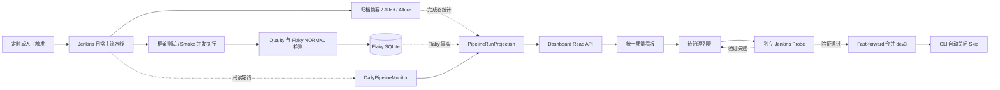

# Flaky 治理覆盖日常主流水线开发方案

## 1. 文档定位

本文定义将现有 Flaky 治理看板扩展为日常主流水线统一质量看板的开发方案。

本次建设不是替换 Jenkins，也不是把普通 Smoke 运行改造成 Probe，而是在现有执行事实、Flaky 检测、治理、Probe 验证和自动关闭能力之上，增加日常主流水线的实时监控与统一展示：

```text
日常主流水线监控
  + 本轮测试与质量事实
  + 本轮 Flaky 变化
  + 待治理用例
  + 独立 Probe 验证
  + 验证通过后合并 dev3 并自动关闭 Skip
```

第一阶段必须采用只读 Shadow 方式接入 Jenkins。监控失败不得触发构建、修改 Jenkins 结果、写入 Flaky 检测表或影响现有 Probe。

## 2. 当前基线

### 2.1 已具备能力

- 根目录 `Jenkinsfile` 是日常主流水线，包含框架测试、Smoke 收集、真实 Smoke、质量收口和报告发布。
- 主 Job 通过 `disableConcurrentBuilds()` 避免两个主构建同时运行；真实 Smoke 内部可以通过 pytest-xdist 并发执行多个用例。
- 真实 Smoke 开启 `QUALITY_ENABLE`、Semantic 和 Metrics；检测到有效 `QUALITY_FLAKY_DB_PATH` 时同时开启 Flaky 历史与状态计算。
- Jenkins 已归档 `reports/pipeline-summary.md`、`reports/pipeline-summary.json`、JUnit、Allure 和 `reports/quality/**`。
- NORMAL Run 的 `run_id` 可由 Jenkins `JOB_NAME + BUILD_NUMBER` 稳定生成。
- Flaky SQLite 已保存 Job、构建号、分支、Commit、运行状态和检测变化，可以与 Jenkins 构建关联。
- 当前看板已有汇总、治理列表、用例详情、运行决策、Probe 创建、验证后 fast-forward 合并 dev3 和自动关闭能力。

### 2.2 当前缺口

- 首页没有把日常主流水线作为第一视图。
- 看板不能直接显示 Jenkins 排队、运行、成功、失败或取消状态。
- Jenkins 实时状态与已完成的 Quality/Flaky 事实没有统一投影。
- 用户需要分别查看 Jenkins 和 Flaky 看板，不能从一处判断“流水线是否运行、运行结果如何、本轮产生了哪些 Flaky 变化”。
- Jenkins 不可达、Quality 产物延迟或缺失时，页面尚无明确的数据新鲜度和降级状态。

## 3. 建设目标

### 3.1 目标

1. 看板首页直观显示日常主流水线的排队、运行、空闲和不可用状态。
2. 展示当前或最近构建的分支、Commit、触发方式、阶段、开始时间和耗时。
3. 构建完成后展示测试统计、质量数据状态和本轮 Flaky 变化。
4. 待治理用例保持直接展开，继续提供 Probe 验证、合并和关闭能力。
5. 运行态每 5 秒刷新，空闲态每 30 秒刷新。
6. Jenkins、测试执行、Quality 和 Flaky 各自保持独立事实边界，任一观察组件异常不得覆盖其他事实。
7. 首版接口不做应用身份鉴权，但服务必须只绑定 loopback 或隔离管理网。
8. 可以通过单一开关关闭主流水线监控并回退到原治理看板。

### 3.2 非目标

- 不替代 Jenkins Console、Blue Ocean、JUnit 或 Allure 的详细诊断能力。
- 不从看板修改主流水线参数、取消主流水线或重跑主流水线。
- 不把普通 Smoke PASS 当成 Probe 恢复证据。
- 不让 NORMAL Run 推进 Probe attempt 或自动关闭治理记录。
- 不在页面展示数据库路径、检测策略细节、Shadow 模式、凭据或证据签名。
- 不为第一版增加 Web 登录、角色权限、消息中心或跨 Jenkins Controller 聚合。
- 不解析 Jenkins Console 文本推断状态或测试结论。
- 不在第一阶段新增持久化运行历史表。

## 4. 核心边界

### 4.1 事实来源

| 信息 | 唯一权威来源 | 说明 |
|---|---|---|
| 队列、是否运行、构建结果 | Jenkins REST API | Dashboard 只读，不反向修改结果 |
| 阶段状态 | Jenkins Pipeline API；不可用时降级为未知 | 不通过 Console 正则解析 |
| 测试统计 | 本轮 `pipeline-summary.json`，必要时回退 Jenkins Test Report API | 缺失显示 `NO_DATA`，不得按零计算 |
| Flaky 检测变化 | Flaky SQLite 中对应 NORMAL Run 的可信事实 | 只关联，不复制为 Jenkins 状态 |
| 待治理和 Skip 状态 | Flaky SQLite 治理投影 | 保持现有查询语义 |
| Probe 状态与证据 | Probe ledger / Flaky SQLite | 不进入 NORMAL 检测窗口 |
| 合并结果 | GitLab refs 与现有合并服务 | 只允许已验证 SHA fast-forward 到 dev3 |

### 4.2 主流水线与 Probe 隔离

```text
NORMAL 主流水线
  -> 可以产生 Flaky 检测样本
  -> 不产生 Probe 恢复证据
  -> 不自动推进 attempt
  -> 不自动关闭 Skip

FLAKY_PROBE 专用流水线
  -> 只验证一个 case_id + param_hash
  -> 不进入 NORMAL 历史
  -> 达到可信门槛后允许合并
  -> 合并成功后调用既有 CLI 自动关闭 Skip
```

### 4.3 状态模型

不得用一个字段混合“当前是否执行”和“最近一次执行结果”。统一读模型至少包含：

- `activity_status`：`QUEUED`、`RUNNING`、`IDLE`、`UNKNOWN`。
- `result_status`：`SUCCESS`、`FAILURE`、`UNSTABLE`、`ABORTED`、`NOT_BUILT`、`UNKNOWN`。
- `quality_status`：`PENDING`、`READY`、`NOT_RUN`、`MISSING`、`INVALID`。
- `freshness_status`：`FRESH`、`STALE`、`UNAVAILABLE`。

规则：

- Jenkins 请求失败时为 `activity_status=UNKNOWN`，不能显示 `IDLE`。
- 正在运行且 Quality 尚未完成时为 `quality_status=PENDING`。
- 本轮未启用真实 Smoke 时为 `quality_status=NOT_RUN`。
- 构建完成后在宽限期内仍可为 `PENDING`；超过宽限期且无产物才是 `MISSING`。
- Quality/Flaky 无数据、损坏或版本不匹配不能改变 Jenkins `result_status`。
- 页面必须展示 `observed_at` 和 `last_successful_poll_at`，让用户判断数据是否过期。

## 5. 目标架构



### 5.1 组件职责

#### `DailyPipelineMonitor`

- 查询配置的主 Jenkins Job，而不是 Probe Job。
- 查询队列、当前构建、最近完成构建和可选阶段信息。
- 将 Jenkins 状态转换为内部稳定枚举。
- 后台持续运行，不依赖浏览器页面是否打开。
- 运行或排队时每 5 秒查询；空闲时每 30 秒查询。
- 请求超时、认证失败、响应结构异常均记录为可展示的观察错误。
- 使用单航班和短期缓存，避免多个浏览器同时放大 Jenkins 请求量。
- 不包含 Build、Cancel 或 Replay 方法，从接口边界保证只读。

#### `PipelineRunProjection`

- 使用规范化 Job 全名和 Build Number 关联 Jenkins Build 与 NORMAL Run。
- 同时校验分支和 Commit；不一致时拒绝关联并返回完整性告警。
- 合并 Jenkins 实时状态、构建摘要、测试统计、Flaky 变化及数据新鲜度。
- 不把 Jenkins 观察结果写入 `flaky_import_run`、`case_observation` 或治理表。
- 对 Quality 延迟、缺失和损坏分别建模，不使用空数组或零值掩盖异常。

#### `PipelineReadService`

- 为 API 提供不可变 DTO。
- 限制历史查询数量和单次下载的 Jenkins Artifact 大小。
- 对外隐藏 Jenkins 凭据、数据库路径、内部异常堆栈和原始证据签名。
- 为 Jenkins URL、JUnit、Allure 和摘要链接生成经过校验的同源地址。

### 5.2 Jenkins 读取范围

优先使用 Jenkins 标准 JSON API：

- Queue API：识别目标 Job 的排队项和原因。
- Job API：获取最近构建、是否正在执行、结果、时间和构建 URL。
- Build API：获取参数、分支、Commit 和 Actions。
- Pipeline Stage API：插件可用时获取阶段；不可用时仅降级阶段展示。
- Artifact API：构建完成后读取受大小限制的 `reports/pipeline-summary.json`。
- Test Report API：仅作为测试统计的兼容回退。

禁止抓取 Jenkins HTML 或解析 Console 日志推断事实。

## 6. API 契约

### 6.1 当前主流水线

```http
GET /api/v1/pipeline/current
```

建议响应结构：

```json
{
  "schema_version": "quality.pipeline-current.v1",
  "activity_status": "RUNNING",
  "result_status": "UNKNOWN",
  "quality_status": "PENDING",
  "freshness_status": "FRESH",
  "job_name": "api-case-main",
  "build_number": 128,
  "branch": "dev3",
  "commit_sha": "0123456789abcdef",
  "trigger_kind": "TIMER",
  "started_at": "2026-09-02T00:00:00Z",
  "duration_ms": 42000,
  "current_stage": "Real Smoke",
  "stages": [],
  "test_summary": null,
  "flaky_delta": null,
  "links": {},
  "observed_at": "2026-09-02T00:00:05Z",
  "last_successful_poll_at": "2026-09-02T00:00:05Z",
  "issues": []
}
```

### 6.2 最近运行

```http
GET /api/v1/pipeline/runs?limit=20
GET /api/v1/pipeline/runs/{build_number}
```

约束：

- `limit` 默认 10，最大 50。
- 只返回配置的主 Job，不允许调用者传任意 Jenkins Job 或 URL。
- 排序固定为构建号倒序。
- 历史列表只展示摘要，详情接口才返回阶段、测试统计和 Flaky 变化。
- HEAD 与 GET 保持现有只读接口兼容策略。

### 6.3 错误语义

| 场景 | HTTP | 页面状态 |
|---|---:|---|
| Jenkins 暂时超时 | 200 | `UNKNOWN + STALE`，携带脱敏 issue |
| Jenkins 凭据失效 | 200 | `UNKNOWN + UNAVAILABLE`，不得回退为空闲 |
| 主 Job 不存在 | 200 | `UNKNOWN + UNAVAILABLE`，明确配置错误 |
| Quality 尚未完成 | 200 | `PENDING` |
| 本轮没有运行真实 Smoke | 200 | `NOT_RUN` |
| 完成后产物缺失 | 200 | `MISSING` |
| 产物不可信或版本不匹配 | 200 | `INVALID` |
| 非法历史参数 | 400 | 结构化 `invalid_query` |

观察源故障是业务可展示状态，不应让首页整体返回 500。

## 7. 前端方案

### 7.1 首页信息层级

1. **日常主流水线状态条**：排队/运行/空闲/不可用、构建号、分支、Commit、刷新时间。
2. **当前执行阶段**：阶段名称、已运行时间、Jenkins 构建入口。
3. **最近完成结果**：构建结果、测试总数、通过、失败、跳过、JUnit/Allure/摘要入口。
4. **本轮 Flaky 变化**：新增、持续、恢复、无可信数据。
5. **待治理用例**：保持直接展开，不折叠。
6. **治理操作**：启动 Probe、查看轮次、验证通过后合并 dev3 并自动关闭。

页面不展示连接数据库、策略版本和 Shadow 模式。

### 7.2 刷新行为

- `QUEUED/RUNNING`：前端每 5 秒获取一次 `/api/v1/pipeline/current`。
- `IDLE`：每 30 秒获取一次。
- `UNKNOWN`：首次按 5 秒重试，连续失败后使用指数退避，上限 30 秒。
- 浏览器标签隐藏时统一降至 30 秒；恢复可见时立即刷新一次。
- 只更新主流水线区域，不整页刷新，避免用户正在填写的 Probe 表单丢失。
- 请求使用 `AbortController`，新请求开始前取消上一请求，防止旧响应覆盖新状态。
- 页面保留“最后成功同步时间”和显式手动刷新按钮。

### 7.3 交互边界

- 主流水线区域第一版只有只读链接，不提供启动、重跑、停止或修改参数按钮。
- Probe 按钮只出现在待治理用例区域。
- 主流水线成功不会自动关闭治理；只有对应修复分支的专用 Probe 达标、合并成功后才调用 CLI 关闭。
- 主流水线失败不会自动创建 Probe，也不会改变现有治理状态。

## 8. 运行环境配置

建议增加独立配置，避免与 Probe 的写权限和 Job 名混用：

```text
QUALITY_DASHBOARD_MAIN_PIPELINE_ENABLE=0
QUALITY_DASHBOARD_JENKINS_ORIGIN=https://jenkins.example.internal
QUALITY_DASHBOARD_JENKINS_JOB=api-case-main
QUALITY_DASHBOARD_JENKINS_CREDENTIAL_FILE=D:\JenkinsSecrets\dashboard-main-readonly.txt
QUALITY_DASHBOARD_ACTIVE_POLL_SECONDS=5
QUALITY_DASHBOARD_IDLE_POLL_SECONDS=30
QUALITY_DASHBOARD_REQUEST_TIMEOUT_SECONDS=5
QUALITY_DASHBOARD_QUALITY_GRACE_SECONDS=120
```

要求：

- 功能开关默认 `0`，完成 Shadow 验收后才改为 `1`。
- 主流水线读取凭据与 Probe 调度凭据分离。
- 读取账号只授予 Jenkins `Overall/Read` 和目标主 Job 的 `Job/Read`。
- Credential 文件严格位于仓库外，不进入 Git、日志或 Artifact。
- Jenkins 与 Dashboard 位于不同容器时，使用受信 HTTPS 入口或同一受控容器网络地址；TLS 校验不能静默关闭。
- Dashboard 继续绑定 `127.0.0.1:8765`；第一版无应用鉴权时禁止暴露公网。
- 主流水线执行节点和 Dashboard 必须访问同一宿主机本地持久卷中的 Flaky SQLite，不使用 SMB/NFS。
- Probe 现有 `QUALITY_FLAKY_JENKINS_JOB`、Evidence key 和 GitLab 配置保持不变。

## 9. 分阶段开发计划

### 阶段 A：契约和配置冻结

交付：

- 冻结四组状态枚举和 API v1 Schema。
- 增加主 Job 独立配置解析、URL 校验和只读凭据读取。
- 冻结 Job 名、Build Number、分支、Commit 的关联规则。
- 增加功能开关，默认关闭。

门禁：

- 无有效配置时 Dashboard 仍能按原模式启动。
- 配置错误只禁用主流水线监控，不禁用治理查询。
- Probe 配置和行为完全不变。

### 阶段 B：只读 Shadow 监控

交付：

- 实现 `DailyPipelineMonitor` 和只读 Jenkins Client。
- 在 Dashboard lifespan 中启动独立后台轮询任务。
- 暂不替换首页，只通过测试和内部只读 API 观察结果。
- 完成 5 秒运行态和 30 秒空闲态调度。

门禁：

- 对排队、运行、成功、失败、取消、Jenkins 不可用六种状态完成验收。
- 看板结果与 Jenkins UI 的 Job、构建号和状态一致。
- Shadow 期间 Jenkins Build/Cancel 请求数为零。
- `flaky_import_run`、`case_observation`、治理表和 Probe 表没有因监控产生新增写入。
- 监控异常不影响 `/health/live`；依赖异常通过 `/health/ready` 或状态 issue 明确表达。

### 阶段 C：统一完成态投影

交付：

- 实现 `PipelineRunProjection`。
- 通过 Job + Build 关联 SQLite NORMAL Run，并校验分支和 Commit。
- 接入 `pipeline-summary.json`、Test Report 和 Flaky 变化。
- 提供 current、runs、run detail 三个 API。

门禁：

- 真实 Smoke 完成后可以关联唯一 Flaky Run。
- 框架测试或 Collect-only 构建显示 `NOT_RUN`，不伪造 Flaky 样本。
- Quality 延迟、缺失、损坏分别显示 `PENDING/MISSING/INVALID`。
- Jenkins 最终结果与 Dashboard 一致，Quality 异常不能修改结果。
- Job/Build 相同但 Commit 不匹配时拒绝关联并显示完整性问题。

### 阶段 D：首页迁移

交付：

- 主流水线状态成为 `/` 首页首屏。
- 原治理列表继续在首页直接展示，并保留 `/governance` 入口。
- 增加局部自动刷新、手动刷新、过期状态和 Jenkins/报告链接。
- 保留现有 Probe、合并和关闭前端交互。

门禁：

- 用户无需打开 Jenkins 即可判断主流水线是否执行及最近结果。
- 用户可以一键进入 Jenkins Build、JUnit、Allure 和 Pipeline Summary。
- 自动刷新不会关闭对话框、清空输入或重复提交 Probe。
- 320px 和桌面宽度下无关键内容遮挡。
- 页面不泄露数据库路径、Token、Secret 或内部异常堆栈。

### 阶段 E：正式切换与观察

交付：

- 在目标环境启用主流水线监控开关。
- 连续观察定时、人工、失败和取消构建。
- 更新 README、迁移文档和人工验收说明。
- 原治理入口至少保留一个发布周期。

门禁：

- 运行态发现延迟不超过 10 秒，空闲态新构建发现延迟不超过 30 秒。
- 连续运行期间无重复后台轮询任务、无请求堆积、无 SQLite 锁放大。
- 主流水线现有测试、报告、邮件和 Flaky 检测行为不变。
- Probe 验证、fast-forward 合并和自动关闭完成回归验收。

## 10. 测试方案

### 10.1 单元测试

- Jenkins 状态、时间、参数和阶段响应解析。
- Folder Job URL 编码和目标 Job 白名单。
- 队列项到可执行 Build 的转换。
- 5 秒/30 秒调度与退避逻辑。
- 超时、401/403、404、5xx、无效 JSON 和字段缺失。
- Job + Build + Branch + Commit 关联成功与冲突。
- `PENDING/READY/NOT_RUN/MISSING/INVALID` 判定。
- Artifact 大小、Schema 和内容校验。
- API limit、排序、HEAD、错误脱敏和只读边界。

### 10.2 集成测试

- 使用 Fake Jenkins HTTP Server 回放 queue、running 和 completed 响应。
- 使用隔离 SQLite 验证完成态关联，不接触实际治理库。
- 验证后台任务启动、关闭和异常恢复，不遗留线程或协程。
- 验证多个浏览器请求只触发一次上游刷新。
- 验证主流水线监控不会调用 Probe gateway 的写方法。

### 10.3 前端交互验收

- 排队后状态从空闲变为排队。
- 获得 Build Number 后变为运行并展示阶段。
- 成功、失败、取消分别正确落入最终状态。
- Quality 延迟时先显示等待，完成后局部更新统计与 Flaky 变化。
- Jenkins 断开时显示不可用和最后成功同步时间。
- 自动刷新期间 Probe 对话框内容不丢失。
- 待治理列表始终直接展示。

### 10.4 主流水线回归

- 使用至少 6 个 Smoke 用例验证 pytest-xdist 并发执行。
- Dashboard 只展示构建和聚合进度，不虚构单用例实时进度。
- 本轮产生的可信 NORMAL 结果能进入既有 Flaky 检测。
- 已被治理 Skip 的用例仍按运行开始时的不可变决策执行。
- 主流水线普通 PASS 不能被 Probe recovery 计数。

## 11. 故障处理

| 故障 | 看板行为 | 对流水线/治理的影响 |
|---|---|---|
| Jenkins 超时或不可达 | `UNKNOWN`，保留最后快照并标记过期 | 无影响 |
| Jenkins 凭据失效 | `UNAVAILABLE`，提示运维检查 | 无影响 |
| Stage API 不可用 | 构建状态正常，阶段显示未知 | 无影响 |
| Summary 尚未归档 | `PENDING` | 无影响 |
| Summary 永久缺失 | `MISSING`，提供 Jenkins 链接 | 不修改构建结果 |
| Summary 损坏 | `INVALID` | 不修改构建结果 |
| SQLite 暂时不可读 | 流水线正常，Flaky 区域 `NO_DATA` | 不创建或关闭治理 |
| Jenkins 与 SQLite Commit 不一致 | 拒绝关联并报警 | 不自动修正数据 |
| Probe 失败 | 治理保持打开，显示失败并允许重新验证 | 下一轮仍按现有 Skip 决策 |
| 合并成功但关闭失败 | 明确显示部分成功，沿用既有受控重试 | 不回滚或 force-push dev3 |

## 12. 回退方案

1. 设置 `QUALITY_DASHBOARD_MAIN_PIPELINE_ENABLE=0` 并重启 Dashboard。
2. `/` 恢复原 Flaky 治理首页，`/governance` 始终可作为固定回退入口。
3. 停止主流水线后台监控任务，不删除 Flaky 或 Probe 数据。
4. 第一版不增加数据库表，因此无需数据库回滚。
5. 不回滚 Jenkins 构建、不修改构建结果、不删除 Artifact。
6. Probe、合并和自动关闭继续使用现有配置与代码路径。

## 13. 预计文件影响

### 13.1 新增

- `quality/pipeline_monitor.py`：主 Jenkins Job 只读监控、状态标准化和调度。
- `quality/pipeline_projection.py`：Jenkins、报告与 Flaky 完成态投影。
- `tests/quality/test_pipeline_monitor.py`：监控和错误处理单元测试。
- `tests/quality/test_pipeline_projection.py`：关联与降级测试。
- `tests/quality/test_pipeline_dashboard.py`：API 和页面集成测试。

### 13.2 修改

- `quality/flaky_dashboard.py`：后台任务生命周期和三个只读 API。
- `quality/templates/flaky_summary.html`：主流水线首页区域。
- `quality/templates/_flaky_interactions.html`：局部刷新与交互保护；不改变 Probe 提交语义。
- `quality/config.py` 或独立 Dashboard 配置模块：主 Job 读取配置。
- `quality/flaky_store/` 的只读查询服务：按 Job 和 Build 查询 NORMAL Run，不修改 Schema。
- `README.md`：日常查看方式和配置入口。
- `FLAKY_DASHBOARD_MIGRATION.md`：容器网络、只读凭据、Volume 和回退步骤。

### 13.3 第一版原则上不修改

- `Jenkinsfile`：已有构建身份、Quality 启用和结构化摘要能力，只有验收发现必要字段缺失时才做最小补充。
- `Jenkinsfile.probe`：Probe 语义保持不变。
- Flaky v3 Schema：现有运行身份足够关联，第一版不新增表。
- 检测算法、治理状态机、Skip 规则和 Probe 门槛。

## 14. 完成定义

同时满足以下条件才视为完成：

- 主流水线排队、运行和完成状态可以从首页稳定观察。
- Jenkins 不可用时不会误显示空闲或成功。
- 完成构建可以正确关联测试统计和本轮 Flaky 变化。
- 未执行真实 Smoke 的构建不会进入 Flaky 检测样本。
- 待治理用例不折叠，原 Probe、合并及自动关闭链路正常。
- 运行态 5 秒、空闲态 30 秒刷新生效且不会形成请求堆积。
- 监控全程只读，不产生 Jenkins 构建操作和 Flaky 数据写入。
- 所有新增单元测试和现有 `tests/quality` 回归测试通过。
- 独立验收覆盖正常、失败、降级、恢复和回退场景。
- README 与迁移文档能够支持新环境独立复建。

## 15. 推荐执行顺序

```text
阶段 A 契约冻结
  -> 阶段 B 只读 Shadow 监控
  -> 阶段 C 完成态投影
  -> 阶段 D 首页迁移
  -> 阶段 E 正式切换
```

必须先完成阶段 B 的只读验收，再允许首页切换。不得为了缩短上线时间，将主流水线监控直接接入 Probe 调度或绕过数据完整性检查。
